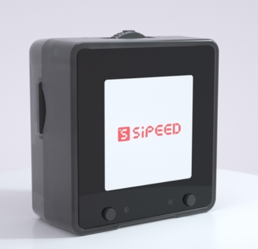

## Summary

- [Maix-I & Zero](#maix-i--zero) AI devemopment board based on MCU
- [Maix-II](#maix-ii-series)：Linux AI devemopment board with tiny size.
- [Maix-III](#maix-iii)： Linux AI devemopment board with high performance
- [LicheePI](#licheepi-series)： Linux devemopment board
- [Tang](#tang-fpga-series)：FPGA devemopment board
- [MaixSense](#maixsense-series)：3D TOF Module
- [Longon](#longon-series)：MCU Development board
- [MaixFace](#maixface-模组)：Business board
- [其他外设](#外设模组)

## Maix Zero

| Item           | M0S                                                                                   | M0                                                                                |
| :------------- | :------------------------------------------------------------------------------------ | :-------------------------------------------------------------------------------- |
| Chip           | BL616                                                                                 | BL702                                                                             |
| Core           | RV32GCP@320MHz                                                                        | RV32@144MHz                                                                       |
| RAM            | 480KB                                                                                 | 132KB                                                                             |
| Storage        | 4MB Flash Inside                                                                      | 192KB ROM, 512KB Flash Inside                                                     |
| Wireless       | · Wifi · Bluetooth · Zigbee                                                     | Bluetooth                                                                         |
| Model platform | [MaixHub](https://www.maixhub.com)                                                    | [MaixHub](https://www.maixhub.com)                                                |
| Size           | 11(L)x10(W)mm                                                                         |                                                                                   |
| Detail         | [Click me](./maixzero/m0s/m0s.md)                                                     | [Click me](./maixzero/sense/maix_zero_sense.md)                                   |
| Outlook        |  |  |

## Maix-I

| Detail         | M1/M1w                             | M1n                                | M1s                                                | M0                                              |
| :------------- | :--------------------------------- | :--------------------------------- | :------------------------------------------------- | :---------------------------------------------- |
| MainChip       | K210                               | K210                               | BL808                                              | BL702                                           |
| Core           | RV64@400MHz \* 2                   | RV64@400MHz \* 2                   | RV64GCV@480MHz RV32GCP@320MHz RV32EMC@160MHz | RV32@144MHz                                     |
| RAM            | 8MB                                | 8MB                                | 64MB                                               | 132KB                                           |
| Wireless       | M1w supports Wifi                  |                                    | · Wifi · Bluetooth · Zigbee                  | Bluetooth                                       |
| Package        | Stamp hole                         | Golden finger                      | Stamp hole                                         |                                                 |
| Model platform | [MaixHub](https://www.maixhub.com) | [MaixHub](https://www.maixhub.com) | [MaixHub](https://www.maixhub.com)                 | [MaixHub](https://www.maixhub.com)              |
| Size           | 25.4(L)x25.4(W)mm                  | 25.0(L)x22.0(W)mm                  | 31.0(L)x18.0(W)mm                                  |                                                 |
| Details        | [Click me](./maix/core_module.md)  | [Click me](./maix/M1n.md)          | [Click me](./maix/m1s/m1s_module.md)               | [Click me](./maixzero/sense/maix_zero_sense.md) |

### Maix-I S

This is the AIOT module and develptment board based on BL808.

|            | [M1s](./maix/m1s/m1s_module.md)                                                                                                                                                                                      | [M1s Dock](./maix/m1s/m1s_dock.md)                                                                                                                                                                                      |
| ---------- | -------------------------------------------------------------------------------------------------------------------------------------------------------------------------------------------------------------------- | ----------------------------------------------------------------------------------------------------------------------------------------------------------------------------------------------------------------------- |
| Appearance |  |  |

### Maix-I

This is a series of AIOT development boards based on K210 in 2019.

<table role="table" class="center_table">
    <tbody>
        <tr>
            <th scope="col"></th>
            <th scope="col">Maix Bit</th>
            <th scope="col">Maix Dock</th>
            <th scope="col">Maix Duino</th>
            <th scope="col">Maix nano</th>
        </tr>
        <tr>
             <td style="white-space:nowrap">Appearance</td>
            <td>  </td>
            <td></td>
            <td></td>
            <td></td>
        </tr>
        <tr>
            <th scope="col"></th>
            <th scope="col">Maix Cube</th>
            <th scope="col">Maix Amigo</th>
            <th scope="col">Maix HAT</th>
            <th scope="col">Maix Go</th>
        </tr>
        <tr>
             <td style="white-space:nowrap">Appearance</td>
            <td></td>
            <td></td>
            <td></td>
            <td></td>
        </tr>
    </tbody>
</table>

### Support

Maix series products have meet different needs of customers in a variety of situations. The quality and performance are good reputation in the industry. Professional technical team solves various problems in hardware design or software usages for our customers. For business cooperation, please contact <support@sipeed.com>.

## Maix-II

| Detail         | MaixII-Dock                                                                                                                                                                                                                                                                                                | MaixII-Sense                                                                                                                                                            | MaixII-S                                                                                                                                                            |
| :------------- | :--------------------------------------------------------------------------------------------------------------------------------------------------------------------------------------------------------------------------------------------------------------------------------------------------------- | :---------------------------------------------------------------------------------------------------------------------------------------------------------------------- | :------------------------------------------------------------------------------------------------------------------------------------------------------------------ |
| MainChip       | V831                                                                                                                                                                                                                                                                                                       | R329                                                                                                                                                                    | V833                                                                                                                                                                |
| Core           | Cortex A7@800MHz                                                                                                                                                                                                                                                                                           | Cortex A53\*2@1.5GHz                                                                                                                                                    | Cortex A7@1.2GHz                                                                                                                                                    |
| RAM            | 64MB                                                                                                                                                                                                                                                                                                       | 256MB                                                                                                                                                                   | 默认 128MB                                                                                                                                                          |
| Wireless       | Wifi                                                                                                                                                                                                                                                                                                       | · Wifi · Bluetooth                                                                                                                                                   | · Wifi                                                                                                                                                              |
| Appearance     |                                                                                                                                      |  |  |
| Model platform | [MaixHub](https://www.maixhub.com)                                                                                                                                                                                                                                                                         |                                                                                                                                                                         |                                                                                                                                                                     |
| Details        | [Click me](http://wiki.sipeed.com/m2dock)                                                                                                                                                                                                                                                                  | [Click me](./maixii/m2a/maixsense.md)                                                                                                                                   | [Click me](./maixii/M2S/V833.md)                                                                                                                                    |
| Notes          | <strong>Popular product</strong>，it supports hardware AI acceleration (0.2Tops computing power) unit. At present, the software support is the easiest to get started. C SDK and Python SDK are provided. And an online model training service (<a href="https://maixhub.com" target="_blank">MaixHub</a>) | Hardware AI acceleration unit with 0.25Tops computing power                                                                                                             | Business only                                                                                                                                                       |

## Maix-III

Latest AI development board, with good performance and enough memory, many connectors and supports plenty of operators.

|               | MaixIII-axpi                                                                                                                                                                        |
| :------------ | :---------------------------------------------------------------------------------------------------------------------------------------------------------------------------------- |
| Chip          | Ax620a                                                                                                                                                                              |
| CPU           | Cortex A7\*4@1.0GHz                                                                                                                                                                 |
| NPU           | 14.4Tops@int4，3.6Tops@int8                                                                                                                                                         |
| ISP           | 4K@30fps                                                                                                                                                                            |
| RAM           | 2GB LPDDR4X 3733Mhz                                                                                                                                                                 |
| CAMERA        | 3 CAMERA max  · 1 x MIPI4-LANE CSI · 2 x MIPI2-LANE   CSI                                                                                                                     |
| SCREEN        | 4-LANE MIPI DSI                                                                                                                                                                     |
| NETWORK       | · 1000M ETHERNET  · 2.4GHz WI-FI                                                                                                                                                 |
| USB CONNECTOR | · 1 x USB2.0HS For user， · 1 x USB-UART            for controling                                                                                                               |
| OUTLOOK       |  |
| MODELS        | [MaixHub](https://www.maixhub.com)                                                                                                                                                  |

Visit [Maix III AXera-Pi](./maixIII/ax-pi/axpi.md) to know more.

## LicheePI series

|           | Lichee RV        | Lichee Zero Plus                        | Lichee Zero                | Lichee nano            |
| :-------- | :--------------- | :-------------------------------------- | :------------------------- | :--------------------- |
| SOC       | Allwinner D1     | Allwinner S3                            | Allwinner V3s              | Allwinner F1c100s      |
| CPU       | Xuantie C906     | Cortex™-A7                              | Cortex™-A7                 | ARM 926EJS             |
| Frequency | 1GHz             | 1.2GHz                                  | 1.2GHz(max)                | 600MHz(max)            |
| RAM       | 512MB DDR3       | 128Mbyte DDR3                           | 64MB DRAM                  | 32MB DDR               |
| FLASH     | Optional SD-nand | Optional SD Nand, SPI Nor Flash or eMMC | eserved SOP8 SPI Flash PAD | Onboard 16MB NOR FLASH |
| TF Slot   | YES              | YES                                     | YES                        | YES                    |

- LicheePI is the linux development board.

<table>
<thead>
<tr>
<th style="text-align:center">Lichee Zero</th>
<th style="text-align:center">Lichee Nano</th>
</tr>
</thead>
<tbody>
<tr>
<td style="text-align:center"></td>
<td style="text-align:center"></td>
</tr>
</tbody>
<thead>
<tr>
<th style="text-align:center">Lichee Zero Plus</th>
<th style="text-align:center">Lichee RV</th>
</tr>
</thead>
<tbody>
<tr>
<td style="text-align:center"></td>
<td style="text-align:center"></td>
</tr>
</tbody>
</table>

## Tang FPGA series

|                   | 
Tang Primer 20K
 | 
Tang Nano 9K
 | 
Tang Nano 4K
 | 
Tang Nano 1K
 |
| :---------------- | :------------------------------------------------ | :--------------------------------------------- | :--------------------------------------------- | ---------------------------------------------- |
| LUT4              | 20736                                             | 8640                                           | 4608                                           | 1152                                           |
| Flip-Flop         | 15552                                             | 6480                                           | 3456                                           | 864                                            |
| S-SRAM (bits)     | 41472                                             | 17280                                          |                                                |                                                |
| B-SRAM (bits)     | 828K x 46                                         | 468K x 26                                      | 180K x 10                                      | 72K x 4                                        |
| User Flash (bits) |                                                   | 608K                                           | 256K                                           | 96K                                            |
| PLL               | 4                                                 | 2                                              | 2                                              | 1                                              |
| Onboard Flash     | 32Mbits NOR Flash                                 | 32Mbits NOR Flash                              | 32Mbits NOR Flash                              | PAD reserved                                   |
| Embedded core     |                                                   |                                                | Cortex-M3                                      |

- Tang FPGA series Contains `Tang Nano` and `Tang Primer` .

<table>
<thead>
<tr>
<th style="text-align:center">Tang Primer 20K (COre Module) </th>
<th style="text-align:center">Tang Nano 1K</th>
</tr>
</thead>
<tbody>
<tr>
<td style="text-align:center"></td>
<td style="text-align:center"></td>
</tr>
</tbody>
<thead>
<tr>
<th style="text-align:center">Tang Nano 4K</th>
<th style="text-align:center">Tang Nano 9K</th>
</tr>
</thead>
<tbody>
<tr>
<td style="text-align:center"></td>
<td style="text-align:center"></td>
</tr>
</tbody>
</table>

### Sold-Out FPGA

|                                       Tang Nano                                       |                                              Tang Primer                                               |
| :-----------------------------------------------------------------------------------: | :----------------------------------------------------------------------------------------------------: |
|  |  |

## MaixSense series

- Depth camera based on TOF

|                                                  | Maixsense-a010                                                 | MaixSense-a075V                                            |
| ------------------------------------------------ | -------------------------------------------------------------- | ---------------------------------------------------------- |
| Outlook                                          |  |  |
| Interface                                        | 1.25mm Uart connector \*1 Type-C USB2.0 \*1                 | 1.25mm Uart connector \*1  Type-C USB2.0 \*1            |
| Solution                                         | TOF：100x100@30fps                                             | RGB：1600x1200@30fps TOF：320x240@60fps                 |
| Field Angle                                      | RGB：None TOF：70°(H) \* 60°(V)                             | RGB：120° TOF：55°(H)\*72°(H)                           |
| 
TOF pixel size
 |                                                                | 15um                                                       |
| Laser transmitter                                | 40nm VCSEL                                                     | 940nm,3W                                                   |
| Measuring range                                  | 0.2-2.5m                                                       | 0.15-1.5m                                                  |
| Measurement accuracy                             | &lt;=1%/cm                                                     | &lt;=1%/cm                                                 |

## SLogic series

SLogic is Sipeed Logic Analyzer.

|                        | Lite8                                         | Combo8                                        |
| ---------------------- | --------------------------------------------- | --------------------------------------------- |
| Chip                   | BL616                                         | BL616                                         |
| Communication          | USB2.0   HS                                   | USB2.0   HS                                   |
| Sampling rate@Channels | 160M@2Channel 80M@4Channel 40M@8Channel | 160M@2Channel 80M@4Channel 40M@8Channel |
| Signal input range     | 0～3.6V                                       | 0～3.6V                                       |
| Voltage identification | VIH: >2V VIL: <0.8V                        | VIH: >2V VIL: <0.8V                        |
| CKLink                 |                                               | Support                                       |
| DapLink                |                                               | Support                                       |
| UART                   |                                               | Support 4 UART, each UART at 20MBps max       |

## Longon series

MCU Development board

[Click me](./longan/Nano/assets/readme.md) to know more.

## MaixFace Module

- Business only.

## Peripheral

Visit [homepage](https://wiki.sipeed.com/en/) to locate your device and read more.