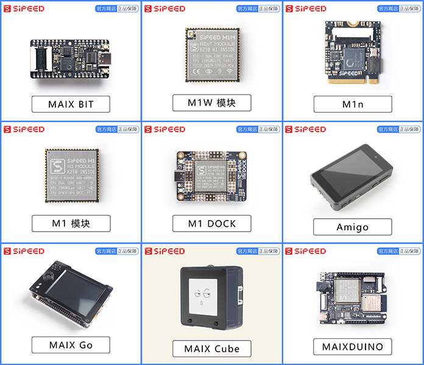
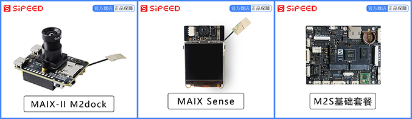
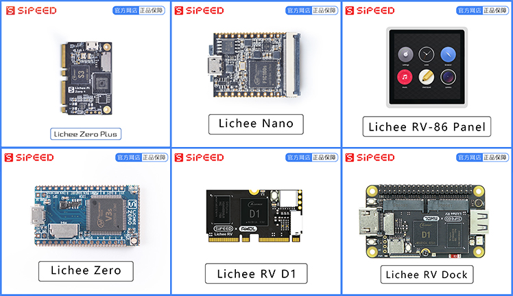
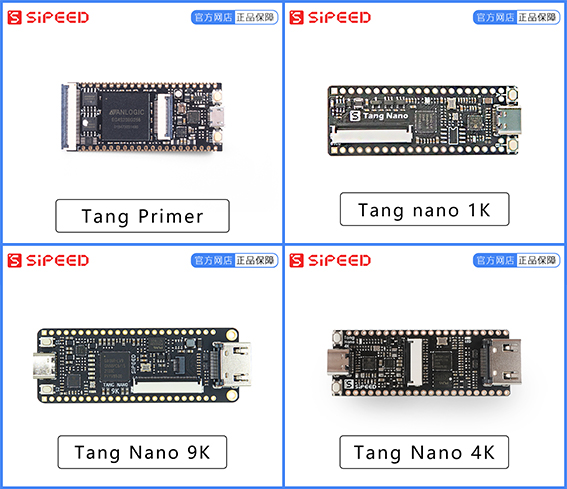

# Sipeed Hardware WIKI

## Maix Series

A series of development boards based on **K210**, meets the needs of different groups of people

## MaixII & III Series

Linux AI Development board

## Lichee Series

Linux Development board

## Tang Series

FPGA Development board

## Metasense Module

Waiting picture

## Longon Series

MCU Development board

