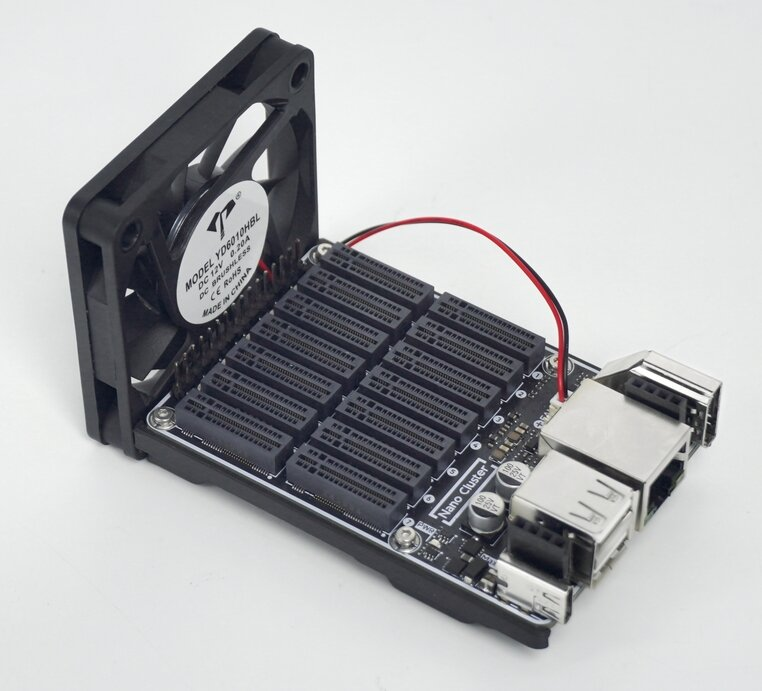
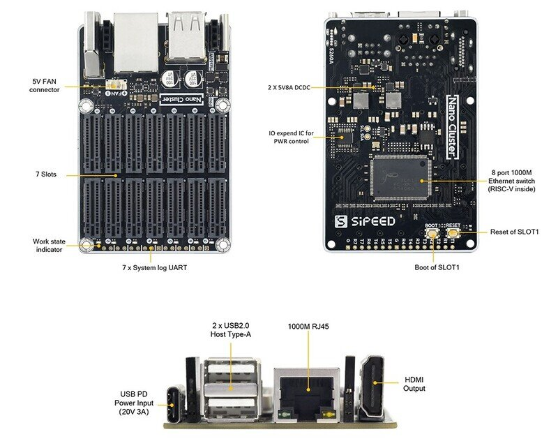
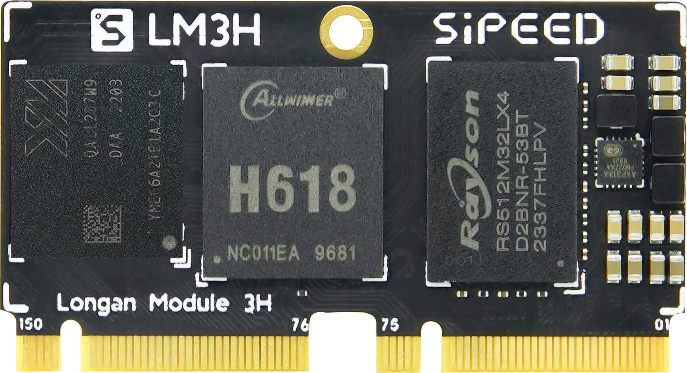
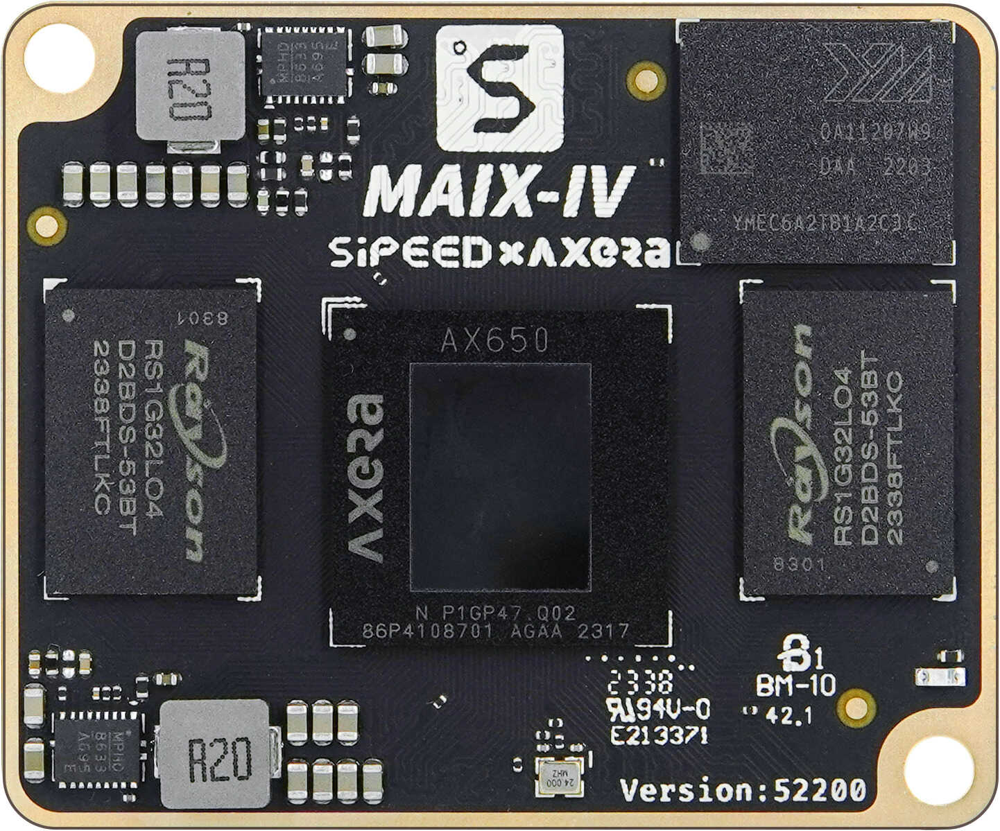
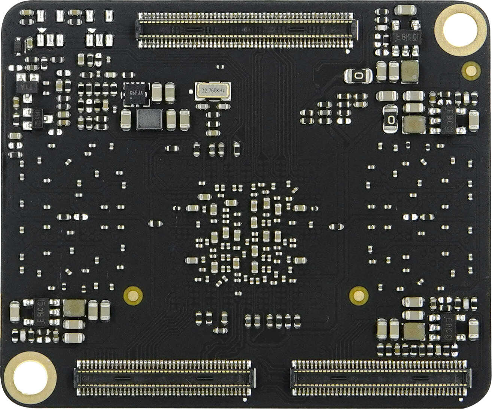

## Introduction

NanoCluster is an ultra-miniature cluster board developed by Sipeed, featuring 7 SOM slots interconnected via a RISC-V-based Gigabit switch. It supports USB-C PD power supply and optional PoE expansion. Additionally, NanoCluster provides independent UART and power control, making it an ideal entry-level platform for HomeLab users exploring distributed computing, Kubernetes, Docker, and edge computing.

NanoCluster is compatible with Sipeed's Longan Module 3H (4 × Cortex-A53), M4N (4 × Cortex-A55 + NPU), as well as the Raspberry Pi Compute Module 4 (4 × Cortex-A72) and Compute Module 5 (4× Cortex-A76). Users can freely choose compute modules based on performance needs and budget, or mix and match different architectures to build a highly customized and heterogeneous computing cluster.

The NanoCluster adopts an open SOM interface standard, supporting both official core modules and custom adapter boards for third-party SOM solutions. This design greatly enhances the platform's flexibility.

 

## Technical Specifications

### Baseboard

<table>
  <thead>
    <tr>
      <th colspan="2">Hardware Specifications</th>
    </tr>
  </thead>
  <tbody>
    <tr>
      <td><strong>SOM Slots</strong></td>
      <td>7× Dual M.2 M-Key vertical slots</td>
    </tr>
    <tr>
      <td><strong>Power Supply</strong></td>
      <td>USB-C 20V PD (Max 60W), Optional 60W PoE module</td>
    </tr>
    <tr>
      <td><strong>Ethernet</strong></td>
      <td>Integrated RISC-V Gigabit switch chip JL6108 for high-speed interconnection, supporting web-based management and SDK-based custom feature development</td>
    </tr>
    <tr>
      <td><strong>USB Ports</strong></td>
      <td>USB-A Host (Top), USB-A OTG (Bottom), connected to Slot 1</td>
    </tr>
    <tr>
      <td><strong>Display Interface</strong></td>
      <td>HDMI, connected to Slot 1</td>
    </tr>
    <tr>
      <td><strong>Cooling System</strong></td>
      <td>Equipped with a 60mm 2-pin fan for efficient cooling</td>
    </tr>
    <tr>
      <td><strong>Status Indicators</strong></td>
      <td>7× SYS LED indicators for node status monitoring</td>
    </tr>
    <tr>
      <td><strong>Serial Communication</strong></td>
      <td>7× independent UARTs for easy debugging and control, optional quad-serial USB module available</td>
    </tr>
    <tr>
      <td><strong>Power Management</strong></td>
      <td>Slot1 centrally manages other Slots and switch power through IO expansion chip</td>
    </tr>
    <tr>
      <td><strong>Power Consumption</strong></td>
      <td>3.6 W</td>
    </tr>
    <tr>
      <td><strong>Dimensions</strong></td>
      <td>PCBA: 88x57mm, approximately 100x60x60mm with SOMs installed and fan mounted</td>
    </tr>
  </tbody>
</table>

### SOM

<table>
    <tr>
        <th>SOM</th>
        <th>LM3H</th>
        <th>M4N</th>
        <th>CM4</th>
        <th>CM5</th>
    </tr>
    <tr>
        <td>SoC</td>
        <td>H618</td>
        <td>AX650N</td>
        <td>BCM2711</td>
        <td>BCM2712</td>
    </tr>
    <tr>
        <td>Memory</td>
        <td>2GB ~ 4GB</td>
        <td>8GB</td>
        <td>1GB ~ 8GB</td>
        <td>1GB ~ 16GB</td>
    </tr>
    <tr>
        <td>eMMC</td>
        <td>32GB</td>
        <td>32GB</td>
        <td>0GB ~ 64GB</td>
        <td>0GB ~ 64GB</td>
    </tr>
    <tr>
        <td>CPU</td>
        <td>4 × A53 1.5 GHz</td>
        <td>8 × A55 1.6 GHz</td>
        <td>4 × A72 1.5 GHz</td>
        <td>4 × A76 2.4 GHz</td>
    </tr>
    <tr>
        <td>GPU</td>
        <td>Mali-G31</td>
        <td>-</td>
        <td>VideoCore VI</td>
        <td>VideoCore VII</td>
    </tr>
    <tr>
        <td>NPU</td>
        <td>-</td>
        <td>18TOPS INT8</td>
        <td>-</td>
        <td>-</td>
    </tr>
    <tr>
        <td>Network</td>
        <td>100M</td>
        <td>1G</td>
        <td>1G</td>
        <td>1G</td>
    </tr>
    <tr>
        <td>Additional Interfaces</td>
        <td>None</td>
        <td>Download interface + M.2 SSD + USB 3.0</td>
        <td>Download interface + M.2 SSD</td>
        <td>Download interface + M.2 SSD + USB 3.0</td>
    </tr>
    <tr>
        <td>Power Idle / Full Load / Peak</td>
        <td><nobr>1.2W/2.6W/3.7W</nobr></td>
        <td><nobr>3W/8.3W/9W</nobr></td>
        <td><nobr>3W/4.5W/4.6W</nobr></td>
        <td><nobr>4W/7.6W/8W</nobr></td>
    </tr>
</table>

## Interface Diagram

### Baseboard Interfaces

### SOM

The LM3H SOM connects directly to the baseboard via 7 × dual M.2 M-Key vertical slots.

The M4N SOM connects to a dedicated adapter board through a BTB connector, which then interfaces with the baseboard.

<table>
    <tr>
        <th>SOM</th>
        <th>LM3H</th>
        <th>M4N</th>
    </tr>
    <tr>
        <td>Front Side</td>
        <td></td>
        <td></td>
    </tr>
    <tr>
        <td>Back Side</td>
        <td></td>
        <td></td>
    </tr>
</table>

### Adapter Boards

The CM4 / CM5 adapter board features a BTB connector on the front side, supporting CM4 and CM5 SOMs. It also includes a Boot button and a Type-C port for flashing.
The back side includes an SD card slot, an M.2 NVMe SSD connector (compatible with 2242 or 2230 size), and a reserved USB pad for optional CM5 USB 3.0 support.

The M4N adapter board features a BTB connector for Sipeed M4N SOMs, a Boot button, and a Type-C flashing port on the front side.
The back side includes an M.2 NVMe SSD connector (2242 or 2230), and a reserved USB pad for optional USB 3.0 support.

<table>
    <tr>
        <th>Adapter Board</th>
        <th>CM4 / CM5</th>
        <th>M4N</th>
    </tr>
    <tr>
        <td>Front Side</td>
        <td></td>
        <td></td>
    </tr>
    <tr>
        <td>Back Side</td>
        <td></td>
        <td></td>
    </tr>
</table>

## Hardware & Software Resources

### Baseboard Hardware

[Click to view](https://dl.sipeed.com/Cluster/NanoCluster)

### Longan Module 3H Documentation

Hardware documentation can be accessed here: [Click to view](https://dl.sipeed.com/shareURL/LONGAN/LonganPi3H). For system building and software development guides, please refer to: [Click here](https://wiki.sipeed.com/hardware/en/longan/h618/lpi3h/7_develop_mainline.html).

### M4N Documentation

[Hardware Documentation](https://dl.sipeed.com/shareURL/MaixIV/M4N-Dock)
[Software Development Guide](https://dl.sipeed.com/shareURL/MaixIV/M4N-Dock)
[Software Development SDK](https://github.com/AXERA-TECH/ax650n_bsp_sdk)

### Raspberry Pi Compute Module 4

[Click to view](https://www.raspberrypi.com/products/compute-module-4)

### Raspberry Pi Compute Module 5

[Click to view](https://www.raspberrypi.com/products/compute-module-5)

## Purchase Information

[Taobao Store](https://item.taobao.com/item.htm?id=977609765104)

[AliExpress Store](https://www.aliexpress.com/item/1005009393696842.html)

## Feedback & Support

If you have any questions or suggestions during use, please provide feedback through the following channels:

+ [Github issues](https://github.com/sipeed/NanoCluster)