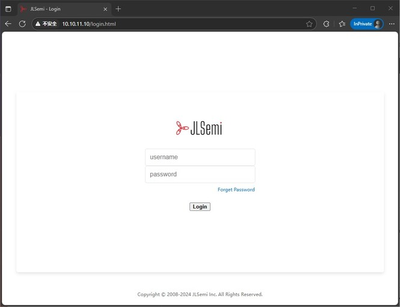
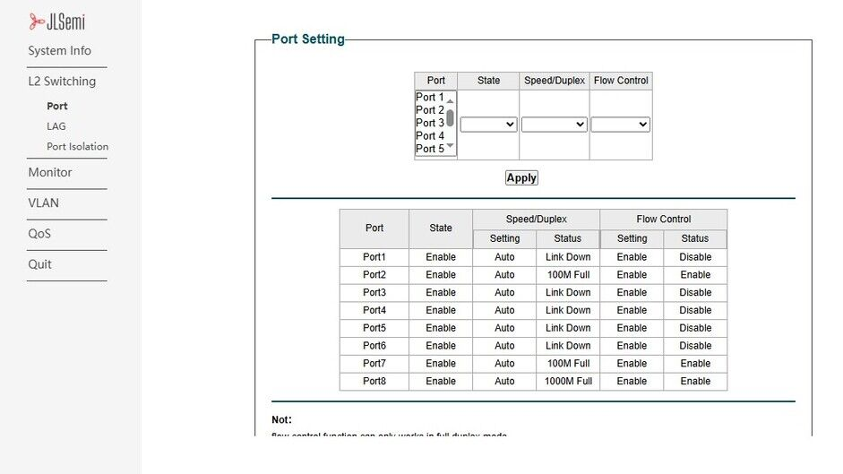

## Introduction

NanoCluster is equipped with the JL6108 Gigabit switch chip, which is based on the **RISC-V** architecture. It can be used as a plug-and-play switch or as a locally managed Layer 2 switch, supporting configuration via a web interface. Its main features include:

- **System Management**: Displays system information, supports reboot, factory reset, and firmware upgrades
- **Network Configuration**: Supports static IP and DHCP dynamic IP configuration
- **Port Management**: Enables/disables ports, configures link speed, and manages flow control
- **Port Aggregation**: Supports port binding to increase bandwidth utilization
- **Security and Isolation**: Port isolation to prevent data leakage
- **Traffic Monitoring**: Port MIB statistics and traffic analysis
- **Loop Protection**: Prevents network loops to enhance stability
- **VLAN Configuration**: Supports MTU VLAN, port-based VLAN, 802.1Q VLAN, and PVID settings
- **QoS Configuration**: Manages traffic priority based on port, PCP, and DSCP
- **Bandwidth and Storm Control**: Supports port-based bandwidth limitation and broadcast storm suppression

> The default firmware management interface is in English. You can switch to a bilingual (Chinese/English) interface by updating via OTA.

>! The switch management interface currently has response issues on Linux. For better compatibility, it is recommended to log in to the switch management interface using Windows.

## Port Allocation

The cluster backplane connects to each core board (SOM) via the JL6108 switch. The port allocation is as follows:

| Switch Port | Connected Device                    |
|------------|--------------------------------------|
| Port 1     | Slot 7                               |
| Port 2     | Slot 6                               |
| Port 3     | Slot 5                               |
| Port 4     | Slot 4                               |
| Port 5     | Slot 3                               |
| Port 6     | Slot 2                               |
| Port 7     | Slot 1                               |
| Port 8     | Cluster backplane RJ45 port (for external network connection)   |

## User Guide

### Logging into the Web Management Interface

1. **Ensure Device Connection**  
   Make sure the NanoCluster is powered on and connected to the management host via an Ethernet cable.

2. **Configure IP Address**  
   The switch's default IP address is **10.10.11.10/24**. Ensure the management host has an IP in the same subnet, e.g., **10.10.11.x** (where x is between 1-254 but not 10), with a subnet mask of **255.255.255.0**.  

   

3. **Access the Management Interface**  
   Open a browser and enter `http://10.10.11.10`, then press Enter to reach the login page.  

   

4. **Login to the Management System**  
   Enter the **admin username and password** (both default to `admin`), then click **Login** to access the main interface.  

   

## Basic Configuration

### Port Management
The JL6108 switch provides port status management, supporting **port enable/disable**, **speed configuration**, and **flow control**.
- **Enable/Disable Ports**: Navigate to the **Port Management** page, select the desired port, and enable or disable it.  
- **Modify Port Speed**: Supports 10Mbps / 100Mbps / 1000Mbps modes.  
- **Flow Control**: Can be enabled to prevent packet loss.  

### VLAN Configuration
VLAN (Virtual Local Area Network) is used to segment different network areas, prevent broadcast storms, and enhance security.

#### Configuring Port VLAN

1. **Access the Port VLAN Page**  
   Navigate to `VLAN` >> `Port VLAN` in the Web interface.

2. **Enable Port VLAN**  
   Check the **"Enable Port VLAN"** option and click **`Apply`**.

3. **Create VLAN 2 and Assign Ports**  
   - Enter **`2`** in the **VLAN ID** field  
   - Select **Ports 2 to 4**  
   - Click **`Apply`** to save the configuration  

4. **View the Port Member Table**  
   After configuration, **Ports 2-4 will be automatically removed from VLAN 1** and assigned to VLAN 2.   

   

### QoS Configuration (Traffic Prioritization)
QoS ensures stable performance for high-priority traffic such as video conferencing and VoIP:
1. **Navigate to "QoS Settings"**  
2. Select **Port-Based / 802.1P / DSCP** QoS strategy  
3. Set **High / Medium / Low Priority Queues**  
4. **Save the settings** to apply the QoS rules    

### OTA Update

Firmware download link: [Click to download OTA firmware](../../../zh/cluster/NanoCluster/assets/firmware.zip)

1. Open the Web management interface and navigate to: `System Information Configuration` → `System Upgrade`
2. Click **Select File** and select the appropriate firmware file for the upgrade:
    - **English interface firmware**: `lms_ota_en.fw`
    - **Chinese interface firmware**: `lms_ota_zh.fw`
3. Click **Upgrade**. The system will display the upgrade progress and automatically verify the firmware.
4. After the upgrade is complete, the device will automatically reboot to apply the new firmware.
5. If the upgrade fails, power cycle the device, re-enter the management address to access the upgrade page, and repeat the upgrade process.

## Additional Configuration

The JL6108 switch also supports more advanced features. For detailed configuration instructions, please refer to the official manual.

[Click here to view the full manual](https://dl.sipeed.com/shareURL/Cluster/NanoCluster/06_Switch_JL6108)

We provide the **JL6108 SDK** based on the **RISC-V** architecture. Users can download the SDK and develop independently from the following link:

[JL6108 SDK](https://dl.sipeed.com/shareURL/Cluster/NanoCluster/06_Switch_JL6108)