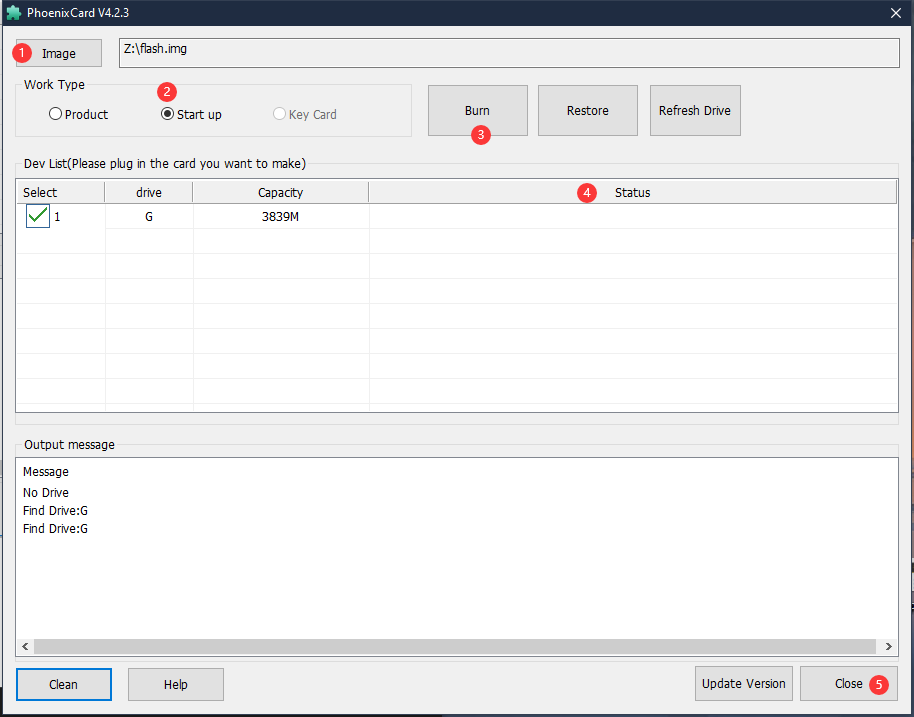

## Apt trouble

- When execute apt command in debian system it may show error as follows
  
> GPG error: http://ftp.ports.debian.org/debian-ports sid InRelease: The following signatures couldn't be verified because the public key is not available: NO_PUBKEY E852514F5DF312F6

This means built-in key expires and need updating manually, here are two ways to download key.

 - Doanload from web page：https://packages.debian.org/sid/all/debian-ports-archive-keyring/download
 - wget : `wget http://ftp.cn.debian.org/debian/pool/main/d/debian-ports-archive-keyring/debian-ports-archive-keyring_2022.02.15_all.deb`
  
Copy downloaded key (usr scp or lrzsz tool) into LicheeRV board, then run following command to update key:

> sudo dpkg -i debian-ports-archive-keyring_2022.02.15_all.deb

Then run `sudo apt-get update` to update apt.

## Not work

- Make sure you choose as what is shown below when burnning card by yourself
  <details>
  <summary><font color="#4F84FF">Click to see burn requirement</font></summary>

</details>

- We can use adb shell to communicate with computer by **Tina OS**
  Just connect the core board with computer for communication.
  
- **Debian OS** only can use uart for communication with computer.

## 86 panel screen no display/ display wrong

Here we need use corresopnding fex file to overwrite the board-level configuration by using following command in linux system 
Download fex file here https://dl.sipeed.com/shareURL/LICHEE/D1/Lichee_RV/SDK/board
Overwrite command:
```bash
sudo dd if=boot_package_XXX.fex of=/dev/sdX bs=1K seek=16400
```
The sdX in the command is the name of TF card in linux

If you have other trouble, consult the seller or email to support@sipeed.com for help.