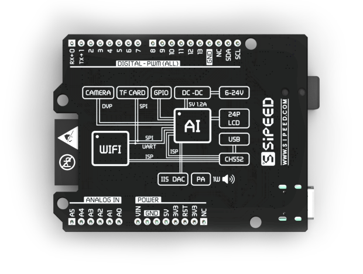
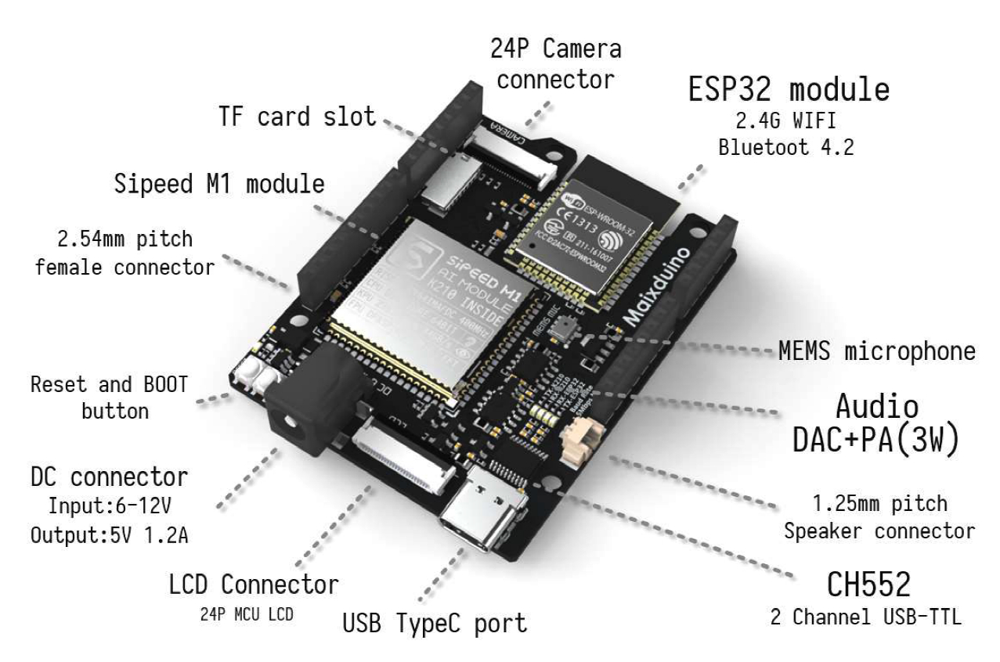

# MaixDuino Development Board

## Overview

  SIPEED MaixDuino is an Arduino-compatible development board based on our M1 module (main controller: Kendryte K210).
   MaixDuino integrates camera, TF card slot, user buttons, TFT display, MaixDuino expansion interface. Users can use MaixDuino to easily build a face recognition access control system, and also reserve a development and debugging interface, which can also be used as a functioning powerful AI learning development board.

## MaixDuino Features

### Appearance

### Onboard features

- DC Barrel Power Jack: 6~12V DC power input
- USB Type-C: For power input and debug interface
- DVP 24PIN: Camera interface
- TF slot: For SD/TF card
- ESP32: WiFi and Bluetooth support via SPI
- I2C DAC
- PA PAM8403A

## MaixDuino Description
The Maixduino development board uses the powerful M1Al module as the core unit. The module has a built-in 64-bit dual-core processor chip and 8MB on-chip SRAM. It has outstanding performance in Al machine vision and hearing performance with a total computing power up to 1TOPS (FPU, Fast Fourier Transform Accelerator), which can easily implement machine vision/auditory algorithms for various application scenarios, and can also perform preprocessing for voice direction scanning and voice data output. In addition, the development board is also equipped with an ESP32 module (WiFi+Bluetooth integrated), which can be easily connected to the Internet with simple operations.

<table role="table" class="center_table">
    <thead>
        <tr>
            <th colspan = "2">K210 chip features</th>   
        </tr>
    </thead>
    <tbody>
    <tr>    
        <td>Core</td>
        <td>RISC-V Dual Core 64bit, with FPU</td>
    </tr>
    <tr>
        <td>Frequency</td>
        <td>400MHz （Can be overclocked to 600MHz）</td>
    </tr>
    <tr>
        <td>SRAM</td>
        <td>built-in 8MB</td>
    </tr>
    <tr>
        <td>Image Recognition</td>
        <td>QVGA@60fps/VGA@30fps</td>
    </tr>
    <tr>
        <td>Speech Recognition</td>
        <td>Microphone array (8mics)</td>
    </tr>
    <tr>
        <td>Network Model</td>
        <td><li>Support YOLOv3<li>Mobilenetv2<li>TinyYOLOv2<li>facial recognition, etc.</td>
    </tr>
    <tr>
        <td>Deep Learning Framework</td>
        <td>Supports TensorFlow, Keras, Darknet, Caffe, other mainstream frameworks</td>
    </tr>
    <tr>
        <td>Peripherals</td>
        <td>FPIOA, UART, GPIO, SPI, I2C, I2S, TIMER</td>
    </tr>
    <tr>
        <td>Video Processing</td>
        <td><li>Neural Network Processor (KPU)<li>FPU Meets IEEE754-2008 Standard<li>Audio Processor (APU)<li>Fast Fourier Transform Accelerator (FFT)</td>
    </tr>
    </tbody>
</table>
<table role="table" class="center_table">
  <thead>
    <tr>
      <th colspan = "2">ESP32 Module</th>
    </tr>
  </thead>
  <tr>
    <td>Core</td>
    <td>ESP32-D0WDQ6(Xtensa 32-bit core)</td>
  </tr>
  <tr>
    <td>Wireless Standards</td>
    <td>802.11b/g/n</td>
  </tr>
  <tr>
    <td>Radio Frequencies</td>
    <td>2400MHz-2483.5MHz</td>
  </tr>
  <tr>
    <td>Wireless Protocols</td>
    <td>2.4Ghz WiFi, Dual-mode Bluetooth (BT & BLE4.2)</td>
  </tr>
  <tr>
    <td>Antenna</td>
    <td>PCB Onboard Antenna</td>
  </tr> 
</table>
<table role="table" class="center_table">
    <thead>
        <tr>
            <th colspan = "2" >Development board features</th>   
        </tr>
    </thead>
        <td>Onboard</td>
        <td><li>1x RGB LED<li>1x MEMS Microphone<li>1x USB to serial port</td>
    </tr>
    <tr>
        <td>Interfaces</td>
        <td><li>USB Type-C interface<li>24PIN DVP camera interface<li>24PIN LCD interface<li>MicroSD card slot<li>Audio interface (supports 3 external speakers)<li>Part of the IO pin header</td>
    </tr>
    <tr>
        <td>Size</td>
        <td>60*88mm</td>
    </tr>
    <tr>
        <td>Supply Voltage</td>
        <td>5.0V @ 300mA（300mA minimum)</td>
    </tr>
    <tr>
        <td>Operating Temperature</td>
        <td>-30℃ ~85C</td>
    </tr>
</table>
    
<table role="table" class="center_table">
    <thead>
        <tr>
        <th colspan = "2">Software</th>
        <tr>
    </thead>
    <tr>
    <td>Operating Systems</td>
    <td>FreeRTOS, RT-Thread, etc</td>
    </tr>
    <tr>
    <td>Development Environments</td>
    <td>MaixPy IDE、PlatformlO IDE、Arduino IDE, etc</td>
    </tr>
    <tr>
    <td>Programming languages</td>
    <td>C，C++，MicroPython</td>
    </tr>
</table>

## Related Links

- [MaixDuino Schematic](https://dl.sipeed.com/shareURL/MAIX/HDK/Sipeed-Maixduino)
- <a href="/soft/maixpy/zh/" target="_blank"> MaixPy Tutorial</a>
- <a href="/soft/maixduino/zh/" target="_blank"> Arduino Tutorial</a>

## Product Technical Support
Maix series of products can meet the different needs of customers in a variety of scenarios, and have been widely used in AIoT. The quality and performance have a very good reputation in the industry. The professional technical team solves hardware design and software functions for our customers. For professional technical support and more detailed information, please contact <support@sipeed.com>。
