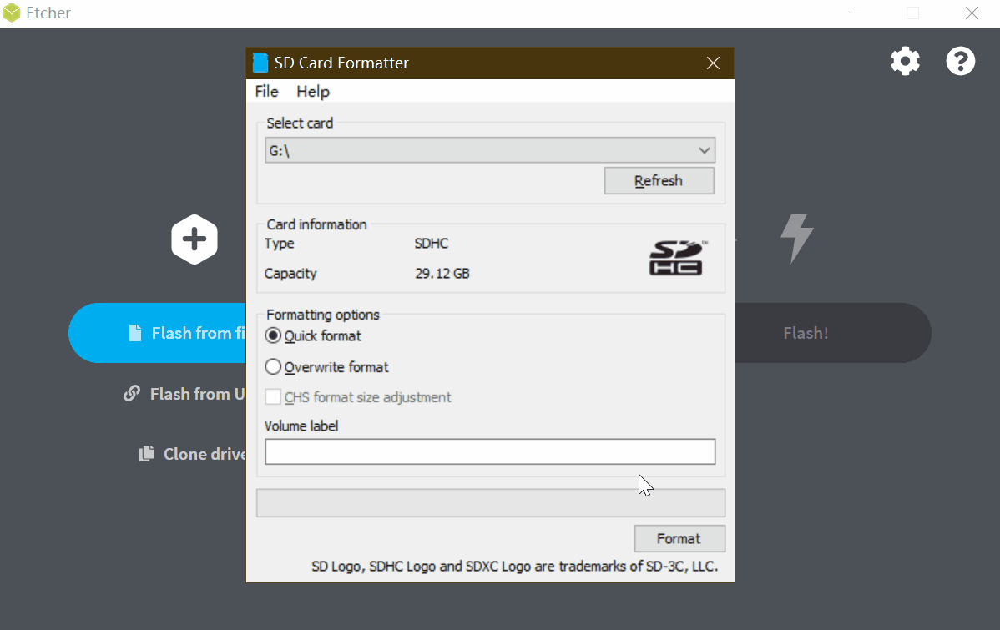

# Burn image

## System introduction

There are 2 system images for Lichee MaixSense(which will be called R329 below) 

| Image name   | armbian                                        | Tina                                                   |
| :----------- | :--------------------------------------------- | :----------------------------------------------------- |
| Description  | A lightweight Debian for arm development board | Linux system created by Allwinner Based on OpenWRT1404 |
| Feature      | Linux mainline, mutiple contents               | Tiny os                                                |
| Target users | Geeker, or newer                               | Customization requirements developer                   |

- For armbian system image it's required to use sdcard over than 4GBi
- For Tina os it needs sdcard over than 512MBi
- Low speed sdcard will lead a bad experience

## Get image

### armbian system image

Download armbian system image from MEGA ：https://mega.nz/folder/1B4RFKpK#X0tMwHLHFQJvJ9POt_lXtg

The image named with maixpy3 means this image has installed MaixPy3 and its related drivers

This image file is created by [dd](https://en.wikipedia.org/wiki/Dd_(Unix)). So we use [Etcher](https://www.balena.io/etcher/ "Etcher")  to burn our image card.

### Tina system image

Tina os need to be compiled by yourself, visit [https://github.com/sipeed/R329-Tina-jishu](https://github.com/sipeed/R329-Tina-jishu) for imformation.

## Burn system

### Burn armbian image

#### Get software

[Etcher](https://www.balena.io/etcher/ "Etcher")

#### Burn steps

Extract your downloaded image file to get the `.img` file, run Etcher, click `Flash from file`, choose the extracted .img file, click `Select target` and choose your sdcard, click `Flash` to burn your sdcard, wait it for finishing.

If failed burning, try to format your sdcard. For Windows and macos users we suggest use [SD Card Formatter](https://www.sdcard.org/downloads/formatter/eula_windows/SDCardFormatterv5_WinEN.zip "SDCardFormatter") to format sdcard, while for linuc users can try [Gparted](https://gparted.org/).

### Burn Tina image

Its burning steps are the same as MaixII Dock, visit [Buring MaixII-Dock OS](./../M2/flash.html#Buring-system) for detailed steps.