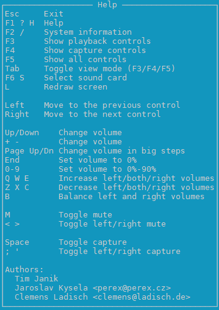
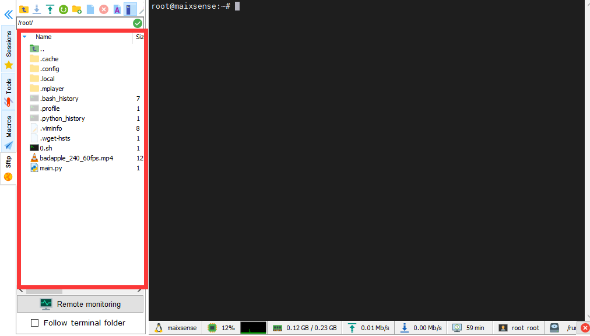

# Basic usage

After finishing [config system](./config_system.md), we have logged in the board and we can use command to control the board.

## Expand system capacity

The system not containing MaixPy3 will auto expand the capacity to the maximum at your first start up.

System containing MaixPy3 will not auto expand the capacity, so we need to run this command `/usr/lib/armbian/armbian-resize-filesystem start` to expand the capacity to the maximum, this will take a while, and don't cancel this when running this command. After finishing this work it will be back to the console for us to control it.

## Connect network

Here we use `nmtui` to connect network.


<details>
<summary><font color="#4F84FF">Click to see graphic steps</font></summary>
<p>Enter nmtui to open NetworkManager TUI</p>


<p>We choose Activate a connection</p>
<p>Choose your target wifi </p>


<p>Input the correct password</p>

<p>It will display connecting</p>

<p>The active on the right change into Deactive if succeed connecting wifi</p>
<p>If failed connecting wifi, please retry and input the correct password</p>

<p>Then we back to the command console</p>


<p>Use command ifconfig to get the IP of this board</p>


<p>If we see the IP(marked with red box), we have succeed connecting the network</p>
</details>

## Add user

Normally we use another user to use linux system instead of root user, because root user can break the system the easily. Here we tell how to create a new user by `adduser` command.

Add a user named `xxx`
```bash
adduser xxx
```
After some log shows up, we need to set the password.
```bash
New password:
Retype new password:
```
The following log shows up if we succeed setting password.
```bash
passwd: password updated successfully
```
Then we press `Enter` for all following settings by default.
```bash
Enter the new value, or press ENTER for the default
        Full Name []:
        Room Number []:
        Work Phone []:
        Home Phone []:
        Other []:
Is the information correct? [Y/n]
```
Then we succeed creating the user named `xxx`.

We can use command `login` to use our new created user:
```bash
login xxx
```
Use command `logout` to sign out.
```bash
logout
```

### Grant administrator privilege

The new created user may need administrator privilege to do finish some work, so here we tell how to grant administrator privilege.

To grant administrator privilege, we just neet to edit a file named `sudoers` in `/etc`.

```bash
sudo nano /etc/sudoers
```

Find following content in this file.

```vim
# User privilege specification
root    ALL=(ALL:ALL) ALL
```

Add `xxx     ALL=(ALL:ALL) ALL` in that file (`xxx` is the username to be grant administrator privilege)

```vim
# User privilege specification
root    ALL=(ALL:ALL) ALL
xxx     ALL=(ALL:ALL) ALL
```

Then save this file and quie editing.

## Install application

Here we take install `armbian-config` as example, just run following command:

```bash
sudo apt install armbian-config -y
```

The above command means to install armbian-config by running the apt application with root privileges and that everything whichi needs to be selected is the yes option

## Config Timezone

Just use `armbian-config` to change timezone. Here we take change to Shanghai time as example.

`armbian-config` -> `Presonal` -> `Timezone` -> `Asia` -> `Shanghai` to set Shanghai time as timezone, then use keyboard `Tab` switch to OK to finish our settings.


## Config language

We also use `armbian-config` to change language. 

Just `armbian-config` -> `Personal` -> `Locales`, and select your target language, then choose the default sustem language.

Dont't forget to download your language font to avoid wrong display.

## Use Bluetooth

Use `armbian-config`. `armbian-config` -> `Network` -> `BTinstall` to install bluetooth support package.


Then we can use `bluetoothctl` to use the bluetooth.

```bash
root@maixsense:~# bluetoothctl
Agent registered
[CHG] Controller XX:XX:XX:XX:XX:XX Pairable: yes
[bluetooth]# help
Menu main:
Available commands:
-------------------
advertise                                         Advertise Options Submenu
scan                                              Scan Options Submenu
gatt                                              Generic Attribute Submenu
list                                              List available controllers
show [ctrl]                                       Controller information
select <ctrl>                                     Select default controller
devices                                           List available devices
paired-devices                                    List paired devices
system-alias <name>                               Set controller alias
reset-alias                                       Reset controller alias
power <on/off>                                    Set controller power
pairable <on/off>                                 Set controller pairable mode
discoverable <on/off>                             Set controller discoverable mode
discoverable-timeout [value]                      Set discoverable timeout
agent <on/off/capability>                         Enable/disable agent with given capability
default-agent                                     Set agent as the default one
advertise <on/off/type>                           Enable/disable advertising with given type
set-alias <alias>                                 Set device alias
scan <on/off>                                     Scan for devices
info [dev]                                        Device information
pair [dev]                                        Pair with device
cancel-pairing [dev]                              Cancel pairing with device
trust [dev]                                       Trust device
untrust [dev]                                     Untrust device
block [dev]                                       Block device
unblock [dev]                                     Unblock device
remove <dev>                                      Remove device
connect <dev>                                     Connect device
disconnect [dev]                                  Disconnect device
menu <name>                                       Select submenu
version                                           Display version
quit                                              Quit program
exit                                              Quit program
help                                              Display help about this program
export                                            Print environment variables
```

### Connect to Bluetooth device

Use `bluetoothctl` to connect to bluetooth device.

```bash
scan on             
scan off            
trust XX:XX:XX:XX   
pair XX:XX:XX:XX    
connect XX:XX:XX:XX 
```


### Set bluetooth audio in/out

To start this, we need install `pulseaudio` and bluetooth modules

```bash
sudo apt install pulseaudio
sudo apt install pulseaudio-module-bluetooth
```

Then use pactl command to see whether there is device for bluetooth audio output.

```bash
pactl list short sinks
```

Switch audio output to bluetooth, the `<dev>` in the following command should be `2`.

```bash
pactl set-default-sink <dev>
```

The log is as following：

```bash
maixsense:~:# apt install pulseaudio
maixsense:~:# apt install pulseaudio-module-bluetooth
maixsense:~:# pactl list short sinks
0	alsa_output.platform-7032000.codec.stereo-fallback	module-alsa-card.c	s16le 2ch 44100Hz	SUSPENDED
2	bluez_sink.00_26_04_00_73_B1.a2dp_sink	module-bluez5-device.c	s16le 2ch 44100Hz	SUSPENDED
maixsense:~:# pactl set-default-sink 2 
```


Then we can play audio to a Bluetooth device or connect the phone via Bluetooth to use as a Bluetooth speaker.

## Change volume

Here we use `alsamixer` to change volume


Use keyboard `H` to see help.



To change Bluetooth volume, we use `pactl`.
Besides, we can also use `pactl` to change the volume of onboard speaker.

```bash
## See the input/output device index
pactl list short sources/sinks
## Sets the input/output volume
pactl set-source/sink-volume index volume
pactl set-default-source/sink
## Set the default input/output
```
For example, set the Bluetooth headset as the output device, the volume is 10%, then increased by 20%, and finally reduced by 30%

```bash
maixsense:~:# pactl list short sinks
0	alsa_output.platform-7032000.codec.stereo-fallback	module-alsa-card.c	s16le 2ch 44100Hz	SUSPENDED
2	bluez_sink.00_26_04_00_73_B1.a2dp_sink	module-bluez5-device.c	s16le 2ch 44100Hz	RUNNING
## The bluetooth normally is bluez_sink
maixsense:~:# pactl set-default-sink 2
maixsense:~:# pactl set-sink-volume 2 10%  
maixsense:~:# pactl set-sink-volume 2 +8192  
maixsense:~:# pactl set-sink-volume 2 -0x3000
##Optional number, Percentage, Decimal, Hexadecimal control, same resule, and can exceed 100%
```

## Media player

Normally we use `mplayer` for media play.

- Install mplayer 
  
```bash
sudo apt install mplayer -y
```

Then transfer the media file to the board.

The media file can be downloaded from our [Download station](https://dl.sipeed.com/shareURL/MaixII/MaixII-Dock/example)

We can use [mobaxterm](https://mobaxterm.mobatek.net/) connect the board by SSH protocol, then use [mobaxterm](https://mobaxterm.mobatek.net/) to transfer the media file to the board.

Drag your media file to the red box in the left of the following picture.


  
Use command `sudo mplayer badapple_240_60fps.mp4 -vo fbdev2` to play video or `sudo mplayer Short.mp3` to play audio.

```bash
mplayer badapple_240_60fps.mp4 -vo fbdev2
```

Use onboard `Ctrl+C` to exit the media playing.

We can also add `< /dev/null > /dev/null 2>1 &` in the end of the command to play the media background.

```bash
mplayer badapple_240_60fps.mp4 -vo fbdev2  < /dev/null > /dev/null 2>1 &
```

The command above plays media background, if you wang to stop it, you need to use `fg` command to switch the background application to the front, then use `Ctrl+C` to stop it.


If it didn't play media correctly, try to increase the media volume by `alsamixer` application or check the media file path whether matchs the command.

## Program C code

Here we use `vim` as the editor. You can learn many skills about from Internet.

Use command `sudo apt install vim -y` to install `vim`.

Then create a file named `helloworld.c` by vim.

```bash
vim helloworld.c
```

There are 3 modes in vim: `Command mode`, `Insert mode` and `Last line mode`.

The default mode after creating a new file is `Command mode`, we press the 'i' on the keyboard to enter `Insert mode`.

Then we input the following codes as the content in the new created file.

```c
#include <stdio.h>
int main()
{
    printf("Hello, world\n");
    return 0;
}
```

We use keyboard `esc` to quit `Insert mode` to `Command mode`.

Then use `:` to `Last line mode`, use command `wq` wo save and quit editing.

Then we use gcc to compile our code. If there ie no gcc, install it by apt.

The detailed usage about gcc can be searched from Internet.

```bash
gcc hello.c -o hello.o
```
After finishing compiling our code, run it.

```bash
./hello.o
```


## Prepare python code

- See [Program C code](#program-c-code) to get explaination.

```bash
vim helloworld.py
i
print("hello world!\n")
esc
:wq
python3 helloworld.py
```


## Light an led by python

Install the python GPIO library first.

```bash
pip install gpiod
```

Then insert the led positive electrode into PH5, and negative electrode into GND.

Cerate `led.py` file.

``` bash
vim led.py
```

Then we input the following codes as the content in the new created file.

```python
import time
import gpiod as gpio
PH_BASE = (8-1)*32 # "PH"
gpiochip1 = gpio.chip("gpiochip1")
led = gpiochip1.get_line((PH_BASE + 5)) # "PH5"
config = gpio.line_request()
config.request_type = gpio.line_request.DIRECTION_OUTPUT
led.request(config)

while led:
    led.set_value(0)
    time.sleep(1)
    print("led on")
    led.set_value(1)
    time.sleep(1)
    print("led off")
```

Save it and quit editing, run the code in terminal.

 ```bash
 python3 led.py
 ```

Result:


## Running at startup

Scripting language skill is required.

First enable the boot auto-start script, here we can modify the relevant settings by editing the relevant files to.

```bash
vim /lib/systemd/system/rc-local.service
```

Then we add following content in the end of the file.

```bash
[Install]
WantedBy=multi-user.target
Alias=rc.local.service
```

Up to now we have succeed enable auto-start script.

Then we just need to add what we want to run at startup to the rc.local file to achieve startup start.

Edit the auto-start script.

 ```bash
 vim /etc/rc.local
 ```

Add the operations you want to do at startup before ``exit 0`.

```bash
echo "hello world!"
```

Then restart the board.

For example, after editing the auto-start script, it executs before user logs in, and the execution example log is as follows.

```bash
[  OK  ] Finished Permit User Sessions.
[  38.569457] rc.local[1322]: hello world!
```

It's suggested not to use serial port ar startup, this will make us unable to use the board by serial port.

## More usage

Visit [MaixPy3](/soft/maixpy3/zh/readme.md)(English docs will be updated soon)