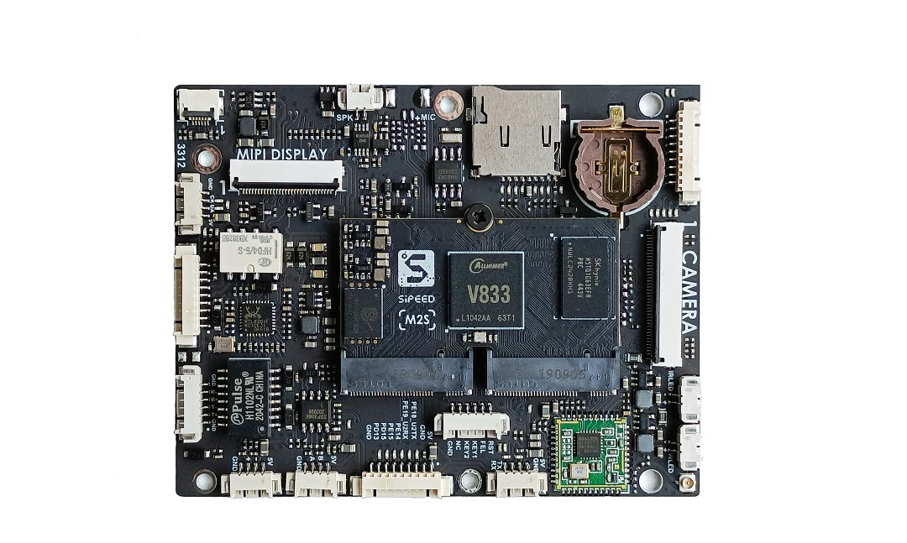

# M2S介绍

MaixII S是基于 V833 芯片设计的一款【板卡】+【底板】的开发板产品。

## 板卡

> 资料[下载](https://dl.sipeed.com/shareURL/MaixII/MaixII-A)

### 参数
| 项目 | 参数 | 
| --- | --- |
| CPU | 全志 V833 Arm-Cortex-A7 1.2Ghz 主频 |
| NPU | 0.4TOPS 算力|
|内存 |标配单片 16bit 128MB DDR3（可选最大 16bit 512MB DDR3）|
|存储|核心板板载 128MB SD NAND（可选 512MB 和 4GB）底板板载 TF 卡座子，可扩展存储|
|摄像头接口|MIPI：标配 200W 像素可见光摄像头(可选配宽动态摄像头)，76 度视场角 DVP：标配 30W 像素红外摄像头|
| 补光灯接口 | 板载 2 个 DC-DC 恒流降压驱动电路+2 个 2P 1.25mm 卧贴母座  （每路最大驱动能力达到 5V 0.5A）|
| 显示屏幕接口 |  MIPI：默认引出 4-lane MIPI 接口，已适配 5 寸和 7 寸屏 |
| 触摸屏接口 | 6P 0.5mm FPC 座子：可以连接电容触摸屏或者电阻触摸屏，目前已适配 GT911 |
| 音频接口 | 板载 3W 单声道音频功放，有 2P 1.25mm 卧贴母座可以连接喇叭  板载驻极体麦克风电路，有 2P 1.25mm 卧贴母座可以连接麦克风 |
| 以太网 | 板载百兆 PHY 和百兆网口变压器，有 6P 1.25mm 卧贴母座可以连接以太网口 |
| 继电器 | 板载继电器，触电切换能力 2A 30VDC |
| RTC 实时时钟 | 板载专用 RTC 芯片+1220 纽扣电池座子 |
| 按键 |• 复位按键 • FEL 按键（进入下载模式） • 2 个用户可编程按键（可以用作防拆报警键等自定义功能）|
| 扩展接口 |  • 4P 座子：1 组 UART、1 组 485、1 组 USB、1 组 IIC • 9P 座子：2 个供电引脚+2 个继电器引脚+1 个按键的 2 引脚+2 个信号引脚 • 9P 座子：7 个信号引脚（可以复用为 1 组 SPI 总线+多个 CS 脚）+2 个电源引脚 • 9P 座子：6 个信号引脚+3 个电源引脚 |

## 产品技术支持
M2S开发板可以在多种场景实现客户不同方面的需要，在AIoT上已经广泛的使用，品质和性能在行业内已经有非常好的口碑，专业的技术团队为广大客户解决硬件设计和软件功能上的各种各样问题。专业技术支持和更详细资料请联系商务<support@sipeed.com>。