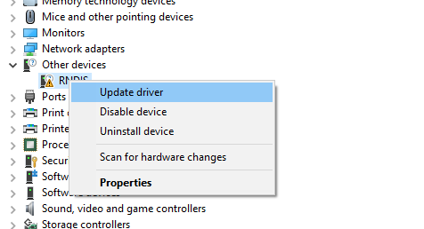
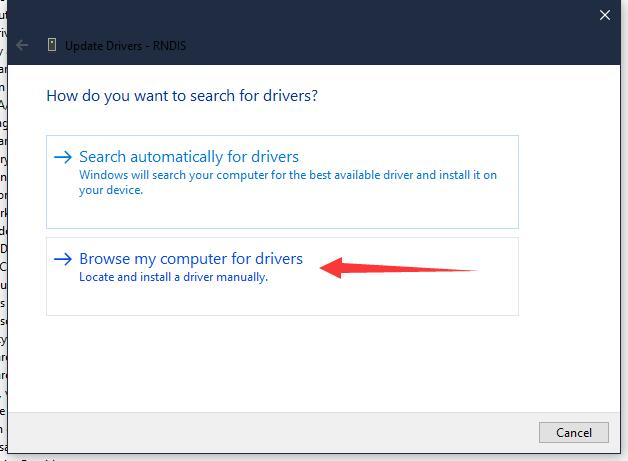
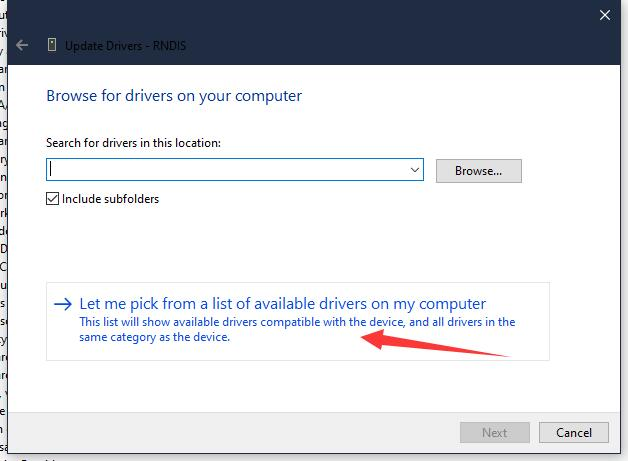
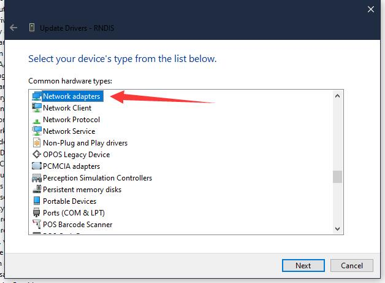
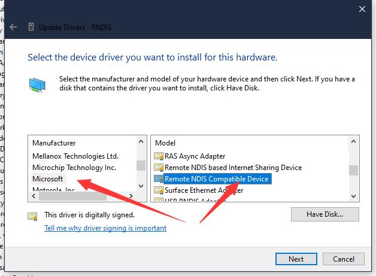
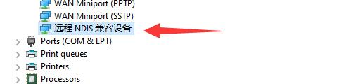

This essay just tells how to fix the RNDIS error in windows device manager.

## RNDIS interduction

Visit [Introduction to Remote NDIS (RNDIS)](https://learn.microsoft.com/en-us/windows-hardware/drivers/network/remote-ndis--rndis-2?source=recommendations) to know more.

## Steps

Right click the error RNDIS device and choose Update driver

Choose the `Browse my computer for drivers`

Choose where the arrow points at

Network adapter

Compatible Device

Then there is no error on the RNDIS device

