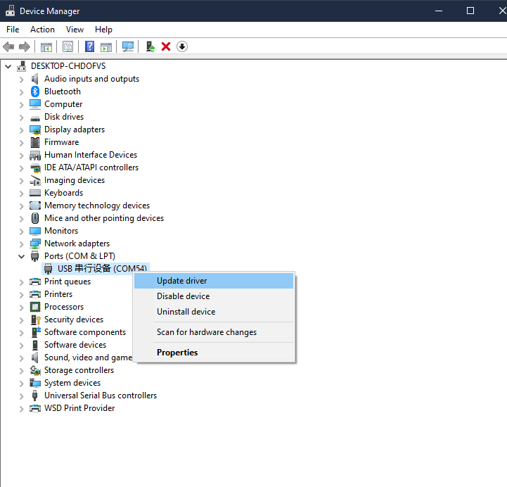
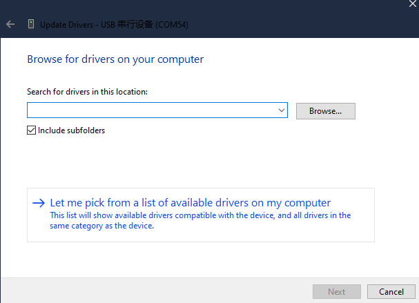
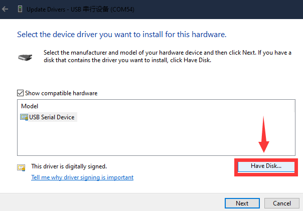
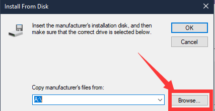
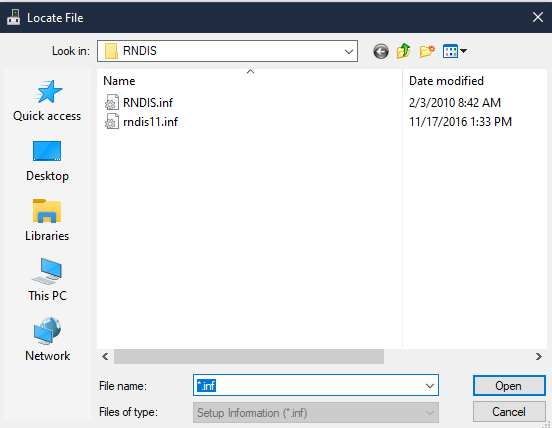
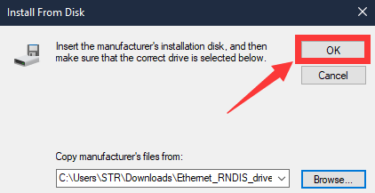
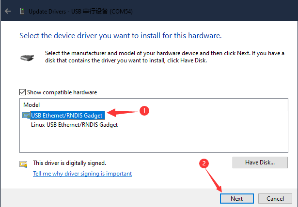
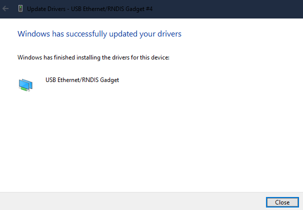

# Install RNDIS driver

## Introduction

RNDIS is the abbreviation of Remote Network Driver Interface Specification, is a specification to run TCP/IP on USB devices.

## Install guide

In Windows7 and later operating systems, RNDIS is already built-in. But we need do some operations to make the computer generally recognize the relevant RNDIS-compliant device.

### Download driver

<!-- **Windows Driver:**[Click me](https://dl.sipeed.com/shareURL/MaixSense/Drivers) -->
**Windows Driver:**[Click me](https://dl.sipeed.com/fileList/MaixSense/Drivers/Ethernet_RNDIS_drivers_20220808.zip)

### Install driver

Connect the device with computer, then we can see Serial Device in computer device manager. If there is no Serial Device in the computer device manager, maybe because of insufficient power supply. For desktop we recommend use the USB port on the back, for those who use USB hub we recommend use extra power supply for the hub, and we suggest to use the USB 3.0 port because USB 2.0 may lack of power to drive.

Right click it, choose Update driver, then choose `Broswer my computer for drivers`

We choose `Let me pick from...`

We choose `Have Disk...`

We choose `Broswe...`

Open the extracted downloaded file path, choose one .inf file, click the `open`.

Here we click `OK`

Then we choose `Next`.

We have finished installing driver.

Replug USB device, and wait about 10 seconds, we can see `RNDIS/Ethernet Gadget` in Network adapters in Device Manager.