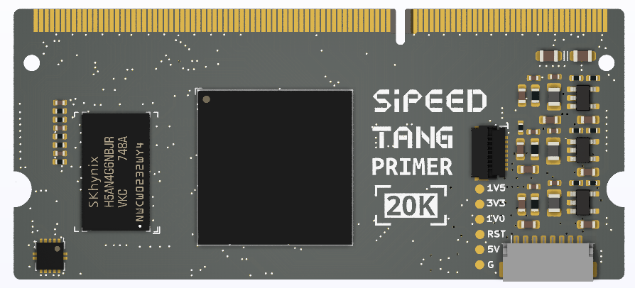

# Tang Primer

Tang Primer series FPGA is a larger capacity board designed by Sipeed.

<table>
    <thead>
        <tr>
            <th>Tang primer 20K</th>
            <th>Tang primer （Sold Out）</th>
        </tr>
    </thead>
        <tr>
            <td></td>
            <td></td>
        </tr>
</table>