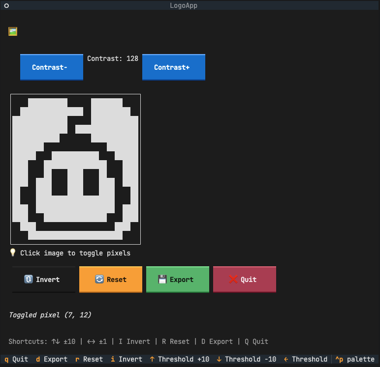
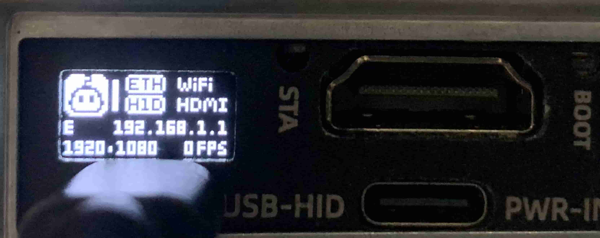

In addition to implementing KVM functionality, NanoKVM has opened up some data for secondary development by users. This document describes the purpose of this data and the considerations for development.

## Customizing Logo

> Note: This feature is supported in NanoKVM application versions `v2.3.6` and above.

NanoKVM supports custom logo display, which can be shown simultaneously on the OLED screen and the Web management interface. The OLED screen displays low-resolution monochrome binary images, while the Web interface displays high-resolution color images.

### Step 1: Generate Logo File



1. Download the [Logo Generation Python Script](https://github.com/sipeed/NanoKVM/tree/main/tools/logo_generator)
2. Install dependencies:
   ```bash
   pip install Pillow numpy textual
   ```
3. Prepare a logo image that is close to square and obtain its file path
4. Execute the script to generate the logo file:
   ```bash
   python logo_generator.py /path/to/your_logo.png
   ```
5. Select the display language (currently only Chinese and English are supported)
6. The terminal interface will display the OLED simulation effect. Adjust the contrast to achieve the desired display effect
7. Fine-tune: Click "Invert" to generate a white-background logo, or click "Pixel" to control individual pixel states
8. Click the "Export" button to generate `logo.bin` and `logo.ico` files in the current directory; click "Exit" after completion

### Step 2: Upload Logo File

1. Upload the `logo.bin` and `logo.ico` files to the `/boot` directory of NanoKVM:
   - Using SCP command:
     ```bash
     scp logo.bin logo.ico root@xxx.xxx.xxx.xxx:/boot
     ```
     The default login password is `root`. If you have modified the Web management interface password, please use the modified password for authentication.
   - Alternatively, via TF card: Copy the files to the `boot` partition of the TF card, and NanoKVM will automatically read them during boot
2. Reboot the NanoKVM device for the changes to take effect



## Modifying USB VID/PID

NanoKVM supports customizing the Vendor ID (VID) and Product ID (PID) of USB devices. You can modify these parameters by creating specific configuration files.

### Procedure

1. Create configuration files:
   - Modify VID: Create the `usb.vid` file in the `/boot` directory and write a 4-digit hexadecimal VID
   - Modify PID: Create the `usb.pid` file in the `/boot` directory and write a 4-digit hexadecimal PID

   **There are two methods to create the files:**

   **Method 1: Create via Web Terminal or SSH Login**
   
   Directly execute the following commands in the NanoKVM web terminal or after logging in via SSH:
   ```bash
   echo "0x3346" > /boot/usb.vid
   echo "0x1009" > /boot/usb.pid
   ```
   
   **Method 2: Create via TF Card**
   
   If the TF card is easily removable, insert it into your computer and create the `usb.vid` and `usb.pid` files directly in the `boot` partition, writing the corresponding values.

2. Reboot the NanoKVM device for the changes to take effect

3. **Restore Default VID/PID**: Delete the `/boot/usb.vid` and `/boot/usb.pid` files, then reboot the device to restore the default VID/PID.

### Verify Changes

After modification, you can verify the VID/PID changes using the `lsusb` command:

```bash
$ lsusb
Bus 003 Device 089: ID 3346:1009 sipeed NanoKVM
```

> Note: After modifying the VID/PID, the host may require reinstallation of the driver. Ensure that you use legitimate VID/PID combinations to avoid conflicts with existing devices.

## Obtaining Streaming Related Data

Streaming and image parameters are located in the `/kvmapp/kvm` folder.

### HDMI Obtained Image Native Resolution

- **Image Width**: `/kvmapp/kvm/width`
- **Image Height**: `/kvmapp/kvm/height`

Example: Check the current resolution in the terminal

```bash
echo "$(cat /kvmapp/kvm/width) * $(cat /kvmapp/kvm/height)"
```

> Note: width/height is read-only and cannot be written to. `kvm_stream` dynamically modifies vi parameters based on this data; manual modification will cause the vi subsystem to misinterpret the correct image. When either or both parameters are 0, it indicates the HDMI cable has been unplugged or the HDMI resolution is switching.

### Stream Transmission Resolution

- **Transmission Resolution**: `/kvmapp/kvm/res`
  - 0: Automatic, follows HDMI native resolution
  - 480: Transmit at 640x480
  - 600: Transmit at 800x600
  - 720: Transmit at 1280x720
  - 1080: Transmit at 1920x1080

> Note: This parameter is readable and writable.

Example: Set `kvm_stream` to transmit at 1280x720 resolution in the terminal

```bash
echo 720 > /kvmapp/kvm/res
```

### Stream Maximum Transmission Frame Rate

- **Maximum Transmission Frame Rate**: `/kvmapp/kvm/fps`
- **Range**: 0-60

Example: Limit `kvm_stream` to a maximum of 45 fps in the terminal

```bash
echo 45 > /kvmapp/kvm/fps
```

### Stream Current Transmission Frame Rate

- **Current Transmission Frame Rate**: `/kvmapp/kvm/now_fps`

Example: View current stream frame rate

```bash
cat /kvmapp/kvm/now_fps
```

### Check Hardware Version

NanoKVM has different versions, and there are hardware differences between versions. Please refer to the [schematic diagram]. The boot script will detect hardware differences and save them in `/etc/kvm/hw`.

- alpha: Early access version NanoKVM Full
- beta: Official version NanoKVM Full and Lite
- pcie: NanoKVM PCIe

### Network Related Configuration

- `/etc/kvm/server.yaml`
- For details, refer to WiKi -> KVM -> NanoKVM Cube -> Network

### USB Status Retrieval

```bash
cat /sys/class/udc/4340000.usb/state
```

- configured: Connected
- not attached: Not connected

### HDMI Status Retrieval

```bash
cat /kvmapp/kvm/state
```

- 1: HDMI Normal
- 0: HDMI Abnormal

### ETH Status Retrieval

```bash
cat /sys/class/net/eth0/carrier
```

- 1: Ethernet Cable Connected
- 0: Ethernet Cable Disconnected (inaccurate)

### WiFi Presence

The file `/etc/kvm/wifi_exist` indicates the presence of the WiFi module.

### WiFi Status Retrieval

```bash
cat /kvmapp/kvm/wifi_state
```

- 0: WiFi exists but not connected
- 1: WiFi connected

### Enable Watchdog (Real-time)

```bash
touch /etc/kvm/watchdog # Enable
rm /etc/kvm/watchdog    # Disable
```

### Disable Ping Function

```bash
touch /etc/kvm/stop_ping # Disable
rm /etc/kvm/stop_ping    # Enable
```

## USB HID Simulation Devices

- **Initialization**: NanoKVM uses USB Gadget to simulate USB HID devices, initializing keyboard, mouse, and touchscreen in the device boot script `/etc/init.d/S03usbdev`.

### Simulated Keyboard

- **Device**: `/dev/hidg0`
- **Message**: 8 bytes

```plaintext
| 0x00 | 0x00 | 0xXX | 0x00 | 0x00 | 0x00 | 0x00 | 0x00 |
```

- The fourth byte represents the ordinary key value, e.g., F11: 0x44.
- After sending the key value, it must be released promptly.

Example: Pressing the F11 key

```bash
echo -ne \\x00\\x00\\x44\\x00\\x00\\x00\\x00\\x00 > /dev/hidg0   # Press F11 key
echo -ne \\x00\\x00\\x00\\x00\\x00\\x00\\x00\\x00 > /dev/hidg0   # Release
```

### Simulated Mouse

- **Device**: `/dev/hidg1`
- **Message**: 4 bytes

```plaintext
| b8 Button | s8 X-axis Relative Movement | s8 Y-axis Relative Movement | s8 Wheel |
```

#### Buttons

- Left button down: 0x01
- Right button down: 0x12 (compatible with multiple systems)
- Release: 0x00

Example: Clicking the left button

```bash
echo -ne \\x01\\x00\\x00\\x00 > /dev/hidg1  # Press left button
echo -ne \\x00\\x00\\x00\\x00 > /dev/hidg1  # Release
```

#### Movement (Relative Movement)

- X/Y axis relative movement is signed, where positive x moves right and positive y moves down.

Example: Move right by 5 units, up by 1 unit

```bash
echo -ne \\x00\\x05\\xff\\x00 > /dev/hidg1
```

#### Wheel

- The wheel is signed, where positive values move down.

Example: Move down by 1 unit

```bash
echo -ne \\x00\\x00\\x00\\x01 > /dev/hidg1
```

### Simulated Touchscreen

- **Device**: `/dev/hidg2`
- **Message**: 6 bytes

```plaintext
| Button | X-axis Absolute Position Low 8 bits | X-axis Absolute Position High 8 bits | Y-axis Absolute Position Low 8 bits | Y-axis Absolute Position High 8 bits | Wheel |
```

#### Buttons

- Left button down: 0x01
- Right button down: 0x10
- Release: 0x00

Example: Clicking the left button

```bash
echo -ne \\x01\\x00\\x00\\x00\\x00\\x00 > /dev/hidg2  # Press left button
echo -ne \\x00\\x00\\x00\\x00\\x00\\x00 > /dev/hidg2  # Release
```

#### Movement (Absolute Position)

- X/Y are unsigned numbers, with (0x0001, 0x0001) representing the top left corner and (0x7fff, 0x7fff) representing the bottom right corner.

Example: Move the mouse to the center of the screen

```bash
echo -ne \\x00\\xff\\x3f\\xff\\x3f\\x00 > /dev/hidg2
```

#### Wheel

- The wheel is signed, where positive values move down.

Example: Move down by 1 unit

```bash
echo -ne \\x00\\x00\\x00\\x00\\x00\\x01 > /dev/hidg2
```

## IO

The ATX power control function is implemented through IO and the external KVM-B. The corresponding relationship between IO and functions is as follows:
Alpha version definition (including early NanoKVM-Cube)

| Function      | Linux GPIO Number |
|---------------|-------------------|
| PWR LED Input | 504               |
| PWR KEY Output| 503               |
| RST KEY Output| 507               |
    
Beta version definition (including later NanoKVM-Cube and all NanoKVM-PCIe)

| Function      | Linux GPIO Number |
|---------------|-------------------|
| PWR LED Input | 504               |
| PWR KEY Output| 503               |
| RST KEY Output| 505               |

+ Read LED status (using Beta as an example)
    ```shell
    cat /sys/class/gpio/gpio504/value
    # 0 -> LED on
    # 1 -> LED off
    ```
+ Operate power button (using Beta as an example)
    ```shell
    # Press down
    echo 1 > /sys/class/gpio/gpio503/value

    # Wait for 1 second
    sleep 1

    # Release
    echo 0 > /sys/class/gpio/gpio503/value
    ```
+ Operate reset button (using Beta as an example)
    ```shell
    # Press down
    echo 1 > /sys/class/gpio/gpio505/value

    # Wait for 1 second
    sleep 1

    # Release
    echo 0 > /sys/class/gpio/gpio505/value
    ```
+ For other IO: Please refer to [LicheeRV Nano GPIO](https://wiki.sipeed.com/hardware/zh/lichee/RV_Nano/5_peripheral.html#LicheeRV-Nano%E5%BC%95%E8%84%9A%E5%9B%BE%26amp%3BLinux-GPIO%E7%BC%96%E5%8F%B7%EF%BC%9A) for development.

## Precautions

- Users should not place their own built programs in the `/kvmapp` directory, as any updates will reset all contents within the folder.
- Simulated keyboard and mouse operations may conflict with operations on the front-end page.