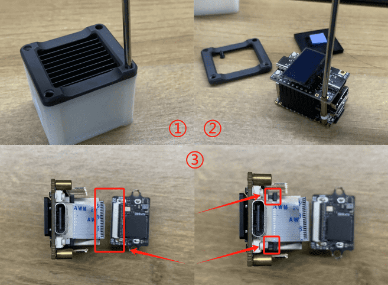
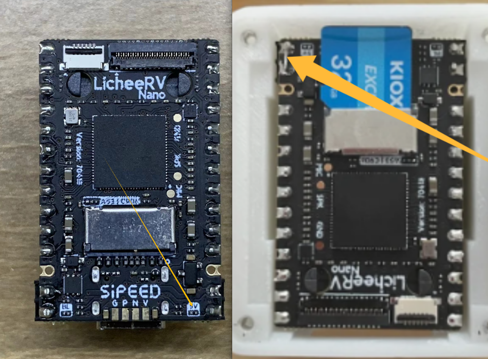

## Exception Fixes

Please use the table of contents on the right to locate the issue that matches your situation.

**The following solutions are based on the latest application version. If you encounter issues, please update the application first. If you cannot update via the web interface, please follow the steps below for a forced update:**

1. Refer to [this link](https://wiki.sipeed.com/hardware/en/kvm/NanoKVM/system/updating.html#%E8%8E%B7%E5%8F%96-IP) to connect to the development board.
2. Run: `python /etc/kvm/update-nanokvm.py`

> Users outside China may experience download failures due to DNS issues. Please refer to [Detailed DNS Configuration Guide for NanoKVM Cube/Lite/PCIe](https://wiki.sipeed.com/hardware/en/kvm/NanoKVM/user_guide.html#设置DNS) and add the recommended DNS servers before trying again.
> Early application versions may not include this script. In that case, download it from https://github.com/sipeed/NanoKVM/blob/main/kvmapp/system/update-nanokvm.py, extract it, grant execute permission, and try again.

### About Resetting the Web Password and SSH Password

#### Default Passwords

- **Web interface:** `username`/`password` = `admin` / `admin`
- **SSH:** `username`/`password` = `root` / `root`

#### Changing or Resetting the Password

1. Starting from version `2.1.5`, if you have never set a web password before, you will be prompted to change it after login. After changing it, the SSH `root` password will also be synchronized to the new web password.
2. Starting from version `2.1.5`, if you forget the password, press and hold the `BOOT` button on the device for more than 10 seconds.
   - On **NanoKVM-Cube**, the `BOOT` button is located to the right of the USB-HID port.
   - On the **PCIe version**, the `BOOT` button is accessible on the panel.
   - On some older **NanoKVM Full** versions, there may be no opening at the corresponding location, so disassembly may be required.
3. If holding the button does not reset the password, the application version may be lower than `2.1.5`. Please refer to [this link](https://wiki.sipeed.com/hardware/en/kvm/NanoKVM/system/flashing.html) to reflash the image. Note that reflashing will erase all configuration data.

### HID Keyboard and Mouse Not Working

1. Use the **Reset HID** function in the web interface.
2. Some host systems have strict requirements for USB keyboards and mice and require **HID Only** mode. In this mode, USB simulates only keyboard and mouse devices. Switch to this mode using the mouse icon in the web interface.
3. Some motherboards require HID keyboard and mouse devices to include a BIOS identifier. NanoKVM can enable this by creating `BIOS` under `/boot`. Run: `touch /boot/BIOS && restart`
4. Check whether the USB connection is stable. You can verify whether the HID icon on the OLED is lit, or run the following command in the web terminal: `cat /sys/class/udc/4340000.usb/state`
   If it shows `not connected`, the USB cable may have poor contact. Replace the USB cable and try again.

### BIOS Does Not Recognize the HID Keyboard and Mouse

1. Some host systems require **HID Only** mode. In this mode, USB simulates only BIOS-compatible keyboard and mouse devices. Switch this mode using the mouse icon in the web interface.
2. Use the **Reset HID** function in the web interface.
3. On some Dell models, due to very poor motherboard driver compatibility, the keyboard and mouse may not be recognized in BIOS. There is currently no solution for this.

### Incorrect Key Mapping for Non-English Keyboards

- The keyboard layout must be changed in the settings of the controlled host system. For example, to set a French keyboard layout in Ubuntu:

  `Settings -> Keyboard -> Input Sources -> '+' -> Add -> Search "French" -> Add`

### STA LED (Blue LED) Not Flashing Normally

The STA LED indicates the running status of NanoKVM.

- **Normal state:** irregular flashing
- **Regular intermittent off state after power-on:** the system did not detect a valid system on the TF card. Check whether the TF card is inserted correctly and reflash the TF image.
- **Off for a long time:** usually caused by lack of power. Check the power supply.

> If powered only through USB-HID, USB power may be cut off when the host computer shuts down. Please refer to your BIOS documentation and configure USB to stay powered, or use auxiliary power.
> If connected to an abnormal or unsupported power source, NanoKVM may be damaged, which can also cause the STA LED to stay off.

- **On continuously without flashing:** this normally should not happen with the official system and application. If custom features have been configured inside NanoKVM, the system may freeze and leave the STA LED constantly on. Reflashing the image is recommended.

### Unable to Obtain an IP Address

- **Lite users** should first check whether a TF card is inserted. The Lite version does not include a TF card by default, so users must prepare one themselves. Please follow the instructions [here](https://wiki.sipeed.com/hardware/en/kvm/NanoKVM/system/flashing.html) to flash the TF card and try again.
- On **NanoKVM Cube** devices (including **NanoKVM Full** and **NanoKVM Lite**), certain power supplies or HDMI connections may prevent the device from obtaining an IP address. Please verify the following:

> Disconnect all cables, power the device using a power bank, and connect the network cable to see whether it can obtain an IP address.
> If it can, reconnect HDMI and/or the host USB cable and check whether the IP address remains available.
> If the IP address exists only when powered by the power bank, but disappears after connecting HDMI or the host USB, then this issue is confirmed. Please contact customer service to purchase an isolator.

- Check whether the network switch supports **100M Ethernet**. Some newer switches do not support 100M links. Replace the switch and try again.

### Unable to Obtain an IP Address via DHCP, and the Device Shows `192.168.70.70`

Please refer to [Static IP Fix](https://wiki.sipeed.com/hardware/en/kvm/NanoKVM/static_ip_fix.html).

### No Display After Logging In to the Browser Interface

#### Default Resolution Error

NanoKVM supports up to **1080P** resolution only, but the host may sometimes output a resolution higher than 1080P. It is recommended to modify the default EDID to solve this problem. Before doing so, please update the APP to the latest version (`2.3.2` or above) in the web interface.

##### Cube Version

On-site operation is required. After modification, you must power cycle the device to apply the new configuration. Otherwise, HDMI capture may behave abnormally.

Open the web terminal and run:

`/kvmapp/system/tool/nanokvm_update_edid /kvmapp/system/tool/E21_NanoKVM.bin`

```shell
## Normal output for Cube/Lite:
# /kvmapp/system/tool/nanokvm_update_edid /kvmapp/system/tool/E21_NanoKVM.bin
Chip Version: LT6911UXC
Product Version: CUBE_B

=========================================================
Incorrect EDID may cause issues such as
inability to display images, please modify with caution
=========================================================


==========================================================
⚠️  WARNING: Hardware version detected as Cube/Lite!
==========================================================
After flashing, you MUST manually power cycle the device!
Please ensure you can physically disconnect its power,
NOT just remotely reboot it!!
==========================================================

Do you want to continue? (Y/N):
Y
EDID data loaded successfully from /kvmapp/system/tool/E21_NanoKVM.bin
Writing EDID....
EDID write completed
Reading EDID...
EDID data verified successfully

=========================================================
✅  EDID update successful!
Please manually power cycle the device to apply changes.
=========================================================
```

##### PCIe Version

After modification, power cycle the device to apply the new configuration. Otherwise, HDMI capture may behave abnormally.

Open the web terminal and run:

`/kvmapp/system/tool/nanokvm_update_edid /kvmapp/system/tool/E21_NanoKVM.bin`

```shell
## Normal output for PCIe:
# /kvmapp/system/tool/nanokvm_update_edid /kvmapp/system/tool/E21_NanoKVM.bin
Chip Version: LT6911UXC
Product Version : PCIE_A

=========================================================
Incorrect EDID may cause issues such as
inability to display images, please modify with caution
=========================================================

EDID data loaded successfully from /kvmapp/system/tool/E21_NanoKVM.bin
Writing EDID....
EDID write completed
Reading EDID...
EDID data verified successfully

=========================================================
✅  EDID update successful!
=========================================================
```

#### Other Possible Causes

1. The controlled host may be in sleep mode. Press any key on the keyboard to try waking it up.
2. Some non-Chrome browsers may fail to display H264 video while MJPEG works normally. Please try again using Chrome.
3. On the **PCIe version**, try clicking **Reset HDMI** under the **Video** icon.
4. On the **Cube version**, try unplugging and reconnecting the HDMI cable after opening the web page.
5. Check the resolution shown on the OLED, or run the following command in the web terminal:

   `echo "$(cat /kvmapp/kvm/width) * $(cat /kvmapp/kvm/height)"`

   Compare it with the actual resolution of the controlled host. If they differ, you can manually set the resolution using:

   `echo xxx > /kvmapp/kvm/width && echo xxx > /kvmapp/kvm/height`

> If the host system is Windows, the resolution shown in Display Settings may not match the actual output resolution. Please check **Advanced Display Settings -> Active Signal Resolution**.

6. Early internal test versions of **Full NanoKVM** used standard ribbon cables to connect the HDMI capture board. Poor cable contact may prevent HDMI signal detection. You can reconnect the cable as shown below, or contact customer service to purchase the dedicated cable.



7. Try rebooting the device by running: `reboot` in the web terminal.
8. **If the methods above still cannot identify the problem**, run the following in the web terminal:

   `cat /proc/cvitek/vi_dbg`

> If `VIDevFPS` is `0`, NanoKVM is not receiving HDMI input. Check whether the host is outputting a video signal, whether the HDMI cable is damaged, or whether the Cube is an early version with poor connector contact.
> If `VIDevFPS` is not `0` but `VIFPS` is `0`, NanoKVM failed to configure the HDMI parameters correctly. On Cube, unplug and reconnect HDMI to trigger auto-detection. On PCIe, click **Reset HDMI** under **Video**.
> Check whether `VIInImgWidth` and `VIInImgHeight` match the actual HDMI resolution. If not, NanoKVM did not auto-detect the correct HDMI parameters, and you should manually set the resolution as described above.

### No Display After the Host Wakes from Sleep

1. Check whether you are using a cheap **DP-to-HDMI passive adapter**. These adapters often lack a proper wake-up mechanism and cannot notify NanoKVM when the display is restored.
2. On the **PCIe version**, click **Reset HDMI** to force reacquisition of the video signal.
3. The **Cube/Lite versions** do not have a reset function for this. Please switch to an **active DP adapter**.

### Severe Video Delay in a Local Network Environment

1. Try replacing the network switch or power supply.
2. If the issue persists, please contact after-sales support.

### OLED Displays Information Normally, but the Web Page Cannot Be Opened

1. Please perform a forced application update.

### OLED Does Not Light Up

NanoKVM Full and PCIe versions include an OLED screen for displaying information such as the IP address. If the OLED does not light up, follow these steps:

1. Application version `2.1.4` added an OLED sleep function. Press the `BOOT` button to temporarily wake the OLED.
2. If the STA LED is flashing abnormally, first check whether the system has booted normally. Refer to the section **STA LED (Blue LED) Not Flashing Normally** above.
3. Try a forced update or reflash the system.

### About Memory

1. NanoKVM has a total of **256MB RAM**. Part of it is reserved as a dedicated **ION memory area** for video/image processing, so the memory visible in user space will be less than 256MB.
2. Firmware versions earlier than `1.3.0` reserve only **128MB** for user space. All images from version `1.3.0` onward increase user-space memory to **158MB**, which is better for long-term Tailscale usage. If needed, please update the image according to the instructions [here](https://wiki.sipeed.com/hardware/en/kvm/NanoKVM/system/flashing.html).
3. Enable **Memory Optimization** in Settings.

### Host Reboots Unexpectedly

- In early internal test versions, if the **Full NanoKVM ATX board** is connected to the host's **RESET** pin, rebooting NanoKVM may also reboot the host. Please disconnect the RESET jumper or contact customer service to obtain stable-version accessories.

### Reverse Current / Backfeeding

- Early internal test versions of **Full NanoKVM** have a reverse-current issue: when the host is powered off and USB no longer provides power, connecting auxiliary power may feed current back into the host.

1. It is recommended to configure the host so that USB remains powered after shutdown.
2. For **Full version** users: use a soldering iron to disconnect the 5V resistor or the shorted header at the location shown below, and power the unit only through the auxiliary power port.



### Try Power Cycling to Solve Unknown Issues

### If the Update Fails Due to Network Disconnection or Other Abnormal Conditions During the Update Process

1. Refer to [this page](https://wiki.sipeed.com/hardware/en/kvm/NanoKVM/system/updating.html#%E8%8E%B7%E5%8F%96-IP) to connect to the development board.
2. Run the following command to restore the previous version:

   `rm -r /kvmapp && cp -r /root/old/ / && mv /old/kvmapp && reboot`

3. Manually perform a forced update using the method described at the top of this page.
4. Reflash the system.

### If the Methods Above Do Not Solve the Problem

Please describe your NanoKVM model and the issue you encountered in the forum, GitHub, or QQ group. We will respond patiently.

- When reporting an issue, please specify:
  - your NanoKVM version,
  - the usage environment (motherboard model, operating system, etc.),
  - and the system configuration (for example: image version `1.4.0`, application version `2.2.5`, H264, 1080P, high quality, frame rate 30).

  This information helps us reproduce and solve the issue more efficiently.

- If there is a **no image display** problem, please run the following commands while the issue is occurring and paste the output into the issue:

```shell
cat /etc/kvm/hw
cat /etc/kvm/hdmi_version
cat /etc/kvm/hdmi_mode
```

- Some issues require collecting runtime application logs. Please follow these steps:

```shell
# Enable SSH in the web interface (Settings -> Devices -> SSH)
# Log in via SSH using the password configured in the web interface.
# If no password has been set, the default password is root.
ssh root@xxx.xxx.xxx.xxx

# Change the log level in /etc/kvm/server.yaml:
# logger -> level: change info to debug
vi /etc/kvm/server.yaml

# Press 'i' to edit; use 'Esc' + :wq to save and exit

# Restart the KVM service
/etc/init.d/S95nanokvm restart

# Copy the log
```

## Feedback Methods

- MaixHub Forum: https://maixhub.com/discussion/nanokvm
- GitHub: https://github.com/sipeed/NanoKVM
- QQ Group: 703230713
