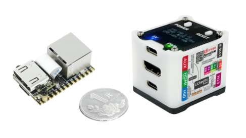
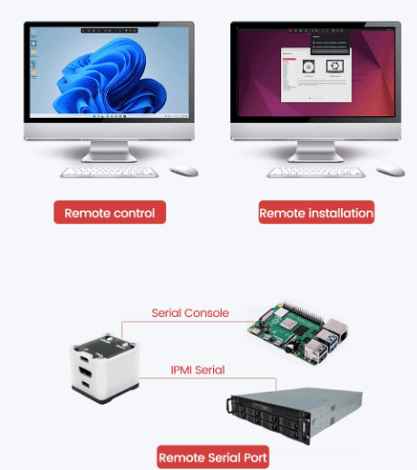

## Introduction

The Lichee NanoKVM is an IP-KVM product based on the LicheeRV Nano, inheriting its compact size and powerful features.

NanoKVM includes an HDMI input interface that can be recognized as a monitor by a computer, capturing the computer's screen. It has a USB 2.0 interface to connect to the computer host, recognized as HID devices like keyboard, mouse, and touchpad, and uses extra storage space on the Micro SD card, mounted as a USB flash drive. It comes with a 100 Mbps Ethernet port for video and control signal transmission. Additionally, the Full version features an ATX power control interface (USB-C form) for remote control and monitoring of the host's power status. Under the Full version's shell, there is an OLED display for showing the device's IP and KVM-related status.

To meet different user needs, NanoKVM is available in two versions:
- **NanoKVM Lite**: Basic version suitable for DIY enthusiasts and enterprises with bulk requirements.
- **NanoKVM Full**: Complete version with a sleek shell and full accessories, including a pre-installed system image card, recommended for individual users.

## Use Cases

- **Server Management**: For real-time monitoring and control of servers.
- **Remote Desktop and Power Control**: Provides remote control functionality without requiring the host to be networked or run specific software.
- **Remote Installation**: Simulates a USB flash drive to mount installation images and set up the system, also allows BIOS access.
- **Remote Serial Port (Not exposed in Full beta version)**: Provides two serial ports for IPMI use or connecting other development boards for web-based serial terminal interaction. More features are coming soon (e.g., live streaming), stay tuned.

## Specifications

| Product                     | NanoKVM (Lite)                      | NanoKVM (Full)                                  | PiKVM V4                        |
| --------------------------- | ----------------------------------- | ----------------------------------------------- | ------------------------------- |
| Computing Unit              | LicheeRV Nano (RISCV)               | LicheeRV Nano (RISCV)                           | CM4 (ARM)                       |
| Resolution                  | 1080P @ 60fps                       | 1080P @ 60fps                                   | 1080P, 1200P @ 60fps            |
| Video Encoding              | MJPEG, H264 (WIP)                   | MJPEG, H264 (WIP)                               | MJPEG, H264                     |
| Video Latency               | 90-230ms                            | 90-230ms                                        | 100-230ms                       |
| UEFI/BIOS                   | ✓                                   | ✓                                               | ✓                               |
| Emulated USB Keyboard/Mouse | ✓                                   | ✓                                               | ✓                               |
| Emulated USB Storage        | ✓                                   | ✓                                               | ✓                               |
| IPMI                        | ✓                                   | ✓                                               | ✓                               |
| Wake-on-LAN                 | ✓                                   | ✓                                               | ✓                               |
| Tailscale                   | ✓                                   | ✓                                               | ✓                               |
| WebSSH                      | ✓                                   | ✓                                               | ✓                               |
| Custom Scripts              | ✓                                   | ✓                                               | ✓                               |
| RTC                         | -                                   | -                                               | ✓                               |
| Ethernet                    | 10/100MbE                           | 10/100MbE                                       | 10/100/1GbE                     |
| ATX Power Control           | None, user-configurable             | USB interface IO control board                  | RJ45 interface IO control board |
| OLED Display                | None, user-expandable               | 128x64 0.96" white                              | 128x32 0.91" white              |
| Serial Terminal             | 2 channels                          | 2 channels                                      | 1 channel                       |
| TF Card                     | None, user-provided                 | Included, ready to use                          | Included                        |
| Expansion Accessories       | None                                | WiFi or PoE                                     | WiFi/LTE, PoE                   |
| Power Consumption           | 0.2A@5V                             | 0.2A@5V                                         | Peak 2.6A@5V                    |
| Power Input                 | Powered by PC USB                   | Powered by PC USB   Supports auxiliary power | Requires DC 5V 3A               |
| Cooling                     | Silent, fanless                     | Silent, fanless                                 | Requires active fan cooling     |
| Dimensions                  | 23x37x15mm   ~1/30 PiKVM V4 size | 40x36x36mm   ~1/7 PiKVM V4 size              | 120x68x44mm                     |

## NanoKVM Hardware and Software Resources

NanoKVM is built on the Sipeed [LicheeRV Nano](https://wiki.sipeed.com/hardware/zh/lichee/RV_Nano/1_intro.html) core board. You can find the hardware specifications, schematics, and dimensions here: [Click here](http://cn.dl.sipeed.com/shareURL/LICHEE/LicheeRV_Nano)

NanoKVM Lite consists of the LicheeRV Nano E and HDMItoCSI board, while NanoKVM Full adds the NanoKVM-A/B board and shell to the Lite version. The HDMItoCSI board converts HDMI signals; NanoKVM-A includes OLED, ATX control output (TypeC interface), auxiliary power (TypeC interface), and ATX power/reset buttons; NanoKVM-B connects the A board to the computer's ATX pins for remote power control.

> The NanoKVM image is built on the LicheeRV Nano SDK and MaixCDK, compatible with LicheeRV Nano resources. Other SG2002 products cannot use KVM software. Contact us for technical support if you want to develop HDMI input applications on NanoKVM.

+ [Schematics](https://cn.dl.sipeed.com/shareURL/KVM/nanoKVM/HDK/02_Schematic)
+ [3D Structure](https://cn.dl.sipeed.com/shareURL/KVM/nanoKVM/HDK/04_3D_file)
+ [NanoKVM Image Download](https://github.com/sipeed/NanoKVM/releases)

## Purchase Links

[Official Taobao Store](https://item.taobao.com/item.htm?id=811206560480)
[AliExpress Store](https://www.aliexpress.com/item/1005007369816019.html)
[Pre-sale Page](https://sipeed.com/nanokvm)

## Product Feedback

If you encounter any issues or have suggestions, please contact us through the following channels:

+ [Github Issues](https://github.com/sipeed/NanoKVM)
+ [MaixHub Forum](https://maixhub.com/discussion/nanokvm)
+ QQ Group: 703230713
