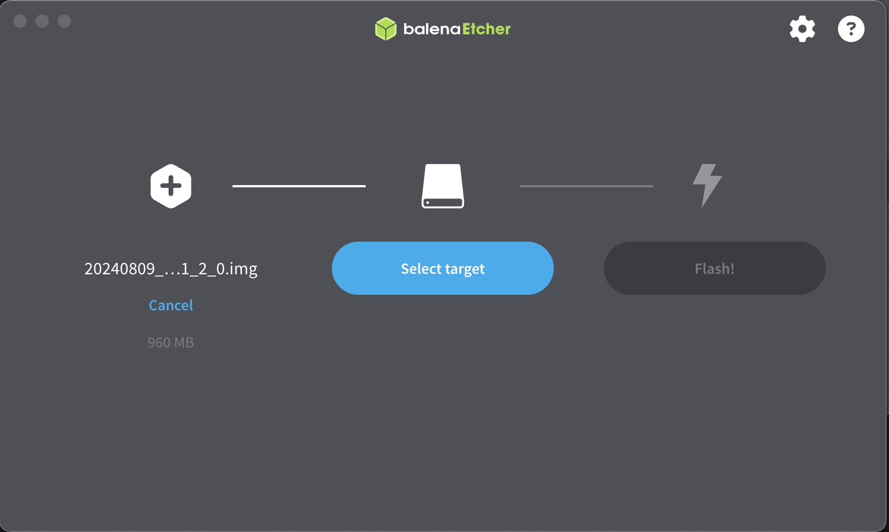

*The NanoKVM Full version comes pre-flashed with an image and can skip this step if desired.*

## Burning the TF card using a card reader

1. Prepare the SD Card:

    - The Full version comes with a 32G SD card. You will need to remove it by opening the case.
    - The Lite version requires you to prepare an SD card of at least 8G.

1. Go to [Github](https://github.com/sipeed/NanoKVM/releases) to download the latest version image.

1. Install the flashing software. We recommend using [Etcher](https://etcher.balena.io).

1. Run Etcher:
    

1. Click `Flash from file` and select the image file:

    

1. Click `Select target` and choose the SD card:

    

1. Click `Flash!` to start the flashing process:

    

1. Wait for the flashing process to complete.

    

Congratulations! The image has been successfully flashed!

You can now insert the SD card into the NanoKVM and proceed to the next steps.

## USB Update TF Card Image

**Note: Using USB can only update the system; it cannot be used for the initial flashing.**
Please ensure that the TF card already has the system installed and **the system can run normally** before using this method.

- For **NanoKVM cube**:

  - Power off the device, keeping the TF card inserted.
  
  - Use a sharp object like a toothpick or SIM eject tool to press down on the reset button located in the small round hole next to the USB-C port. While pressing down, connect the USB cable to the computer. Wait for the USB drive to appear on your computer, and once the `boot` drive icon shows up, you can release the tool.

    

  - Open `Etcher`, select the image file, choose the USB drive, and click `Flash`.

    

  - Wait for the flashing process to complete. If your computer prompts you with a message like `You need to format the disk in drive G: before you can use it`, **do not** format the disk! If you do, the newly flashed system will be erased. Simply close the window, right-click the disk, and select "Eject" to safely remove the TF card.

  - Then, disconnect the USB-C cable, power the device back on, and wait for the system to boot. The first boot may take a little longer, so it's recommended to wait for about 1 minute (until something appears on the screen). Do not power off during boot, as doing so may corrupt system files being processed (the solution for such corruption is to re-flash the image).

> If you cannot enter USB upgrade mode, the system files may be corrupted. In this case, use a card reader to flash the TF card.