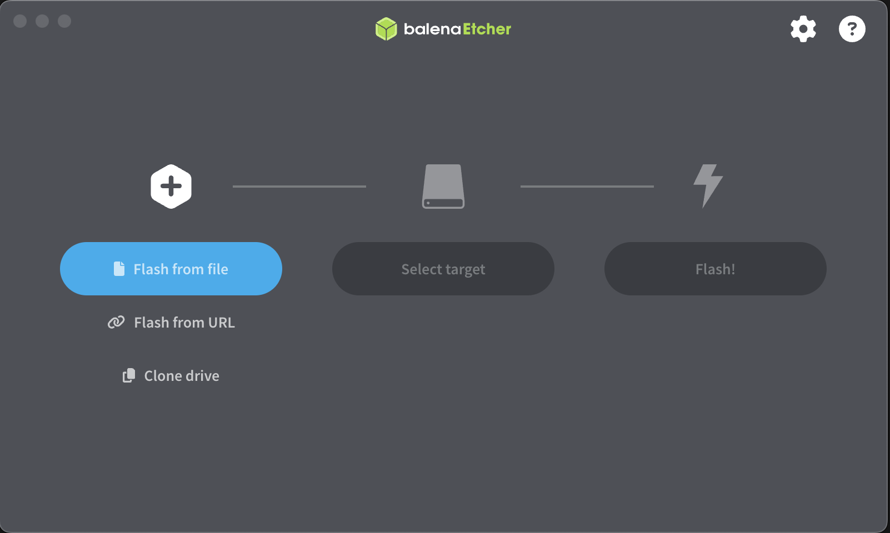
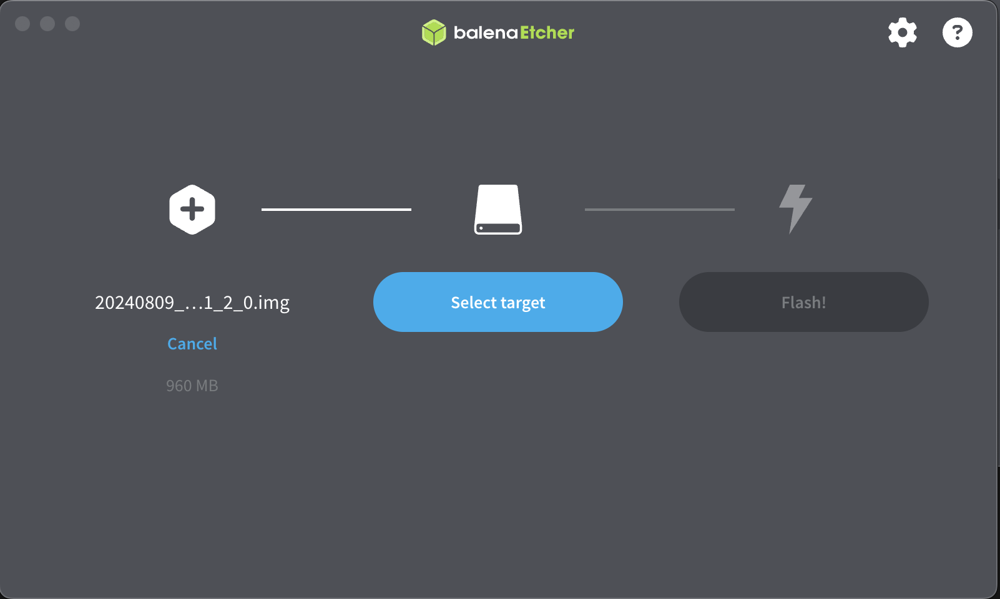
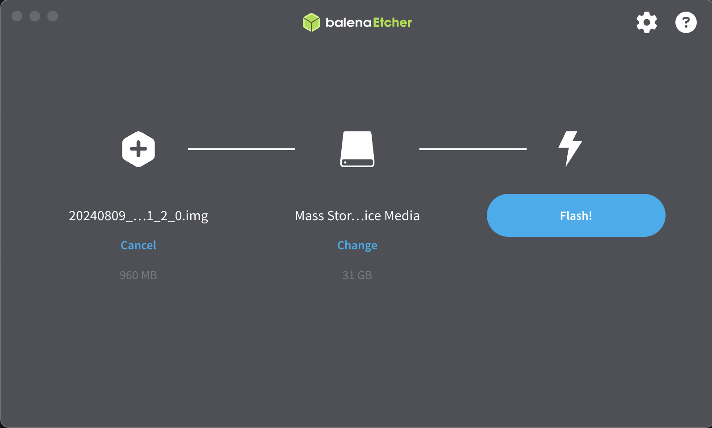
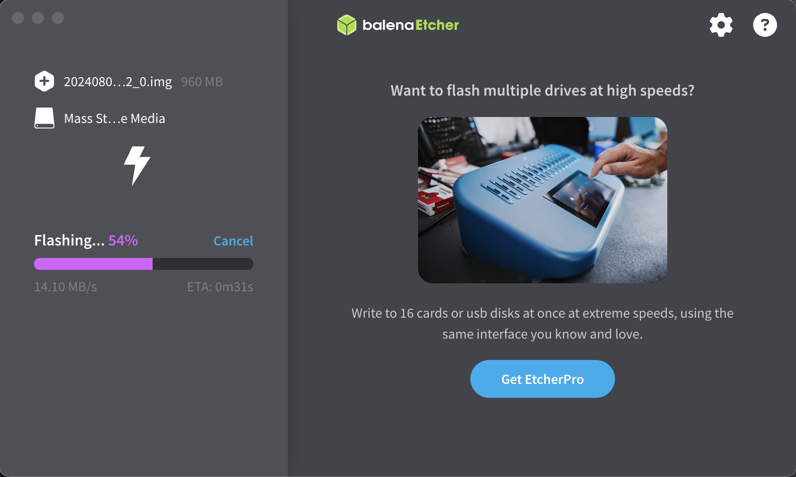
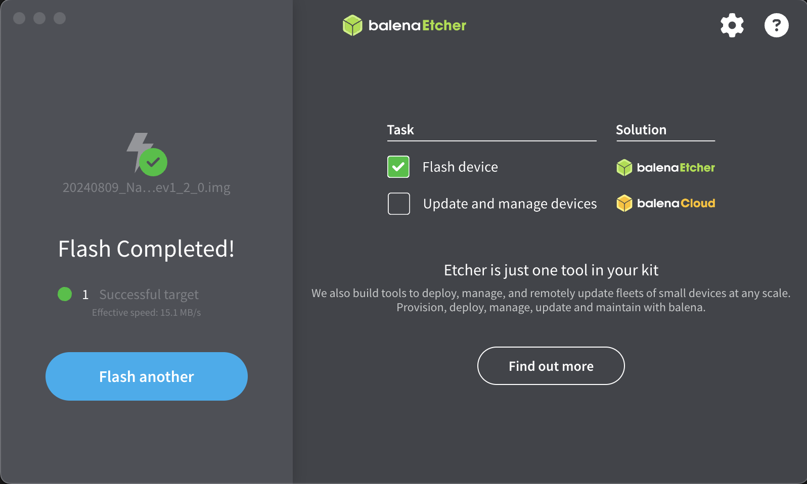
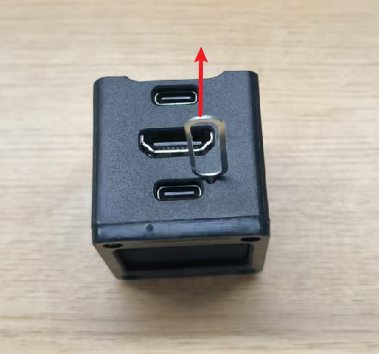
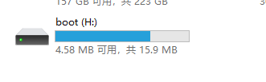

*The NanoKVM Full version comes pre-flashed with an image and can skip this step if desired.*

## Burning the TF card using a card reader

1. Prepare the SD Card:

    - The Full version comes with a 32G SD card. You will need to remove it by opening the case.
    - The Lite version requires you to prepare an SD card of at least 8G.

1. Go to [Github](https://github.com/sipeed/NanoKVM/releases/latest) to download the latest version image.

1. Install the flashing software. We recommend using [Etcher](https://etcher.balena.io).

1. Run Etcher:
    

1. Click `Flash from file` and select the image file:

    

1. Click `Select target` and choose the SD card:

    

1. Click `Flash!` to start the flashing process:

    

1. Wait for the flashing process to complete.

    

Congratulations! The image has been successfully flashed!

You can now insert the SD card into the NanoKVM and proceed to the next steps.

## USB Update TF Card Image

**Note: Using USB can only update the system; it cannot be used for the initial flashing.**
Please ensure that the TF card already has the system installed and **the system can run normally** before using this method.

**For NanoKVM Cube:**

1. Power off the device and keep the TF card inserted.

1. Locate the small round hole next to the HID (PC-USB) port. **The `BOOT` button sits inside the case, deeper and lower than the hole rather than directly behind its center**, so a pin pushed straight in and then pressed downward never reaches it. This is why so many users cannot get it to work.

1. Insert the pin all the way into the hole, then **use the edge of the hole as a fulcrum and lever the exposed end of the pin toward the top of the device** (the direction of the red arrow in the photo). The pin is rigid, so as its outer end goes up, the tip inside is pushed down onto the `BOOT` button. Use moderate force: you only need to feel the button being pressed; do not force it.

    

1. **Keep levering the pin upward without releasing it**, and while holding it, plug one end of the USB cable into **the USB-C port next to the hole** (the HID port, below the HDMI port) and connect the other end to the computer.

1. Wait for the USB drive to appear on your computer. **Do not release the pin until the `boot` drive shows up.**

    

1. Open `Etcher`, select the image file, choose the USB drive, and click `Flash`.

    

1. Wait for the flashing process to complete. If your computer prompts you with a message like `You need to format the disk in drive G: before you can use it`, **do not** format the disk! If you do, the newly flashed system will be erased. Simply close the window, right-click the disk, and select "Eject" to safely remove the TF card.

1. Then, disconnect the USB-C cable, power the device back on, and wait for the system to boot. The first boot may take a little longer, so it's recommended to wait for about 1 minute (until something appears on the screen). Do not power off during boot, as doing so may corrupt system files being processed (the solution for such corruption is to re-flash the image).

> If you cannot enter USB upgrade mode, the system files may be corrupted. In this case, use a card reader to flash the TF card.
