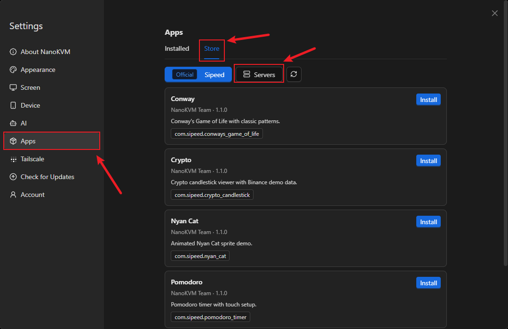
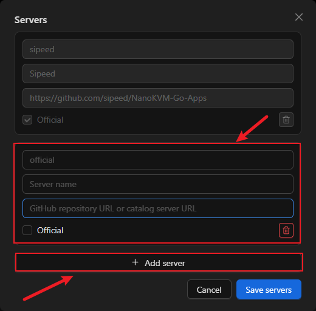
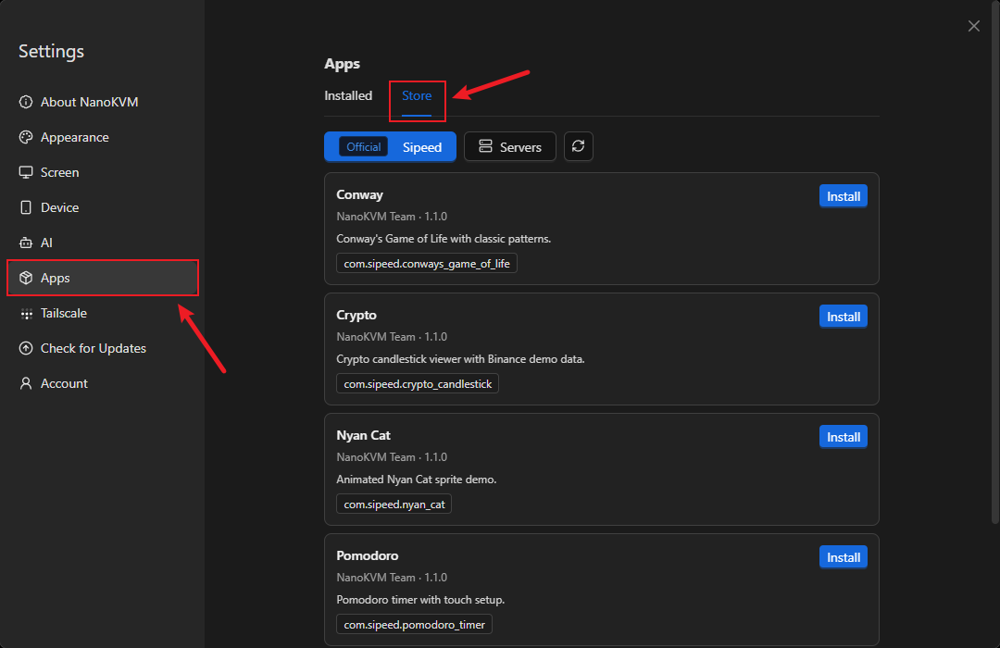
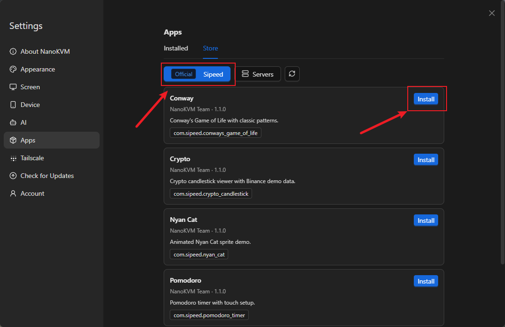
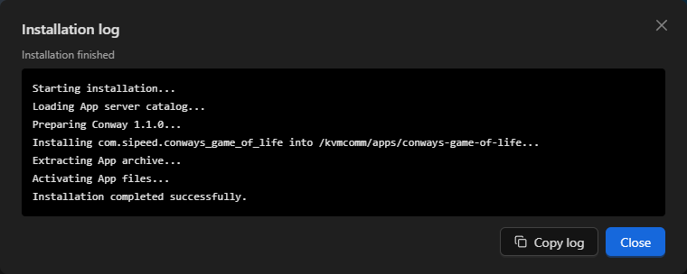
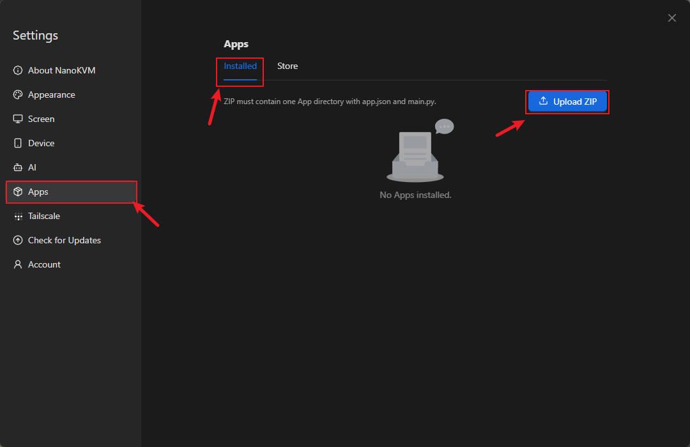
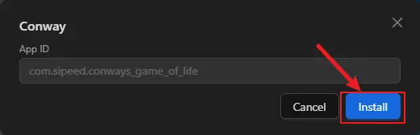
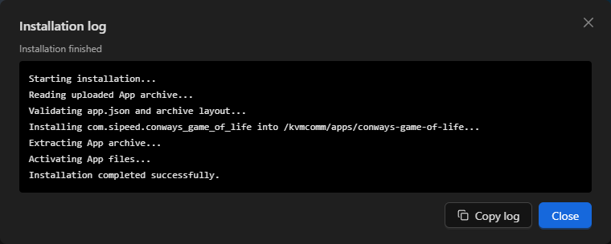
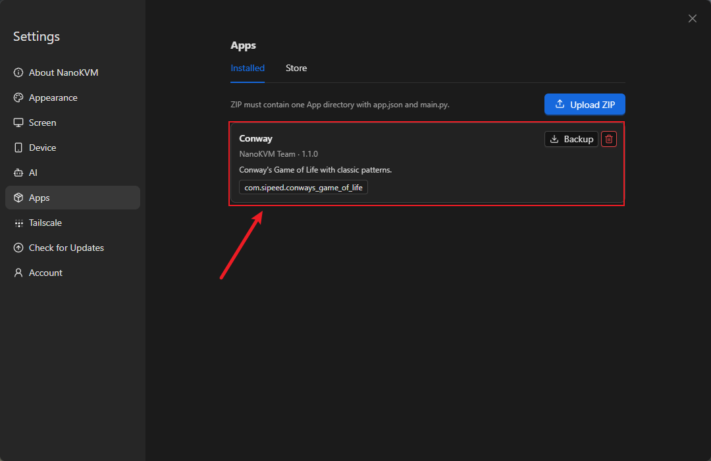

# Custom Apps

## Introduction

A custom App is a full-screen Python application that runs on the NanoKVM Go touchscreen. It uses the `appbase` SDK provided by the device to draw on the RGB565 framebuffer and receive touch events. You can use custom Apps to turn the NanoKVM Go display into a status panel, timer, market dashboard, or another interactive tool.

NanoKVM Go provides a complete workflow for managing and running Apps:

```text
App Server or local ZIP -> install and manage in the web interface -> launch from the device Apps page
```

Regular users can install and run existing Apps, while developers can write their own Python Apps, package them as ZIP files, and upload them to the device. This guide first explains how to install and use Apps, then uses a `Hello World` example to demonstrate development and deployment.

## Prerequisites

Before starting, make sure that:

- the NanoKVM Go system and application are updated to the latest versions;
- the NanoKVM Go web interface is accessible from the local network;
- the touchscreen works correctly and the main interface includes an `Apps` page;
- NanoKVM Go can access the relevant App repository when installing from an App Server;
- a text editor, basic Python environment, and ZIP utility are available on the development computer when creating a custom App.

> If the web settings do not include an `Apps` option, or the device does not have an `Apps` page, check for and install the latest NanoKVM Go system and application updates.

## Install and Use Apps

### Run a Built-in App

Open the `Apps` page on the device touchscreen and select a built-in App. These examples demonstrate full-screen rendering, animation, and touch interaction:

<video src="./../../../assets/NanoKVM/go/custom_app/apps-demo.mp4" aria-label="NanoKVM Go built-in App demonstration" style="width: 100%; max-width: 568px;" playsinline controls autoplay loop muted preload="metadata"></video>

| App directory | Display name | Main feature |
| --- | --- | --- |
| `conways-game-of-life` | Conway | Frame-limited animation |
| `crypto-candlestick` | Crypto | Market data and swipe navigation |
| `nyan-cat` | Nyan Cat | Animated pixel sprite |
| `pomodoro-timer` | Pomodoro | Buttons, taps, and a countdown timer |

Crypto uses a public market-data API and falls back to simulated data when the network is unavailable. It is intended only as an example of a network-enabled App.

### Install an App from the App Store

An App Server is a repository from which NanoKVM Go can browse and download Apps. The `Settings > Apps` page has two sections:

- `Installed`: manage installed Apps, including editing their configuration, downloading them, or removing them;
- `Store`: browse the official repository or a repository added by the user, and install Apps directly.

Whether you use the official repository or another App Server, first open the NanoKVM Go web interface and click the settings icon in the top toolbar.


#### Select an App Server

The official Sipeed repository, [NanoKVM-Go-Apps](https://github.com/sipeed/NanoKVM-Go-Apps), is preconfigured on the device. No additional App Server configuration is required when using this repository.

To use another App repository, open `Settings > Apps`, select `Store`, and click `Servers`.



Click `Add server`, enter the server name and URL, and save the configuration. You can then switch to that repository in the App Store.



> Only add repositories that you trust. App installation scripts run with root privileges. If the page indicates that an App includes installation scripts, inspect its source code, configuration, and actual behavior before installing it.

#### Install an App

After selecting an App Server, install an App as follows:

1. On the settings page, open `Apps > Store`.



2. Select the App Server and the App to install, then click `Install`.



3. If the App requires environment variables, complete the form and confirm the installation.

4. Wait for the `Installation log` window to report that installation has finished, then close the window.



The log shows repository access, validation, extraction, installation scripts, and the final result. If installation fails, copy the log or capture the error at the end before closing the window.

5. Return to the `Setting` page on the device touchscreen and tap the Apps icon.


6. Select the newly installed App to launch it.


<a id="upload-zip-install-app"></a>

### Install an App from a ZIP File

You can upload a ZIP file to install an App obtained elsewhere or one that you developed yourself. The ZIP archive must contain exactly one top-level App directory:

```text
example-app.zip
└── example-app/
    ├── app.json
    ├── main.py
    └── assets/       # Optional resources
```

To install the ZIP file:

1. Open the NanoKVM Go web interface and go to `Settings > Apps > Installed`;

2. click `Upload ZIP` and select the App ZIP file;



3. after the web interface validates the ZIP file and `app.json`, complete any requested App configuration;



4. click `Install` and wait for the `Installation log` window to report success;



5. open the `Apps` page on the device touchscreen and select the App.

<a id="exit-app"></a>

### Exit an App

While an App is running full screen, use the reserved left-edge gesture to return to the `Apps` page:

1. Touch and hold the left edge of the screen, then swipe right toward the center;
2. keep holding while the upper and lower progress bars on the left edge move together and fill the edge;
3. release your finger after the progress bars are full to exit the App.


To cancel, move your finger back to the left before releasing it. Release your finger after the two progress bars separate again, and the App will continue running:


### Manage Installed Apps

On `Settings > Apps > Installed`, you can edit an App's environment variables, download its ZIP file, or remove it. After installing, deleting, or renaming an App, or modifying its `app.json`, the device list normally refreshes within about 10 seconds. You do not need to restart `kvmcomm`.



## Develop a Custom App

### Get the SDK and Examples

Public resources are available in [NanoKVM-Go-Apps](https://github.com/sipeed/NanoKVM-Go-Apps). The repository uses two independent branches:

- [`main`](https://github.com/sipeed/NanoKVM-Go-Apps/tree/main): the App Store catalog, App source code, and `_utils`;
- [`base`](https://github.com/sipeed/NanoKVM-Go-Apps/tree/base): the shared `appbase.py`, `appbase.pyi`, English and Chinese development guides, and `_utils`.

Use `base` for the SDK and API documentation when developing an App. Use `main` to browse, install, or learn from existing Apps. Both branches include `_utils`, so general tools such as the screen-recording script can be obtained from either branch.

<details>
<summary>Record the NanoKVM Go device display</summary>

The `_utils/record-nanokvm-fb0.sh` script in the public repository reads the device's `fb0` and encodes it as a video on the local computer. It is useful for App demonstrations and reproducing issues.

The script reads the framebuffer from the NanoKVM Go through `ssh`; it does not use `scp`. The local computer needs Bash, `ssh`, and `ffmpeg`. Before using the script, also make sure that the computer can sign in to the device without a password:

```sh
ssh root@<DEVICE_IP> 'echo ok'
```

If the local computer does not have an SSH key yet, create one in a **local terminal**:

```sh
ssh-keygen -t ed25519
```

Then copy the public key to the NanoKVM Go and verify the login again:

```sh
ssh-copy-id root@<DEVICE_IP>
ssh root@<DEVICE_IP> 'echo ok'
```

When the last command prints `ok` without asking for a password, passwordless SSH is ready.

1. Clone the repository and enter the `_utils` directory in a **local terminal**:

   ```sh
   git clone https://github.com/sipeed/NanoKVM-Go-Apps.git
   cd NanoKVM-Go-Apps/_utils
   ```

2. Confirm that the required commands are available on the local computer:

   ```sh
   command -v ssh
   command -v ffmpeg
   ```

   If either command does not print a path, install the corresponding tool before continuing.
3. Set the actual NanoKVM Go address through `NANOKVM_HOST`, then run the script:

   ```sh
   chmod +x record-nanokvm-fb0.sh
   NANOKVM_HOST=root@<DEVICE_IP> ./record-nanokvm-fb0.sh xxx.mp4
   ```

   Operate the App on the device touchscreen while recording. Press `Ctrl-C` in the local terminal when finished. The script stops capturing, saves the video, and prints its location.

   `NANOKVM_HOST` applies only to this command, so you do not need to modify the script. On Windows 10/11, run the Bash script through Git Bash or WSL and install both `ssh` and `ffmpeg` in the same environment.

</details>

### Create Your First Hello World App

#### App Directory Structure

Each App uses a separate directory. Use lowercase English letters and hyphens for the directory name, for example, `hello-world`:

```text
hello-world/
├── app.json
├── main.py
├── assets/          # Optional resources, such as icon.png
├── pre-install.sh   # Optional; required only when app.json declares pre_script
└── post-install.sh  # Optional; required only when app.json declares post_script
```

The launcher scans direct child directories of `launcher.apps_dir`, which defaults to `/kvmcomm/apps`. A directory appears on the Apps page only when all of the following conditions are met:

1. its name does not start with `_`;
2. it contains a regular file named `main.py`;
3. it contains a valid `app.json`;
4. `app.json.app_id` is a valid reverse-domain package name and matches the directory name;
5. `app.json.name` is a non-empty string.

The Apps list refreshes automatically. After adding, deleting, or renaming an App, or modifying its `app.json`, wait about 10 seconds. You do not need to restart `kvmcomm`.

#### Write the Manifest and Entry Point

Add the minimal App manifest to `hello-world/app.json`:

```json
{
  "app_id": "com.example.hello_world",
  "name": "Hello World",
  "creator": "Your Name",
  "create_time": "2026-07-30",
  "version": "1.0.0",
  "desc": "A minimal NanoKVM App.",
  "category": "demo"
}
```

`app_id`, `name`, `creator`, `create_time`, and `version` are required. `desc`, `category`, and `icon` are optional. `app_id` must have at least three components. Its final component must equal the directory name with each `-` replaced by `_`; for example, `hello-world` maps to `com.example.hello_world`. This minimal example does not configure an icon. When adding one later, set `icon` to a resource path relative to the App directory.

If the App needs environment variables, define them in the `app.json.env` object. The web interface automatically creates a configuration form, and the App reads the values through `ctx.env`. Do not create a separate `.env` file.

If an App needs to install dependencies or generate configuration during its first installation, declare optional lifecycle scripts in the same `app.json`. The following continues with `hello-world` and shows a complete manifest that includes environment variables and lifecycle scripts:

```json
{
  "app_id": "com.example.hello_world",
  "name": "Hello World",
  "creator": "Your Name",
  "create_time": "2026-07-30",
  "version": "1.0.0",
  "desc": "A configurable NanoKVM App.",
  "category": "demo",
  "env": {
    "GREETING": {
      "label": "Greeting",
      "default": "Hello",
      "required": true,
      "secret": false,
      "description": "Text displayed on the screen"
    }
  },
  "pre_script": "pre-install.sh",
  "post_script": "post-install.sh"
}
```

> Note: `env`, `pre_script`, and `post_script` are not separate JSON files, and they must not be written after the outer `app.json` braces. Put them in the same `{ ... }` object as `app_id`, `name`, and the other manifest fields, separated by commas. If your App does not need these features, do not add these fields to the manifest.

When the manifest declares `pre_script` or `post_script`, the corresponding script must exist in the App directory and must be included in the ZIP archive; otherwise, installation fails. Remove a script field from the manifest if the App does not need that lifecycle script.

- `pre_script` runs before deployment. If it fails, the App is not installed;
- `post_script` runs after the App files are deployed. If it fails, the installation is rolled back;
- each path must be a safe relative path inside the App directory, which is also the script's working directory;
- scripts can read the configuration from `app.json.env`, as well as `NANOKVM_APP_DIR`, `NANOKVM_APP_ID`, and `NANOKVM_APP_PHASE`;
- scripts run through `/bin/bash` with root privileges, so only install Apps from trusted sources.

Put one-time work such as dependency installation and directory initialization in lifecycle scripts. Do not require regular users to sign in over SSH and manually run `apt install` or `pip install`. Scripts should be safe to run repeatedly and should use non-interactive options so that the installation page does not wait indefinitely for input.

Add the minimal program to `hello-world/main.py`:

```python
#!/usr/bin/env python3

from appbase import AppContext, WHITE, app


@app()
def main(ctx: AppContext) -> None:
    greeting = ctx.env.get("GREETING", "Hello")

    def tick(dt: float) -> None:
        ctx.fb.clear(0)
        ctx.fb.text_center(
            ctx.width // 2,
            ctx.height // 2,
            greeting,
            WHITE,
            2,
        )

    ctx.run(tick, fps=10)


if __name__ == "__main__":
    main()
```

`@app()` reads `app.json` from the same directory, opens the framebuffer and touch device, creates the `AppContext`, and cleans up resources when the App exits. Keep the `if __name__ == "__main__"` guard so that importing the module from another tool does not open hardware devices unexpectedly.

#### Package, Upload, and Launch

Get an example from [NanoKVM-Go-Apps](https://github.com/sipeed/NanoKVM-Go-Apps), or create the `hello-world` directory locally. The web uploader requires the ZIP file to contain exactly one top-level App directory:

```text
hello-world.zip
└── hello-world/
    ├── app.json
    ├── main.py
    ├── assets/          # Optional
    ├── pre-install.sh   # Required only when declared in app.json
    └── post-install.sh  # Required only when declared in app.json
```

Create the archive in a **local terminal**:

```bash
zip -r hello-world.zip hello-world
```

Install `hello-world.zip` by following [Install an App from a ZIP File](#upload-zip-install-app). During installation:

- if `app.json.env` is defined, the web interface displays an environment-variable form before installation;
- the `Installation log` displays upload, validation, extraction, and lifecycle-script output in real time. Keep it open until installation succeeds;
- if installation fails, save the complete log and use the final error messages to correct the App or its configuration;
- after installation succeeds, open the `Apps` page on the device touchscreen and select `Hello World`.

The installation log records only the current operation. When troubleshooting, copy or capture at least the final lines before closing it.

<details>
<summary>Advanced: Deploy from the command line with SSH/SCP</summary>

For debugging or automation, copy the directory directly over SSH/SCP from a local terminal. The destination is still `launcher.apps_dir`, which defaults to `/kvmcomm/apps`:

```bash
scp -r hello-world root@<DEVICE_IP>:/kvmcomm/apps/
ssh root@<DEVICE_IP> 'python3 -m py_compile /kvmcomm/apps/hello-world/main.py'
```

After copying the directory, wait for the Apps list to refresh. Do not overwrite the shared `appbase.py` or `appbase.pyi` already on the device unless you have confirmed that the SDK and App versions match.

</details>

## Common APIs

### AppContext, Lifecycle, and Main Loop

In the previous Hello World example, `main()` receives an argument named `ctx`:

```python
@app()
def main(ctx: AppContext) -> None:
    ...
```

`ctx` is the conventional abbreviation for “context,” and its type is `AppContext`. Here, a context is the collection of resources an App needs while it is running, including the framebuffer drawing object, touch input, display dimensions, and environment variables configured in the web interface.

Developers do not create `ctx` manually, and it is not a global variable. The `@app()` decorator wraps the original `main(ctx)` function in an entry point that takes no arguments. The complete loading and execution sequence is:

```text
Load main.py and define main(ctx)
  -> @app() reads and validates app.json and its environment configuration,
     then creates an entry point that takes no arguments
  -> the guard at the end of the file calls the decorated main()
  -> open the framebuffer and touch device
  -> create an AppContext object
  -> pass that object to the original main(ctx) as ctx
  -> close the touch device and framebuffer after the App exits
```

The argument does not have to be named `ctx`; `context` would work as well. This guide and the official examples consistently use the conventional shorter name.

Common `AppContext` members include:

| API | Purpose |
| --- | --- |
| `ctx.width`, `ctx.height` | Full logical framebuffer dimensions after rotation |
| `ctx.fb` | Drawing object |
| `ctx.touch` | Low-level touch reader, normally accessed through the helper methods below |
| `ctx.env` | Read-only environment mapping built from the `env` field in `app.json` and the Launcher configuration |
| `ctx.poll()` | Return a list of pending `(kind, x, y)` touch events |
| `ctx.taps()` | Return tap coordinates only and ignore swipe events |
| `ctx.button(rect, label, bg, fg, scale)` | Draw a button and return the same `Rect` for touch hit-testing |
| `ctx.flush()` | Submit the back buffer to the display |
| `ctx.run(tick, fps, on_tap, on_swipe)` | Limit frame rate, dispatch touch input, and refresh automatically |

Most Apps can use `ctx.run()` directly as their main loop. On every frame, it performs these steps:

1. Read touch events and dispatch taps and swipes to `on_tap` and `on_swipe`;
2. Call `tick(dt)` once to update state and draw the current frame;
3. Call `ctx.flush()` automatically to present the back buffer on the display;
4. Wait for the next frame according to `fps`, preventing the loop from consuming an entire CPU core.

The `dt` argument passed to `tick(dt)` is the number of seconds elapsed since the previous frame, which is useful for animations and timers. Returning `False` from `tick()` ends the main loop. `main(ctx)` then returns, and `@app()` cleans up the hardware resources.

Therefore, when using `ctx.run()`, do not call `flush()` again inside `tick()`, and do not independently open or close the same framebuffer or touch device. An App that does not need continuous updates can instead organize its own flow with `ctx.poll()` and `ctx.flush()`.

### Drawing, Colors, and Buttons

`ctx.fb` provides `clear()`, `put_pixel()`, `fill_rect()`, `draw_line()`, `draw_text()`, `text_center()`, `draw_sprite()`, and `flush()`. Create colors with `rgb565(r, g, b)` or use the SDK constants:

```text
BLACK WHITE RED GREEN BLUE YELLOW GRAY DKGRAY
ORANGE CYAN MAGENTA NAVY
```

Use the same `Rect` to draw a button and test whether it was tapped:

```python
from appbase import AppContext, GREEN, RED, Rect, app


@app()
def main(ctx: AppContext) -> None:
    state = {"count": 0}
    add_button = Rect(70, 80, 100, 48)

    def on_tap(x: int, y: int) -> None:
        if add_button.contains(x, y):
            state["count"] += 1

    def tick(dt: float) -> None:
        ctx.fb.clear(0)
        ctx.button(add_button, "ADD", GREEN)
        ctx.fb.text_center(ctx.width // 2, 145, str(state["count"]), RED, 2)

    ctx.run(tick, fps=20, on_tap=on_tap)


if __name__ == "__main__":
    main()
```

### Resources and Relative Paths

The launcher changes the current working directory to the App directory, so relative paths such as `assets/icon.png` work directly. To support importing or testing from another directory, calculate paths from `__file__`:

```python
from pathlib import Path

APP_DIR = Path(__file__).resolve().parent
icon_path = APP_DIR / "assets" / "icon.png"
```

## Development Notes

### Display Dimensions and Hidden Area

The physical framebuffer is `284×240`, and its leftmost 14 columns are not visible. The host normally launches Apps with `rotate=90`, producing a `240×284` logical canvas whose bottom 14 rows are hidden. When the display is inverted, the host uses `rotate=270`, moving the hidden area to the top.

| `rotate` | Logical dimensions | Hidden area | Visible logical area |
| ---: | --- | --- | --- |
| `0` | `284×240` | Left 14 columns | `x=14..283, y=0..239` |
| `90` | `240×284` | Bottom 14 rows | `x=0..239, y=0..269` |
| `180` | `284×240` | Right 14 columns | `x=0..269, y=0..239` |
| `270` | `240×284` | Top 14 rows | `x=0..239, y=14..283` |

Always base the layout on `ctx.width`, `ctx.height`, and `ctx.fb.rotate`; do not hard-code a fixed canvas. Use the table above when calculating the visible area.

### Touch Interaction

`ctx.poll()` returns `tap`, `up`, `down`, `left`, and `right` events. Their coordinates are already transformed into the rotated logical coordinate system.

The host reserves the [left-edge exit gesture](#exit-app). Avoid placing controls that require horizontal swipes on the left edge, because they could be triggered while a user exits the App. The host refuses to launch an App if the touch device is unavailable.

### Runtime and Security

The runtime requires an available `/dev/fb0`, the `/dev/input/event0` touch device, Python 3, and the launcher enabled in the device configuration. Configure non-default device paths with environment variables:

| Variable | Default | Purpose |
| --- | --- | --- |
| `APPBASE_FB_DEVICE` | `/dev/fb0` | Framebuffer device |
| `APPBASE_FB_ROTATE` | `0` | Rotation angle; the host normally sets `90` or `270` |
| `APPBASE_TOUCH_DEVICE` | `/dev/input/event0` | Touch input device |

Apps may run with elevated privileges and can access device configuration, credentials, and the network. Deploy only trusted code, do not store secrets in source files, and do not install dependencies from unknown sources. The `appbase.py` and `appbase.pyi` versions on the device must match.

### Simulator and AI-assisted Development

The x86 SDL simulator only reads directories and displays the Apps list. It does not execute Python, map the framebuffer, read touch input, or simulate the exit gesture. Test the display, colors, orientation, and frame rate on a physical NanoKVM Go.

Before asking an AI assistant to write an App, provide it with the device README, existing App source code, and your requirements:

<details>
<summary>Advanced: Read the runtime guide from the device</summary>

```bash
ssh root@<DEVICE_IP> 'cat /kvmcomm/apps/README.md'
```

</details>

Explicitly require the directory-based architecture: generate both `app.json` and `main.py`, do not place a standalone Python file loosely in the Apps directory, and do not overwrite the shared SDK.

## Release Checklist

An App is ready to share after it passes the following checks:

- all required `app.json` fields are present, and directory names and resource paths are correct;
- `main.py` passes `py_compile`;
- the App appears on the Apps page and launches successfully;
- no content is placed in the 14-pixel hidden area;
- taps, swipes, and the left-edge exit gesture work correctly;
- the main interface and touch controls recover after the App exits;
- no secrets, real IP addresses, or private device data are embedded in code or resources.
