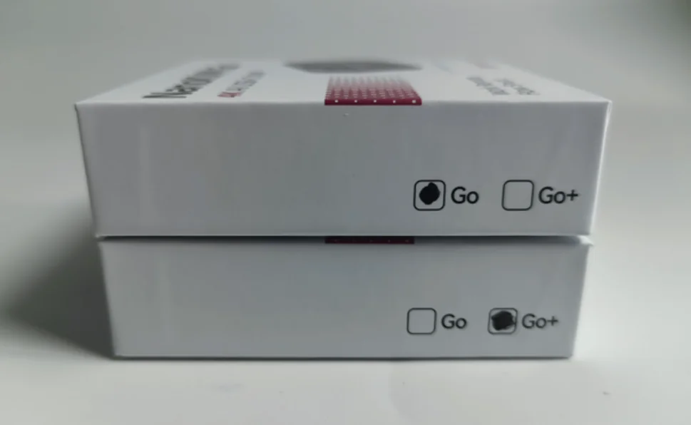
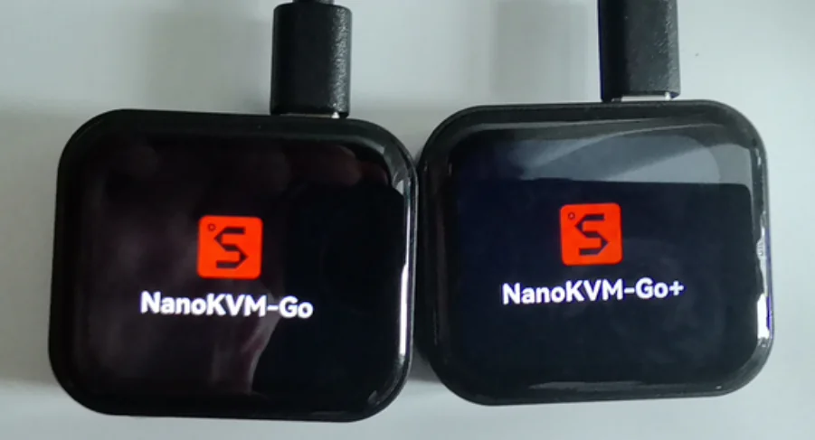
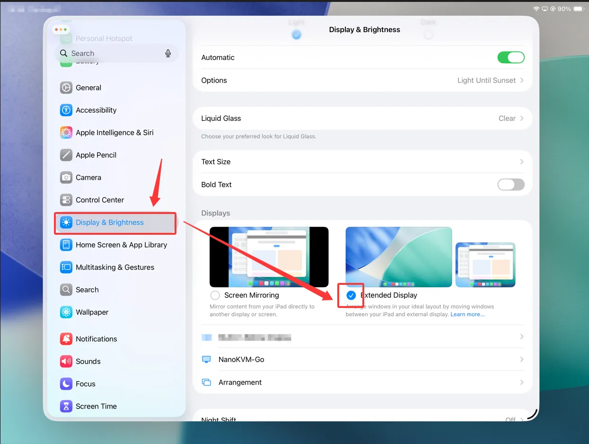
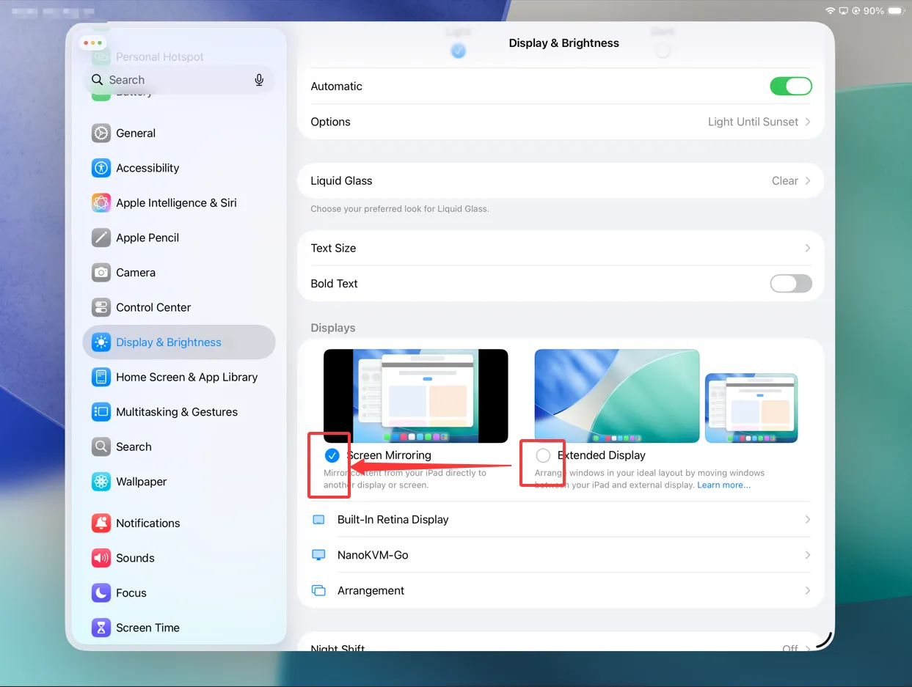
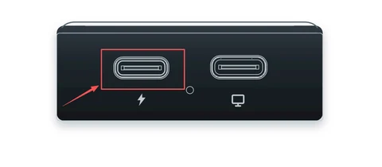

## How to Tell Go and Go+ Apart

The two models look the same from the outside, so use one of the methods below to identify which unit you have.

1. Check the side of the retail box. The model whose checkbox is marked is the one inside.



2. Power on the device and watch the boot screen. The startup logo reads either `NanoKVM-Go` or `NanoKVM-Go+`.



## Account & Password

### What are the default SSH username and password for NanoKVM Go?

The default SSH username for NanoKVM Go is `root`, and the default password is `sipeed`.

Before connecting, open the NanoKVM Go web console, go to `Settings` > `Device`, and enable the SSH service. Then run the following command on a computer on the same LAN as NanoKVM Go:

```bash
ssh root@<NanoKVM Go LAN IP>
```

> On the first connection, the terminal asks whether to trust the device fingerprint. After confirming that the IP address is correct, enter `yes`, then enter the password `sipeed`. The terminal does not display characters while you type the password; this is normal. For security, do not expose a device with SSH enabled directly to the public internet.

## Video Issues

### "No video signal" when connected to the host device

If NanoKVM Go shows "no video signal" after connecting to the host device, make sure the host's USB-C port **supports USB-C DisplayPort Alt mode (DP Alt Mode)**, and that the cable you are using is a **full-featured USB-C cable**.

The host's USB-C port must support DP Alt mode (i.e. it can output a DP signal over the USB-C port), and the cable must be a full-featured USB-C data cable, for NanoKVM Go to receive the video signal. If the port does not support video output, or you are using a charge-only cable, no picture will be displayed.

### The 3840 × 2160 @ 50 Hz EDID is currently in Beta {#edid-4k50-beta}

The `3840 × 2160 @ 50 Hz` EDID is currently an experimental feature. The mode is available for use, but some devices may have compatibility issues and the image may be unstable. If you encounter a problem, switch to the `3840 × 2160 @ 30 Hz` EDID or a lower-resolution EDID.

### After setting the EDID, the resolution shown on the NanoKVM Go screen does not match the one you set

If, after setting the EDID, the **resolution shown on the NanoKVM Go screen** does not match the EDID you set, it is usually because the host device selected a **scaled display mode** instead of the real output mode declared in the EDID.

The resolution shown in the operating system does **not always represent the real video output resolution**. Some options are just scaled display effects; even if they look like the target resolution, **the picture shown on the NanoKVM Go screen** is still the scaled effect.

Please follow these steps to set the **real output resolution**:

1. Make sure the target resolution and refresh rate combination **exists in the current EDID's declared list**. Even if the OS offers a particular resolution, if it is not a real output mode declared by that EDID, you may not get the result you want.
2. **Windows**: Use `Settings` → `System` → `Display` → `Advanced display settings` → select `NanoKVM-Go` → `Display adapter properties` → `List all modes`, and choose the **target resolution and refresh rate listed in the table**.
3. **macOS**: Open `System Settings` → `Displays`, turn on `Show all resolutions`. Prefer the option marked **"Low Resolution"** whose resolution and refresh rate combination exists in the EDID list, and make sure the refresh rate matches.

> For more details and a resolution reference table, please refer to [Resolution and EDID Settings](https://wiki.sipeed.com/hardware/en/kvm/NanoKVM_Go/resolution.html). After changing the EDID, the host may briefly black out, re-detect the display, or rearrange windows; this is normal.

### Mouse moves but clicking programs has no effect (multi-display scenario)

If the host device has **both a physical monitor and NanoKVM Go** connected, and when controlling the host from NanoKVM's web page the **mouse cursor moves but clicking a program or performing an action produces no visible response**, this is usually a **primary display** issue.

When a host has multiple displays, one of them is the **primary display**. If the primary display is the physical monitor and **NanoKVM Go is only an extended display**, then the windows, menus and program interfaces you click on actually appear on the **primary display (the physical monitor)**. NanoKVM Go only captures the extended display, so the changes from these actions are not visible in NanoKVM's web page — it looks like "clicking does nothing", even though the mouse cursor itself can move.

**Solution:**

1. In the host's display settings, set **NanoKVM Go as the primary display (Primary)**, or set the two displays to **mirror (Mirror)**.
2. After that, the picture produced by clicking programs etc. will appear on the display captured by NanoKVM.

> Windows: `Settings` → `System` → `Display` → select the display → check "Make this my main display".
> macOS: `System Settings` → `Displays` → set the primary display in the display arrangement, or use "Mirror Displays".

### iOS device shows no local video frames when playing streaming video in a video app

If an iPhone/iPad **does not show video on its own screen (no local video frames)** when playing streaming video through a video app (such as YouTube, Netflix, etc.), this is because after the iOS device connects to a screen mirroring device, these video apps will **output the video to the external device via AirPlay by default**.

In other words, the video picture is output via AirPlay to the NanoKVM Go (the screen mirroring device) side, and the iOS device no longer shows the local video frames for that video on its own screen. This is a **default iOS system behavior** and cannot be turned off or disabled in the system.

### iPad Pro shows only the extended desktop after connecting

Some iPad Pro models support **Extended Display**, including the 12.9-inch iPad Pro (5th generation and later) and the 11-inch iPad Pro (3rd generation and later). When NanoKVM Go is connected, iPadOS may select Extended Display by default. In this mode, NanoKVM Go captures the extended desktop rather than the iPad's main screen, so the web interface may show only the desktop background instead of the apps open on the iPad.


To display the iPad's main screen in the NanoKVM Go web interface:

On the iPad, open `Settings` > `Display & Brightness`.



Under `Display & Brightness`, select `Screen Mirroring` instead of `Extended Display`.



After switching modes, the NanoKVM Go web interface will show the iPad's main screen content.


## Keyboard & Input Issues

### The host is a phone and the password keyboard does not appear after the screen is locked

If the host device is a phone (Apple or Android), when the phone screen is locked, the NanoKVM Go web page may be **unable to show the password input keyboard**. In this case you do not need to bring up the keyboard on the phone; you can directly enter the password with the **keyboard on the control side (the NanoKVM web page)**.

If the phone requires a **swipe up** to reach the password entry screen after locking, you can first **press the spacebar** on the control side (equivalent to a swipe-up action) to reach the password entry screen, then enter the password directly.

### When the host is an iPhone, the mouse stays in a pressed (dragging) state

If the host device is an iPhone, using the mouse to control it may result in the mouse staying in a **pressed state** (like continuous dragging). This is because touch gestures are not handled correctly after connecting to the iPhone.

Click the mouse style button in the floating toolbar of the web control page and select **`Repair iPhone drag`** to fix this. After each successful connection to an iPhone, you need to click this option, otherwise the mouse may stay pressed.


### Mouse pointer misaligned when mirroring iPhone/iPad in portrait or landscape

When an iPhone/iPad is mirrored in portrait or landscape, even after you adjust the screen orientation in the console, **the mouse pointer on the control side may still not align precisely with the picture**.

This is because precise cursor tracking on the iPhone/iPad requires **the device's gyroscope orientation to exactly match the current screen orientation**. During remote control, the system may not correctly detect the current gyroscope state, which causes the mouse pointer to deviate.

**Solution:**

Enable **Orientation Lock (portrait/rotation lock)** on the iPhone/iPad to ensure accurate cursor tracking.


### Mouse cursor is visible but unresponsive on iPad Pro after selecting Repair iPhone drag

After selecting Repair iPhone drag on an iPad Pro, the mouse cursor may be visible but unresponsive. This occurs when AssistiveTouch is not enabled on the connected iOS device. To enable it, follow the steps in [Notes for Phone Connections](./quick_start.html#Notes-for-Phone-Connections).

## Audio Issues

### Cannot adjust the volume after connecting iOS

Due to iOS system limitations, once an iPhone/iPad is connected to a screen mirroring device that the system recognizes as an **audio output** (such as NanoKVM Go), **the system's native volume control will become unavailable**.

This is a normal behavior restriction of iOS for external audio output devices, not a NanoKVM Go fault. If you need to control the volume, adjust it on the host device (iPhone/iPad) or within the app playing the content, or use an external audio device to adjust the volume.

## Boot Issues

### NanoKVM Go keeps rebooting after power-on

If NanoKVM Go keeps restarting after power-on (the screen repeatedly turns on and off, or the device never reaches the home screen), the cause is usually an insufficient or unstable power supply.

The following power setups commonly trigger this issue:

1. Powering from a computer's USB port: a USB-A port or a plain USB-C data port typically guarantees only 5 V / 0.5 A, which is not enough to meet the power requirement.
2. Using an underpowered charger: an older 5 V / 1 A charger, for example, runs at or beyond its limit under load.
3. Powering through a dock, USB hub or multi-port charger: the current has to be shared with other devices, so the voltage becomes unstable under load.
4. Using a poor-quality, overly long or repeatedly adapted cable: the higher resistance means the voltage reaching the device is already too low.

**Solution:** Power NanoKVM Go separately with a USB-PD charger and cable.

### NanoKVM Go reboots after unplugging the PD power from the auxiliary USB-C port while both USB-C ports are connected

If both the data USB-C port and the **Auxiliary USB-C port (lightning icon, Power Port)** are connected, and you unplug the USB-PD power supply from the auxiliary USB-C port while NanoKVM Go is running, NanoKVM Go will **reboot** once. **This is normal behavior**, not a device fault.



**Cause:** Once a PD power supply is connected to the auxiliary USB-C port, NanoKVM Go draws power from that port first. When the PD power supply is unplugged, the device has to switch its power source back to the target device's USB-C port. This switch causes a brief power interruption, so the device restarts.

**Notes:**

- The reboot usually happens only once; afterwards the device continues to be powered by the target device's USB-C port, and no further action is needed.
- If the device does not just restart once but **keeps rebooting**, the target device's USB-C port cannot supply enough power. See "NanoKVM Go keeps rebooting after power-on" above.

## Feedback

+ If the above methods do not solve the problem, please tell us your purchased model and the issue you encountered on the forum, GitHub or the QQ group, and we will answer patiently.

+ [Github issues](https://github.com/sipeed/NanoKVM-Go/issues)
+ [MaixHub forum](https://maixhub.com/discussion/nanokvm)
+ QQ group: 703230713
