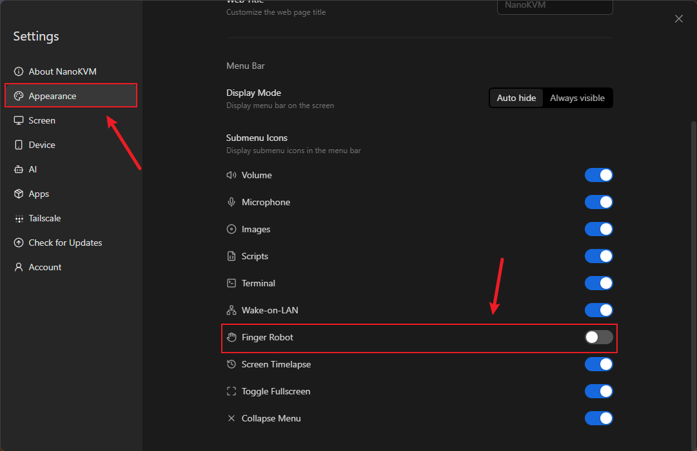
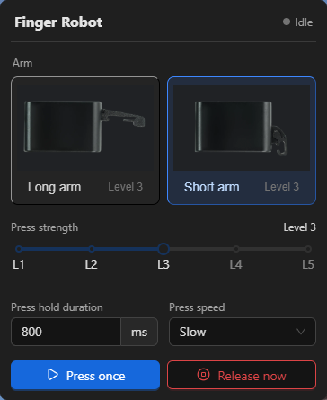

## Introduction

The Finger Robot is a physical-button control accessory for NanoKVM Go. Attach it next to the physical power button of the target device, and NanoKVM Go can drive its arm to press the button. This lets you remotely power the target device on or off, or trigger another action assigned to its power button.

It is useful when the target device is powered off, the operating system is unresponsive, or software-based power control is unavailable.

> Holding a computer power button for an extended period usually forces the computer to power off and may cause unsaved data to be lost. Before operating the Finger Robot, check the press hold duration and the power-button behavior configured on the target device.

## Preparation

Prepare the following items before installation:

+ NanoKVM Go;
+ The Finger Robot and the required arm;
+ A full-featured USB Type-C cable;
+ A computer, tablet, or phone that can open the NanoKVM Go web control page.

Make sure NanoKVM Go is powered on and its web control page is accessible.

<!-- ## Port Overview

The Finger Robot provides two ports:

+ `PWR`: Connects to the power cable and supplies power to the Finger Robot;
+ `PWM`: Connects to NanoKVM Go and receives arm-control signals.
-->

<!-- TODO(image): Add a close-up of the Finger Robot PWR and PWM ports and their labels. Suggested path: ../../../assets/NanoKVM/go/finger_robot/nanokvm-go-finger-robot-ports.webp. Insert the image here. -->

## Connect the Devices

Connect the devices as shown below.


<!-- Use the following connection order:

```text
Power cable → Finger Robot PWR port
NanoKVM Go → Finger Robot PWM port
```

To connect the devices:

1. Connect the power cable to the `PWR` port on the Finger Robot.
2. Connect the `PWM` port on the Finger Robot to NanoKVM Go.
3. Make sure both connections are secure, and then power on the devices.

Follow the port labels when connecting the cables. Do not swap the `PWR` and `PWM` connections.
-->

<!-- TODO(image): Add a complete wiring diagram showing the power cable, Finger Robot, and NanoKVM Go. Label PWR, PWM, and the NanoKVM Go connection point. Suggested path: ../../../assets/NanoKVM/go/finger_robot/nanokvm-go-finger-robot-wiring.webp. Insert the image here. -->

## Install the Finger Robot

1. Choose the long arm or short arm based on the distance to the power button and the available installation space.
2. Place the Finger Robot next to the target device's power button. Align the arm with the center of the button when pressed.
3. Make sure the released arm does not remain in contact with or hold down the power button.
4. Clean and dry the mounting surface, and then attach the Finger Robot securely.
5. After mounting it, test with a low press strength first and increase the level only when necessary.

<!-- TODO(image): Add an installation example showing the Finger Robot attached next to a computer power button. Mark the alignment between the arm and button. Suggested path: ../../../assets/NanoKVM/go/finger_robot/nanokvm-go-finger-robot-installation.webp. Insert the image here. -->

## Enable the Feature

1. Log in to the NanoKVM Go web control page in a browser.
2. Click the Settings icon on the floating toolbar.


3. Open `Settings → Appearance`.



4. Turn on the `Finger Robot` switch.

<!-- TODO(image): Add an English screenshot of the Settings → Appearance → Finger Robot switch. Suggested path: ../../../assets/NanoKVM/go/finger_robot/nanokvm-go-finger-robot-switch-en.webp. Insert the image here. -->

After the switch is enabled, a Finger Robot icon appears on the floating toolbar. Click the icon to open the Finger Robot configuration panel.


<!-- TODO(image): Add an English screenshot of the Finger Robot icon on the floating toolbar and mark the entry. Suggested path: ../../../assets/NanoKVM/go/finger_robot/nanokvm-go-finger-robot-toolbar-en.webp. Insert the image here. -->

## Configuration and Operation

The Finger Robot configuration options are shown below.



<!-- TODO(image): Add an English screenshot of the Finger Robot configuration panel. Suggested path: ../../../assets/NanoKVM/go/finger_robot/nanokvm-go-finger-robot-panel-en.webp. Insert the image here. -->

### Connection Status

The top of the panel shows the Finger Robot connection status. If the page reports that the Finger Robot is not connected, check whether the cables are connected correctly.

Test the press operation only after the connection succeeds. The operation buttons at the bottom of the panel are unavailable while the Finger Robot is disconnected.

### Select the Arm

Select `Long Arm` or `Short Arm` to match the arm that is physically installed. This setting affects the Finger Robot's movement range and must match the actual arm.

After changing the arm type, check its alignment with the power button again and begin testing with a low press strength.

### Adjusting the Press Stroke

The Press Stroke offers 1 to 5 levels. The higher the level, the greater the press stroke of the swing arm.

For the first test, it is recommended to start from level 1. If the swing arm does not fully press the power button, increase the level by one step and retest. Do not directly use a high level to avoid unnecessary stress on the swing arm, the button, or the adhesive points.

### Set the Press Hold Duration

`Press Hold Duration` controls how long the arm remains pressed during each operation. The value is measured in milliseconds (ms).

+ A short press can power on the target device or trigger the shutdown, sleep, or other action assigned to its power button by the operating system;
+ A longer press may force the target device to power off.

The exact behavior depends on the target device hardware and operating-system settings. Begin with a short duration and adjust it only when necessary.

### Set the Press Speed

`Press Speed` controls how quickly the arm presses and releases. After first installation or position adjustment, use a slower speed so that you can check whether the arm reaches the power button correctly.

### Perform a Press

+ Click `Press Once` to perform one press-and-release cycle using the selected arm type, press strength, hold duration, and speed;
+ Click `Release Now` to end the current hold and release the arm. Use this button if the configured hold duration is unsuitable or you need to stop a press early.

<!-- TODO(image): Add an English screenshot or animation showing a successful connection and one completed press. Suggested path: ../../../assets/NanoKVM/go/finger_robot/nanokvm-go-finger-robot-press-demo-en.webp (or GIF). Insert the image here. -->

## First Test

After installation, test the Finger Robot in the following order:

1. Make sure the top of the panel shows that the Finger Robot is connected.
2. Select the arm type that matches the installed arm.
3. Set the press strength to level 1 and select a slow press speed.
4. Set a short press hold duration.
5. Click `Press Once` and check whether the arm is aligned with and fully presses the power button.
6. If the power button is not triggered, check the mounting position first and then increase the press strength one level at a time.
7. After both pressing and releasing work correctly, adjust the hold duration and speed for the target device as needed.

Observe the Finger Robot next to the device during initial testing. Use it unattended only after confirming that the configuration works correctly.

## Troubleshooting

### The Arm Moves but Does Not Trigger the Power Button

+ Make sure the selected long or short arm matches the installed arm;
+ Check that the arm is aligned with the center of the power button;
+ Make sure the Finger Robot is attached securely;
+ Increase the press strength one level at a time, and test after each adjustment.

### The Arm Does Not Release Promptly

Click `Release Now` first. Then reduce the press strength or press hold duration and check the installation position again. Continue using the Finger Robot only after confirming that the arm releases correctly.
