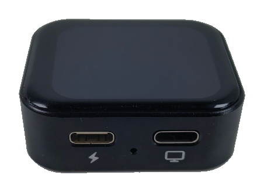

## Introduction

NanoKVM Go is a portable IP-KVM tool in the NanoKVM series, designed for mobile maintenance, temporary access, and remote operation scenarios. It connects to the controlled device through USB-C and lets you view the screen, control keyboard and mouse input, and perform remote access from a browser.

Unlike traditional remote desktop software, NanoKVM Go does not require remote software to be installed on the target host in advance. Even when the operating system cannot boot, it can still be used for BIOS/UEFI settings, system installation, boot option adjustment, and troubleshooting.

## Video Demo

  <iframe src="https://player.bilibili.com/player.html?isOutside=true&bvid=BV1iyTq6pEsD&p=1"
          scrolling="no"
          border="0"
          frameborder="no"
          framespacing="0"
          allowfullscreen="true"
          style="width: 100%; max-width: 640px; aspect-ratio: 16 / 9;">
  </iframe>

## Use Cases

+ Server management: remotely view the target host screen and control keyboard and mouse input;
+ Remote installation: enter BIOS/UEFI, adjust boot options, and install systems with mounted images;
+ Troubleshooting: continue hardware-level maintenance when remote desktop, SSH, or system services are unavailable;
+ Temporary access: the compact body is suitable for field debugging, travel, and switching between multiple devices;
+ Remote access: can be used with Tailscale without a public IP address or router port forwarding.

## Specifications

NanoKVM Go provides two Type-C ports and one reset hole on the side. The port with the lightning icon is the power port, the port with the screen icon is the data port, and the small hole between them is the Reset button.

| Item | NanoKVM Go |
| --- | --- |
| Product Name | NanoKVM Go |
| Positioning | Portable IP-KVM |
| Access Method | Browser access |
| Data Input Port | USB-C x 1 |
| Data Input Protocol | DP Alt Mode |
| Power Input Port | USB-C x 1 |
| Power Input Protocol | USB-PD |
| Supported Power Profiles | 5V⎓3A, 9V⎓3A, 15V⎓3A(Max) |
| Video Specifications | 3840 x 2160 @ 30Hz; 3440 x 1440 @ 60Hz; 2560 x 1440 @ 60Hz; 1920 x 1080 @ 60Hz |
| Typical Features | Remote video viewing, keyboard and mouse control, network-based management |
| Remote Access | Supports remote access through Tailscale and similar tools |
| Operating Temperature | 0°C ~ 40°C |
| Operating Humidity | ≤85%RH, non-condensing |

> The data port of NanoKVM Go requires the controlled device's Type-C port to support DP Alt Mode video output. Type-C ports that only support charging or regular data transfer may not work with the remote display feature.

## NanoKVM Go Software and Hardware Resources

To be added.

## Purchase

To be added.

## Feedback

If you encounter any issues or have suggestions during use, please provide feedback through the following channels:

+ [Github issues](https://github.com/sipeed/NanoKVM/issues)
+ [NanoKVM GitHub repository](https://github.com/sipeed/NanoKVM)
+ [MaixHub forum](https://maixhub.com/discussion/nanokvm)
+ QQ group: 703230713
