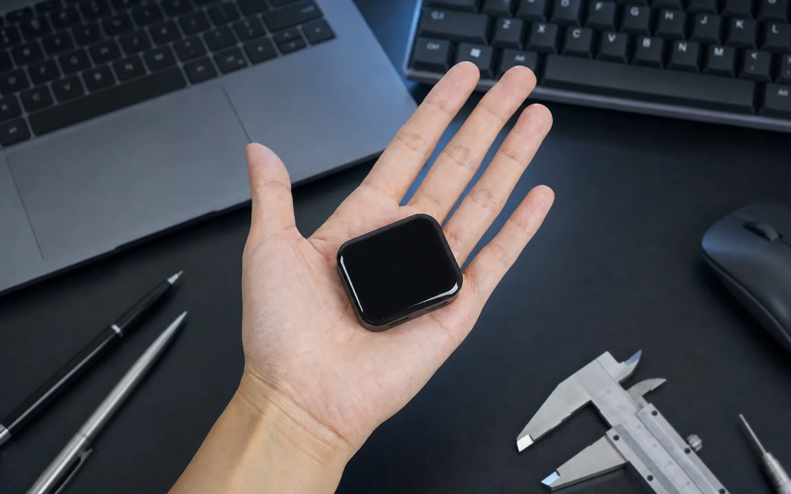
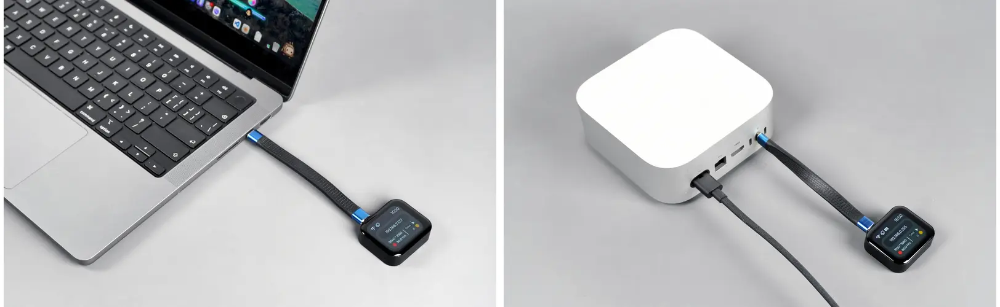
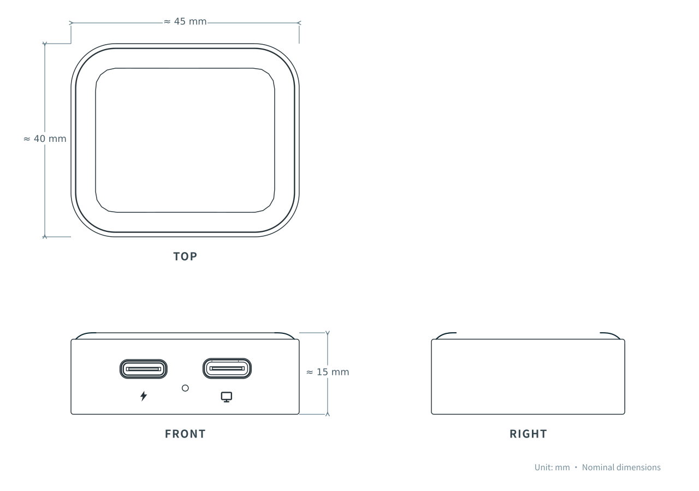

## Introduction

The NanoKVM Go series is a palm-sized USB-C KVM optimized for phones, tablets, and portable computers. After the initial network setup, connect it to a device that can output video over USB-C, then view its screen and click, swipe, and type from a browser on another phone or computer. It is particularly useful for helping family members with mobile-device settings from afar, as well as for carrying between devices that need occasional maintenance.

Unlike remote desktop software, NanoKVM Go captures the display and emulates keyboard, mouse, and storage devices at the hardware level. The target does not need a dedicated driver or remote-access client. NanoKVM Go remains available when the operating system is frozen, offline, or not yet running, so you can enter UEFI/BIOS, install an OS, or troubleshoot boot problems.

## Product Video

<iframe src="https://www.youtube.com/embed/qkVUMs2S7ks" title="NanoKVM Go product introduction" scrolling="no" allowfullscreen style="width:100%; max-width:800px; aspect-ratio:16/9; height:auto; border:0; display:block; margin:0 auto;"></iframe>

## Use Cases

### Help Family Members with Phones and Tablets

You can leave a preconfigured NanoKVM Go at home with its WiFi and remote-access settings ready. When a family member needs help, they connect it to their phone or tablet with a full-featured USB-C cable. You can then view and operate the device directly from a browser on your own phone or computer instead of describing every button over a call.

The auxiliary USB-C port supports USB-PD passthrough, keeping the target charged during a longer session. The target does not need a remote-control app, but its USB-C port must support video output. An iPhone also requires AssistiveTouch; see [Notes for Phone Connections](./quick_start.html#Notes-for-Phone-Connections) for setup details.

### Carry One KVM Between Laptops and Mini PCs

At approximately 45 × 40 × 15 mm, NanoKVM Go fits in a small tool pouch and can move between MacBooks, Mac minis, Windows laptops, mini PCs, Steam Decks, and other portable systems. Its main USB-C connection carries video, audio, keyboard and mouse control, a virtual USB drive, and a virtual network interface over one full-featured cable, reducing the adapters and wiring associated with a traditional KVM.

NanoKVM Go streams video and control traffic over dual-band 2.4 GHz / 5 GHz WiFi 6. Away from the local network, built-in Tailscale support provides an encrypted path to the device without exposing the KVM management interface directly to the public Internet. See the [Tailscale guide](./network/tailscale.html) for setup details.

### Recover a Device When Its System Is Unavailable

NanoKVM Go does not depend on the target operating system or its network services. If remote desktop, SSH, or the OS itself stops working, you can still view the boot screen, enter UEFI/BIOS, change boot options, or mount an image to install and repair the system.

If the target is completely unresponsive, add the Finger Robot to press its physical power button remotely. See the [Finger Robot guide](./finger_robot.html) for wiring and operation.

<video src="./../../../assets/NanoKVM/go/introduction/nanokvm-go-finger-robot.mp4" aria-label="Press a device power button remotely with NanoKVM Go and the Finger Robot" style="width:100%; max-width:800px; display:block; margin:0 auto;" playsinline controls autoplay loop muted preload="metadata"></video>

### Connect Real Devices to AI Agents

On both Go and Go+, the user can enable an MCP server that exposes KVM capabilities to compatible AI tools. The tool can receive the target display through NanoKVM Go and send keyboard or mouse actions, effectively giving an AI agent eyes and hands on a real device. See the [MCP guide](./mcp.html) for configuration.

NanoKVM Go+ also provides Memory Fabric. It periodically extracts text and context from screens that have changed, producing operation records that AI tools can search and query. Memory Fabric is not continuous video recording. See the [Memory Fabric guide](./memory_weaving.html) for its behavior, model configuration, and privacy considerations.

> MCP and Memory Fabric must be enabled by the user. A target screen can contain account details, messages, or other sensitive information. Use these features only on trusted networks and with trusted AI tools, and keep the API Key private.

## Models and Specifications

The series includes two models: **NanoKVM Go** and **NanoKVM Go+**. Both provide the same core KVM, MCP, wireless, and expansion capabilities. Go+ adds an on-device AI processor, more memory and storage, and screen-memory features.

Choose NanoKVM Go if you need complete remote viewing and control. Choose Go+ if you also want to search text that previously appeared on screen or give an AI agent more continuous context about your work.

| Item | NanoKVM Go | NanoKVM Go+ |
| --- | --- | --- |
| Best suited for | Family remote assistance, mobile maintenance, remote OS installation, and MCP control | Family remote assistance, mobile maintenance, remote OS installation, and MCP control, plus screen memory, OCR-backed search, and work-session playback |
| Processor | Dual-core Cortex-A53 | Dual-core Cortex-A53 + 3.2 TOPS NPU |
| Memory | 256 MB LPDDR4x | 512 MB LPDDR4 |
| Storage | 16 GB | 64 GB |
| Display | 1.83-inch color touchscreen | 1.83-inch color touchscreen |
| Maximum video capture capability | 4K @ 50 Hz; 2K @ 90 Hz | 4K @ 50 Hz; 2K @ 90 Hz |
| Current built-in EDID modes | 3840 × 2160 @ 50 Hz ([Beta](./faq.html#edid-4k50-beta)) 3840 × 2160 @ 30 Hz 3440 × 1440 @ 60 Hz 2560 × 1440 @ 60 Hz 1920 × 1080 @ 60 Hz | 3840 × 2160 @ 50 Hz ([Beta](./faq.html#edid-4k50-beta)) 3840 × 2160 @ 30 Hz 3440 × 1440 @ 60 Hz 2560 × 1440 @ 60 Hz 1920 × 1080 @ 60 Hz |
| Typical video latency | Approx. 60 ms @ 1080P60; 80 ms @ 2K60; 100 ms @ 4K30 | Approx. 60 ms @ 1080P60; 80 ms @ 2K60; 100 ms @ 4K30 |
| Audio | Two-way audio | Two-way audio |
| Wireless | WiFi 6, 2.4 GHz / 5 GHz, up to 286 Mbps | WiFi 6, 2.4 GHz / 5 GHz, up to 286 Mbps |
| Remote access | Browser; built-in Tailscale | Browser; built-in Tailscale |
| MCP server | Supported, enabled by the user | Supported, enabled by the user |
| Memory Fabric | — | Supported |
| Screen Timelapse | — | Supported |
| Virtual devices | Keyboard, mouse, USB drive, and virtual network interface | Keyboard, mouse, USB drive, and virtual network interface |
| OS images | ISO mounting and remote OS installation | ISO mounting and remote OS installation |
| Ports | 1 × USB-C data port (DP Alt Mode); 1 × USB-C power/charging port (USB-PD) | 1 × USB-C data port (DP Alt Mode); 1 × USB-C power/charging port (USB-PD) |
| Finger Robot | Supported through the expansion IO on the USB-C power port | Supported through the expansion IO on the USB-C power port |
| Dimensions | Approx. 45 × 40 × 15 mm | Approx. 45 × 40 × 15 mm |
| Typical power at 4K30 | Approx. 1.6 W | Approx. 2.0 W |
| Operating temperature | 0 °C to 40 °C | 0 °C to 40 °C |
| Operating humidity | ≤85% RH, non-condensing | ≤85% RH, non-condensing |

> `4K @ 50 Hz / 2K @ 90 Hz` describes the maximum video capture capability. The resolution and refresh rate available on the target also depend on the active EDID, operating system, and USB-C interface. The highest 4K mode in the current built-in EDID set is `3840 × 2160 @ 50 Hz`. See [Resolution and EDID Settings](./resolution.html) for the complete mode list and configuration steps.

## Compatible Devices

For a target device, Apple products must use a native USB-C video-output model listed below. For other devices, the specific USB-C port in use must support **DisplayPort Alt Mode**. Ports limited to charging or ordinary USB data cannot output video. The Apple model ranges below follow Apple's current documentation; check Apple's technical specifications again for future models.

| Device type | Compatible models and connection requirements |
| --- | --- |
| Phones | **iPhone**: all iPhone 15 models; iPhone 16 models except iPhone 16e; and iPhone 17 models except iPhone 17e. AssistiveTouch is required. Other iPhones cannot output video directly over USB-C. **Android**: the USB-C port in use must support DisplayPort Alt Mode, and some phones ask for external-display or USB-device permission on first connection. |
| Tablets | **iPad Pro**: 1st-generation 11-inch, 3rd-generation 12.9-inch, and later USB-C models; **iPad Air**: 4th generation and later; **iPad mini**: 6th generation and later; **iPad**: 10th generation and later. Earlier iPads with a Lightning connector cannot connect directly. Android and other tablets must use a USB-C port that supports DisplayPort Alt Mode. |
| Laptops | **MacBook**: 12-inch, 2015–2017; **MacBook Air**: 2018 and later; **MacBook Pro**: 2016 and later. Windows / Linux laptops must use a USB-C or Thunderbolt port that supports DisplayPort Alt Mode. |
| Desktop systems | **iMac / iMac Pro**: 2017 and later; **Mac mini**: 2018 and later; **Mac Studio**: 2022 and later; **Mac Pro**: 2019 and later. Connect to a Thunderbolt (USB-C) port that supports DisplayPort output; a port labeled only USB-C / USB 3 on some models may carry data only. Other mini PCs and computers must use a USB-C port that supports DisplayPort Alt Mode. |
| Handheld gaming PCs | Steam Deck and similar devices whose USB-C port supports DisplayPort Alt Mode; keyboard, mouse, and touch behavior can vary by operating system. |

Official Apple references: [USB-C display support on iPhone](https://support.apple.com/en-us/105099), [USB-C display support on iPad](https://support.apple.com/en-us/108894), [MacBook (2015)](https://support.apple.com/kb/SP712?locale=en_US), [MacBook Air (2018)](https://support.apple.com/kb/SP783?locale=en_US), [MacBook Pro (2016)](https://support.apple.com/kb/SP747?locale=en_US), [iMac (2017)](https://support.apple.com/kb/SP758?locale=en_US), [Mac mini (2018)](https://support.apple.com/kb/SP782?locale=en_US), [Mac Studio (2022)](https://support.apple.com/kb/SP865?locale=en_US), and [Mac Pro (2019)](https://support.apple.com/kb/SP797?locale=en_US).

The controlling device can be another phone, tablet, or computer. It only needs a modern browser and network access to NanoKVM Go. Use the included cable or another full-featured USB-C cable that supports video transmission.

## Physical Features and Dimensions

NanoKVM Go has a 1.83-inch touchscreen that shows network, resolution, and operating status and supports network setup and selected local controls.

Built-in magnets attach the device to a metal PC case or another suitable metal surface; during heavier workloads, the metal surface can also help dissipate heat passively.

## Hardware and Software Resources

- [NanoKVM Go source code](https://github.com/sipeed/NanoKVM-Go)

## Purchase

- [NanoKVM Go Kickstarter campaign](https://www.kickstarter.com/projects/zepan/nanokvm-go-worlds-first-ai-native-4k-usb-c-kvm?ref=2804x3)

## Feedback

If you encounter an issue or have a suggestion, use one of the following channels:

- [GitHub Issues](https://github.com/sipeed/NanoKVM-Go/issues)
- [MaixHub forum](https://maixhub.com/discussion/nanokvm)
- QQ group: 703230713
