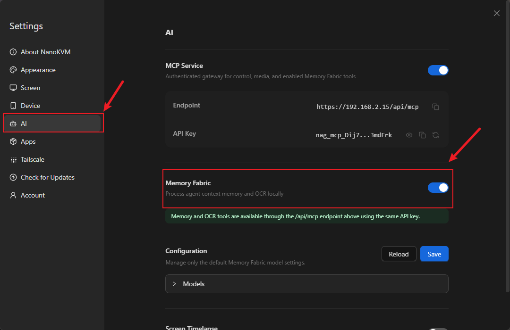
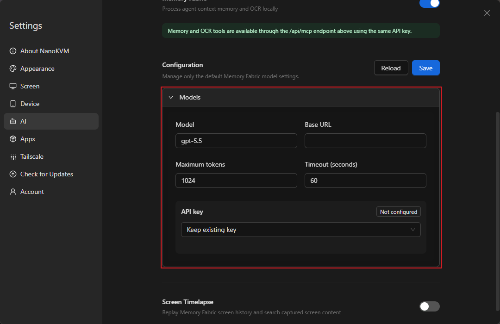
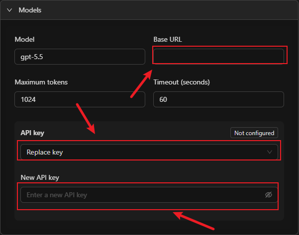
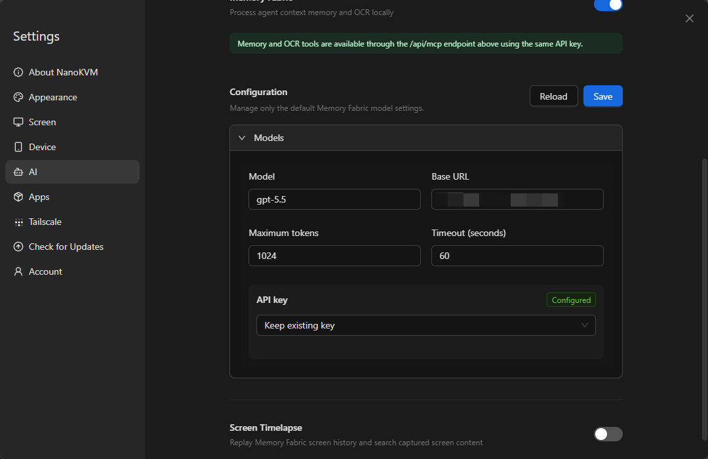

## Introduction

Memory Fabric records operations performed on the target device and helps AI review and summarize them.

> Memory Fabric is available only on NanoKVM Go+. NanoKVM Go does not support this feature.

When Memory Fabric is enabled, NanoKVM Go+ periodically checks the target device screen for changes, recognizes text in changed screens, and creates operation records. You can then ask an AI tool connected to NanoKVM Go MCP what operations were performed or have it organize the entire process in chronological order.

Memory Fabric is useful for:

+ Reviewing a sequence of operations you just completed;
+ Documenting software installation, system configuration, or troubleshooting steps;
+ Checking which pages were opened or which settings were changed during a period of time;
+ Generating instructions or work logs from an actual operation process.

> Screen content recognized and processed by Memory Fabric may contain sensitive information such as account details, chat messages, file names, passwords, and keys. Before using this feature, close any pages you do not want to record and make sure that both the configured model service and the connected AI tool are trustworthy.

## How It Works

Memory Fabric is not a continuous recording feature, and it does not save historical screenshots by default. It periodically samples the target device screen. When the screen changes, it extracts text and related context to create OCR-backed operation records. NanoKVM Go+ uses the model configured under `Settings > AI` to organize Memory Fabric content and exposes memory and OCR tools to AI tools through the `/api/mcp` endpoint.

```text
NanoKVM Go+ periodically samples the target device screen
              |
              v
Screen text is recognized and stored as operation records
              |
              | /api/mcp
              v
The AI tool reads the records and answers questions
```

The memory and OCR tools use the same endpoint and `API Key` as NanoKVM Go MCP. Before using Memory Fabric, connect your AI tool to NanoKVM Go+ as described in the MCP guide, and then configure a model for Memory Fabric.

## Preparation

Before using Memory Fabric, make sure that:

+ You are using NanoKVM Go+. NanoKVM Go does not support Memory Fabric, so the feature is not shown on its settings page;
+ NanoKVM Go+ is connected to the target device;
+ The NanoKVM Go+ web control page displays the target device screen correctly;
+ The NanoKVM Go+ system and application have been updated to versions that support Memory Fabric;
+ NanoKVM Go+ is connected to a network and can access the model service you plan to use;
+ You have the model name, Base URL, and API Key;
+ An MCP-compatible AI tool is installed on the control device.

If NanoKVM Go MCP has not been configured yet, follow the [MCP guide](./mcp.html) to add it to your AI tool and confirm that it is connected before configuring Memory Fabric.

## Enable Memory Fabric and Configure the Model

### Enable Memory Fabric

1. Enter the NanoKVM Go+ IP address in your browser to open the web control page.
2. Log in to NanoKVM Go+ and click the settings button on the toolbar.


3. Select `AI` in the left sidebar, find `Memory Fabric`, and turn on the switch.



After enabling the feature, configure the default model below it. This model processes Memory Fabric content.

### Configure the Model

Fill in the model settings under the Memory Fabric switch. The model service must provide an OpenAI-compatible Chat Completions endpoint:

| Setting | Description |
| --- | --- |
| `Model` | Enter the model name provided by your model service. It must match a model ID actually supported by the service. |
| `Base URL` | Enter the base URL of the OpenAI-compatible endpoint, such as `https://api.openai.com/v1`. The URL must stop before `/chat/completions`; do not enter the full `/chat/completions` request URL. |
| `Maximum tokens` | Limits the maximum number of tokens used by a single model request. A value that is too low may result in incomplete output. |
| `Timeout (seconds)` | Sets how long to wait for a model request. Increase it if the network or model responds slowly. |
| `API key` | The credential used to access the model service. |



The `API key` menu provides the following options:

+ `Keep existing key`: Continue using the saved key without changing it;
+ `Replace key`: Enter and save a new key;
+ `Clear key`: Delete the saved key.

For the initial configuration, select `Replace key` and enter the API Key provided by the model service. When changing other model settings without changing the key, select `Keep existing key`.



If an API key has already been saved, the page shows `Configured`. To change it, select `Replace key` and enter the new API key.

### Save the Configuration

After filling in the settings, click `Save` in the upper-right corner. To discard unsaved changes and load the current configuration again, click `Reload`.

After saving, confirm that:

+ The Memory Fabric switch is enabled;
+ The model name and Base URL are correct;
+ The API key is shown as configured;
+ No configuration save error is shown.

> A successful save only confirms that the configuration was written to NanoKVM Go+. It does not confirm connectivity to the model service, and the web page does not currently perform a separate model connection test. Continue with the short operation test below, wait one to two minutes, and then query the records from your AI tool to verify screen capture and MCP access. If your model provider supplies request logs, you can also check for a successful Chat Completions request from NanoKVM Go+ to verify model connectivity separately.



The model service API Key and the NanoKVM Go MCP API Key serve different purposes. Do not mix them up:

| API Key | Purpose | Where to enter it |
| --- | --- | --- |
| Model service API Key | Allows NanoKVM Go+ to call the configured model | `Settings > AI > Memory Fabric > Configuration` |
| NanoKVM Go MCP API Key | Allows an external AI tool to connect to NanoKVM Go MCP | The MCP Server configuration in the AI tool |

## Record an Operation Process

After configuring the model and MCP, leave Memory Fabric enabled and operate the target device through NanoKVM Go+ as usual.

For an initial test, perform a few simple operations. For example:

1. Open the system settings;
2. Open the system information or About page;
3. View non-sensitive information such as the device name and system version;
4. Return to the settings home page;
5. Close the settings and return to the desktop.

This sequence contains several clear screen changes but does not modify the target device configuration, making it suitable for verifying that Memory Fabric records and organizes the process correctly.

Memory Fabric samples the target device screen approximately every 10 seconds. When a sampled screen differs from the previous one, NanoKVM Go+ recognizes its text and creates a new OCR-backed operation record. You do not need to take screenshots manually or start a separate recording.

Memory Fabric retains OCR text records and organized memories, not historical screenshots that can be visually reviewed. Changes that are purely graphical, icon-only, or contain no clear text may not produce a useful record. To review the actual screen history, separately enable `Screen Timelapse` under `Settings > AI`.

For clearer review results:

+ Keep each important page visible for longer than one complete sampling cycle; waiting about 15 seconds is recommended;
+ Avoid rapidly switching back and forth between unrelated pages;
+ Do not display passwords, keys, or personal information that you do not want recorded;
+ When you no longer need the feature, return to `Settings > AI` and disable Memory Fabric.

## Review Operations with AI

Open an AI tool that is connected to NanoKVM Go MCP and ask about the operations you just performed using natural language.

For example:

```text
Use the NanoKVM Go+ memory tools to tell me what I just did.
```

```text
Organize my recent operations in chronological order. For each step, explain which page I opened and what I did there.
```

```text
Create a repeatable operation guide based on my recent activity.
```

```text
Based on my recent activity, tell me which system information I viewed and whether I changed any settings.
```

The AI tool calls the memory and OCR tools through NanoKVM Go MCP and answers based on the saved OCR-backed operation records and organized memories. The level of detail depends on the completeness of the record, text clarity, model configuration, and the capabilities of the AI tool.

## Verify the Feature

For the initial test, perform a short sequence with three to five clear screen changes. Keep each important page visible for about 15 seconds, and then check that:

+ Memory Fabric is enabled under `Settings > AI`;
+ The model configuration has been saved and the API key is shown as configured;
+ NanoKVM Go MCP remains connected in the AI tool;
+ The AI can call the memory or OCR tools;
+ The AI can describe the pages you just opened or operated;
+ The sequence produced by the AI generally matches the actual order of operations;
+ If your model provider supplies request logs, a successful Chat Completions request from NanoKVM Go+ appears within one to two minutes after the operation.

## Troubleshooting

### Memory Fabric Is Not Shown on the Settings Page

Check that:

+ The device is NanoKVM Go+. NanoKVM Go does not support Memory Fabric;
+ The NanoKVM Go+ system and application have been updated to versions that support the feature.

### The Configuration Cannot Be Saved or the Model Call Fails

Check that:

+ The model name matches a model ID actually supported by the model service;
+ The model service provides an OpenAI-compatible Chat Completions endpoint;
+ The Base URL stops before `/chat/completions`;
+ The model service API Key is valid and has permission to use the selected model;
+ NanoKVM Go+ can access the model service;
+ The model service account has available quota;
+ The timeout is not too short.

### The AI Tool Cannot Read Memory Fabric Records

Check that:

+ You completed the configuration described in the [MCP guide](./mcp.html);
+ NanoKVM Go MCP is shown as connected;
+ The MCP `Endpoint` and MCP `API Key` are correct;
+ The model service API Key was not accidentally entered in the MCP configuration;
+ The AI tool is allowed to call NanoKVM Go MCP tools;
+ Memory Fabric is enabled;
+ The NanoKVM Go+ system and application versions support the feature.

### No New Records Are Created After an Operation

Check that:

+ Memory Fabric is enabled;
+ The NanoKVM Go+ web control page displays the target device screen correctly;
+ There is a clear difference between the screen before and after the operation;
+ Important pages remain visible for longer than 10 seconds;
+ The page contains clear, recognizable text;
+ The target device is not showing a black screen, lock screen, or no-signal screen.

### The AI Produces Incomplete or Incorrectly Ordered Steps

Possible causes include:

+ Pages were switched too quickly for key screens to remain visible;
+ Multiple operations occurred on the same page with little visual change;
+ The operation was shown mainly through graphics or icons without recognizable text;
+ Text was too small, obscured, or unclear;
+ `Maximum tokens` was set too low and the answer was truncated;
+ The question did not define the requested scope clearly enough.

Repeat a shorter sequence, keep each important page visible for about 15 seconds, and explicitly ask the AI to organize the result in chronological order.

## Privacy and Security

+ Memory Fabric processes the target device screen, which may contain sensitive information;
+ Text recognized from the screen and organized content may be sent to the configured model service. Review the service's privacy and data retention policies before use;
+ Enable Memory Fabric only when needed and disable it after use;
+ Connect NanoKVM Go MCP only to trusted AI tools;
+ Do not disclose the model service API Key or NanoKVM Go MCP API Key;
+ Do not expose the MCP service directly to the public internet;
+ Before sharing AI-generated summaries or screenshots, check and redact account details, passwords, keys, and personal information.
