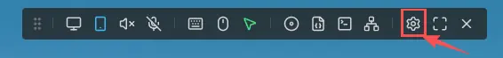
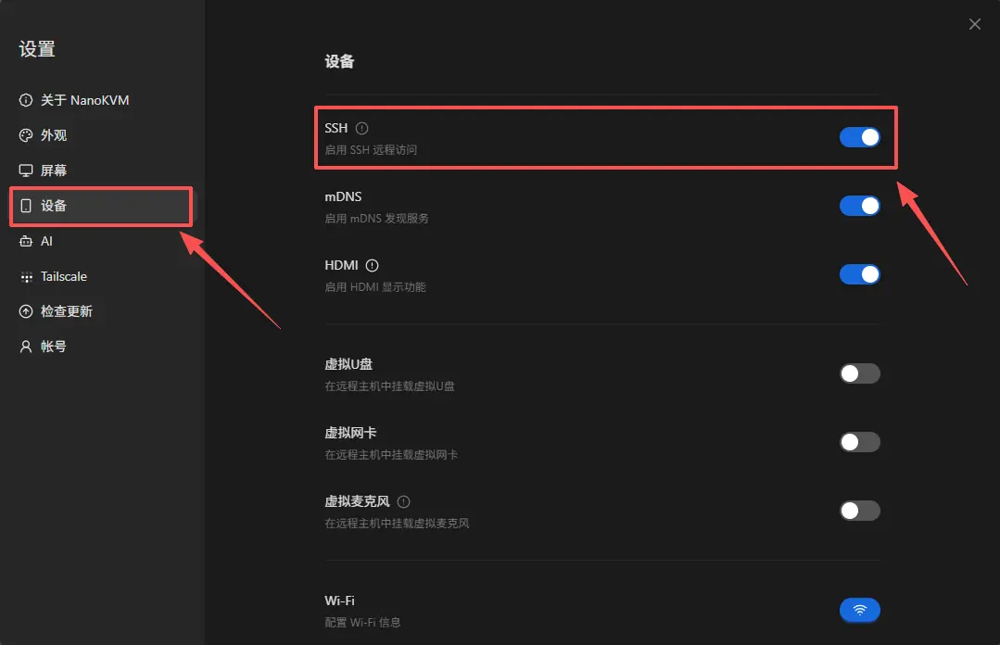
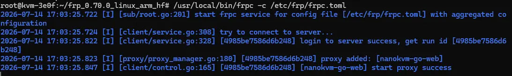

# Configure frp Remote Access

frp is an intranet penetration tool. It can forward the NanoKVM Go service in a local network to a server with a public IP address. After configuration, you can remotely access NanoKVM Go through the public server even if the network where NanoKVM Go is located does not have a public IP address.

frp consists of two components:

- `frps`: the server, running on a server with a public IP address;
- `frpc`: the client, running on NanoKVM Go.

```text
Remote PC or phone
       |
       | Access https://public IP:8080
       v
Public server (frps) <----- frpc active connection ----- NanoKVM Go
```

> The NanoKVM Go web interface currently does not provide an FRP entry. You need to enable SSH in the web interface first, then install and configure `frpc` manually through SSH.

> Exposing NanoKVM Go to the public Internet increases the risk of scanning, password guessing, and attacks. Set a strong password for NanoKVM Go first. The basic TCP example in this document forwards NanoKVM Go's local HTTPS service, but the device certificate is usually self-signed, so the browser may report that the certificate is not trusted. If you have a domain name, you can configure a trusted certificate for it. If you do not want to expose public ports, you can use a virtual networking solution such as Tailscale instead.

## Preparation

Before you start, prepare:

- a Linux server with a public IPv4 address;
- a NanoKVM Go connected to the Internet;
- administrator privileges on both NanoKVM Go and the public server;
- permission to modify the cloud security group and the server firewall;
- an frp authentication token that is hard to guess.

This document uses the following example values:

| Item | Example | Usage |
| --- | --- | --- |
| Public server IP | `203.0.113.10` | Runs `frps` |
| frps communication port | `7000` | Used by `frpc` to connect to `frps` |
| NanoKVM Go public access port | `8080` | Used by the browser to access NanoKVM Go |
| NanoKVM Go web address | `127.0.0.1:443` | Local HTTPS service forwarded by `frpc` |
| Token | `replace_with_a_strong_token` | Authenticates `frpc` |

`203.0.113.10` is an example address and cannot be used directly. Replace the public IP address, ports, and token in this document with your actual values.

## Install frps on the Public Server

### Download frp

Check the CPU architecture of the server:

```bash
uname -m
```

Open [frp Releases](https://github.com/fatedier/frp/releases), and select the Linux package that matches your server architecture. Common architecture mappings are:

| `uname -m` output | frp package architecture |
| --- | --- |
| `x86_64` | `linux_amd64` |
| `aarch64`, `arm64` | `linux_arm64` |
| `armv7l` | `linux_arm_hf` |
| Older ARM devices such as ARMv5 | `linux_arm` |
| `riscv64` | `linux_riscv64` |

This document uses frp `0.70.0` as an example. You can download it from the release page:

- [frp 0.70.0 release page](https://github.com/fatedier/frp/releases/tag/v0.70.0)
- [Linux AMD64 package](https://github.com/fatedier/frp/releases/download/v0.70.0/frp_0.70.0_linux_amd64.tar.gz)
- [Linux ARM64 package](https://github.com/fatedier/frp/releases/download/v0.70.0/frp_0.70.0_linux_arm64.tar.gz)
- [Linux ARMv7 hard-float package](https://github.com/fatedier/frp/releases/download/v0.70.0/frp_0.70.0_linux_arm_hf.tar.gz)
- [Linux RISC-V 64 package](https://github.com/fatedier/frp/releases/download/v0.70.0/frp_0.70.0_linux_riscv64.tar.gz)

Most cloud servers use the `x86_64` architecture. If `uname -m` outputs `x86_64`, run the following commands to download and install `frps`:

```bash
wget https://github.com/fatedier/frp/releases/download/v0.70.0/frp_0.70.0_linux_amd64.tar.gz
tar -xzf frp_0.70.0_linux_amd64.tar.gz
cd frp_0.70.0_linux_amd64
sudo install -m 755 frps /usr/local/bin/frps
```

`sudo install -m 755 frps /usr/local/bin/frps` copies the `frps` program from the current directory to `/usr/local/bin/frps`, and sets its permission to `755`. This means all users can execute it, while only the file owner can modify it.

If your server uses another architecture, download the matching package from the table above, and replace the package name and extracted directory in the commands with the actual names. The public server and NanoKVM Go should use the same frp version.

Verify that `frps` can run:

```bash
/usr/local/bin/frps --version
```

> It is recommended to install the same frp version on the public server and NanoKVM Go to avoid configuration incompatibilities caused by version differences.

### Create the frps configuration

Create the configuration directory:

```bash
sudo mkdir -p /etc/frp
```

Create `/etc/frp/frps.toml`:

```toml
bindPort = 7000

auth.method = "token"
auth.token = "replace_with_a_strong_token"
```

Replace `auth.token` with a randomly generated strong token. You can generate one on the public server with:

```bash
openssl rand -hex 32
```

The token in the `frps` and `frpc` configurations must be exactly the same. The token only authenticates `frpc`. It does not replace the NanoKVM Go login password, and it does not replace the HTTPS certificate used by the browser.

### Start frps

Start it in the foreground first, so you can see the logs directly:

```bash
sudo /usr/local/bin/frps -c /etc/frp/frps.toml
```

If there is no error, press `Ctrl+C` to stop the test. Foreground mode works on all Linux systems, but `frps` stops when the terminal is closed. For long-term use, register it as a system service.

#### Check the init system

Run the following command to check the process used by PID 1:

```bash
ps -p 1 -o comm=
```

Choose the startup method according to the output:

| Example output | Startup method |
| --- | --- |
| `systemd` | Use systemd |
| `init`, `sysvinit`, and `/etc/init.d/` exists | Use SysV init |
| `openrc-init` | Use OpenRC |

> Whether systemd can be used depends on whether PID 1 is `systemd`. Having the `systemctl` command installed does not mean the current system was booted with systemd.

#### Start with systemd

Use this section only when `ps -p 1 -o comm=` outputs `systemd`.

Create `/etc/systemd/system/frps.service`:

```ini
[Unit]
Description=frp server
After=network-online.target
Wants=network-online.target

[Service]
Type=simple
ExecStart=/usr/local/bin/frps -c /etc/frp/frps.toml
Restart=on-failure
RestartSec=5s

[Install]
WantedBy=multi-user.target
```

Load the service and enable it on boot:

```bash
sudo systemctl daemon-reload
sudo systemctl enable --now frps
sudo systemctl status frps
```

If the status is `active (running)`, `frps` has started. View live logs with:

```bash
sudo journalctl -u frps -f
```

#### Start with SysV init

If the system uses SysV init and the `start-stop-daemon` command exists, create `/etc/init.d/frps`:

```sh
#!/bin/sh

DAEMON=/usr/local/bin/frps
CONFIG=/etc/frp/frps.toml
PIDFILE=/var/run/frps.pid

case "$1" in
    start)
        if [ -f "$PIDFILE" ] && kill -0 "$(cat "$PIDFILE")" 2>/dev/null; then
            echo "frps is already running"
            exit 0
        fi
        echo "Starting frps"
        start-stop-daemon --start --background --make-pidfile \
            --pidfile "$PIDFILE" --exec "$DAEMON" -- -c "$CONFIG"
        ;;
    stop)
        echo "Stopping frps"
        start-stop-daemon --stop --pidfile "$PIDFILE" --retry TERM/5/KILL/5
        rm -f "$PIDFILE"
        ;;
    restart)
        "$0" stop
        "$0" start
        ;;
    status)
        if [ -f "$PIDFILE" ] && kill -0 "$(cat "$PIDFILE")" 2>/dev/null; then
            echo "frps is running"
        else
            echo "frps is not running"
            exit 1
        fi
        ;;
    *)
        echo "Usage: $0 {start|stop|restart|status}"
        exit 1
        ;;
esac
```

Make the script executable:

```bash
sudo chmod +x /etc/init.d/frps
```

On Debian, Ubuntu, and other SysV init systems that use `update-rc.d`, enable the service on boot and start it:

```bash
sudo update-rc.d frps defaults
sudo service frps start
sudo service frps status
```

If the system does not have `update-rc.d`, use the SysV init service management command provided by your distribution.

#### Systems without systemd

If you see the following error:

```text
System has not been booted with systemd as init system (PID 1). Can't operate.
Failed to connect to bus: Host is down
```

The current environment was not booted with systemd, so do not continue using `systemctl`. You can test `frps` in the foreground first:

```bash
sudo /usr/local/bin/frps -c /etc/frp/frps.toml
```

For long-term use, add a service configuration according to the init system actually used by the distribution.

### Open public server ports

Allow the following ports in the cloud security group and the server firewall:

- `7000/tcp`: used by `frpc` on NanoKVM Go to connect to `frps`;
- `8080/tcp`: used by remote browsers to access NanoKVM Go.

Different Linux distributions may use different firewall tools. Check first:

```bash
command -v ufw
command -v firewall-cmd
```

Choose the corresponding section according to the command output. Do not run commands for a firewall tool that is not installed.

#### Use UFW

If `command -v ufw` outputs the UFW path, run:

```bash
sudo ufw allow 7000/tcp
sudo ufw allow 8080/tcp
sudo ufw status
```

If the terminal reports `ufw: command not found`, UFW is not installed on the current system. UFW is not required for running `frps`. Continue checking whether the system uses firewalld, another firewall, or only the cloud security group.

#### Use firewalld

If `command -v firewall-cmd` outputs the firewalld command path, run:

```bash
sudo firewall-cmd --permanent --add-port=7000/tcp
sudo firewall-cmd --permanent --add-port=8080/tcp
sudo firewall-cmd --reload
sudo firewall-cmd --list-ports
```

#### Use a cloud security group

Alibaba Cloud, Huawei Cloud, Tencent Cloud, AWS, and other cloud providers usually provide a security group that is independent of the Linux system. Even if UFW or firewalld is not installed inside the server, you must add inbound rules in the cloud server console:

| Protocol | Port | Source |
| --- | --- | --- |
| TCP | `7000` | Public IP of the network where NanoKVM Go is located. If it cannot be fixed, you can temporarily allow any source for testing. |
| TCP | `8080` | Public IP that needs to access NanoKVM Go. If it cannot be fixed, you can temporarily allow any source for testing. |

After testing, restrict the source range to the actual IPs you need. Do not keep these ports open to the entire Internet for a long time.

Confirm that `frps` is listening on port `7000`:

```bash
sudo ss -lntp | grep ':7000'
```

You can also confirm whether the remote access port is already listening:

```bash
sudo ss -lntp | grep ':8080'
```

> Port `8080` appears only after `frpc` on NanoKVM Go connects successfully and registers the proxy.

## Enable SSH in the NanoKVM Go Web Interface

The NanoKVM Go web interface does not provide an FRP entry, so you need to enable SSH first, then install `frpc` from the command line.

### Log in to NanoKVM Go

1. Open the local network address of NanoKVM Go in a browser;
2. Enter the username and password to log in to the web console;
3. Confirm the current local network IP address of NanoKVM Go.

### Open SSH settings

1. Open the NanoKVM Go settings page;



2. Go to the settings item that contains the SSH switch, and enable SSH;



### Log in through SSH

Open a terminal on a computer in the same local network as NanoKVM Go, and log in through SSH:

```bash
ssh <SSH username>@<NanoKVM-Go local IP>

Example: ssh root@192.168.0.225
```

> On the first connection, the terminal asks whether to trust the device fingerprint. After confirming that the IP address is correct, enter `yes`, then enter the SSH password. The username is `root`, and the password is `sipeed`.

## Install frpc on NanoKVM Go

Run the following commands in the NanoKVM Go SSH terminal.

### Confirm the system architecture

Run:

```bash
uname -m
```

The output of `uname -m` on a real NanoKVM Go device is:

```text
armv7l
```

Therefore, use the `linux_arm_hf` package of frp. This package is built for ARMv7 hard-float environments. Do not download `linux_arm64`.

### Download and install frpc

The `/tmp` directory on NanoKVM Go is usually mounted as an in-memory tmpfs and has limited space. Download the package to `/root` on the root filesystem instead.

Run the following commands to download and install `frpc`:

```bash
cd /root
wget https://github.com/fatedier/frp/releases/download/v0.70.0/frp_0.70.0_linux_arm_hf.tar.gz
tar -xzf frp_0.70.0_linux_arm_hf.tar.gz
cd frp_0.70.0_linux_arm_hf
mkdir -p /usr/local/bin
cp frpc /usr/local/bin/frpc
chmod +x /usr/local/bin/frpc
```

If the download or extraction fails, confirm that NanoKVM Go can access GitHub, and check whether the version number and file name match the Releases page.

Verify the installation:

```bash
/usr/local/bin/frpc --version
```

If NanoKVM Go cannot access GitHub directly, download the package on your computer first, then upload it to `/root` on the device with `scp`:

```bash
scp frp_0.70.0_linux_arm_hf.tar.gz <SSH username>@<NanoKVM-Go local IP>:/root/
```

### Create the frpc configuration

Create the configuration directory:

```bash
mkdir -p /etc/frp
```

Create `/etc/frp/frpc.toml`:

```toml
serverAddr = "203.0.113.10"
serverPort = 7000

auth.method = "token"
auth.token = "replace_with_a_strong_token"

[[proxies]]
name = "nanokvm-go-web"
type = "tcp"
localIP = "127.0.0.1"
localPort = 443
remotePort = 8080
```

Modify the following parameters:

| Parameter | What to change |
| --- | --- |
| `serverAddr` | Actual IP address or domain name of the public server |
| `serverPort` | `bindPort` of `frps`, `7000` in this document |
| `auth.token` | The same token as in `frps.toml` |
| `localPort` | Actual NanoKVM Go web service port. This document uses HTTPS port `443` |
| `remotePort` | Public access port, `8080` in this document |

Check whether the local web service is accessible:

```bash
wget --no-check-certificate -S -O /dev/null https://127.0.0.1:443
```

The HTTP port of NanoKVM Go may redirect to HTTPS. If directly accessing `http://127.0.0.1:80` returns `307 Temporary Redirect` and redirects to `https://127.0.0.1/`, this is normal. Because the device certificate is usually not a publicly trusted certificate, add `--no-check-certificate` when testing with `wget`.

If the connection is refused, confirm the actual NanoKVM Go web service port, then modify `localPort`.

### Test the frpc connection

Start `frpc` in the foreground:

```bash
/usr/local/bin/frpc -c /etc/frp/frpc.toml
```

If the logs show `login to server success` and `start proxy success`, `frpc` has connected to `frps` and registered the proxy.

Keep this terminal running, and open the following address in a browser from an external network:

```text
https://203.0.113.10:8080
```

Replace the example IP address with the actual IP address of your public server. On first access, the browser may report that the certificate is not trusted. After confirming that you are accessing your own server, continue for testing. If the NanoKVM Go login page opens, the TCP forwarding configuration is correct. After testing, return to the SSH terminal and press `Ctrl+C` to stop `frpc`.



### Enable frpc on boot

NanoKVM Go uses systemd to manage system services. Create `/etc/systemd/system/frpc.service`:

```ini
[Unit]
Description=frp client for NanoKVM Go
After=network-online.target
Wants=network-online.target

[Service]
Type=simple
ExecStart=/usr/local/bin/frpc -c /etc/frp/frpc.toml
Restart=always
RestartSec=5s

[Install]
WantedBy=multi-user.target
```

Load the service and enable it on boot:

```bash
systemctl daemon-reload
systemctl enable --now frpc
systemctl status frpc
```

View live logs:

```bash
journalctl -u frpc -f
```

After rebooting NanoKVM Go, run `systemctl status frpc` again to confirm that the service starts automatically and reconnects to `frps`.

## Access NanoKVM Go from an External Network

To confirm that the traffic really goes through the public server, switch your computer or phone to another network, such as a mobile hotspot or mobile data network, then:

1. Open `https://<public server IP>:8080` in a browser;
2. Log in with the NanoKVM Go username and password;
3. Test the remote display, keyboard, mouse, and power control;
4. Refresh the page, and confirm that video and control features still work.

The TCP proxy forwards HTTPS and WebSocket connections as-is, so WebSocket usually does not require extra configuration. If the page opens but video or control functions are abnormal, check the browser developer tools, `frpc` logs, and `frps` logs.

## Configure a Domain Name and HTTPS (Optional)

The basic example `https://<public IP>:8080` uses the certificate provided by NanoKVM Go itself, so the browser may report that the certificate is not trusted. If you have an available domain name, you can point it to the `frps` server and use Nginx or Caddy to provide a trusted HTTPS reverse proxy.

For example, with Nginx, let Nginx listen on `443`, then forward requests to port `8080` exposed by frp on the server itself:

```nginx
server {
    listen 443 ssl;
    server_name kvm.example.com;

    ssl_certificate /path/to/fullchain.pem;
    ssl_certificate_key /path/to/privkey.pem;

    location / {
        proxy_pass https://127.0.0.1:8080;
        proxy_http_version 1.1;
        proxy_ssl_verify off;
        proxy_set_header Host $host;
        proxy_set_header X-Real-IP $remote_addr;
        proxy_set_header X-Forwarded-For $proxy_add_x_forwarded_for;
        proxy_set_header X-Forwarded-Proto $scheme;
        proxy_set_header Upgrade $http_upgrade;
        proxy_set_header Connection "upgrade";
        proxy_read_timeout 3600s;
    }
}
```

The overall steps are:

1. Point the domain A record to the public IP address of the `frps` server;
2. Install Nginx or Caddy on the server;
3. Issue a TLS certificate for the domain;
4. Reverse proxy HTTPS requests to `https://127.0.0.1:8080`;
5. Allow `443/tcp` in the security group and firewall;
6. After confirming that `https://kvm.example.com` works, close public inbound access to `8080/tcp`.

After configuring HTTPS, use the cloud security group and server firewall to deny public inbound traffic to `8080/tcp`, and allow only the local Nginx process on the server to access that port. Do not keep the HTTP test port publicly exposed after HTTPS is configured.

## FAQ

### frpc cannot connect to frps

Check the following:

- whether `serverAddr` and `serverPort` are correct;
- whether `frps` is `active (running)`;
- whether `7000/tcp` is allowed in the cloud security group and server firewall;
- whether the tokens in `frps` and `frpc` are exactly the same;
- whether the frp versions on the public server and NanoKVM Go are compatible;
- whether NanoKVM Go can access the Internet and the public server.

You can test port connectivity on NanoKVM Go:

```bash
nc -vz <public server IP> 7000
```

If `nc` is not available, observe the `frpc` connection logs directly.

### frpc is connected, but the public port cannot be accessed

Check:

- whether `remotePort` is occupied by another program or another frp proxy;
- whether `8080/tcp` is allowed in the cloud security group and server firewall;
- whether the `frpc` log shows that the proxy started successfully;
- whether the `frps` log contains `nanokvm-go-web`;
- whether the browser is using `https://`, not `http://`.

Confirm on the public server whether the port is listening:

```bash
sudo ss -lntp | grep ':8080'
```

### The page cannot be opened or returns connection refused

Run the following command on NanoKVM Go:

```bash
wget --no-check-certificate -S -O /dev/null https://127.0.0.1:443
```

If local access also fails, `localIP` or `localPort` is incorrect, or the NanoKVM Go web service is not running.

### Local test reports that the certificate is not trusted

If running `wget -S -O /dev/null http://127.0.0.1:80` returns `307 Temporary Redirect` and redirects to `https://127.0.0.1/`, NanoKVM Go is automatically using HTTPS. The following certificate errors are usually normal:

```text
ERROR: The certificate of '127.0.0.1' is not trusted.
ERROR: The certificate's owner does not match hostname '127.0.0.1'
```

This happens because the NanoKVM Go certificate is not a publicly trusted certificate issued for `127.0.0.1`. To test the local HTTPS service, use:

```bash
wget --no-check-certificate -S -O /dev/null https://127.0.0.1:443
```

The `frpc` configuration should also forward `localPort = 443`.

### The page opens, but video or control features are abnormal

Check:

- whether the browser developer tools show WebSocket connection errors;
- whether `frpc` and `frps` disconnect or reconnect frequently;
- whether Nginx or Caddy forwards WebSocket Upgrade requests correctly;
- whether an HTTPS page loads HTTP resources;
- whether the public server bandwidth and the uplink bandwidth of the NanoKVM Go network are sufficient.

### frpc does not start automatically after reboot

Run the following commands on NanoKVM Go:

```bash
systemctl status frpc
journalctl -u frpc -b
```

Check whether the service is enabled, whether the configuration file path is correct, and whether `frpc` can connect to `frps` after the network is ready.

## Disable frp

### Temporarily disable

If you only want to stop using frp temporarily and may use it again later, stop the service and disable auto-start while keeping the program and configuration files.

Stop and disable `frpc` on NanoKVM Go:

```bash
systemctl disable --now frpc
```

If the public server uses systemd, stop and disable `frps`:

```bash
sudo systemctl disable --now frps
```

If the public server uses SysV init, stop `frps` and remove it from auto-start:

```bash
sudo service frps stop
sudo update-rc.d -f frps remove
```

To restore the systemd service on NanoKVM Go, run:

```bash
systemctl enable --now frpc
```

To restore the systemd service on the public server, run:

```bash
sudo systemctl enable --now frps
```

To restore the SysV init service on the public server, run:

```bash
sudo update-rc.d frps defaults
sudo service frps start
```

> Only run the commands that match the current init system. If the public server uses another service manager, use the corresponding stop and disable commands.

### Completely uninstall

frp was installed by manually copying binaries, so it is not managed by package managers such as `apt` or `dnf`. To completely uninstall it, manually delete the service, program, and configuration files.

On NanoKVM Go, stop `frpc` and remove the systemd service file:

```bash
systemctl disable --now frpc
rm -f /etc/systemd/system/frpc.service
systemctl daemon-reload
```

Then delete the `frpc` program and configuration on NanoKVM Go:

```bash
rm -f /usr/local/bin/frpc
rm -f /etc/frp/frpc.toml
rmdir /etc/frp 2>/dev/null || true
```

Delete the package and extracted directory created during installation on NanoKVM Go:

```bash
rm -f /root/frp_0.70.0_linux_arm_hf.tar.gz
rm -rf /root/frp_0.70.0_linux_arm_hf
```

If you downloaded another version or architecture, replace the file names with the actual names.

If the public server uses systemd, remove the `frps` service first:

```bash
sudo systemctl disable --now frps
sudo rm -f /etc/systemd/system/frps.service
sudo systemctl daemon-reload
```

If the public server uses SysV init, remove the `frps` service first:

```bash
sudo service frps stop
sudo update-rc.d -f frps remove
sudo rm -f /etc/init.d/frps
```

After cleaning up the corresponding service, delete the `frps` program and configuration:

```bash
sudo rm -f /usr/local/bin/frps
sudo rm -f /etc/frp/frps.toml
sudo rmdir /etc/frp 2>/dev/null || true
```

The frp package and extracted directory on the public server are located in the directory where you ran the download commands. After confirming the directory and file names, you can delete them.

### Clean up firewall and other configuration

If UFW was installed and used, delete the allow rules added in this document:

```bash
sudo ufw delete allow 7000/tcp
sudo ufw delete allow 8080/tcp
```

If firewalld was installed and used, run:

```bash
sudo firewall-cmd --permanent --remove-port=7000/tcp
sudo firewall-cmd --permanent --remove-port=8080/tcp
sudo firewall-cmd --reload
```

Finally, check and clean up:

- `7000/tcp`, `8080/tcp`, and other frp ports in the cloud security group;
- Nginx or Caddy configuration created specifically for NanoKVM Go;
- TLS certificates that are no longer used;
- DNS records that are no longer used.

> If the corresponding firewall command does not exist, skip that group of commands. If a port, reverse proxy, or certificate is still used by another service, do not delete the corresponding configuration directly.

## Security Recommendations

- Set a separate strong password for NanoKVM Go;
- Use a randomly generated strong token, and do not use the example value in this document;
- Do not expose the frps Dashboard to the public Internet;
- Open only the ports that are actually needed, and restrict source IPs through the firewall whenever possible;
- If you have a domain name, you can configure a trusted HTTPS reverse proxy;
- Regularly update NanoKVM Go, frp, and the public server system;
- Regularly check `frpc`, `frps`, and reverse proxy logs;
- Stop the service and close public ports immediately when you no longer use it.

## References

- [frp official documentation](https://gofrp.org/)
- [frp GitHub repository](https://github.com/fatedier/frp)
- [frp Releases](https://github.com/fatedier/frp/releases)
