## Introduction to the Sipeed Remote Network

Sipeed provides the control server for the Sipeed Remote Network, devices connect to each other directly without relaying traffic through the server, and no Tailscale account is required; the client device connects with the Tailscale client.

> Note: this method uses Sipeed's servers (`control.tailnet.sipeed.com`, located in mainland China) for device registration, authentication, and connection coordination. Connection details such as the device identifier, device name, and virtual network IP address are sent to those servers. If you prefer not to use Sipeed's servers, choose [Tailscale](tailscale.html).

## Before You Start

Before starting, make sure that:

- NanoKVM Go is connected to the Internet;
- NanoKVM Go is accessible from the local network;
- the NanoKVM Go system and application are updated to the latest versions;
- the computer or phone used for remote access can install the Tailscale client.

| Platform | Installation method |
| --- | --- |
| Android | Install from [Google Play](https://play.google.com/store/apps/details?id=com.tailscale.ipn) or [F-Droid](https://f-droid.org/en/packages/com.tailscale.ipn/) |
| iOS / iPadOS | Install from the [App Store](https://apps.apple.com/app/tailscale/id1470499037) |
| macOS | Follow the [Tailscale for macOS installation guide](https://tailscale.com/docs/install/mac) to install it from the website or App Store |

> If the `Sipeed Remote Network` option is not available on the settings page, check for and install the latest NanoKVM Go system and application updates.

## Differences from Tailscale

The two methods differ in the control server they use: `Sipeed Remote Network` is provided by Sipeed and does not require a Tailscale account, while [Tailscale](tailscale.html) is provided by Tailscale and requires you to register and sign in.

To switch from the method you are using to the other one, click `Exit` on the NanoKVM Go page and confirm. The device leaves its current network and returns to the `Choose a connection network` page, where you can select the other method.

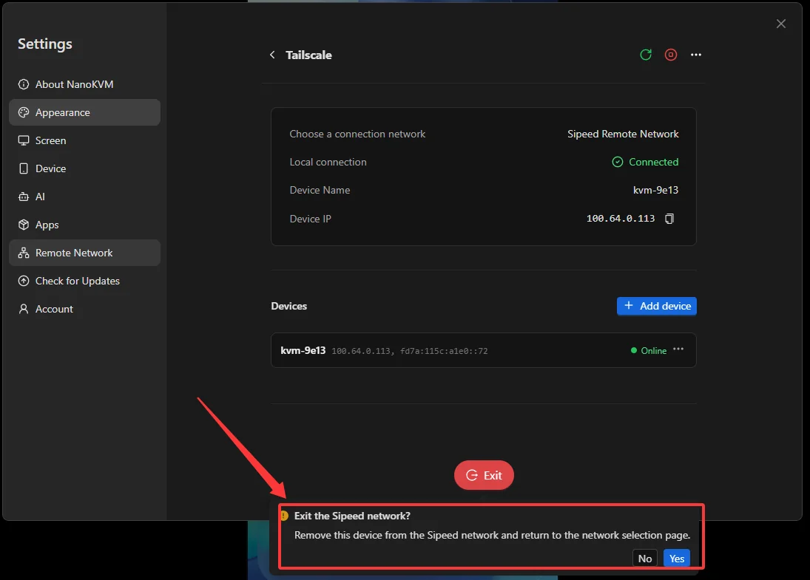

## Enable the Sipeed Remote Network on NanoKVM Go

### Open the Tailscale Settings

1. Log in to the NanoKVM Go web interface and click the settings icon in the top toolbar.

2. Select `Remote Network` in the sidebar, then open `Tailscale`.

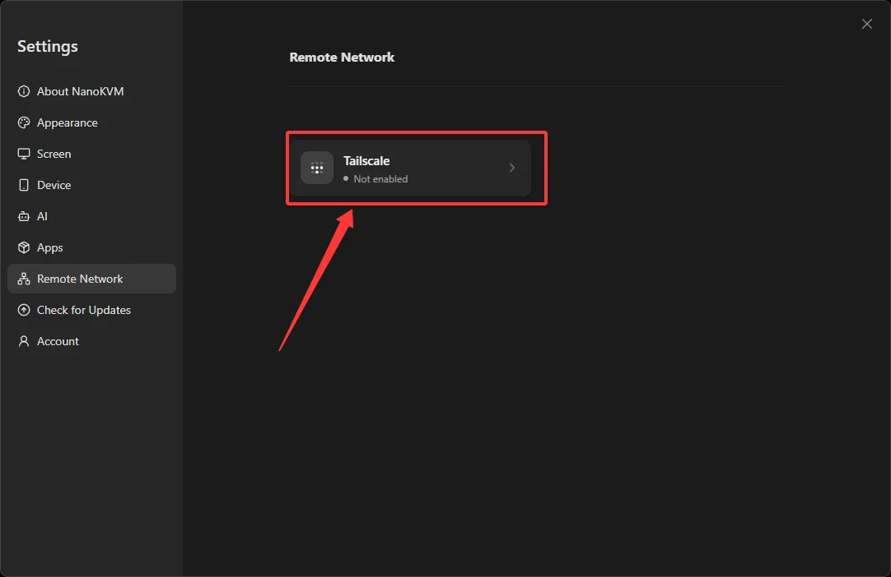

### Start the Sipeed Remote Network

1. Under `Choose a connection network`, select `Sipeed Remote Network`, then click `Enable remote network`;

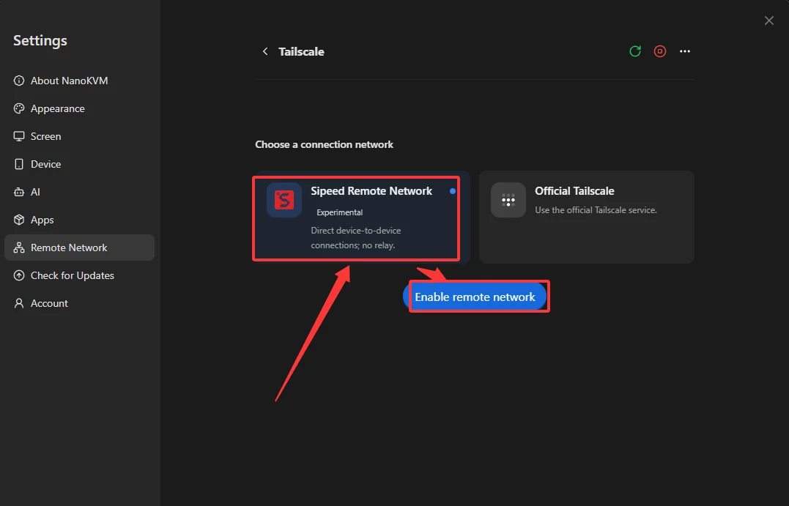

2. The first time you enable it, a `Disclaimer` dialog appears. Read it and click `Agree and start`;

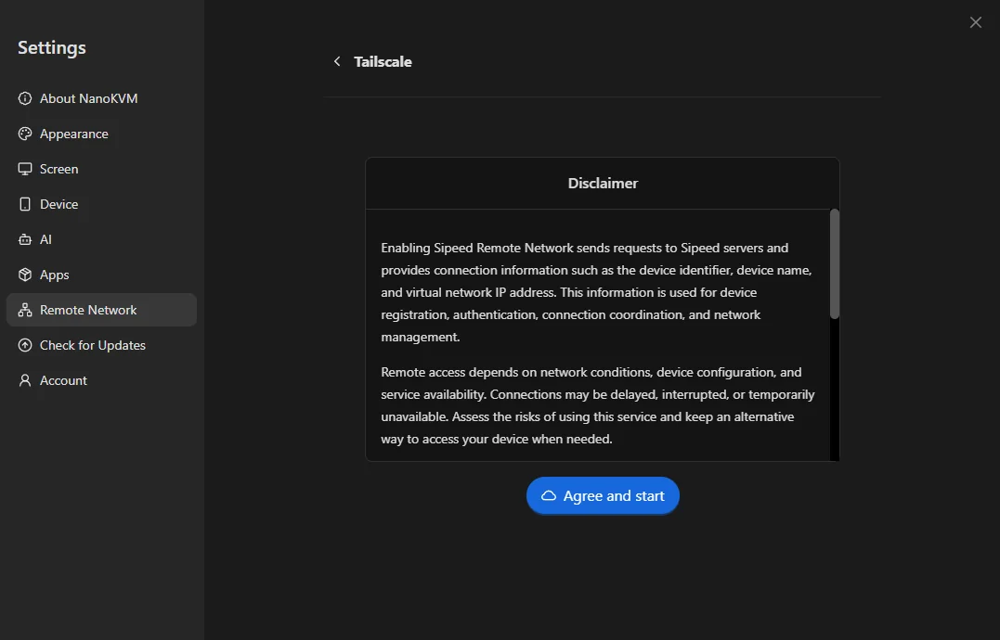

3. Once enabled, the page shows `Choose a connection network` as `Sipeed Remote Network` and `Local connection` as `Connected`, together with the `Device Name` (for example, `kvm-9e13`) and the `Device IP` (a virtual IP in the `100.x.x.x` range).

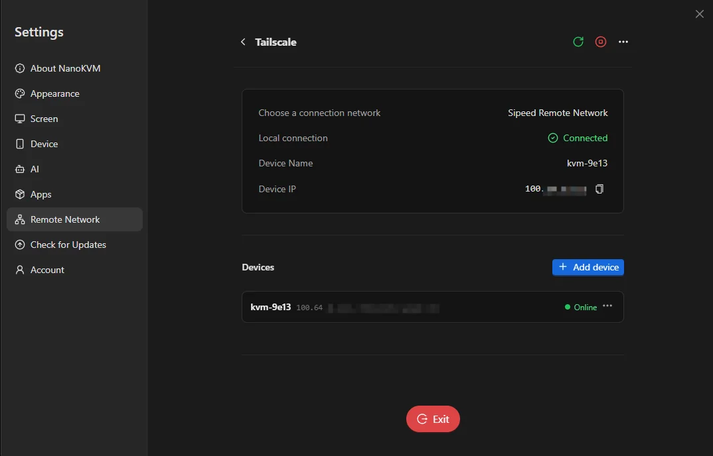

## Install the Tailscale Client and Join the Sipeed Remote Network

The client device does not sign in to a Tailscale account; you only point its control server at Sipeed's address. For installation, see the platform table in [Before You Start](#Before-You-Start); the steps below cover joining the network on each platform.

### Android

1. Open the Tailscale client and tap the settings icon in the top-right corner;

2. Open `Settings` > `Accounts`;

3. Tap the menu in the top-right corner and select `Use an alternate server`;

4. Enter `https://control.tailnet.sipeed.com` in `Custom control server URL` and tap `Add account`;

### iOS / iPadOS

> Tailscale is not listed in the App Store in mainland China. Sign in to the App Store with an Apple ID from another region before installing it.

1. Open the Tailscale client and tap the account icon in the top-right corner;

2. Tap `Log In…`;

3. On the `Accounts` page, tap `⋯` in the top-right corner;

4. Select `Use a custom coordination server`;

5. Enter `https://control.tailnet.sipeed.com` in `Server URL` and tap `Log in`.

### macOS

1. Click the Tailscale icon in the menu bar, then click the settings icon in the top-right corner of the popover;

2. In the `Tailscale Settings` window, open `Accounts` and click the drop-down next to `Add Account…`; enter `https://control.tailnet.sipeed.com` in the `Add Account Using Alternate Server` dialog that appears, then click the yellow `Add Account…` button;

Once the client device is connected, the browser automatically opens the NanoKVM join page, which asks for the 6-digit claim code. That code is generated as described in [Add the Device on NanoKVM Go](#Add-the-Device-on-NanoKVM-Go).

> Any computer or phone counts as a client device: install the Tailscale client on each one that needs remote access and pair it once, following the steps for its platform.
>
> If the browser does not open the join page automatically, open the address manually, or go back to the NanoKVM Go page and click `Get a new code` to generate a new claim code.

## Add the Device on NanoKVM Go

1. Open `Remote Network` > `Tailscale` on NanoKVM Go and click `Add device`;

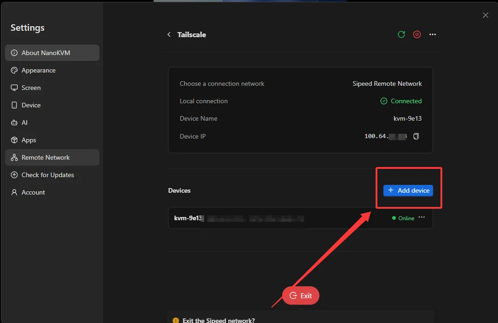

2. The page shows a 6-digit claim code, for example, `086 140`. It is valid for 10 minutes and can be used only once; use `Copy claim code` or `Get a new code` as needed;

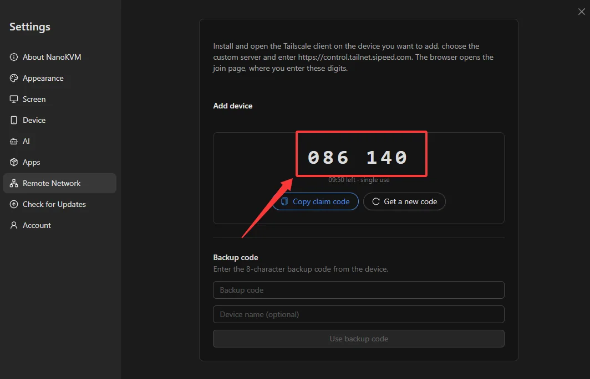

3. Enter the claim code on the join page in the browser and click `Continue`;

4. The browser then shows a 3-digit number, and a `Pending device` window appears on the NanoKVM Go page. If the two numbers match, click `Allow` on the NanoKVM Go page; if they differ, another device may be trying to join, so click `Reject`.

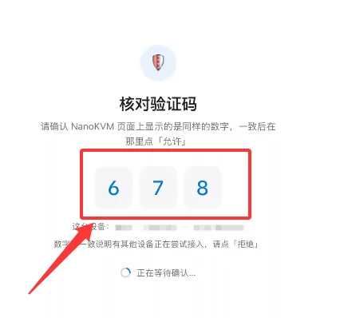

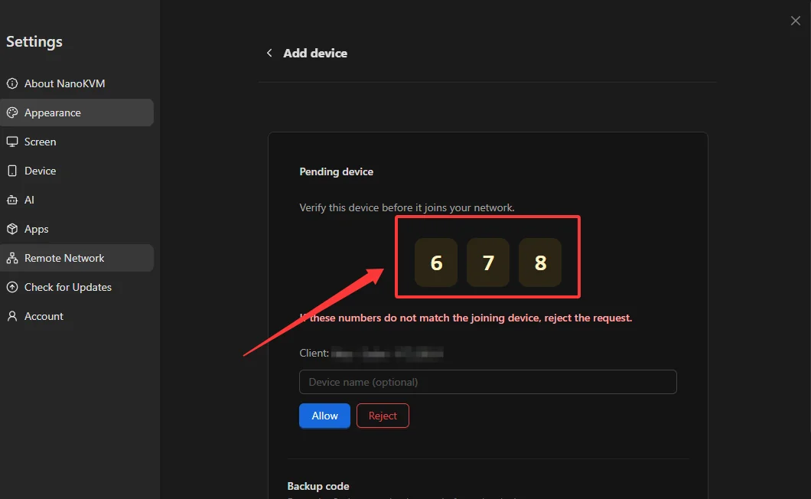

5. After you click `Allow`, the browser shows a success page, where you can click `Open NanoKVM admin page` to continue, or `Copy address` and open it in the browser yourself;

6. Back on the NanoKVM Go page, the new device appears in the `Devices` list with its `Device Name`, `Device IP` (a `100.x.x.x` address), and `Online` status, which means it has joined the Sipeed Remote Network.

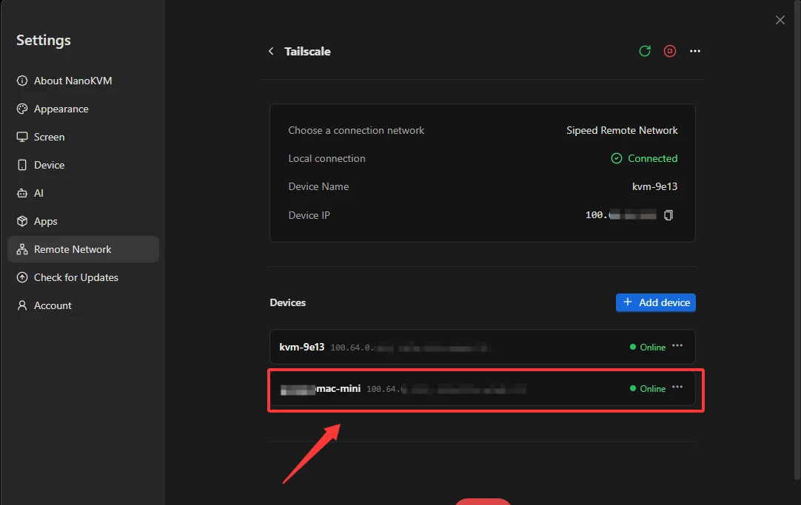

> You can also pair in the opposite direction with a `Backup code`: expand `Backup code` on the join page in the browser, then enter the 8-character backup code on the NanoKVM Go `Add device` page and click `Use backup code`.

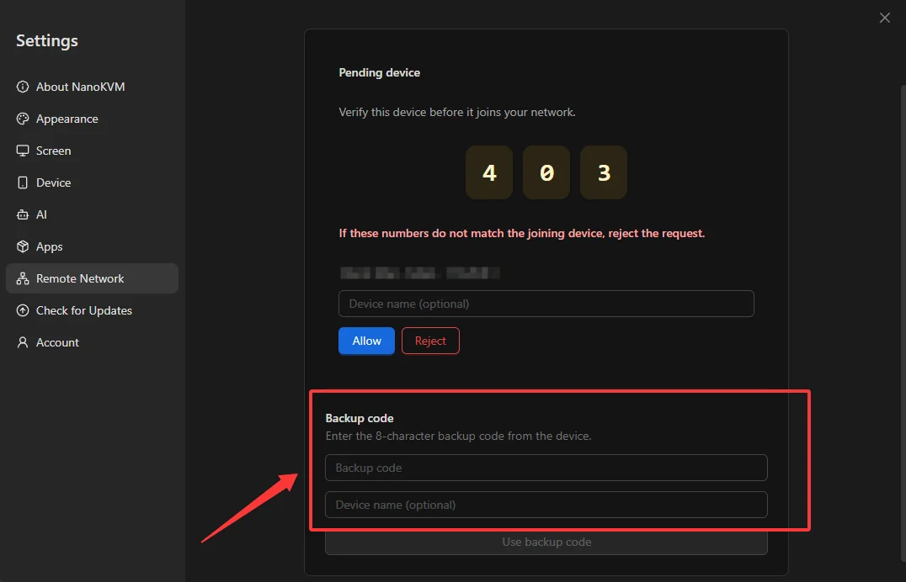

## Access NanoKVM Go Remotely (Device IP)

The `Device IP` of NanoKVM Go is a virtual IP in the `100.x.x.x` range, and it is the address you use for remote access; you can also see it in the `Devices` list. Before you start, confirm that both ends are online:

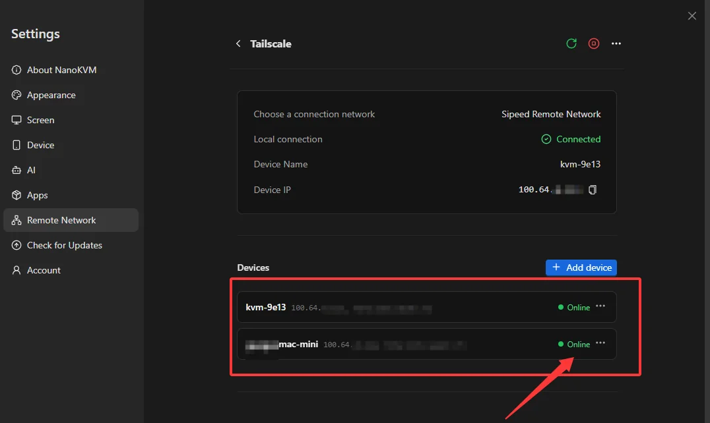

To ensure that the test uses an external network, disconnect the client device from the current LAN and use a phone hotspot or mobile network instead. Then:

1. Confirm that the Tailscale client is connected on the client device (the switch on the client home screen is on);
2. Enter the `Device IP` of NanoKVM Go in the browser address bar, for example, `http://100.x.x.x`;
3. Open the NanoKVM Go login page and sign in;
4. Test remote video, keyboard and mouse control, power control, and other features.

> If the page cannot be opened, check that `Local connection` on NanoKVM Go still shows `Connected` and that the Tailscale client on the client device is connected.
>
> When you no longer need it, click `Exit` on the NanoKVM Go page to leave the Sipeed Remote Network; on the client device you can simply turn the connection off in the Tailscale client.

## Everyday Use and Security Recommendations

- Set a strong password for NanoKVM Go and keep its own login authentication enabled;
- Do not expose additional NanoKVM Go ports on the router;
- Keep your login credentials and pairing codes safe, and grant access to others only when necessary;
- Regularly check the `Devices` list on NanoKVM Go and confirm that every connected device is one you trust;
- Regularly update NanoKVM Go and the Tailscale client on your client devices to receive the latest features and security fixes.
