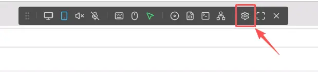
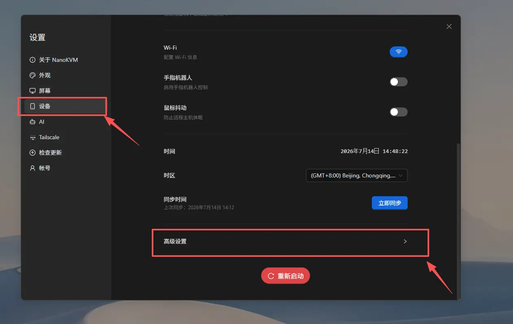
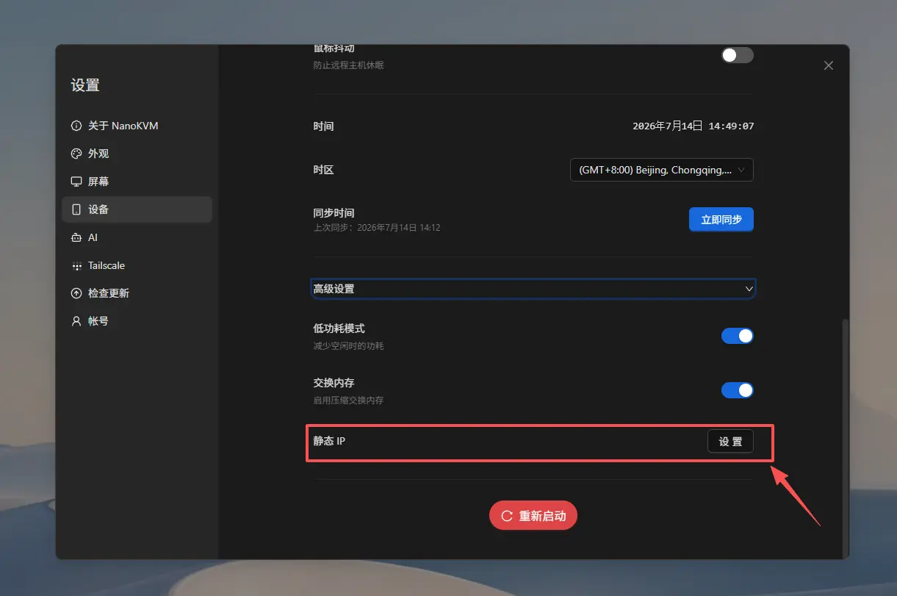
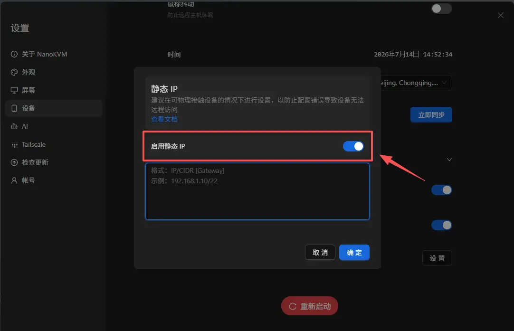
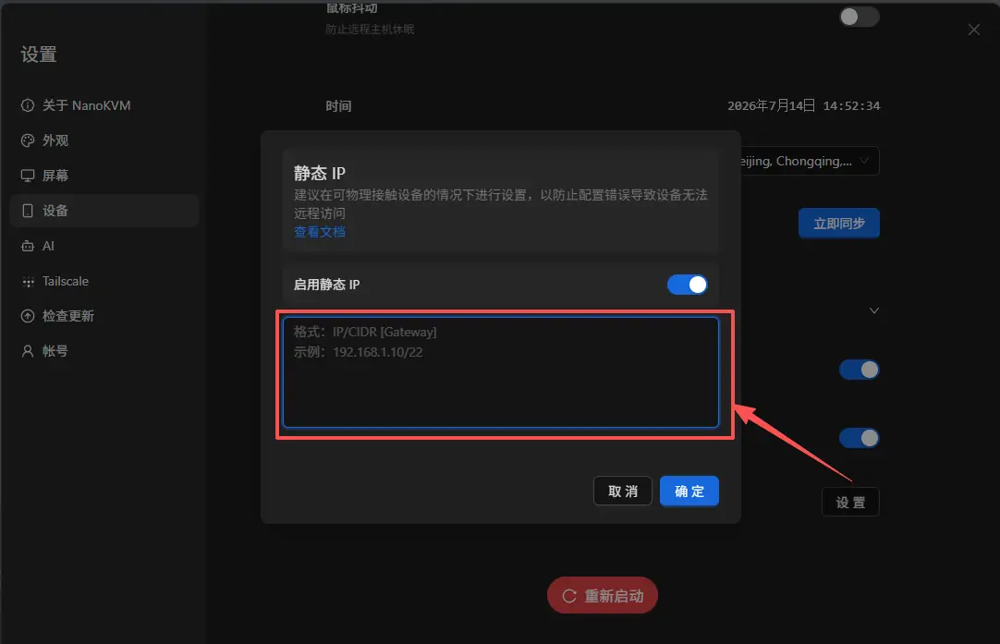

# Configure a Static IP

## Introduction

NanoKVM Go obtains an IP address from the router through DHCP by default. A DHCP address may change after the device restarts, the router restarts, or the DHCP lease is renewed. If that happens, the old access address will no longer work.

After enabling static IP in the NanoKVM Go web interface, you can assign a fixed LAN address to the device and keep accessing it through the same address.

> A static IP only fixes the address of NanoKVM Go inside the current LAN. It is not a public IP address and does not provide remote access by itself. To access NanoKVM Go from outside the LAN, refer to remote access solutions such as [Tailscale](./tailscale.md).

## Before You Start

Before configuring a static IP, make sure that:

- NanoKVM Go is connected to the LAN where the static IP will be used;
- you can open the NanoKVM Go web interface through the current IP address;
- you know the current LAN subnet, subnet mask, and default gateway;
- the IP address you plan to use is in the same subnet as the router;
- the IP address is not already used by the router or another device;
- you have recorded the current NanoKVM Go IP address for troubleshooting.

You can check the LAN parameters, DHCP address pool, and connected devices in the router management page. It is recommended to choose an address outside the DHCP address pool but still inside the current LAN subnet. If possible, reserve or label this address in the router.

For example:

| Item | Example Value |
| --- | --- |
| Router address | `192.168.1.1` |
| Subnet mask | `255.255.255.0` |
| CIDR prefix length | `/24` |
| DHCP address pool | `192.168.1.100` to `192.168.1.200` |
| NanoKVM Go static IP | `192.168.1.50` |
| Full configuration | `192.168.1.50/24 192.168.1.1` |

In this example, `192.168.1.50` is in the same subnet as the router and is outside the DHCP address pool. The subnet mask `255.255.255.0` corresponds to the CIDR prefix length `/24`, so you should not copy the `/22` example shown in the interface. When configuring your device, use the IP address, CIDR prefix length, and gateway that match your own network.

## Understand IP, CIDR, and Gateway

The NanoKVM Go static IP input field uses the following format:

```text
IP/CIDR [Gateway]
```

The fields mean:

- `IP`: the static IP address assigned to NanoKVM Go;
- `CIDR`: the prefix length that corresponds to the subnet mask of the current network, such as `/24`;
- `Gateway`: the default gateway, usually the LAN address of the router. This field is optional.

The square brackets in `[Gateway]` mean that the gateway is optional. Do not type `[` or `]` in the actual input field. Use one space between `IP/CIDR` and the gateway.

Without a gateway:

```text
192.168.1.10/22
```

With a gateway:

```text
192.168.1.10/22 192.168.1.1
```

If NanoKVM Go needs to access the internet or other subnets, enter the correct default gateway. The gateway usually needs to be in the same subnet as the static IP address.

> `/22` is only an example format shown in the interface. It does not apply to all networks. Check your current subnet mask first, then convert it to the correct CIDR prefix length.

### Check the Current Subnet Mask and Gateway

The preferred method is to log in to the router management page and check the subnet mask and gateway in the LAN or DHCP settings. You can also check them from a computer that is already connected to the same router:

- Windows: open Command Prompt, run `ipconfig`, and check the `Subnet Mask` and `Default Gateway` of the current adapter;
- macOS: open `System Settings` > `Network`, select the current network, open `Details` > `TCP/IP`, and check the subnet mask and router address;
- Linux: run `ip -4 addr` to check the CIDR after the current adapter address, such as `192.168.1.20/24`; run `ip route` to check the default gateway after `default via`.

Check the physical network adapter connected to the same LAN as NanoKVM Go. Do not use parameters from virtual adapters created by Tailscale, VPN software, virtual machines, or containers.

### Convert a Subnet Mask to CIDR

The number after the slash in CIDR is the number of continuous binary `1` bits in the subnet mask from left to right. An IPv4 subnet mask has four octets. Each octet can be converted using the table below:

| Subnet Mask Octet | Binary | Number of `1` Bits |
| --- | --- | --- |
| `255` | `11111111` | 8 |
| `254` | `11111110` | 7 |
| `252` | `11111100` | 6 |
| `248` | `11111000` | 5 |
| `240` | `11110000` | 4 |
| `224` | `11100000` | 3 |
| `192` | `11000000` | 2 |
| `128` | `10000000` | 1 |
| `0` | `00000000` | 0 |

Add the number of binary `1` bits in all four octets to get the CIDR prefix length.

For example, if the subnet mask is `255.255.252.0`:

```text
255        255        252        0
  8    +     8    +     6    +   0    = 22
```

So:

```text
255.255.252.0 = /22
```

If the static IP is `192.168.1.10`, enter the following when no gateway is needed:

```text
192.168.1.10/22
```

If the gateway is `192.168.1.1`, enter:

```text
192.168.1.10/22 192.168.1.1
```

As another example, the subnet mask `255.255.255.0` contains 24 continuous binary `1` bits, so it corresponds to `/24`. In that case, enter something like `192.168.1.50/24`, not `/22`.

Common subnet mask and CIDR mappings:

| Subnet Mask | CIDR |
| --- | --- |
| `255.0.0.0` | `/8` |
| `255.255.0.0` | `/16` |
| `255.255.240.0` | `/20` |
| `255.255.248.0` | `/21` |
| `255.255.252.0` | `/22` |
| `255.255.254.0` | `/23` |
| `255.255.255.0` | `/24` |
| `255.255.255.128` | `/25` |
| `255.255.255.192` | `/26` |
| `255.255.255.224` | `/27` |
| `255.255.255.240` | `/28` |

> Do not guess the CIDR prefix length. An incorrect CIDR value may cause NanoKVM Go to judge the local network range incorrectly, which can make some devices unreachable or make the gateway inaccessible.

## Configure a Static IP in the Web Interface

### Open Advanced Settings

1. Log in to the NanoKVM Go web interface through the current IP address;
2. Click `Settings` in the top toolbar;



3. Select `Device` on the settings page, then open `Advanced Settings`.



### Enable and Fill In the Static IP

1. Find `Static IP` in `Advanced Settings`;



2. Enable `Static IP`;



3. Fill in the static IP configuration in the `IP/CIDR [Gateway]` format;



4. Check the IP address, CIDR, and gateway, then click `Confirm`.

> After saving the configuration, NanoKVM Go may briefly disconnect from the network, and the current web page may also disconnect. This is normal when the IP address changes.

### Access NanoKVM Go Through the New Address

After the setting takes effect, enter only the new static IP address in the browser address bar, for example:

```text
http://192.168.1.50
```

Do not include the CIDR or gateway in the browser address. Do not enter `http://192.168.1.50/24`.

Open the login page, sign in, and then test video, keyboard, mouse, and power control functions.

## Verify the Configuration

After configuring the static IP, check the following:

1. Open the NanoKVM Go web interface through the new static IP address;
2. Confirm that video, keyboard, mouse, and power control work normally;
3. Restart NanoKVM Go and access it again through the same address;
4. If possible, restart the router and confirm that the address still works;
5. Check the router management page to confirm that no other device is using the same IP address.

If NanoKVM Go is still accessible through the same address after a restart, the static IP configuration is working.

## Static IP Notes

### The IP Address Must Be in the Correct Subnet

The static IP address usually needs to be in the same LAN subnet as the router and client device. For example, if the router address is `192.168.1.1` and the subnet mask is `255.255.255.0`, the CIDR should be `/24`, and NanoKVM Go should usually use an available address in the `192.168.1.x` range.

If you enter an address from another subnet, such as `192.168.2.50`, computers in the current network may not be able to access NanoKVM Go directly.

### Avoid IP Address Conflicts

Do not use an address that has already been assigned to a computer, phone, camera, or other network device. An IP address conflict may cause NanoKVM Go and another device to go offline intermittently or become inaccessible.

Recommended checks:

- check whether the address is already used in the router device list;
- choose an address outside the DHCP address pool when possible;
- reserve the address for NanoKVM Go in the router if the router supports address reservation;
- record what the address is used for so that it is not assigned to another device later.

> The `ping` command alone cannot fully confirm that an IP address is unused, because a powered-off or sleeping device will not respond.

### Do Not Use Special Addresses

Do not set the following addresses as the NanoKVM Go static IP:

- the router's own address, such as `192.168.1.1`;
- the network address or broadcast address of the current subnet; the exact addresses depend on the CIDR, such as `192.168.1.0` and `192.168.1.255` in a `192.168.1.0/24` network;
- local loopback addresses such as `127.x.x.x`;
- link-local addresses such as `169.254.x.x`;
- virtual addresses in the `100.x.x.x` range used by Tailscale.

### Use the New Address After the Change

After the static IP takes effect, the original DHCP address usually no longer works in the browser. Close the old page and reopen the NanoKVM Go web interface through the new address.

Record the new address before changing the setting. If the address is configured incorrectly, you may need to temporarily set your computer to the same subnet before you can access NanoKVM Go again and correct the network settings.

### Reconfigure It When Moving to Another LAN

A static IP is configured according to the current LAN. If NanoKVM Go is moved to another subnet, the old static IP may no longer work.

Before replacing the router or moving NanoKVM Go to a new network, it is recommended to disable static IP and let NanoKVM Go obtain an address through DHCP again. You can also update the static IP in advance according to the new network.

### Static IP Does Not Bypass Network Access Restrictions

Configuring a static IP does not open router ports, bypass firewalls, bypass guest network isolation, or bypass VLAN rules. If the client device and NanoKVM Go are not in networks that can reach each other, NanoKVM Go may still be inaccessible even when the IP address is correct.

## Disable Static IP

To make NanoKVM Go obtain an IP address automatically again:

1. Log in to the NanoKVM Go web interface through the current static IP;
2. Go to `Settings` > `Device` > `Advanced Settings` > `Static IP`;
3. Turn off `Enable Static IP`;
4. Save or apply the setting according to the page prompt;
5. Wait for NanoKVM Go to obtain a DHCP address from the router again;
6. Find the new IP address in the router management page or on the device display, then access NanoKVM Go through the new address.

## FAQ

### NanoKVM Go Cannot Be Opened After Saving

Check the following:

- whether the browser is using the new static IP address;
- whether the static IP was entered in the `IP/CIDR [Gateway]` format;
- whether the CIDR matches the subnet mask of the current network;
- whether the gateway is the LAN address of the current router;
- whether the computer and NanoKVM Go are connected to the same LAN;
- whether the static IP is in the same subnet as the router;
- whether the address conflicts with another device;
- whether guest network isolation, VLAN, or other access restrictions are enabled on the router;
- whether NanoKVM Go has finished reconnecting to the network.

If the static IP was configured for the wrong subnet, temporarily set the wired network on your computer to the same subnet, then try to access NanoKVM Go and update the configuration. Record the original network settings before doing this, and restore automatic addressing after the configuration is corrected.

### Static IP Works, but NanoKVM Go Cannot Access the Internet

Check whether the correct default gateway is included in the static IP configuration, and confirm that the CIDR matches the subnet mask of the current network. For example, if the IP/CIDR is `192.168.1.50/24` and the router address is `192.168.1.1`, you can enter `192.168.1.50/24 192.168.1.1`. Also check whether the router's DNS and internet connection are working.

### Static IP Cannot Be Accessed After Restart

Check whether the static IP was saved successfully, and confirm that the router has not assigned the same address to another device. It is recommended to reserve this address for NanoKVM Go in the router, or set the static IP outside the DHCP address pool.
