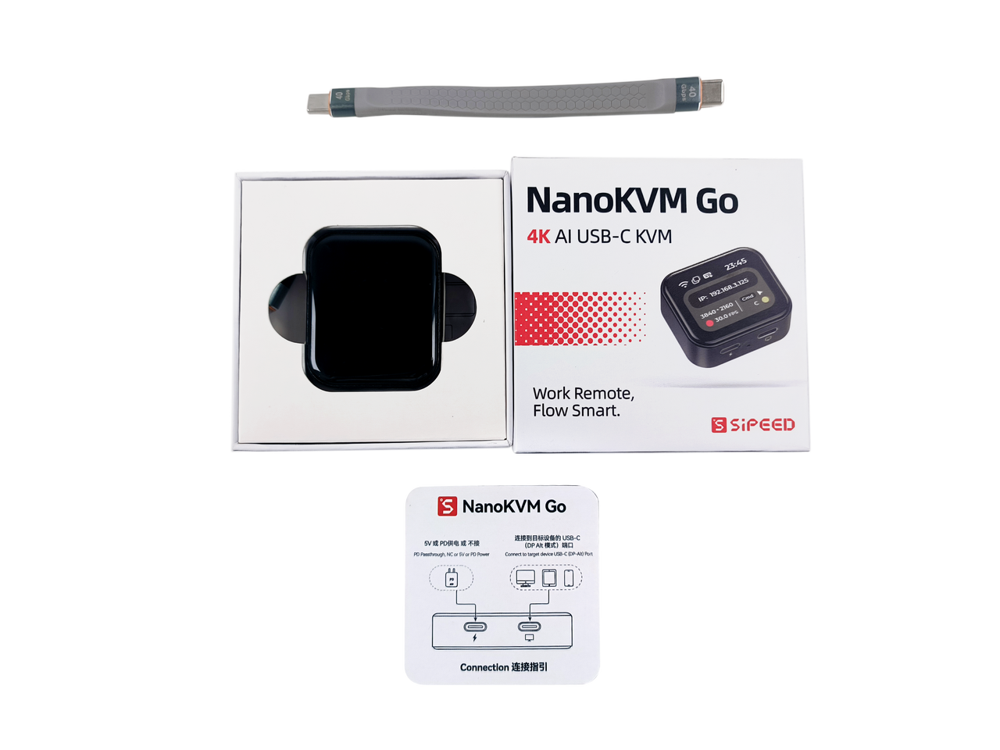
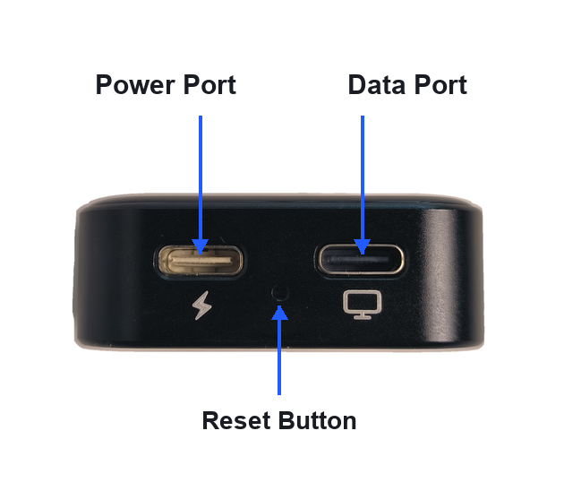
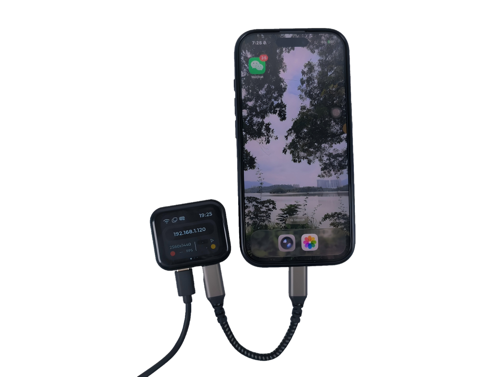
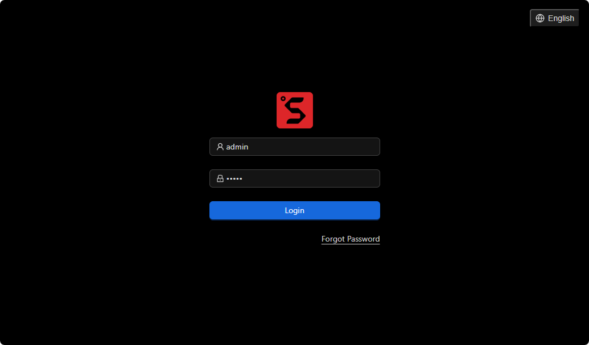
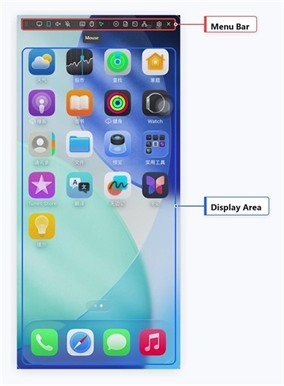

## Unboxing

The NanoKVM Go package includes the NanoKVM Go device, a full-featured USB-C data cable, and a connection guide card. The exact accessories may vary by purchase version.

## Interface Overview

NanoKVM Go has two Type-C ports and one reset hole on the side:

+ The port with the lightning icon is the Power Port for external power input;
+ The port with the screen icon is the Data Port for connecting to the controlled device;
+ The small hole between the two ports is the Reset Button for resetting the device.

## Before You Start

Prepare the following devices and accessories before using NanoKVM Go:

+ A controlled device with a Type-C data port, and the port must support DP Alt Mode video output;
+ A full-featured Type-C data cable for connecting NanoKVM Go to the controlled device;
+ A control device with a browser, such as a computer, tablet, or phone;
+ If the controlled device cannot provide stable power to NanoKVM Go, prepare an additional USB-C power adapter.

> Type-C ports that only support charging or regular data transfer cannot output video and may not work with NanoKVM Go's remote display feature.

## Connect Devices

Connection steps:

1. Use a full-featured Type-C data cable to connect the NanoKVM Go Data Port to a Type-C port on the controlled device that supports DP Alt Mode.
2. If the controlled device cannot power NanoKVM Go, use the power port to power NanoKVM Go separately.
3. Wait for NanoKVM Go to boot. The screen will show the current status and IP address.

## Network Configuration

NanoKVM Go needs to be connected to the network before first use.

1. Open the device Wi-Fi page and make sure the Wi-Fi switch is enabled.
2. Open the configuration method page and choose either `PASSWD` or `QRCODE`.
3. Follow the prompts to enter the Wi-Fi SSID and password, then submit the configuration.
4. After configuration is complete, return to the main screen. If the device IP address is displayed on the main screen, the connection is successful.

For detailed configuration steps, refer to the [Network Configuration section in the User Guide](./user_guide.html#Network-Configuration).

## Basic Remote Control

After network configuration is complete, enter the obtained IP address directly in the browser address bar to open the NanoKVM Go login page. The default username is `admin`, and the default password is `admin`.

After logging in, you can view the controlled device screen and perform keyboard and mouse operations. The web control page usually consists of a floating toolbar and a display area: the top floating toolbar is used to access Image Settings, Portrait Mode, Volume Settings, Microphone, On-Screen Keyboard, Mouse Style, Interface Preview, Image Mounting, Custom Scripts, KVM Web Terminal, Settings, Full Screen, and other features. The center display area is used to view and operate the controlled device screen.

+ The display area is used to view the controlled device screen;
+ The floating toolbar is used to access Image Settings, Portrait Mode, Volume Settings, Microphone, On-Screen Keyboard, Mouse Style, Interface Preview, Image Mounting, Custom Scripts, KVM Web Terminal, Settings, Full Screen, and other features;
+ If no image is displayed, confirm that the controlled device's Type-C port supports DP Alt Mode and that the cable is a full-featured Type-C data cable.

## Security Recommendations

+ Change the default password after the first login. For details, see [User Guide - Change Password](./user_guide.html#Change-Password);
+ Do not expose NanoKVM Go directly to untrusted networks;
+ For remote access, use secure networking tools such as Tailscale;
+ Use certified power adapters and cables to avoid device damage caused by abnormal power input.
