## Unboxing

The NanoKVM Go package includes the NanoKVM Go device, a full-featured USB-C data cable, and a connection guide card. The exact accessories may vary by purchase version.

## Ports and Controls

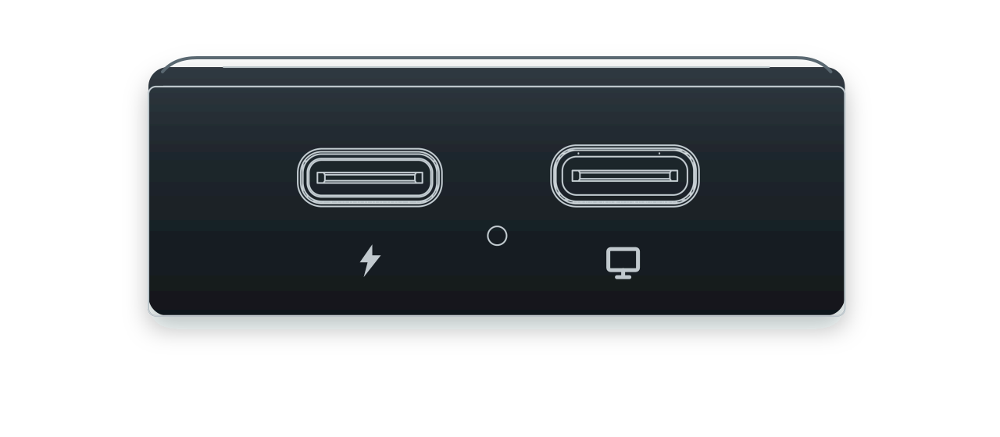

NanoKVM Go has two USB-C ports and a flashing-mode button opening on the side. Use the silkscreen symbols to identify them:

+ **Main USB-C port (display icon, Data Port):** connects to the target and carries DP Alt Mode video and audio, keyboard and mouse emulation, a virtual USB drive, and a virtual network interface.
+ **Auxiliary USB-C port (lightning icon, Power Port):** accepts USB-PD power, provides charging passthrough to the target, and carries the expansion IO used by the Finger Robot.
+ **Flashing-mode button opening:** hold the recessed button with a SIM eject pin while connecting the main USB-C port to enter system flashing mode. This button does not reset or restart the device. See [Flashing](./system/flashing.html) for the full procedure.

## Before You Start

Prepare the following devices and accessories before using NanoKVM Go:

+ A target device with a USB-C port that supports DP Alt Mode video output;
+ A full-featured USB-C cable for connecting NanoKVM Go to the target device;
+ A control device with a browser, such as a computer, tablet, or phone;
+ If the controlled device cannot provide stable power to NanoKVM Go, prepare an additional USB-C power adapter.

> USB-C ports that only support charging or regular data transfer cannot output video and cannot be used with NanoKVM Go's remote display feature.

## Connect Devices

Connection steps:

1. Use a full-featured USB-C cable to connect the main USB-C port (display icon) on NanoKVM Go to a USB-C port on the target that supports DP Alt Mode.
2. If the target cannot power NanoKVM Go reliably, connect a USB-C power adapter to the auxiliary USB-C port (lightning icon).
3. Wait for NanoKVM Go to boot. The screen will show the current status and IP address.

## Network Configuration

Configure the network the first time NanoKVM Go is used or after changing Wi-Fi networks. Before starting, make sure NanoKVM Go is powered on, the Wi-Fi signal covers the area where NanoKVM Go is located, and the target SSID and password are ready.

> NanoKVM Go supports both 2.4 GHz and 5 GHz Wi-Fi. For a more stable remote-control experience, use a 5 GHz Wi-Fi network when available.

Swipe left from the NanoKVM Go main screen to open `Settings`, then tap the Wi-Fi icon. On the `WI-FI` page, tap `Connect Wi-Fi`.

<video src="./../../../assets/NanoKVM/go/quick_start/nanokvm-go-open-wifi.mp4" aria-label="Open the NanoKVM Go Wi-Fi setup page" style="width: 100%; max-width: 360px;" playsinline controls autoplay loop muted preload="metadata"></video>

NanoKVM Go supports two Wi-Fi setup methods: `PASSWD` and `QRCODE`. `PASSWD` is suitable for selecting Wi-Fi and entering the password directly on the NanoKVM Go screen. `QRCODE` is suitable for entering Wi-Fi information from a phone.

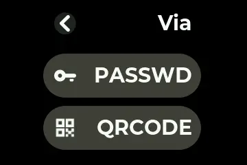

### Configure with PASSWD

1. Select `PASSWD` on the `Via` page. NanoKVM Go scans nearby Wi-Fi networks.
2. Swipe through the Wi-Fi list, select the SSID to connect to, then tap `>` in the upper-right corner to open the password page. To enter an SSID manually, select `Manual SSID`.

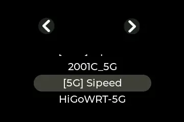

3. Enter the Wi-Fi password with the on-screen keyboard, then tap `OK`.

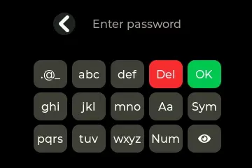

> The on-screen keyboard uses multi-tap input similar to a 9-key keypad. When several letters share one key, tap once for the first letter, tap twice in succession for the second letter, and so on.

### Configure with QRCODE

1. Select `QRCODE` on the `Via` page. NanoKVM Go shows a `Connect to AP` QR code.

2. Scan the `Connect to AP` QR code with a phone and follow the phone prompt to connect to the temporary NanoKVM Go hotspot. After the phone connects, the QR code on NanoKVM Go changes to `Configure WiFi`.

3. Scan the `Configure WiFi` QR code with the phone again. The browser opens the Wi-Fi configuration page.

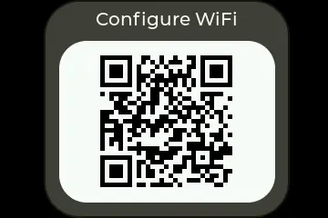

4. Enter the Wi-Fi SSID and password on the page, then tap `Ok`. Keep NanoKVM Go powered on while it connects.

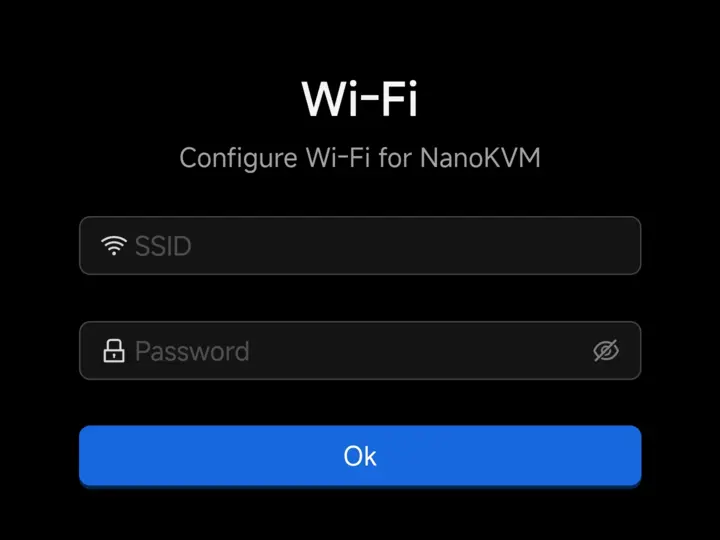

### Confirm the Connection

After setup is complete, the `WI-FI` page shows the current SSID and IP address. Connect the control device to the same network and enter this IP address in a browser to open the web control page.

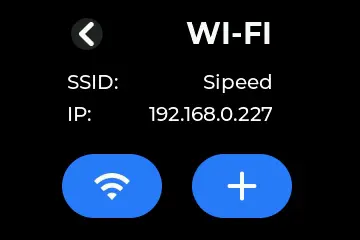

## Basic Remote Control

After network configuration is complete, choose the access method based on the network where the control device and NanoKVM Go are located.

### Access on the Same LAN

If the control device and NanoKVM Go are connected to the same reachable LAN, enter the IP address shown on the `WI-FI` page in the browser address bar to open the NanoKVM Go login page. The default username is `admin`, and the default password is `admin`.

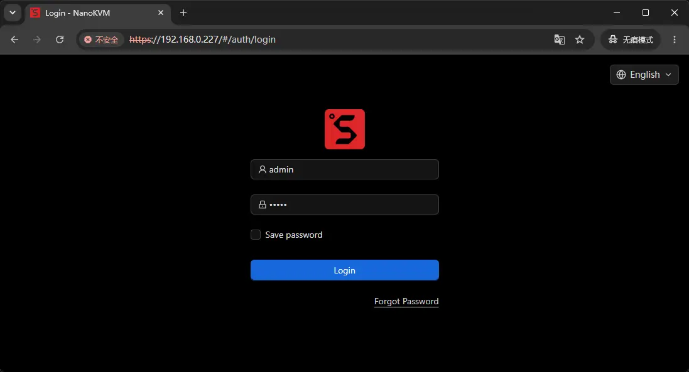

After logging in, you can view and control the target device screen.

### Access from Outside the LAN

If the control device and NanoKVM Go are not on the same LAN, configure Tailscale first. After NanoKVM Go and the control device join the same Tailscale network, enter the Tailscale IP address of NanoKVM Go in the browser on the control device to access NanoKVM Go remotely.

For the complete setup procedure, see [Tailscale Remote Access](./network/tailscale.html).

### Notes for Phone Connections

When using a phone as the target device, pay attention to system connection prompts and adjust the relevant settings for the phone system.

#### Android Phones

On some Android phones, the first connection may trigger a wired projection, external display, or USB device connection confirmation. Allow the connection as prompted. If no prompt appears and video and control work normally, no additional settings are required. USB debugging is not required for NanoKVM Go.

#### iPhone

When connecting an iPhone, enable AssistiveTouch first. Go to `Settings` > `Accessibility` > `Touch` > `AssistiveTouch`, then turn on the `AssistiveTouch` switch.

1. Open Accessibility.

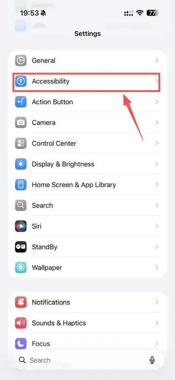

2. Open Touch.

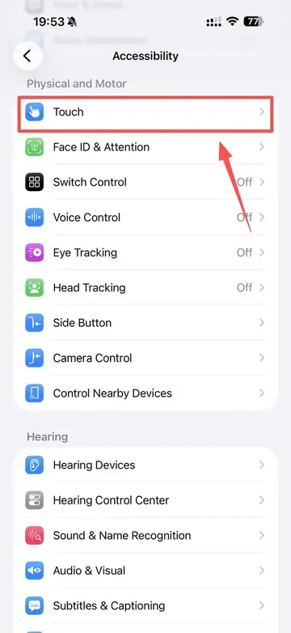

3. Open AssistiveTouch.

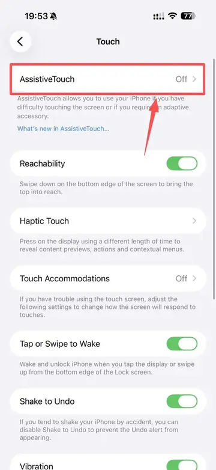

4. Turn on AssistiveTouch.

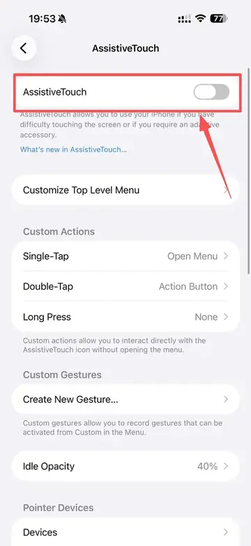

For iPhone, click `Repair iPhone drag` on the web control page each time after the connection succeeds. If this option is not clicked, the mouse may stay in a pressed state.

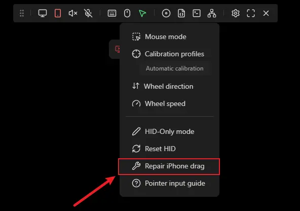

#### Mouse Mode

Click the mouse icon in the top floating toolbar of the web control page, open the `Mouse mode` menu, and select the input mode that matches the target device.

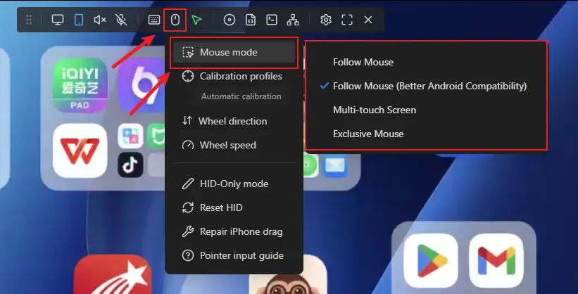

+ `Follow Mouse`: suitable for computers and other regular desktop systems. The target pointer follows the pointer in the web page. Do not use this mode when the target device is an Android phone, as control will not work correctly.
+ `Follow Mouse (Better Android Compatibility)`: use this mode when the target device is an Android phone. It is adapted for Android pointer and touch input and provides better compatibility.
+ `Multi-touch Screen`: suitable when using a phone as the control device to operate another phone. It provides touch-style control and smoother interaction.
+ `Exclusive Mouse`: suitable for games, remote desktops, BIOS/UEFI, and other scenarios that need relative pointer movement or pointer lock.

## Security Recommendations

+ Change the default password after the first login. For details, see [User Guide - Change Password](./user_guide.html#Change-Password);
+ Do not expose NanoKVM Go directly to untrusted networks;
+ For remote access, use secure networking tools such as Tailscale;
+ Use certified power adapters and cables to avoid device damage caused by abnormal power input.
