# Realtime Voice Chat Quick Start

## Voice Bridge Overview

Voice Bridge is a realtime voice bridge App that runs on NanoKVM Go. It forwards two-way audio between the controlled host's audio devices and a cloud realtime voice model, so a caller can talk to an AI assistant directly through a phone call.

In this example, Voice Bridge uses Qwen Audio Realtime. The caller's voice is sent from the controlled host to Qwen through NanoKVM Go, and the model's generated voice is sent back to the controlled host through the NanoKVM Go UAC2 virtual microphone. The App also shows transcripts for both sides on the device screen.

```text
Caller phone -> controlled host call audio -> NanoKVM Go -> Qwen Audio Realtime
Caller phone <- controlled host call audio <- NanoKVM Go <- Qwen Audio Realtime
```

## What You Can Build

Voice Bridge can be used to quickly build and verify:

- AI phone customer-service demos;
- realtime voice assistants and voice bots;
- call-test setups with live transcripts;
- prompt, voice, and realtime model validation workflows.

This guide only covers installing and running the official device-side App. You do not need to understand MCP, WebRTC, Opus, or audio resampling to try it. If you plan to replace the model, add a knowledge base or Agent, or customize the audio pipeline, first complete this quick start and confirm that the base workflow works.

## Final Result

After installation, open `Voice Bridge` from the NanoKVM Go `Apps` page, then start a phone call. The device screen shows the running status and transcripts:

<div style="display: grid; grid-template-columns: 1fr 1fr; gap: 12px; align-items: start;">
  
  <video src="./../../../assets/NanoKVM/go/realtime_voice_bridge/app-voice-bridge.mp4" aria-label="NanoKVM Go Voice Bridge App demo" style="width: 100%;" playsinline controls autoplay loop muted preload="metadata"></video>
</div>

## Before You Start

Before installing the App, make sure that:

- NanoKVM Go is connected to the controlled host, and you can access its web interface;
- the NanoKVM Go system and application are updated to the latest versions;
- NanoKVM Go can access the internet to download App dependencies and connect to Qwen;
- the phone is connected according to the device requirements and can make calls normally;
- the controlled host can detect the NanoKVM Go UAC2 virtual microphone and speaker devices;
- you have an Alibaba Cloud account, or you are ready to register one and enable Alibaba Cloud Model Studio.

> If the web settings do not include `Apps` or `MCP Service`, check for and install the latest NanoKVM Go system and application updates.

## Get Connection Information

Before installing the App, prepare the NanoKVM Go MCP API key, plus the Qwen Workspace ID and API key.

### Enable MCP Service

Open the NanoKVM Go web interface, go to `Settings > AI > MCP Service`, enable MCP Service, and copy the `API Key` shown on the page. Voice Bridge uses this key to create two-way NanoKVM Go audio sessions.

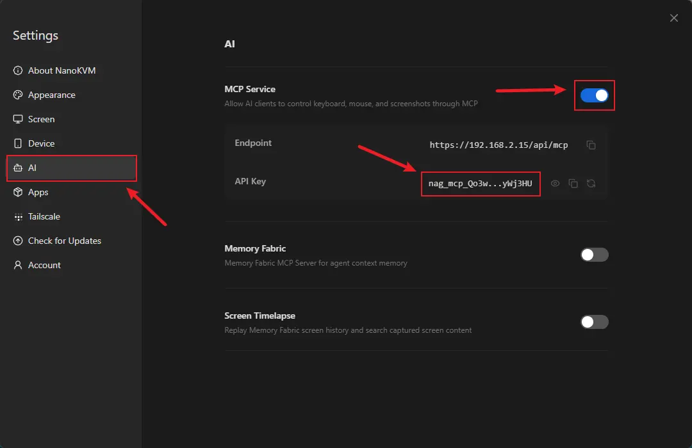

> Do not share the MCP API key with others, and do not write real keys into source code or public repositories.

### Enable Virtual Audio

Open the NanoKVM Go web interface, go to `Settings > Device > Virtual Audio`, and enable Virtual Audio. Then check the controlled host's system audio settings and confirm that the NanoKVM Go UAC2 virtual microphone and speaker devices are detected.

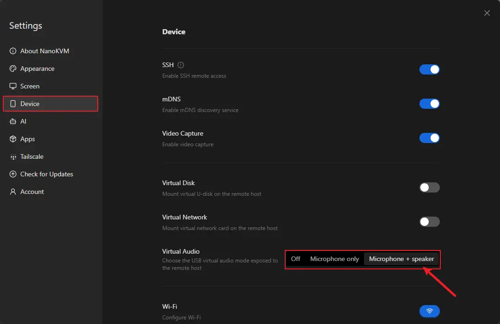

### Get Qwen Connection Information

1. Open the [Alibaba Cloud Model Studio console](https://modelstudio.console.alibabacloud.com/), register or sign in to an Alibaba Cloud account, and enable Model Studio as prompted.
2. Select a region that supports realtime voice models, such as `China (Beijing)` or `Singapore`.

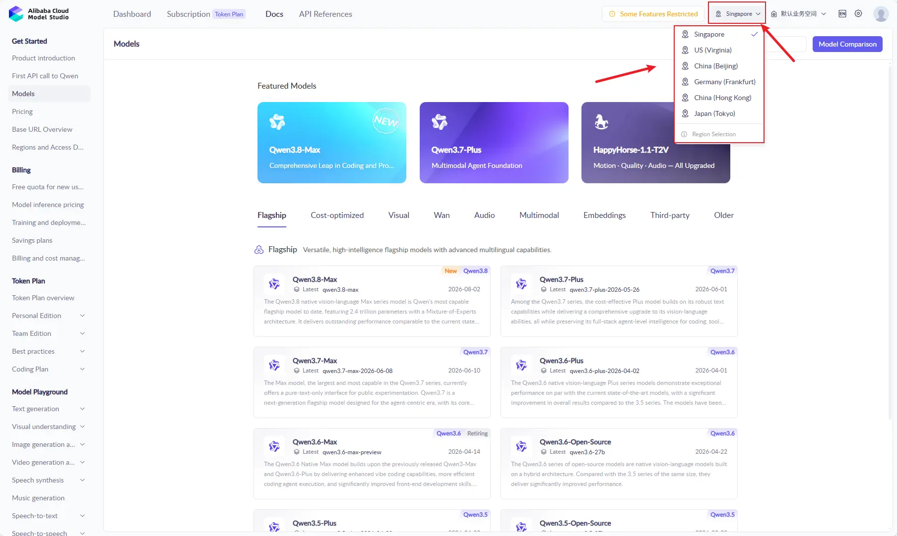

3. Open the `API Key` page.

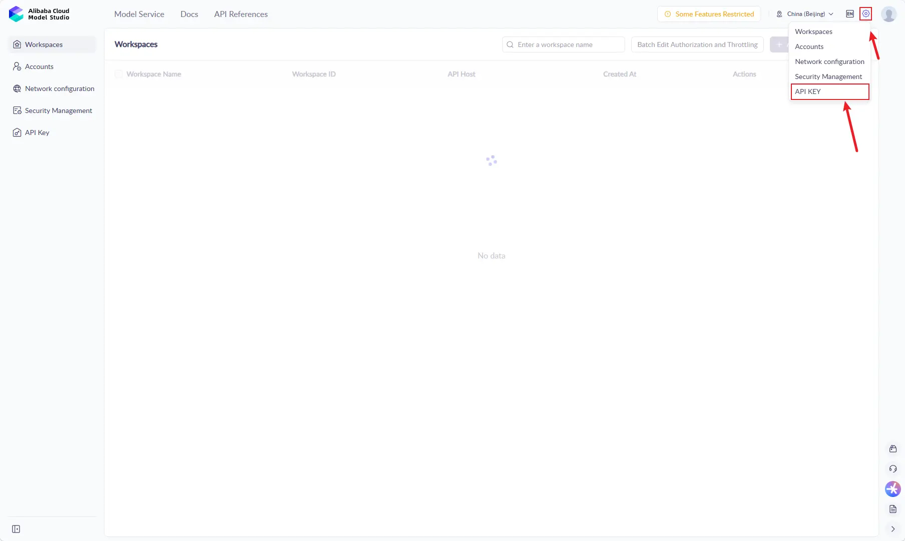

4. Create an API key for `Voice Bridge`. Copy and save the full key immediately after it is created.

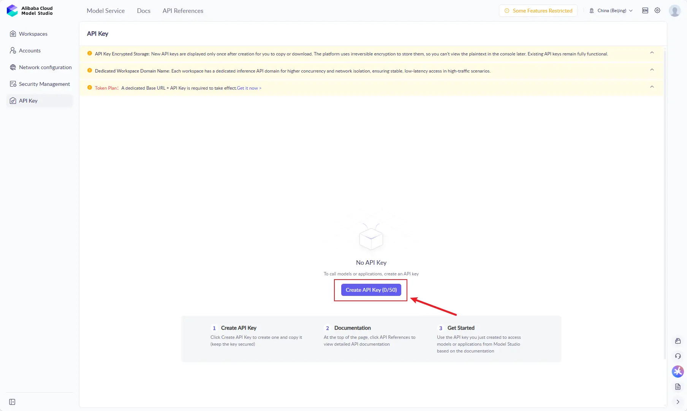

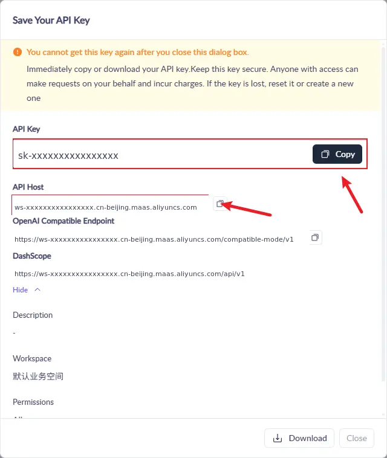

5. After the key is created, the page shows an `API Host` value. It may be shown as a hostname or as part of a full endpoint URL. `QWEN_WORKSPACE_ID` is the leading `ws-...` part of that host.

For example:

```text
API Host:
https://ws-xxxxxxxxxxxxxxxx.ap-southeast-1.maas.aliyuncs.com/compatible-mode/v1
```

In this case, enter the following value for `Qwen Workspace ID`:

```text
ws-xxxxxxxxxxxxxxxx
```

6. Confirm the realtime voice model name and region available to your account in the Model Studio console or the [Qwen-Omni-Realtime documentation](https://www.alibabacloud.com/help/en/model-studio/realtime).

When configuring Voice Bridge later, the required Qwen fields are:

- `Qwen Workspace ID` (`QWEN_WORKSPACE_ID`);
- `Qwen API key` (`QWEN_API_KEY`).

`Qwen region` and `Qwen realtime model` can use the App form defaults first. Change them only if your account region or model access differs.

Available models, regions, quotas, and free usage may vary by account. Use the Model Studio console as the source of truth.

## Install and Configure Voice Bridge

Voice Bridge can be installed directly from the built-in Sipeed official App Server on NanoKVM Go. SSH, SCP, `apt install`, and manual `pip install` are not required.

1. Log in to the NanoKVM Go web interface and open `Settings > Apps > Store`.
2. Select the built-in Sipeed official repository.

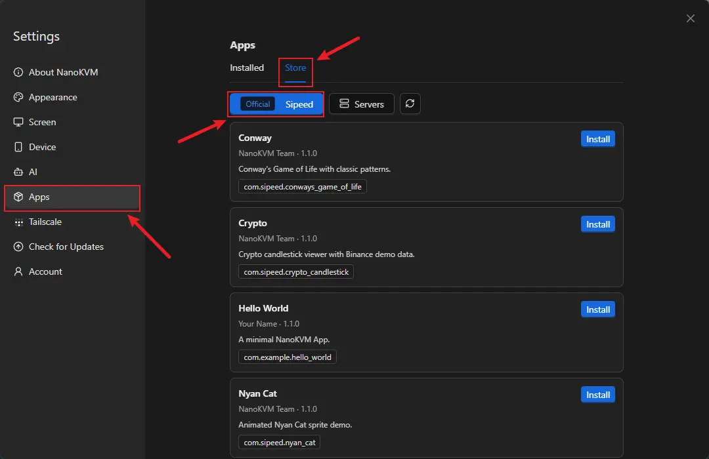

3. Find `Voice Bridge`, then click `Install`.

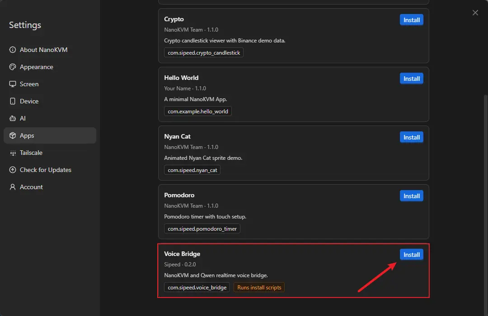

4. Wait for the installation configuration window to open.
5. Fill in the automatically generated environment form. The web form shows user-facing field names, while the App saves them as environment variables internally. For a first test, you usually only need to fill in `NanoKVM MCP API key`, `Qwen Workspace ID`, and `Qwen API key`; keep the other fields at their defaults.

| Web form field | Environment variable | Description |
| --- | --- | --- |
| `Turn detection` | `INTERACT_TYPE` | Has a default value. Sets the turn detection mode. Available values include `server_vad` and `smart_turn`. |
| `NanoKVM MCP API key` | `NANOKVM_MCP_KEY` | Get it from the NanoKVM Go `MCP Service` page. |
| `Qwen API key` | `QWEN_API_KEY` | Create it in the Model Studio console. |
| `Assistant instructions` | `QWEN_INSTRUCTIONS` | Has a default value. Sets the assistant identity, response style, and task requirements. |
| `Base64 instructions` | `QWEN_INSTRUCTIONS_B64` | Optional. Base64-encoded UTF-8 instructions. If set, this overrides regular instructions. Leave it empty for the first test. |
| `Qwen realtime model` | `QWEN_MODEL` | Has a default value. Change it only if your account requires a different available realtime voice model. |
| `Qwen region` | `QWEN_REGION` | Has a default value. Change it only if your Qwen service and Workspace use a different region. |
| `Session rotation interval` | `QWEN_SESSION_ROTATE_SECONDS` | Has a default value. Sets the interval for rotating the Qwen session. |
| `Qwen voice` | `QWEN_VOICE` | Has a default value. Sets the voice used by model responses. |
| `Qwen Workspace ID` | `QWEN_WORKSPACE_ID` | Get it from the `ws-...` prefix of the Model Studio `API Host`. |

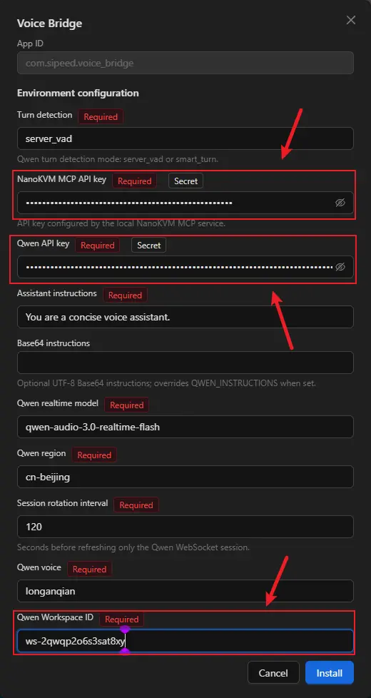

> Field names and default values may change with App updates. Use the current environment form and Qwen official documentation as the source of truth.

6. After filling in the form, click `Install` and keep the `Installation log` window open until the page shows that installation succeeded.

Voice Bridge automatically installs build dependencies and installs pinned Python dependencies into the App's own `python/` directory. The first installation downloads and builds ARM dependencies, so it usually takes several minutes. The log window shows package download, build, and installation progress.

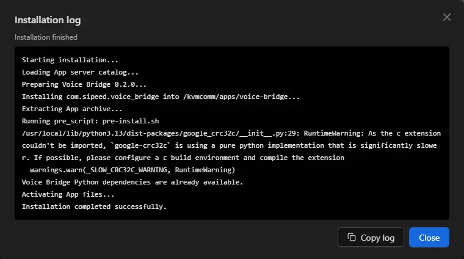

If installation fails, click `Copy log`, save the full log, and check the end of the log for network, package source, storage, or Python package build errors.

After installation, you can update the Voice Bridge environment configuration from `Settings > Apps > Installed`. New values take effect the next time the App starts.

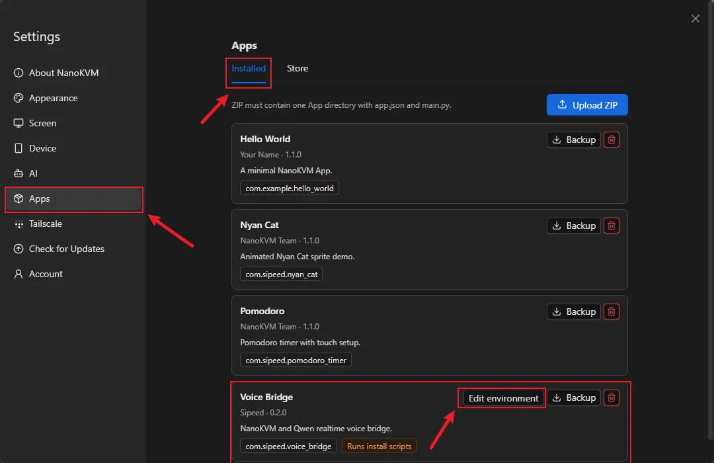

## Run and Test

### Start the App

1. Open the `Apps` page on the NanoKVM Go touchscreen.
2. Select `Voice Bridge` and launch it.
3. Wait until the App reports that the model and audio connections are ready.

<video src="./../../../assets/NanoKVM/go/realtime_voice_bridge/app-voice-bridge.mp4" aria-label="NanoKVM Go Voice Bridge App startup and running demo" style="width: 60%; max-width: 480px; display: block; margin: 0 auto;" playsinline controls autoplay loop muted preload="metadata"></video>

### Start a Voice Conversation

1. Make a phone call and answer it on the controlled host.
2. Speak into the phone.
3. Confirm that the NanoKVM Go screen shows the user transcript.
4. Wait for Qwen to respond, and confirm that the model transcript appears.
5. Confirm that the model voice response is sent back to the phone through the controlled host.

This workflow has been verified with Android phones and iPhones.

## FAQ

### The Controlled Host Cannot Hear the Model Response

In the controlled host's system audio settings or call software, select the NanoKVM Go UAC2 virtual microphone as the input device, and check that the input is not muted.

### The App Does Not Receive Phone Audio

Confirm that the phone call is using USB audio, and select the NanoKVM Go UAC2 virtual speaker in the controlled host's system audio settings or call software. This workflow cannot use DP audio to transfer phone call media.

### The App Cannot Connect to Qwen

Check that `Qwen API key`, `Qwen Workspace ID`, `Qwen region`, and `Qwen realtime model` match, and confirm that NanoKVM Go can access the internet. Model permissions, quota, or rate limits on the account may also cause connection failures.

### Configuration Changes Do Not Take Effect

Exit Voice Bridge, save the new configuration from `Settings > Apps > Installed`, and restart the App. New environment values take effect the next time the App starts.

### How to Exit the App

After Voice Bridge exits, it closes the model, WebRTC, and media sessions, and it does not keep playing audio in the background. For the common App exit gesture and management method, see [Custom Apps: Exit an App](./custom_app.html#exit-app).

## Learn More and Customize

The official device-side example source code is in the [`voice-bridge/` directory of the NanoKVM-Go-Apps `main` branch](https://github.com/sipeed/NanoKVM-Go-Apps/tree/main/voice-bridge). The shared App SDK and development documentation are in the [`base` branch](https://github.com/sipeed/NanoKVM-Go-Apps/tree/base).

If you need to replace Qwen, connect another realtime voice model, or add a knowledge base, Agent, business tools, or custom audio processing, refer to the App source code and SDK documentation.

References: [NanoKVM-Go-Apps](https://github.com/sipeed/NanoKVM-Go-Apps) · [Alibaba Cloud Model Studio console](https://modelstudio.console.alibabacloud.com/) · [Get an API key](https://www.alibabacloud.com/help/en/model-studio/apikey) · [Get a Workspace ID](https://help.aliyun.com/en/model-studio/obtain-the-app-id-and-workspace-id) · [Qwen-Omni-Realtime documentation](https://www.alibabacloud.com/help/en/model-studio/realtime)
