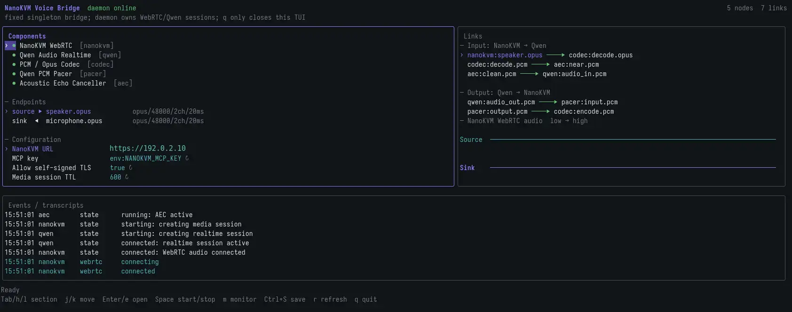

# Realtime Voice Chat Technical Guide

## Voice Bridge Technical Overview

Voice Bridge is a bridge program that connects the NanoKVM Go audio media interface to a realtime voice model. It receives audio entering NanoKVM Go from the controlled host or phone call, converts channels, resamples it, and sends it to the model. The streaming audio returned by the model is buffered and then written to the controlled host through the NanoKVM Go UAC2 virtual microphone via the NanoKVM Go WebRTC audio track.

This guide is the advanced companion to [Realtime Voice Chat Quick Start](./realtime_voice_bridge.html). It is intended for users who need to understand the underlying design or customize the implementation. Run the official App by following the quick start first, then read this guide. That confirms the hardware, account, and base audio path before you narrow issues down to your own changes.

The official device-side App is a foreground Python App. It creates a short-lived media session through the device-local `https://127.0.0.1/api/mcp`, establishes WebRTC audio tracks with `aiortc`, uses PyAV for PCM resampling, and connects to Qwen Audio Realtime over WebSocket. When the App exits, it closes the Qwen WebSocket, WebRTC PeerConnection, and MCP media session. It does not continue bridging audio in the background.

This guide first explains the minimal path implemented by the official App, then covers advanced customization such as model replacement, external Bridge services, AEC, and debug probes. The URLs, event names, and media parameters in this guide are used to explain the implementation approach. NanoKVM MCP tools, media-session parameters, and the signaling protocol must follow the interface description returned by the actual device. Model events and audio formats must follow the model's official documentation and the real server responses.

## Suggested Reading Path

If you only want to understand how the official App works, read through "Create a Model Session"; those sections explain configuration, MCP, WebRTC, and Qwen audio formats.  
If you want to replace Qwen or change model behavior, continue with "Realtime Buffering, Pacing, and Interruption" and "Lifecycle and Reliability".  
If you plan to build an external Bridge, add AEC, analyze recordings, or ask AI to help with implementation, also read the acceptance, troubleshooting, and prompt sections near the end.

## What You Can Customize

After you understand the Voice Bridge data flow, you can build on the official example to:

- replace Qwen with another realtime voice model that supports streaming audio input and output;
- change model instructions, voice, language, and turn detection strategy;
- connect knowledge bases, Agents, or business tools for phone customer-service and voice-assistant workflows;
- add AEC, noise suppression, recording, monitoring, and custom audio processing;
- turn the device-side App into a long-running service on a PC or server;
- add recovery for model disconnects, media-session expiration, and network jitter.

## Overall Architecture

Voice Bridge contains a control plane, a media plane, and a model connection:

```text
Bridge
  |
  +-- Control plane: MCP
  |      Bridge -> NanoKVM Go
  |      Create/close media sessions
  |
  +-- Media plane: WebRTC / Opus
  |      Bridge <-> NanoKVM Go <-> controlled host audio devices
  |
  +-- Model connection: WebSocket / PCM
         Bridge <-> realtime voice model
```

| Part | Role | Not Responsible For |
| --- | --- | --- |
| MCP control plane | Authentication, media-session creation and cleanup, short-lived token and signaling address return | Continuous audio transport |
| WebRTC media plane | Low-latency Opus track exchange with NanoKVM Go | Model event handling |
| Audio processing layer | PCM format conversion, buffering, and send pacing; in the official Python App, WebRTC Opus encoding and RTP pacing are handled by `aiortc` | Device authentication |
| Model adapter layer | Model session creation, PCM upload, voice output, and transcript handling | Direct UAC2 device control |

The bidirectional audio flow is:

```text
Upstream: controlled host / phone -> NanoKVM Go speakerReceive -> Bridge -> realtime voice model
Downstream: realtime voice model -> Bridge -> NanoKVM Go micSend -> controlled host virtual microphone
```

## Choose a Runtime Mode

The Bridge can run inside NanoKVM Go or on an external PC or server. These modes are alternatives; normally choose one for a deployment.

| Mode | Best For | Implementation Focus |
| --- | --- | --- |
| Device-side Python App | Quick deployment, standalone device operation, direct App Server management | App SDK version, ARM Python dependencies, storage and memory footprint |
| External Bridge | Long-running service, complex AEC, audio monitoring, centralized operations | Service management, network reachability, external-host audio toolchain, manual Opus/RTP handling |

The official device-side App uses `aiortc`, PyAV, and the model WebSocket. It is the best starting point for verifying the minimal working path. An external Bridge can use Go, `libopus`, `libspeexdsp`, and PipeWire, and is better suited to long-running services, complex AEC, or richer audio probes. The following external Bridge TUI example can show component status, audio connections, events, and transcripts:



The MCP, WebRTC, and audio-conversion principles below apply to both modes, but process lifecycle and dependency management need separate implementations. Do not infer an external Bridge lifecycle from the device-side App reconnection logic. Whether model reconnection can keep using an existing NanoKVM media session also depends on the media-session TTL and device implementation.

## Before Development

Before changing the implementation, prepare:

- the official device-side App already verified by following [Quick Start](./realtime_voice_bridge.html);
- `Settings > Device > Virtual Audio` and `Settings > AI > MCP Service` enabled;
- a NanoKVM Go App SDK version that supports `app.json` and parameterless `@app()`;
- the full NanoKVM Go access URL and MCP API key;
- the target model API key, service address, model name, region, or Workspace information;
- the current official realtime-audio API documentation for the target model;
- a Go or Python development and test environment matching your target runtime mode;
- a tool that can record the NanoKVM Go virtual microphone on the controlled host.

Real secrets should only be provided through environment variables or App environment configuration. Do not write them into source code, logs, screenshots, or commits.

## Get the Example Source Code

The runnable device-side implementation is in the [`voice-bridge/` directory of the NanoKVM-Go-Apps `main` branch](https://github.com/sipeed/NanoKVM-Go-Apps/tree/main/voice-bridge). It contains the App entry point, configuration manifest, and installation scripts. The shared `appbase` SDK and development documentation are in the [`base` branch](https://github.com/sipeed/NanoKVM-Go-Apps/tree/base).

It is usually easiest to copy `voice-bridge/` as your own App first, then replace the model adapter or audio processing code layer by layer. The App environment configuration is declared in the `env` field of `app.json`, and the web UI generates a form when installing or editing the App configuration. Installation lifecycle scripts install apt build dependencies and pinned Python packages into the App-private `python/` directory, so users do not need to run `apt` or `pip` manually over SSH.

Lifecycle scripts should pin dependency versions, run non-interactively, support idempotent execution, and set timeouts and retries for downloads and builds. The web UI shows stdout/stderr in real time and allows copying the installation log. Scripts run as root, so only use trusted App Servers and source code. Scripts must not print API keys or media-session tokens, and they should not leave background child processes after failures.

## Modify, Configure, and Deploy

If you continue using the device-side App mode, develop and deploy with this flow:

1. Copy the official `voice-bridge/` directory, then change the App ID, name, and version.
2. Modify the model adapter, audio processing, or UI code.
3. Declare required addresses, secrets, and model parameters in the `env` field of `app.json`.
4. Update the installation lifecycle scripts, and verify repeated execution in a clean environment.
5. Package the App as a ZIP containing exactly one top-level App directory.
6. Open `Settings > Apps > Installed` in the NanoKVM Go web interface and upload the ZIP.
7. Fill in the generated environment form and wait until the installation log shows success.
8. Start the App from the `Apps` page on the device touchscreen and complete a real call test.

For the App directory layout, ZIP installation, and exit gesture, see [Custom Apps](./custom_app.html). After changing environment values during development, restart the App for the new values to take effect.

If you choose an external Bridge, you do not need to package a NanoKVM Go App. Build the program on the PC or server, provide connection information through environment variables or a protected configuration file, and use that platform's service manager for startup, restart, and log rotation. The external host must be able to reach both NanoKVM Go and the realtime voice model.

## Recommended Development Order

Do not connect the device, model, and all audio processing at once at the beginning. Verify each layer in this order to locate failures faster:

1. Read the NanoKVM MCP self-description and confirm media tools, parameters, return fields, and cleanup method.
2. Receive only `speakerReceive`, and verify audio direction, sample rate, channels, and continuity.
3. Test `micSend` with known-good PCM, and record it on the controlled host.
4. Verify the model session, transcript, streaming output, and interruption without NanoKVM.
5. Connect the NanoKVM-to-model upstream path and confirm the user transcript.
6. Connect the model-to-NanoKVM downstream path and confirm the final recording on the controlled host.
7. Add barge-in, AEC, layered reconnection, logs, and metrics last.

The following sections explain each layer in the order of control plane, media format, model session, and realtime control.

## Create a NanoKVM Media Session

The official device-side App targets the current NanoKVM Go App SDK and directly uses the known `media_session_create` and `media_session_close` tools. If you are building a generic external Bridge, adapting multiple firmware versions, or maintaining this part as a long-running tool, initialize MCP first and call `tools/list`. If the device supports resources, also call `resources/list`. Use the device's actual self-description to confirm the exact media tool names, parameters, return fields, token lifetime, and cleanup method. Optional capabilities should degrade gracefully; the client must not exit just because resources are unavailable.

MCP is only the control plane. After authentication, the Bridge usually calls `media_session_create`, requests `speakerReceive` and `micSend`, and obtains a short-lived token plus a signaling address. The address usually looks like:

```text
/api/media/audio/webrtc?media_session=<token>
```

The official device-side App runs on NanoKVM Go itself, so the signaling URL is `wss://127.0.0.1` plus the `signalingPath` returned by MCP. The App creates the WebRTC `offer`, NanoKVM returns the `answer` and `candidate` messages, and WebRTC audio tracks carry continuous audio. An external Bridge needs to construct the `ws/wss` URL from the NanoKVM access address and confirm the real signaling order. Do not copy the flow from another WebRTC service blindly.

Typical parameters are shown below. The actual fields must follow the tool schema returned by MCP:

```json
{
  "speakerReceive": true,
  "micSend": true,
  "ttlSeconds": 600
}
```

Connection order:

1. Initialize the MCP session.
2. Call `media_session_create`.
3. Connect to the signaling WebSocket with the short-lived token.
4. Create the PeerConnection and exchange SDP and ICE.
5. After the PeerConnection reaches the connected state, start audio conversion and the model session.
6. On exit, close the model WebSocket, PeerConnection, signaling WebSocket, and media session.

The MCP API key and media-session token are different credentials. Neither should appear in logs.

## Process Audio Formats

NanoKVM WebRTC and Qwen Realtime use different formats, so bytes cannot be forwarded directly:

| Endpoint | Format |
| --- | --- |
| NanoKVM WebRTC audio track | WebRTC audio; in the official Python App, `aiortc` handles Opus/RTP |
| PCM entering the App from NanoKVM | AudioFrame provided by `aiortc` / PyAV, then resampled to S16LE, 16 kHz, mono |
| Qwen input PCM | S16LE, 16 kHz, mono |
| Qwen output PCM | S16LE, 24 kHz, mono |

Complete data flow:

```text
NanoKVM speaker WebRTC audio
  -> aiortc / PyAV AudioFrame
  -> downmix + resample -> PCM 16k mono -> Qwen

Qwen PCM 24k mono
  -> bounded buffer -> 20 ms AudioFrame -> aiortc audio track
  -> NanoKVM microphone WebRTC track
```

Common chunk sizes, where each S16LE sample is 2 bytes:

| Data | Duration | Samples Per Channel | Bytes |
| --- | ---: | ---: | ---: |
| Qwen input PCM, 16 kHz mono | 100 ms | 1600 | 3200 |
| Qwen output PCM, 24 kHz mono | 20 ms | 480 | 960 |
| NanoKVM PCM, 48 kHz stereo | 20 ms | 960 | 3840 |

The Qwen WebSocket does not guarantee that deltas arrive every 20 ms. Network chunks must enter a buffer first, then be cut into fixed frames. The official Python App stores Qwen output in a queue. `AudioStreamTrack.recv()` takes 20 ms of 24 kHz mono PCM at a time, inserts silence when the queue is empty, drops old chunks when the queue is full, and then lets `aiortc` handle WebRTC encoding and RTP sending. When replacing Qwen with another model, confirm input and output sample rates, channels, sample format, and chunking rules again. Do not reuse Qwen parameters directly.

## Create a Model Session

Select the model when opening the WebSocket by appending `?model=<model>` to the connection URL. The official App builds the endpoint as follows:

```text
wss://<workspace>.<region>.maas.aliyuncs.com/api-ws/v1/realtime?model=<model>
```

After the connection returns `session.created` and before sending the first audio chunk, use `session.update` to configure the voice, input/output formats, instructions, and interaction mode. Do not send `model` in `session.update`. Common interaction modes are `server_vad` and `smart_turn`.

Typical event flow:

```text
client                         Qwen Realtime
  |-- WebSocket connect ----------->|  ?model=<model>
  |<- session.created --------------|
  |-- session.update ------------->|
  |-- input_audio_buffer.append -->|  16 kHz mono S16LE
  |<- input_audio_buffer.speech_started
  |<- conversation.item.input_audio_transcription.completed
  |<- response.audio.delta --------|  24 kHz mono S16LE
  |<- response.audio_transcript.* -|
  |<- response.done ---------------|
```

PCM in WebSocket JSON is Base64 encoded and decoded. The upstream side can accumulate 100 ms / 3200 bytes before sending. Downstream deltas should enter the playback buffer immediately after arrival; do not wait for `response.done` and then play the whole response. The client should ignore and log unknown events at low frequency, instead of exiting when the server adds an event type.

When replacing the realtime voice model, keep the NanoKVM MCP, WebRTC, and audio media layers, and replace only the model adapter layer. The new adapter needs to reimplement authentication, session initialization, audio deltas, transcripts, completion, errors, and cancellation events, then provide fixed-duration PCM frames in the format expected by the selected WebRTC send path. In the official Python App, provide `AudioFrame` objects to `aiortc`; for the current Qwen output, these remain `24 kHz / mono / 20 ms` frames, and `aiortc` handles resampling and Opus/RTP encoding. A low-level external Bridge instead needs to convert the model output to the negotiated NanoKVM WebRTC format and handle Opus/RTP itself.

## Realtime Buffering, Pacing, and Interruption

`response.audio.delta` arrives in bursts according to network timing, while WebRTC and the UAC microphone need continuous input. Model output should be written into a bounded queue, then sent as fixed-length frames at a realtime 20 ms cadence. In the official Python App, `AudioStreamTrack.recv()` provides 20 ms PCM frames and `aiortc` drives the send pacing. A low-level external implementation usually needs its own Pacer. If the queue is full, drop stale audio. If it is empty, insert silence or wait according to your underrun policy. Do not push bursty deltas directly into WebRTC.

When scheduling falls behind, do not send a burst to "catch up" with the clock. Drop expired frames and resume from the current time. Clear buffers on every start, stop, or model-session rotation to prevent old audio from playing again.

When `input_audio_buffer.speech_started` arrives, perform barge-in: stop the current response, send `response.cancel`, clear pending playback PCM, then handle the new user turn. The official App implements basic flush and cancellation logic. If an external Bridge maintains its own Opus/RTP queues or more complex debug listeners, further use a generation or epoch marker to invalidate stale response frames, and place a serialized barrier between buffer flushing and the sender coroutine so in-flight old frames cannot continue playing.

## Handle Echo

If the model response feeds back from the controlled host speaker into `speakerReceive`, it forms an echo loop. The current official device-side App does not include application-layer AEC. For the quick-start path, avoid playing the controlled host speaker back into the input, or use an external Bridge with AEC. AEC needs two time-aligned signals: `capture` is the input before it is sent to the model, and `reference` is the playback stream after the Pacer actually outputs it. Do not use raw network deltas that have not been paced yet. VAD is not a replacement for AEC.

## Lifecycle and Reliability

Manage the model WebSocket, NanoKVM MCP media session, and WebRTC as separate layers. If the model connection breaks, prefer rebuilding only the model layer. If the media token or TTL expires, renew or rebuild the media layer according to the device MCP interface.

Reconnection should use capped exponential backoff with random jitter. Model session rotation may lose cloud-side context. If continuity is required, save an application summary and inject it into the new session. All close operations should have timeouts. On normal exit, close the model connection, PeerConnection, signaling WebSocket, and media session, and terminate debug listener processes.

In normal mode, aggregate connection status, PCM byte counts, codec frame counts, queue depth, Pacer late frames, and barge-in counts by second. Do not print per-frame logs. Logs must not contain API keys, media-session tokens, or full audio data.

## Acceptance and Troubleshooting

After development, verify the system in the same layered order:

1. Receive only: create MCP and WebRTC, and confirm `speakerReceive` direction, speed, and channels.
2. Send only: verify `micSend` with known-good PCM and record it on the controlled host.
3. Model only: verify session, transcript, streaming output, and interruption separately.
4. Bridge upstream: decode and downsample audio, send it to Qwen, and confirm the user transcript.
5. Bridge downstream: buffer, read 20 ms frames, resample or send through WebRTC, and send audio back to NanoKVM.
6. After adding barge-in, AEC, and reconnection, repeat the full call test.
7. Exit the program and confirm that the model, WebRTC, media session, and child processes are cleaned up.

Acceptance must cover MCP, WebRTC, model input, model output, the final controlled-host recording, and exit cleanup. Do not conclude that the downstream path is correct just because model PCM or local Opus monitoring sounds normal. The actual recording on the controlled host is the final downstream proof.

If local Opus is normal but the controlled host still has crackling or dropped audio, capture and time-align the pre-encode PCM, sent Opus, audio received by NanoKVM Server, pre-UAC-write audio, and final controlled-host recording. Use those captures to locate the layer where format or pacing breaks.

<a id="use-ai-complete-integration"></a>

## Use AI to Complete an Integration

After understanding the interfaces and data flow above, you can ask an AI system with code-editing, terminal, and MCP access to complete the implementation on top of the official example. Recommended flow:

1. Prepare the NanoKVM address, MCP key, model credentials, model official documentation, and target runtime mode.
2. Ask the AI to read MCP tools/resources and the existing source code before giving a layered plan.
3. Verify receive-only, send-only, model-only, upstream, and downstream paths in the "Recommended Development Order".
4. After the base path works, implement interruption, AEC, reconnection, service management, and logs.
5. Complete the controlled-host recording and exit-cleanup checks in "Acceptance and Troubleshooting".

AI-generated code must still follow the device MCP return values and the model's official documentation. Do not copy the typical URLs, event names, or parameters from this guide blindly.

### Prepare Qwen API Documentation

Before development, open the [Qwen Audio Realtime API guide](https://www.alibabacloud.com/help/en/model-studio/qwen-audio-realtime-user-guides) and confirm the currently available model and API version for your account and region. Do not give the model name alone to the AI, and do not let the AI guess the API from memory.

Confirm the following from the official documentation and provide it to the AI:

- model name, region/Workspace, and service endpoint;
- API key and Workspace ID acquisition method and authentication requirements, with real secrets provided only through environment variables;
- WebSocket connection URL, request headers, and session initialization format;
- fields supported by `session.update`, including voice, input/output audio formats, and `server_vad` / `smart_turn`;
- actual JSON schema for `input_audio_buffer.append`, `response.audio.delta`, transcript events, `response.cancel`, `response.done`, and other events;
- current model sample rates, channels, PCM encoding, Base64 rules, rate limits, and idle timeout.

Provide the official documentation URL or saved documentation content, selected model/region, and NanoKVM MCP self-description together. If the documentation differs from examples in this guide, follow the official documentation and real server responses.

The prompt below includes the main issues encountered in this project. It is suitable for an AI system with code-editing, terminal, and MCP access. Its target is more complete than the current official device-side App and includes advanced capabilities such as an external Bridge, AEC, and debug probes. If you only need to replace the model in the official Python App, remove the unnecessary external-Bridge, AEC, and low-level Opus/RTP requirements. Also provide the [`main/voice-bridge`](https://github.com/sipeed/NanoKVM-Go-Apps/tree/main/voice-bridge) source code, the SDK documentation in the [`base` branch](https://github.com/sipeed/NanoKVM-Go-Apps/tree/base), device MCP return information, and the prepared Qwen documentation. Replace angle-bracket placeholders before use. Provide secrets through environment variables, not directly in the prompt or commits.

```text
You are a senior engineer familiar with MCP, WebRTC, RTP, Opus, USB Audio,
realtime audio, and asynchronous concurrency. Complete the implementation and
real verification in the current repository. Do not provide only sample code or
a design proposal.

## Goal

Create a bidirectional audio media session through NanoKVM Go MCP:

1. Receive audio from the controlled host speaker / phone call and send it to
   the realtime voice model.
2. Stream model-generated PCM and send it to the controlled host through the
   UAC2 virtual microphone via a WebRTC audio track.
3. Support realtime transcripts, user interruption, AEC, disconnect recovery,
   and low-overhead debug probes.

Connections and documentation:

- NanoKVM URL: <NANOKVM_URL, must be a full http:// or https:// URL>
- MCP URL: <usually NANOKVM_URL/api/mcp>
- MCP key: read only from the NANOKVM_MCP_KEY environment variable
- Model API key / Workspace ID: read only from environment variables
- Model official documentation: <REALTIME_AUDIO_API_DOCUMENT_URL; use the
  corresponding official documentation for Qwen or any other model>
- Target language and runtime location: <Go/external host, or Python/NanoKVM Go
  device-side App>

## Prerequisite Checks

1. Remind the user to enable Virtual Audio from Settings > Device > Virtual
   Audio in the web interface. Phone call media currently cannot use DP audio;
   it must enter NanoKVM Go through USB audio.
2. Confirm MCP Service is enabled from Settings > AI > MCP Service in the web
   interface, or from the second page on the device touchscreen.
3. Check that URLs include ://. Do not accidentally convert https://<host> into
   https:<host>.
4. Check repository status and the existing implementation. Preserve user
   changes and do not modify unrelated files.
5. Give a short layered plan before coding. Do not guess information that can
   be confirmed from code, MCP, or documentation.

## Read the MCP Self-Description First

1. Complete MCP initialize, store Mcp-Session-Id, and send it on later requests
   if the server requires it.
2. Call tools/list and, if supported, resources/list to read media-related
   resource/tool schemas. Optional MCP capabilities should degrade gracefully;
   do not exit just because resources are unavailable.
3. Confirm the exact names, parameters, return fields, token lifetime,
   signalingPath, authentication headers, error semantics, and cleanup method
   for media_session_create and media_session_close.
4. Follow the actual interface returned by the device. MCP is the control
   plane; do not transport continuous audio through MCP tools, resources, or a
   DataChannel.
5. The MCP API key and short-lived media token are different credentials.
   Neither may be written to logs.

## NanoKVM WebRTC Interface Notes

- Create a media session with speakerReceive=true and micSend=true.
- speakerReceive: NanoKVM -> client. This is the controlled host speaker /
  phone call audio.
- micSend: client -> NanoKVM. This writes audio to the controlled host UAC2
  virtual microphone.
- Build the ws/wss URL from the NanoKVM host plus signalingPath, and
  authenticate with the short-lived token.
- Handle offer, answer, ICE candidates, and PeerConnection state. Confirm which
  side creates the offer; do not copy the signaling order from another WebRTC
  service blindly.
- Negotiate and verify Opus/48000/2ch, 20 ms per frame, 960 samples per
  channel. Suggested fmtp: minptime=10;useinbandfec=1.
- Confirm whether the chosen WebRTC library expects PCM frames, Opus samples,
  or RTP packets. Do not confuse one object type with another. Send duration
  and timestamp must match 20 ms. RTP clock should advance by 960 per frame.
- Prefer comparing against the NanoKVM Go official web microphone
  implementation for negotiation, track handling, and send pacing.

## Audio Pipeline

Upstream: NanoKVM speaker Opus 48k stereo -> decode -> PCM S16LE 48k stereo
     -> downmix/resample -> model input PCM.

Downstream: model output PCM -> Base64 decode -> bounded queue -> 20 ms audio
     frames -> NanoKVM microphone track. With Python aiortc, provide
     AudioFrame objects and let aiortc handle WebRTC Opus/RTP. With a low-level
     external Bridge, resample, encode Opus, and maintain RTP pacing yourself.

If the model is Qwen Audio Realtime:

- Select the model while opening the WebSocket by appending `?model=<model>` to
  the connection URL. Do not include `model` in `session.update`.
- Wait for session.created, then send session.update. Before sending the first
  audio chunk, configure voice, instructions, input/output format, and
  interact_type, and confirm the server accepts the update.
- Input PCM is S16LE/16000/mono. Sending 3200 bytes every 100 ms is
  recommended.
- Output PCM is S16LE/24000/mono.
- Base64 encode/decode PCM in WebSocket JSON according to the API
  documentation.
- interact_type supports server_vad and smart_turn, and should be configured by
  environment variables.
- Queue response.audio.delta immediately after it arrives. Do not wait for
  response.done and then play the whole response.
- Handle complete User/Qwen transcripts, response.done (including
  status=cancelled), and error. Ignore and log unknown events at low frequency;
  do not exit because the server adds an event type.

## Replace With Another Realtime Voice Model

The NanoKVM media layer only handles WebRTC, Opus, and UAC2 audio. It does not
depend on Qwen. As long as another model provides streaming audio input and
output, keep the NanoKVM media part and replace the model adapter in the Bridge.

When replacing the model, ask the AI to focus on:

1. WebSocket or HTTP streaming connection method, authentication, and session
   initialization.
2. Input/output sample rate, channels, PCM encoding, frame duration, and Base64
   rules.
3. Actual audio delta, transcript, completion, error, and cancel event formats.
4. VAD, interruption, idle timeout, rate limit, and session rotation behavior.
5. Converting model output into fixed-duration PCM frames expected by the
   selected WebRTC send path. With Python `aiortc`, provide `AudioFrame` objects
   and let `aiortc` handle resampling and Opus/RTP encoding; for the current Qwen
   output, use `24 kHz / mono / 20 ms` frames. Only a low-level external Bridge
   needs to convert to the negotiated NanoKVM WebRTC format and handle Opus/RTP
   itself.

Do not apply Qwen event names, field names, or 16/24 kHz audio parameters
directly to another model. Provide the target model's official documentation
first, then let the AI implement and test a new adapter.

## Optional Agent Capabilities

If the target also includes web search or local tool calls, do not assume that
the realtime voice model itself has Agent capability. First confirm tool calling
support in the model's official documentation. If it is not supported, treat the
realtime voice layer as the input/output interface, let an independent
Agent/tool orchestration layer consume complete User transcripts, and send the
final answer into TTS/voice output.

Ensure that only one response generator exists for a turn. Avoid playing both a
native model response and Agent TTS at the same time. When the user interrupts,
cancel the Agent task, TTS, and all downstream audio together. Web access and
local tools must follow least privilege and require user confirmation before
operations with side effects.

Declare and test all sample rates, channels, sample formats, frame durations,
and byte counts explicitly at every endpoint. Do not assume the final
WebRTC/UAC path is correct just because local monitoring sounds clear.

## Pacer and Buffering

- Network deltas are not guaranteed to arrive every 20 ms. Do not send whatever
  arrives as an immediate burst.
- Use a monotonic clock and a single sender coroutine. Send fixed frames every
  20 ms. A small prebuffer is allowed.
- The queue must have a maximum duration/byte size. On overflow, drop stale
  audio instead of accumulating unbounded latency.
- Define the underrun policy and a short grace period. If silence is inserted,
  insert it only at realtime pacing.
- If scheduling falls behind, do not send consecutive bursts to "catch up".
  Drop expired frames and resume from the current clock.
- Clear buffers every time the service starts or stops. Debug monitoring must
  not feed historical data back into the sound card.

## Interruption and AEC

When input_audio_buffer.speech_started arrives, immediately:

1. Stop the model voice currently playing locally or on the controlled host.
2. Prefer sending response.cancel, but only when an active response exists.
3. Clear all downstream Qwen PCM, Pacer, Codec, Opus sender, and debug listener
   buffers.
4. Use a generation/epoch marker to invalidate stale response frames.
5. Place a serialized barrier between flush and the sender coroutine, so
   in-flight old frames that already passed a check cannot escape.
6. Start receiving the new user audio turn immediately.

Control messages must have higher priority than queued audio append messages.
server_vad/smart_turn may cancel the response automatically on the server, but
the client must still clear local output immediately. Do not only wait for
response.done.

If speaker feedback exists, enable AEC. `capture` is the user PCM before it is
sent to the model. `reference` must be the model PCM after actual Pacer output.
The two streams must align in sample rate, frame duration, and time. VAD is not
a replacement for AEC.

## Lifecycle and Fault Tolerance

- Manage the Qwen/model WebSocket, NanoKVM MCP media session, and WebRTC as
  separate layers.
- Qwen may return response_idle_timeout after 180 seconds without a response.
  You may rotate the Qwen session at around 120 seconds or reconnect after an
  error, but do not rebuild a working MCP/WebRTC layer for that reason.
- Qwen session rotation loses cloud-side context. If context continuity is
  required, save an application summary and inject it again.
- Decide whether invalid_request_error can continue according to model
  documentation. server_error, connection close, and network errors trigger
  reconnection. Use capped exponential backoff with random jitter, such as
  1s/2s/4s.
- When media token/TTL expires, renew or rebuild the media layer according to
  the MCP interface. Do not assume the token is permanent.
- Set timeouts for every close operation. On normal exit, close the model,
  PeerConnection, signaling WebSocket, and media session, and terminate pw-cat /
  listener processes. Do not leave orphan processes or residual audio.

## Logs and Debug Probes

Normal mode records connection state, error category, reconnect reason,
barge-in, and complete untruncated "User transcript:" and "Qwen transcript:".
Normal logs must not print audio deltas or per-frame state. Configure file size
limits and rotation.

Debug mode should provide independently startable and stoppable observation
points that copy the main data stream without consuming it:

1. Speaker Opus received by NanoKVM.
2. User PCM after Opus decoding / actual PCM sent to the model.
3. Raw PCM output from the model.
4. Actual PCM output from the Pacer.
5. Encoded microphone Opus / actual WebRTC send counters.

Probes aggregate PCM bytes, Opus frames, RMS/peak, queue depth, dropped frames,
underrun, overrun, and Pacer late frames by second. Clear listener buffers when
stopping probes or restarting the service.

## Implementation and Hardware Acceptance Order

1. Receive only `speakerReceive`, save audio, and confirm direction, speed,
   channels, and continuity.
2. Send known-good voice PCM and a 1 kHz probe through Opus/WebRTC `micSend`,
   then verify with a recording on the controlled host. Do not connect the model
   first.
3. Verify the model session, User/Qwen transcripts, streaming output, and
   interruption with local audio only.
4. Connect NanoKVM -> model upstream and confirm stable, complete User
   transcripts.
5. Connect model -> Pacer -> NanoKVM downstream, and accept it using final
   controlled-host recording plus speech recognition results.
6. If local Opus is normal but the controlled host crackles, capture and
   time-align pre-encode PCM, sent Opus, WebRTC audio received by NanoKVM
   Server, pre-UAC-write audio, and final controlled-host recording to locate
   the failing layer.
7. Add AEC, automatic reconnection, service management, TUI/PipeWire monitoring,
   and performance optimization last.

Required tests: format conversion, frame byte counts, Pacer pacing and
late-recovery behavior, bounded buffering, barge-in epoch / flush barrier,
Qwen-only reconnection, media TTL, process exit cleanup, and sensitive-data
redaction.

## Delivery Requirements

For device-side Python App mode:

- Provide a runnable implementation, README, `app.json`, and a single-App ZIP
  installable from the NanoKVM Go web UI. Package dependencies in the App's own
  directory, declare configuration in the `env` field of `app.json`, and let
  `Settings > Apps` generate the environment form.
- Do not require users to use SSH, SCP, device-side pip, a standalone `.env`, or
  a `kvmcomm` restart. The App should be dynamically scanned, and Launcher should
  handle startup, stop, and environment injection.

For external-host Bridge mode:

- Provide a runnable external executable or system service, together with its
  dependencies and deployment files.
- Document the supported operating system and architecture, installation,
  configuration, startup, shutdown, restart, log access, and automatic-start
  procedure. Do not require an App ZIP, `app.json`, or installation through
  `Settings > Apps`.

For both modes:

- Configuration items should at least include URL, secret environment variables,
  voice, interact_type, TTL, queue/Pacer, Qwen session rotation, AEC, and debug
  switches.
- Run formatting checks, unit tests, and real-device tests that can be
  completed.
- Clearly report which steps were verified on hardware, which were only covered
  by unit tests, and which still need hardware confirmation.
- Do not commit real IP addresses, API keys, media tokens, private recordings,
  or unrelated changes.
```

This prompt intentionally requires the AI to complete the isolated "fixed test audio -> controlled-host recording" test first. The most common false positive in a voice bridge is that model PCM and local Opus monitoring sound normal, while NanoKVM Server, UAC write pacing, or the controlled host recording still has crackling or dropped audio. Final acceptance therefore cannot stop at local monitoring.

References: [NanoKVM open-source repository](https://github.com/sipeed/NanoKVM) · [Qwen Audio Realtime API guide](https://www.alibabacloud.com/help/en/model-studio/qwen-audio-realtime-user-guides)
