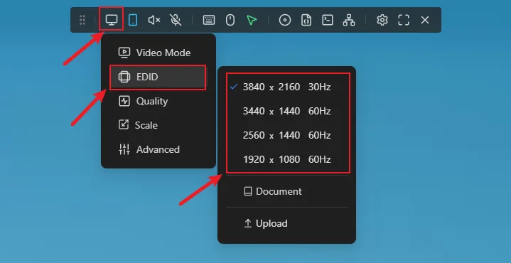
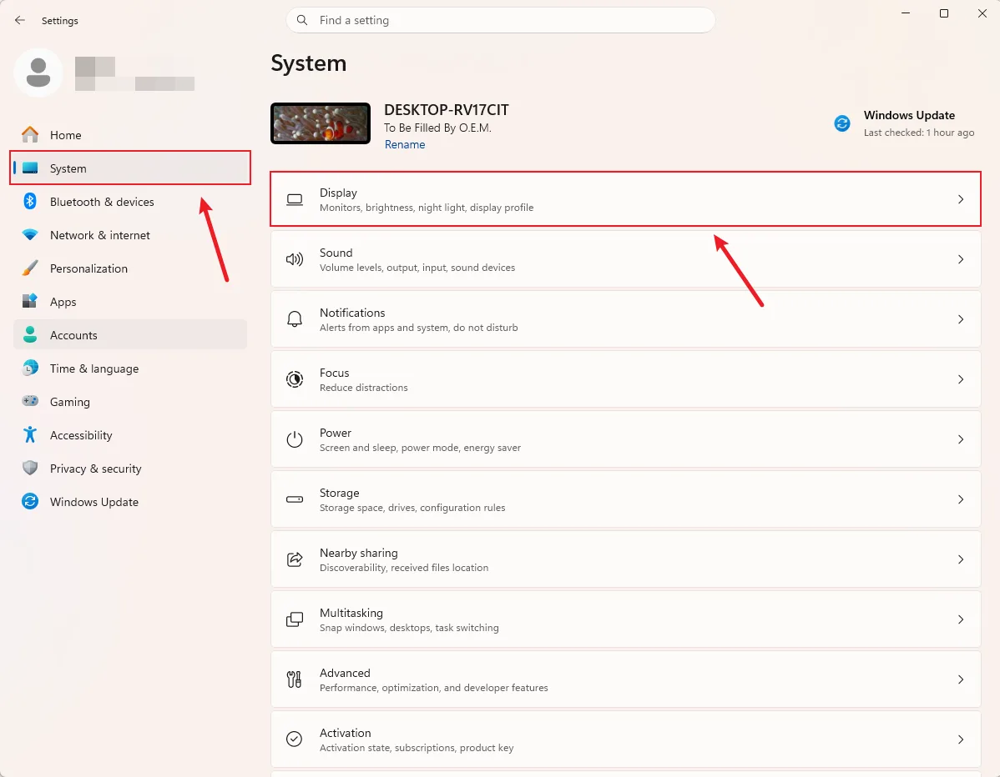
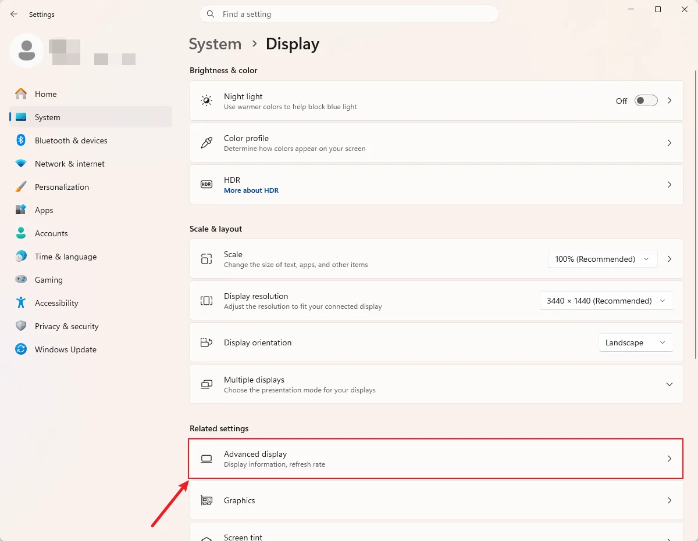
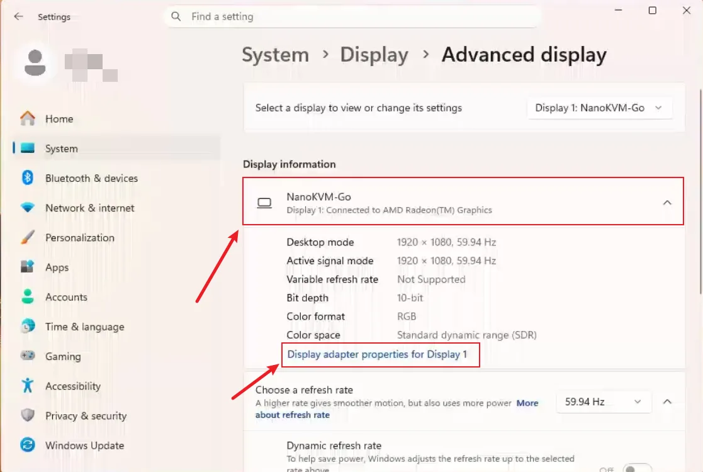
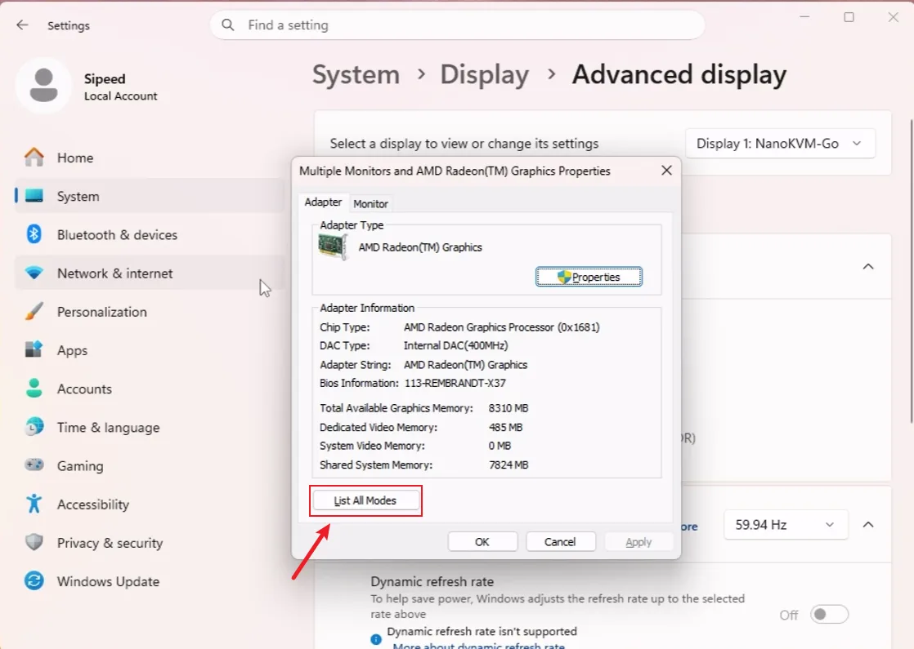
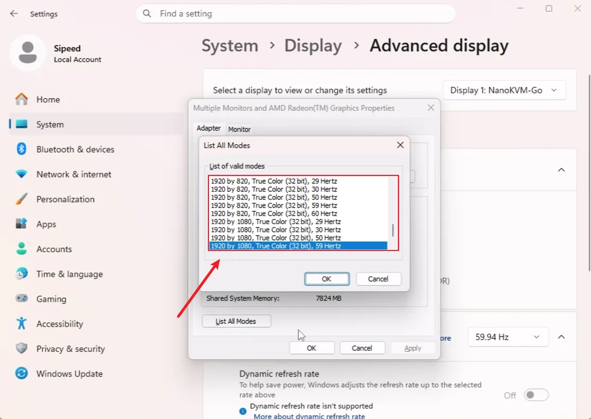
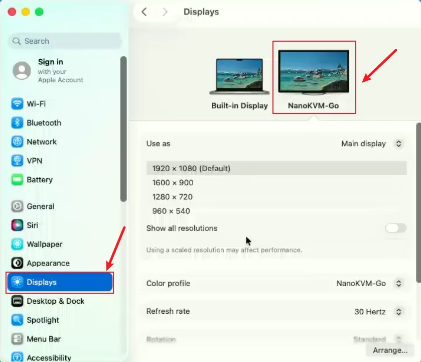
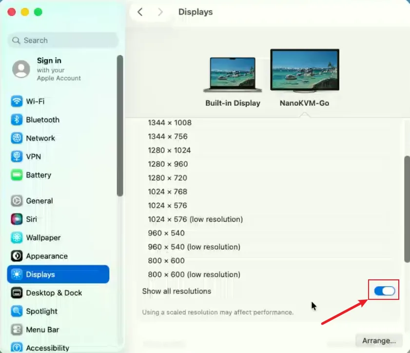

## Introduction

NanoKVM Go provides EDID information to the target device. After the target device reads the EDID, it outputs video according to the display modes declared by that EDID. Therefore, the maximum resolution available on the target device usually depends on the EDID currently selected on NanoKVM Go.

The resolution shown in the operating system display settings does not always represent the actual video output resolution. Some options may be scaled display modes. If you want NanoKVM Go to receive a specific real output resolution, select a resolution and refresh rate combination that exists in the EDID instead of only changing the scaled display size.

## EDID and Resolution

EDID tells the target device which resolutions, refresh rates, and display parameters the current "monitor" supports. NanoKVM Go is recognized by the target device as a monitor, and the target device generates available display modes based on the EDID provided by NanoKVM Go.

For example, if NanoKVM Go is using the `1920x1080 60Hz` EDID, the target device usually will not output a real resolution higher than the range declared by that EDID. To use higher resolutions such as `2560x1440 60Hz`, `3440x1440 60Hz`, `3840x2160 30Hz`, or `3840x2160 50Hz`, switch NanoKVM Go to the corresponding EDID first.

The table below lists the recommended real output modes for each EDID. Only the resolution and refresh rate combinations listed in this table are recommended as target real output modes for NanoKVM Go. Other resolutions or refresh rates shown by the operating system but not listed in the table should be treated as scaled modes, compatibility modes, modes beyond the device specifications, or modes derived by the system.

| Resolution | Aspect ratio | 1920×1080@60Hz EDID | 2560×1440@60Hz EDID | 3440×1440@60Hz EDID | 3840×2160@30Hz EDID | 3840×2160@50Hz EDID (Beta) |
| --- | --- | --- | --- | --- | --- | --- |
| 3840×2160 | 16:9 | × | × | × | 30 Hz | 30 / 50 Hz |
| 3440×1440 | 43:18 (~21:9) | × | × | 30 / 60 Hz | 60 Hz | × |
| 2560×1440 | 16:9 | × | 30 / 60 Hz | 30 / 60 Hz | 30 / 60 Hz | 30 / 60 / 90 Hz |
| 1920×1200 | 16:10 | × | 60 Hz | 60 Hz | 60 Hz | 60 Hz |
| 1920×1080 | 16:9 | 30 / 50 / 60 Hz | 30 / 60 Hz | 30 / 60 Hz | 30 / 50 / 60 Hz | 30 / 50 / 60 Hz |
| 1600×900 | 16:9 | 60 Hz | 60 Hz | 60 Hz | 60 Hz | 60 Hz |
| 1280×1024 | 5:4 | 60 Hz | 60 Hz | 60 Hz | 60 Hz | 60 Hz |
| 1280×960 | 4:3 | 60 Hz | 60 Hz | 60 Hz | 60 Hz | 60 Hz |
| 1280×720 | 16:9 | 30 / 50 / 60 Hz | 60 Hz | 60 Hz | 30 / 50 / 60 Hz | 30 / 50 / 60 Hz |
| 1024×768 | 4:3 | 60 Hz | 60 Hz | 60 Hz | 60 Hz | 60 Hz |
| 800×600 | 4:3 | 60 Hz | 60 Hz | 60 Hz | 60 Hz | 60 Hz |
| 640×480 | 4:3 | 60 Hz | 60 Hz | 60 Hz | 60 Hz | 60 Hz |

> The `3840×2160@50Hz EDID` is currently in **Beta**. This mode is available for use, but the image may be unstable in some environments. If you encounter a problem, switch to the `3840×2160@30Hz` EDID or a lower-resolution EDID.

> Connect PD power before changing EDID. If PD power is not connected, NanoKVM Go may need to be restarted manually after switching EDID.
>
> After changing EDID, the target device may briefly go black, re-detect the display, or rearrange windows. This is normal.

## Select EDID on NanoKVM Go

1. Open the NanoKVM Go web control page.
2. Click the image settings entry in the top floating toolbar.
3. Select the EDID that matches the target resolution.

4. Wait for the target device to re-detect the display.
5. Select the target output resolution again in the target device operating system.

## Set the Real Output Resolution on Windows

On Windows, if you change the resolution directly from `Settings` > `System` > `Display`, the system may use a scaled display mode. In that case, the image received by NanoKVM Go may not be the real output resolution you expected.

To set the real output resolution, select it from the valid mode list, and confirm that the selected resolution and refresh rate combination exists in the EDID table above:

1. Open Windows `Settings`.
2. Go to `System` > `Display`.

3. Click `Advanced display`.

4. If multiple displays are connected, select `NanoKVM-Go` on the Advanced display page first.
5. Click `Display adapter properties` for the current display.

6. In the dialog, click `List All Modes`.

7. Select a target resolution and refresh rate listed in the table above.

8. Confirm and apply the setting.

For example, if you need a real `1920 x 1080 60Hz` output, select the corresponding `1920 x 1080, 60 Hertz` mode from `List All Modes`.

## Set the Real Output Resolution on macOS

On macOS, the display settings may show both regular resolutions and resolutions marked as "low resolution".

+ Options without "low resolution" are usually HiDPI or scaled display modes;
+ Options with "low resolution" usually indicate real output modes without HiDPI scaling.

However, selecting "low resolution" does not always guarantee that the final output is the target native mode. You also need to confirm that the refresh rate for that resolution exists in the EDID table above. If the refresh rate does not match, macOS may still use a scaled mode or another compatibility output mode.

1. Open macOS `System Settings`.
2. Go to `Displays`.
3. Select `NanoKVM-Go` from the display list.

4. Turn on `Show all resolutions`.

5. Find the target resolution in the resolution list.
6. Select the target mode marked as "low resolution", and make sure its resolution and refresh rate combination is listed in the table above.
7. After confirming that the image is displayed correctly, return to NanoKVM Go and check the current image resolution.

For example, if you want the target Mac to output a real `1920 x 1080 60Hz` signal, select `1920 x 1080 (low resolution)` and confirm that the refresh rate is `60Hz`. If you only select the regular scaled `1920 x 1080` option, or if you select a refresh rate that is not declared by the EDID, the result may still be a scaled image.

## FAQ

### Why does the image look scaled after I select a resolution?

The operating system may have selected a scaled display mode instead of a real output mode. Enter the valid mode list for the current system and select a resolution and refresh rate combination listed in the table above.

On Windows, use `List All Modes` to select both the resolution and refresh rate. On macOS, select the corresponding resolution marked as "low resolution", and confirm that the refresh rate is also listed in the table.

### Why is the resolution I want not shown?

Check whether the current EDID selected on NanoKVM Go supports that resolution and refresh rate combination. If the EDID does not declare the corresponding display mode, the target device usually will not show that option, or it may only provide a scaled display mode.

After switching EDID, wait for the system to re-detect the display. If the target resolution still does not appear, try reconnecting the NanoKVM Go data cable or restarting the target device.

### Why does the screen briefly go black after changing EDID?

After EDID is changed, the target device re-detects the display and negotiates the output mode again. A brief black screen during this process is normal.

### Is a higher resolution always better?

Not always. Higher resolutions increase the load for video encoding, network transmission, and browser rendering. For BIOS settings, system installation, or remote maintenance, choose a stable and clear resolution with lower latency.
