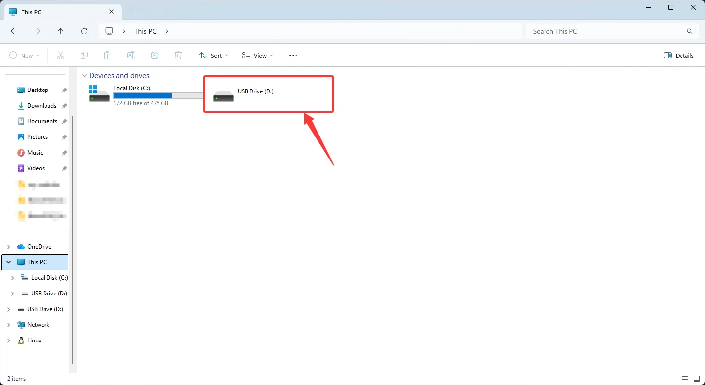
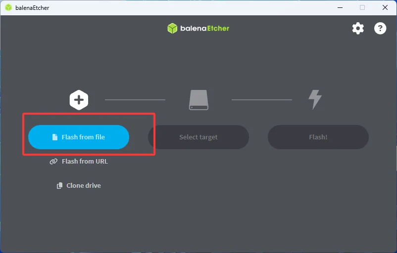
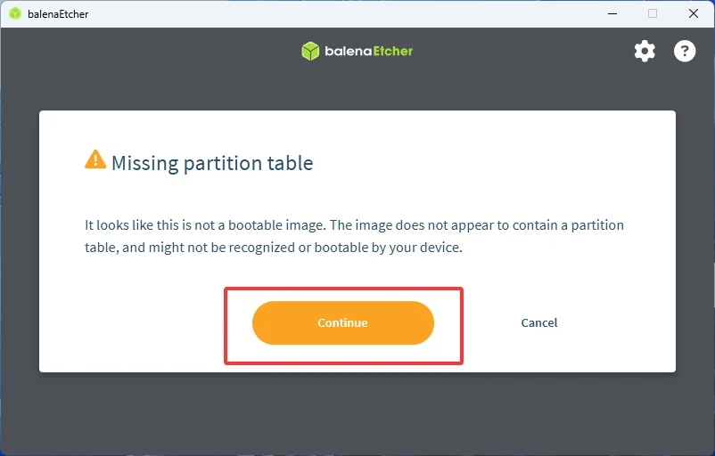
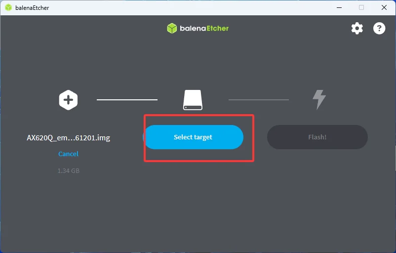
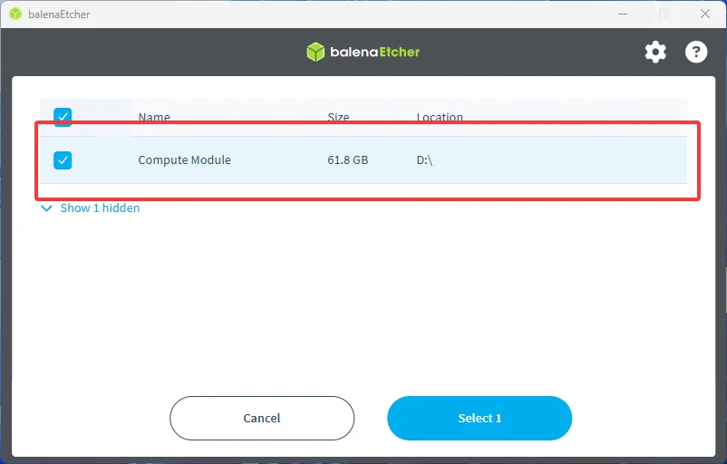
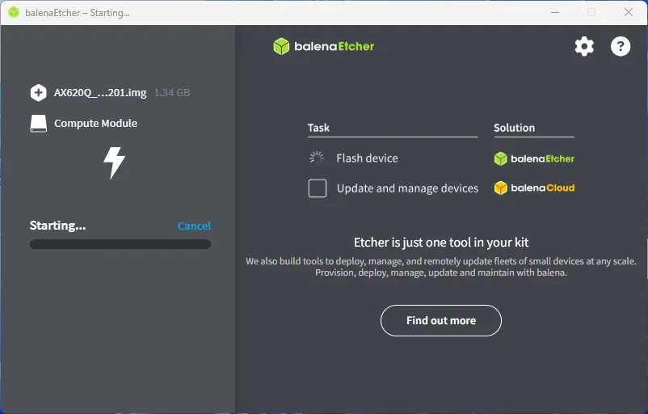
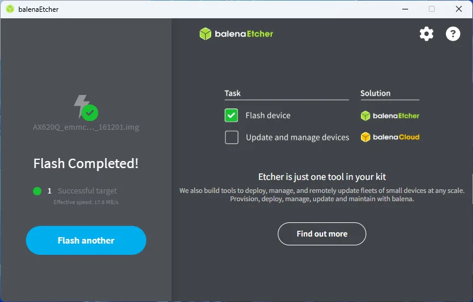

*NanoKVM Go is usually shipped with an image already flashed. If the device boots normally, you can skip this step at first.*

## Preparation

Before flashing, prepare the following items:

- NanoKVM Go;
- a SIM eject pin or another tool that can press and hold the flashing-mode button;
- a USB data cable;
- a Linux / macOS / Windows computer;
- the NanoKVM Go image file;
- the balenaEtcher flashing tool.

## Download the Image

Download the latest NanoKVM Go image from GitHub.

Image download link: [NanoKVM-Go Releases](https://github.com/sipeed/NanoKVM-Go/releases)

## Download the Flashing Tool

Download and install [balenaEtcher](https://etcher.balena.io/#download-etcher).

## Enter Flashing Mode

1. Disconnect the USB cable from NanoKVM Go to power off the device.

2. Open balenaEtcher on the computer.

3. Insert the SIM eject pin through the opening and press and hold the flashing-mode button on NanoKVM Go.

4. Keep holding the flashing-mode button, insert the USB data cable connected to the computer into the NanoKVM Go data port (Data Port).

5. Confirm that the computer detects the NanoKVM Go device. It appears as a USB drive in This PC.

6. Release the flashing-mode button after the device is detected.

## Flash the Image with balenaEtcher

1. In balenaEtcher, click `Flash from file` and select the downloaded NanoKVM Go image.

2. When the `Missing partition table` warning appears, click `Continue`.

3. Click `Select target`.

4. Select the drive that corresponds to NanoKVM Go (listed as `Compute Module`) and click `Select 1`.

5. Click `Flash!` and wait for the flashing to finish.

6. balenaEtcher reports `Flash Completed!` once the image has been written.

After flashing is complete, safely eject the USB device, disconnect the USB cable, reconnect NanoKVM Go, and wait for the system to boot.

> Do not disconnect USB or close balenaEtcher during flashing. Otherwise, the image may fail to write correctly.
