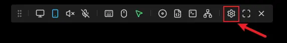
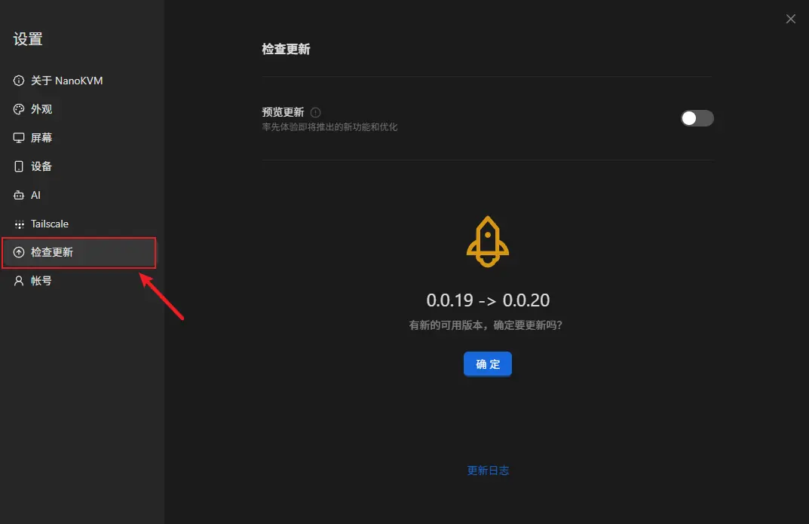
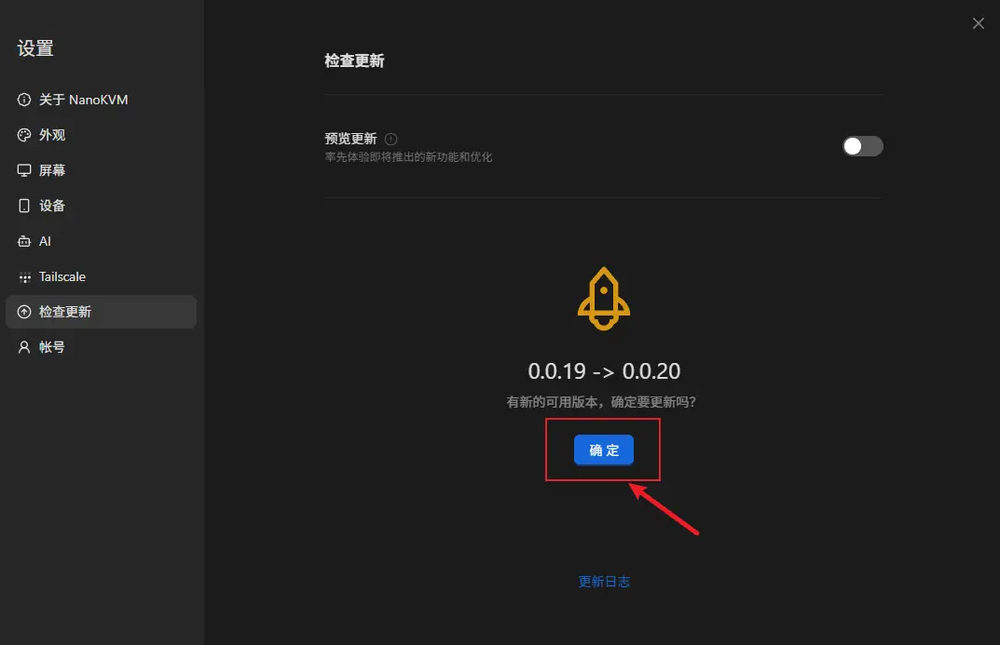
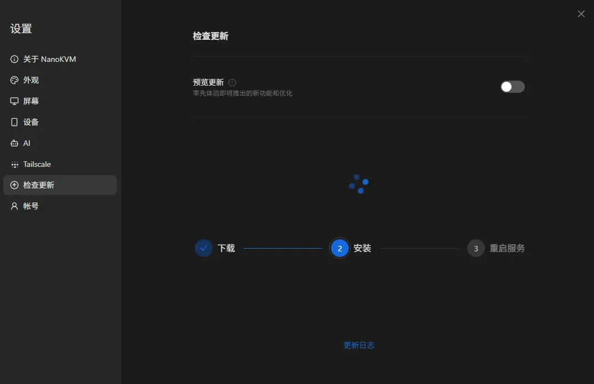

NanoKVM Go supports updating the application from the web control page. Before updating, make sure the device is connected to the network and has obtained an IP address.

## Preparation

Before updating, confirm the following:

- NanoKVM Go has booted normally;
- NanoKVM Go is connected to a network with Internet access;
- NanoKVM Go has obtained an IP address through DHCP or static IP configuration;
- the computer and NanoKVM Go are on mutually reachable networks;
- the browser can open the NanoKVM Go web control page.

## Open the Control Page

1. Open a browser.
2. Enter the NanoKVM Go IP address in the address bar.
3. Open the NanoKVM Go web control page.
4. If the page asks you to log in, log in first.

## Open the Settings Page

On the top menu bar of the control page, click `Settings` to open the settings page.

## Check for Updates

On the settings page, click `Check for updates`.

If an update is available, a confirmation dialog is displayed. Click `OK` to start the update.

## Wait for the Update to Complete

After clicking OK, keep NanoKVM Go powered on and connected to the network, then wait for the application update to complete.

Do not power off the device during the update, and do not refresh or close the page. After the update is complete, follow the instructions on the page. If the page refreshes automatically or returns to the login page, log in again.

## Update Complete

After the update is complete, you can continue accessing NanoKVM Go from the browser and use the remote control functions normally.
