## Configure Two-Factor Authentication

Two-factor authentication (2FA) adds an authentication code to password-based sign-in.

1. Install Google Authenticator or Microsoft Authenticator on your phone. The steps below use Google Authenticator.

2. Sign in to NanoKVM Go and click the Settings icon in the floating toolbar.

3. Select `Account`, then click `Enable` next to `Two-factor authentication`.

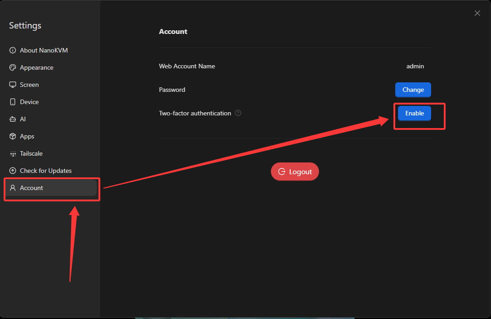

4. Enter your current password, then click `Enable`.

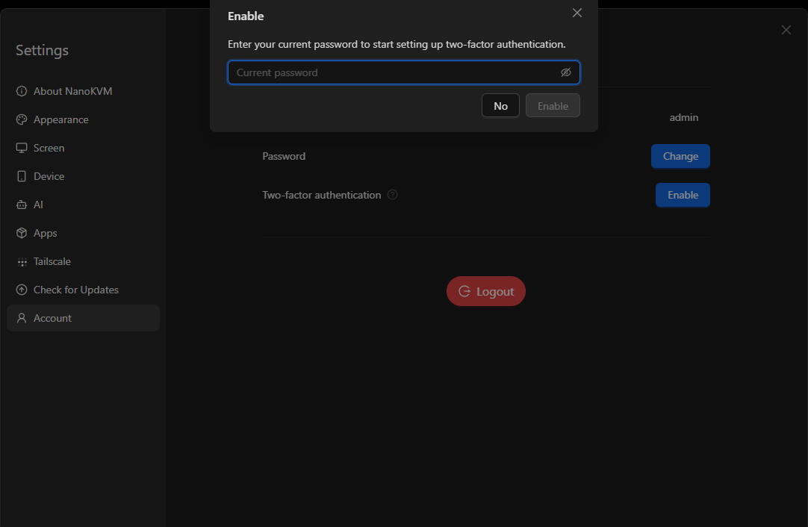

5. Scan the QR code with the authenticator app, or enter the setup key manually.

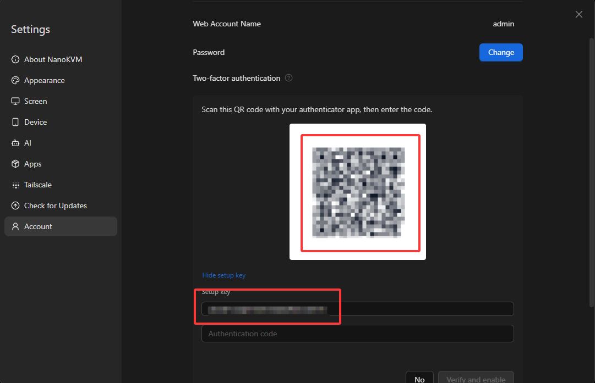

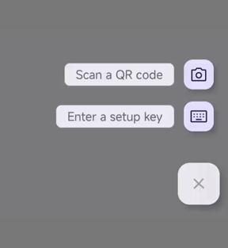

6. Enter the current code from the authenticator app, then click `Verify and enable`.

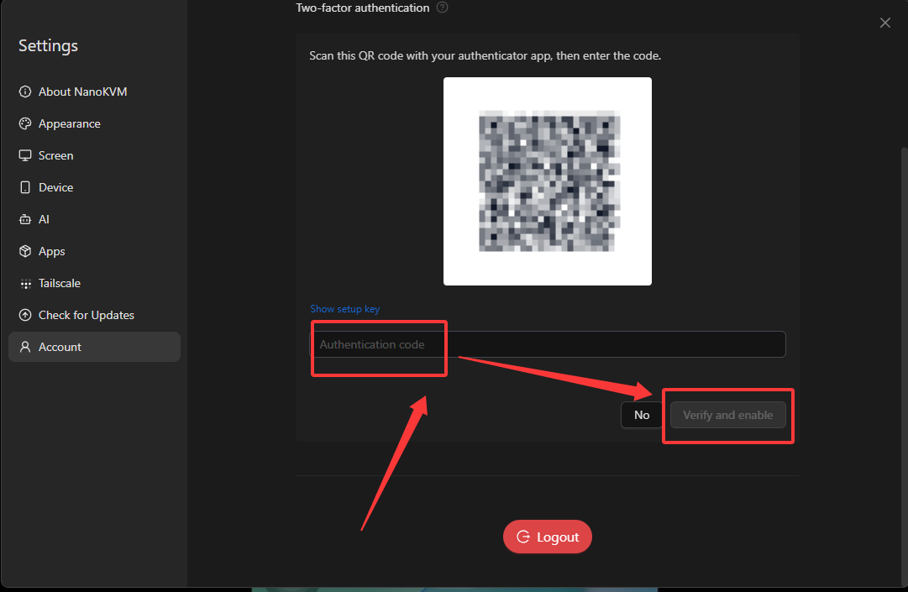

7. After 2FA is enabled, all sessions are logged out. Sign in again.

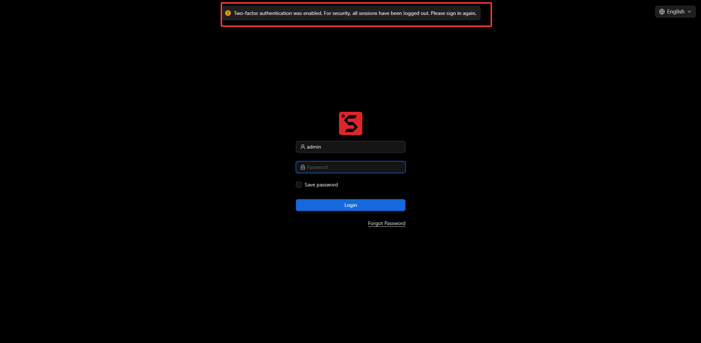

8. Enter the current authentication code or a recovery code, then click `Verify`.

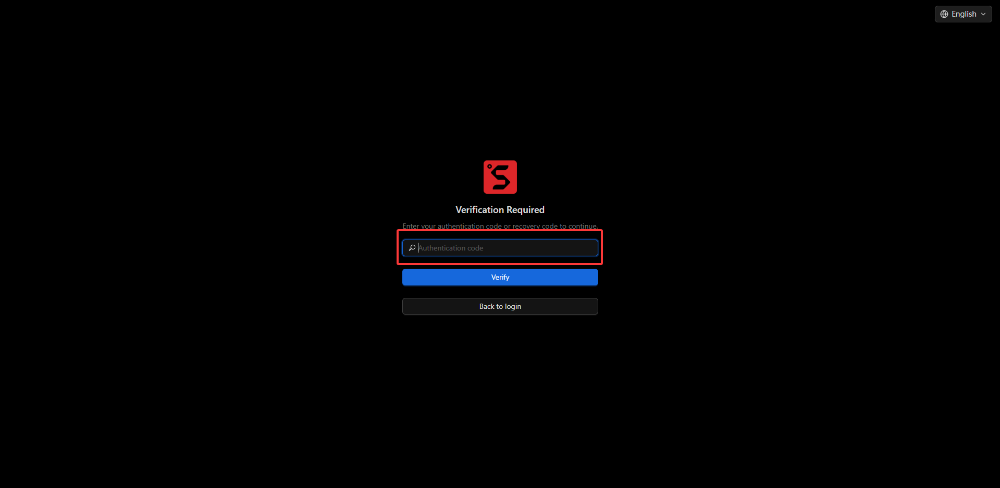

## Configure Recovery Codes

Recovery codes are one-time backup codes for signing in when the authenticator app is unavailable. Save them securely when they are generated.

1. In `Settings`, select `Account`, then click `Enable` next to `Recovery codes`.

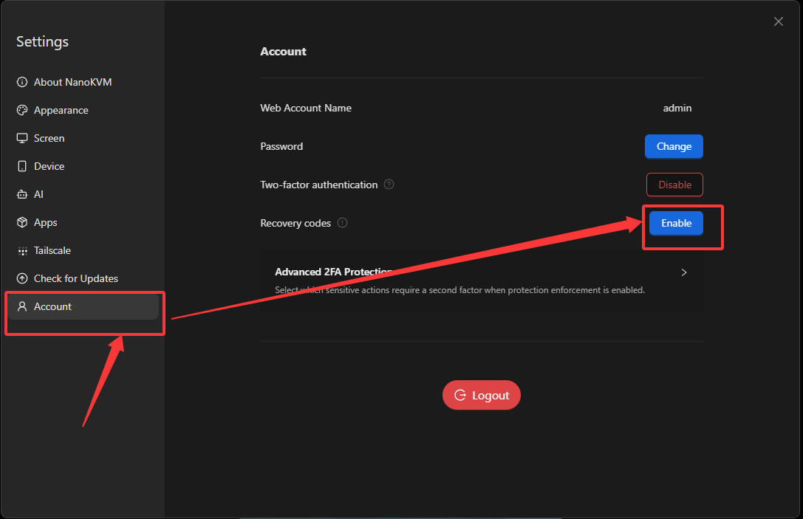

2. Enter your current password and authentication code, then click `Enable` to generate the recovery codes.

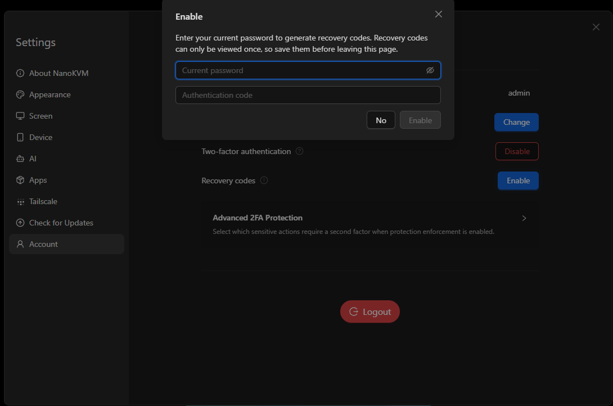

3. Click `Copy` or `Download` before leaving the page, then click `Done`.

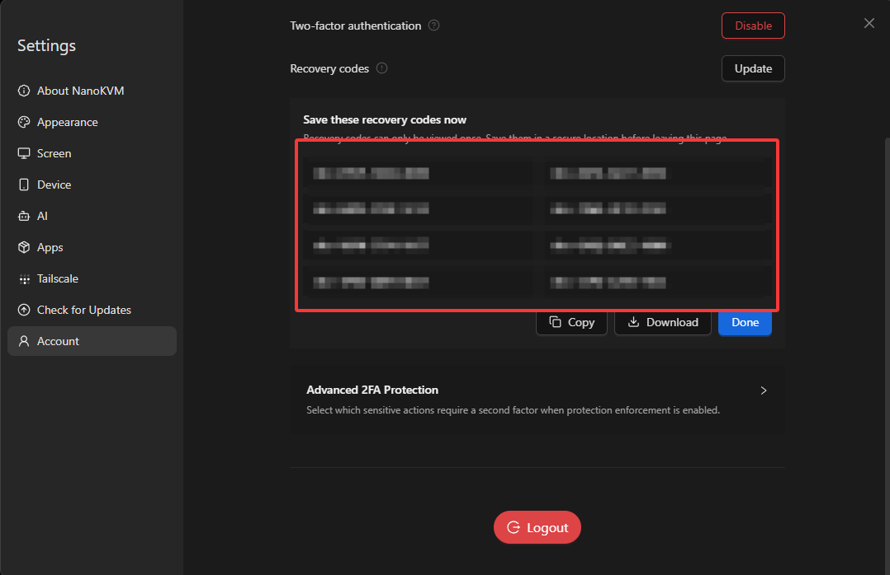

4. If the recovery codes are lost or may have been exposed, click `Update` and save the new set immediately.

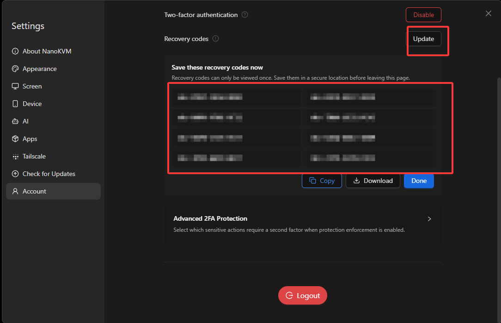

## Advanced 2FA Protection

Advanced 2FA Protection requires a second-factor code for selected sensitive operations.

1. In `Settings`, select `Account`, then expand `Advanced 2FA Protection`.

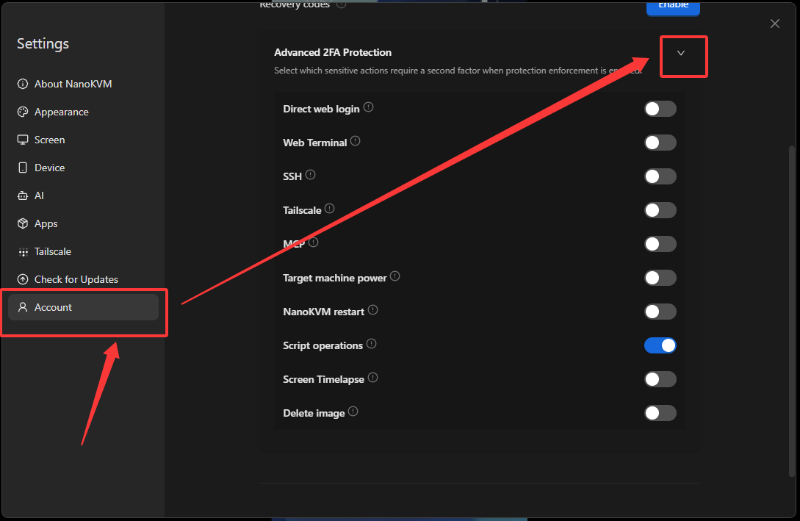

2. Enable protection for the operations that should require a second factor. Available options include `Direct web login`, `Web Terminal`, `SSH`, `Tailscale`, `MCP`, `Target machine power`, `NanoKVM restart`, `Script operations`, `Screen Timelapse`, and `Delete image`.

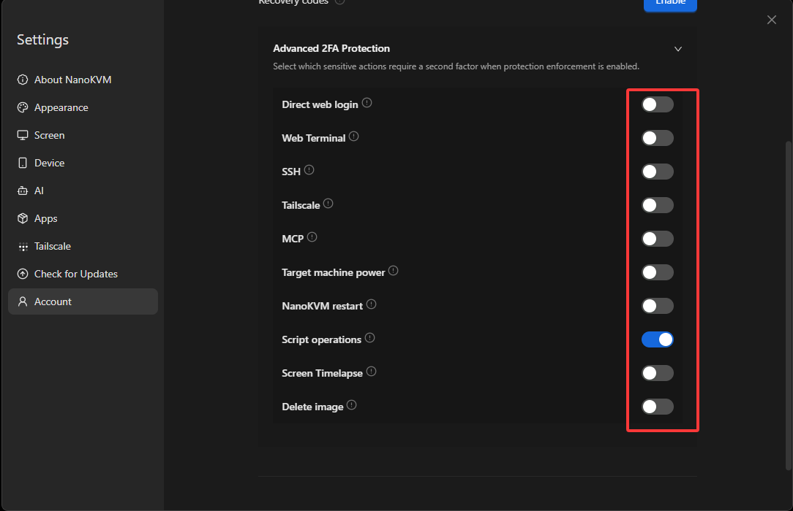

3. A blue toggle indicates that protection is enabled; a gray toggle indicates that it is disabled. When enabled, the selected operation requires a verification code before it can proceed.

## Disable Two-Factor Authentication

1. In `Settings`, select `Account`, then click `Disable` next to `Two-factor authentication`.

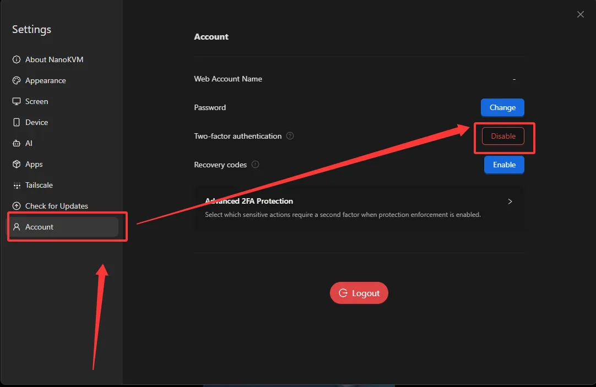

2. Enter your current password and either an authenticator-generated code or an unused recovery code, then click `Disable`.

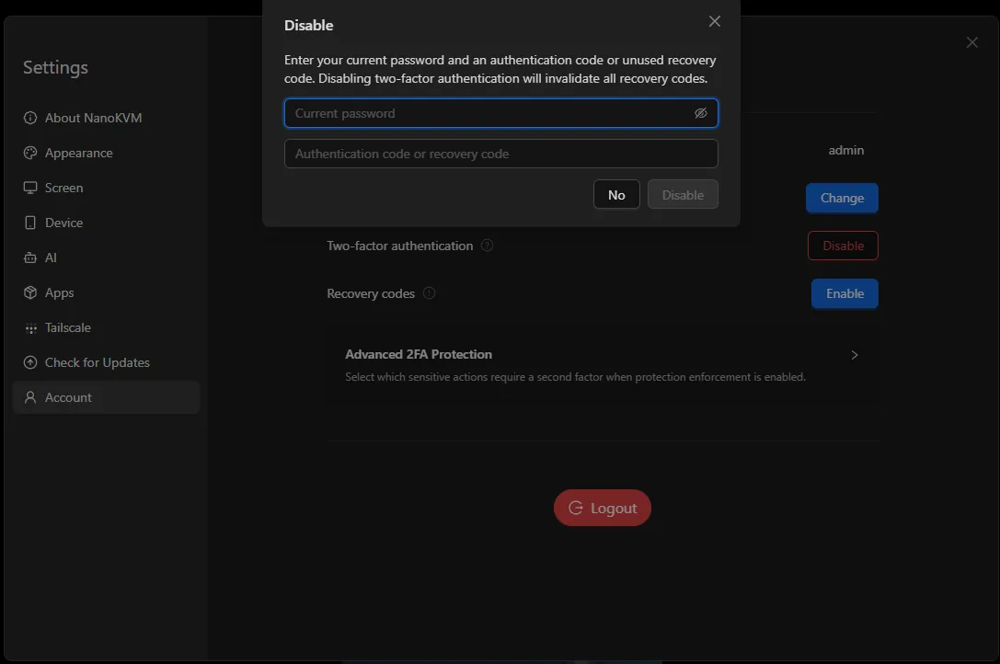
