## Interface

The NanoKVM Go screen is used to show device status and access common settings. Common screens include the main screen and the settings screen.

### Main Screen

The main screen shows network status, device IP address, current resolution, frame rate, and device status. After network configuration is complete, you can check the current IP address of NanoKVM Go here.

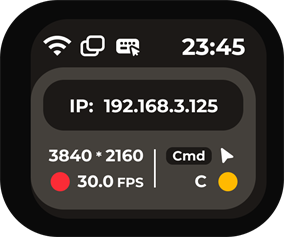

### Settings Screen

The settings screen contains multiple function entries. Switch left or right to view different pages.

Example settings pages are shown below:

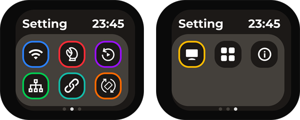

| Setting Entry | Setting Entry | Setting Entry |
| --- | --- | --- |
|  **Wi-Fi**: Configure wireless network connection. |  **MCP**: Enter MCP-related settings. |  **Replay**: Enter replay-related features. |
|  **NCM**: Configure USB network sharing. |  **SSH**: Configure SSH remote access. |  **Rotation**: Adjust screen rotation direction. |
|  **Panel**: Adjust panel display settings. |  **Apps**: View app-related features. |  **About**: View device and version information. |

## Network Configuration

Network configuration is usually entered from the `Wi-Fi` icon.

When NanoKVM Go is used for the first time or after switching Wi-Fi environments, network configuration must be completed first. After configuration is complete, the device displays its IP address on the main screen, and the control device can access the web control page through this IP address.

### Preparation

Before configuration, make sure that:

+ NanoKVM Go is powered on normally;
+ The Wi-Fi network to be connected is available;
+ The Wi-Fi SSID and password are correct;
+ A phone or computer is available for scanning QR codes, connecting to the temporary hotspot, or opening the configuration page.

### Enter Wi-Fi Settings

From the NanoKVM Go main screen, enter the Wi-Fi settings page and make sure the Wi-Fi switch is `ON`.

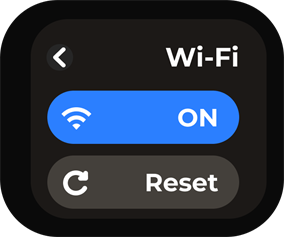

After entering the configuration method page, choose either `QRCODE` or `PASSWD` to complete network configuration.

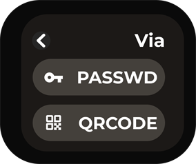

### Configure with QRCODE

`QRCODE` is suitable for configuration with a phone. This method connects the phone to NanoKVM Go's temporary hotspot by scanning a QR code, then opens the Wi-Fi configuration page.

1. Select `QRCODE` on the configuration method page.
2. NanoKVM Go displays the `Connect to AP` QR code.
3. Scan the QR code with a phone and follow the phone prompt to connect to the temporary NanoKVM Go hotspot.

4. After connecting to the temporary hotspot, NanoKVM Go displays the `Configure WiFi` QR code.

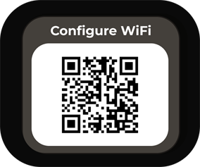

5. Scan the QR code with the phone to open the Wi-Fi configuration page.

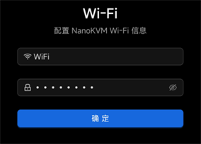

6. Enter the Wi-Fi SSID and password on the page, then submit the configuration.

Wait for NanoKVM Go to complete the connection after submitting. Do not disconnect power during this process.

### Configure with PASSWD

`PASSWD` is suitable for selecting a Wi-Fi network and entering the password directly on the NanoKVM Go screen.

1. Select `PASSWD` on the configuration method page.
2. Select the Wi-Fi SSID to be connected from the Wi-Fi list.

3. Enter the Wi-Fi password on the password input page.
4. Select `OK` after entering the password to submit the configuration.

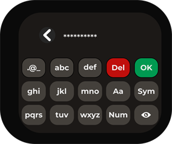

Wait for NanoKVM Go to complete the connection after submitting. If the password is incorrect, return to the Wi-Fi configuration page and configure it again.

### Confirm the Connection

After configuration is complete, NanoKVM Go returns to the main screen. If the main screen displays the device IP address, the network connection is successful.

After the control device and NanoKVM Go are connected to the same network, enter the IP address in the browser address bar to open the NanoKVM Go web control page.

## Management Page Features

After logging in to the NanoKVM Go web control page, you can view the controlled device screen in the browser and access common management functions from the top floating toolbar.

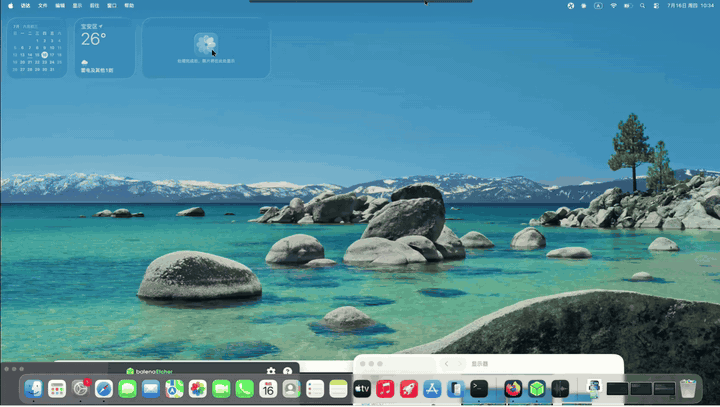

The floating toolbar entries from left to right are: Image Settings, Portrait Mode, Volume Settings, Microphone, On-Screen Keyboard, Mouse Style, Interface Preview, Image Mounting, Custom Scripts, KVM Web Terminal, Settings, Full Screen, and Hide Floating Toolbar.

### Image Settings

Click the Image Settings icon on the left side of the floating toolbar to adjust remote image encoding, display parameters, and clarity. New users are advised to keep the default settings first, and adjust the following options only when the image is laggy, unclear, or the resolution does not match.

+ Video Mode is used to select the video encoding and transmission method. In most cases, `H.264 WebRTC` is recommended for better compatibility. In a stable local network, Direct mode can also be tried if needed.

+ EDID is used to select the display parameters that NanoKVM Go provides to the controlled host. After the host reads the EDID, it outputs the corresponding resolution and refresh rate, such as `3840 x 2160 30Hz`, `2560 x 1440 60Hz`, or `1920 x 1080 60Hz`. After changing EDID, the host image may briefly go black or re-detect the display. This is normal.

+ Image Quality adjusts the compression quality. `Auto` is suitable for most scenarios. When the network is good and a clearer image is needed, choose `Lossless` or `High`. When bandwidth is limited or latency is high, choose `Medium` or `Low` to reduce bandwidth usage.

+ Scale adjusts the display ratio in the browser, such as `50%`, `75%`, `100%`, `150%`, or `200%`. This option only changes the display size on the web page and does not change the actual output resolution of the controlled host.

+ Advanced Settings provides more complete screen parameters, including video mode, bitrate control mode, bitrate, GOP, FPS, scale, and EDID. A higher bitrate usually provides a clearer image but uses more bandwidth. FPS limits the maximum frame rate; higher FPS makes the image smoother but requires more network and device performance. If you are not sure what an option means, keep the default value.

### Portrait Mode

Portrait Mode is used to adapt to controlled interfaces with phone or tablet portrait ratios. It provides three modes: `Auto`, `On`, and `Off`.

+ `Auto`: the system automatically selects a suitable mouse mapping method based on the current screen ratio.

+ `On`: when the control-side mouse moves, the controlled cursor follows the mouse movement. When it reaches the edge of the controlled interface, the cursor stops at the edge.

+ `Off`: mouse movement is mapped proportionally according to the current remote display area. This is suitable for regular landscape desktops or scenarios where edge limiting is not required.

### Volume Settings

Volume Settings adjusts remote audio output. After audio is enabled, the browser receives audio captured by NanoKVM Go and plays it through the current control device.

+ To listen to audio from the controlled device, make sure the browser page is not muted and the control device system volume is normal.

+ If the network latency is high or bandwidth is limited, audio may stutter. Try lowering image quality or frame rate first, then check whether the audio becomes stable.

### Microphone

Microphone controls remote microphone input. After it is enabled, microphone audio from the control device can be transmitted to the controlled device. This is suitable for remote meetings, voice testing, and similar scenarios.

+ When used for the first time, the browser may request microphone permission. Allow access as needed.

+ If you do not need to transmit audio to the controlled device, keep the microphone disabled to avoid unintended input.

### On-Screen Keyboard

The on-screen keyboard is used to input keys from the web page. It is suitable when the control device has no physical keyboard, when shortcut combinations are needed, or when the controlled device temporarily cannot recognize the local keyboard.

+ After opening the on-screen keyboard, click keys directly to send input to the controlled device.

+ When entering passwords, shortcuts, or keys in a system installation interface, make sure the remote screen has focus first.

### Mouse Settings

Click the mouse settings icon in the floating toolbar to adjust pointer display, mouse input mode, and HID-related features. New users are advised to keep the default settings first. If the mouse cannot control the host, the pointer position is inaccurate, or the scroll direction does not match your habit, adjust the following options as needed.

+ Cursor Style sets the mouse pointer display on the web page. Available styles include default cursor, grab pointer, cell pointer, text pointer, and hidden pointer. This option only affects the pointer display in the browser and does not change the mouse settings of the controlled host.

+ Mouse Mode selects how mouse coordinates are transmitted. For regular desktop systems, `Absolute Mode` is recommended. For Android devices, choose `Absolute Mode (Android)`. In BIOS, some system interfaces, or when the mouse position is inaccurate, switch to `Relative Mode`.

+ Input Adapter selects how the browser receives mouse input. In most cases, `Auto (Pointer Lock)` is recommended. If you need fixed mouse movement capture, choose `Pointer Lock`. On touch devices or mobile browsers, choose `Touchpad`.

+ Scroll Direction switches the scroll wheel direction. Choose up or down according to your preference. Scroll Speed adjusts scroll sensitivity. If scrolling is too fast, slow it down; if the scroll distance is not enough, make it faster.

+ `HID-Only Mode` makes USB simulate only keyboard and mouse devices. If some hosts or BIOS interfaces have poor compatibility with composite USB devices, try enabling this mode.

+ `Reset HID` reinitializes the keyboard and mouse simulation device. When the keyboard or mouse cannot control the host, check the USB connection first, then try this function.

+ `Fix iPhone Drag` is used to handle drag issues that may occur in iPhone browsers. `Touchpad Guide` shows the operation instructions for touchpad mode.

### Interface Preview

Interface Preview is used to quickly check the current remote image status. Use this entry when you need to confirm whether the image is displayed normally, whether it is in full screen, or whether the image is changing.

### Image Mounting

Image Mounting is used to mount image files to the controlled device. It is commonly used for system installation, system maintenance, or boot media testing. Before use, make sure the image file comes from a trusted source and select the corresponding boot option according to the controlled device's boot order. For detailed usage, refer to the [Image Mounting section in the NanoKVM Cube User Guide](../NanoKVM/user_guide.html#ISO-Image-Mounting-and-Remote-Installation).

### Custom Scripts

Custom Scripts is used to execute preset scripts or user-added scripts. This feature is suitable for repetitive maintenance tasks, such as restarting services, running diagnostic commands, or performing simple automation.

+ Before running a script, confirm its content and effect to avoid affecting running services.

### KVM Web Terminal

KVM Web Terminal opens the NanoKVM Go command-line terminal in the browser. It can be used to check system status, inspect the network, and perform maintenance operations.

+ For regular remote control, the web terminal is usually not needed.

+ Before running command-line operations, confirm the command meaning to avoid accidentally changing system configuration.

### Settings

Settings opens the NanoKVM Go management settings page, where you can view and adjust device-related parameters.

### Full Screen

Full Screen switches the remote image to full-screen display. It is suitable for long desktop sessions or when a larger display area is needed. To exit full screen, use the browser or operating system exit-full-screen method.

## Account and Password

The default NanoKVM Go web username is `admin`, and the default password is `admin`. It is recommended to change the default password after the first login.

### Change Password

It is recommended to change the default password after the first login. Click the Settings icon in the floating toolbar to enter the NanoKVM Go settings page.

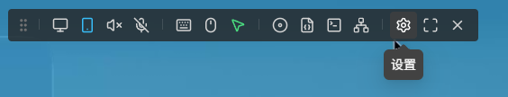

On the settings page, select `Account` on the left, then click `Modify` in the `Password` row.

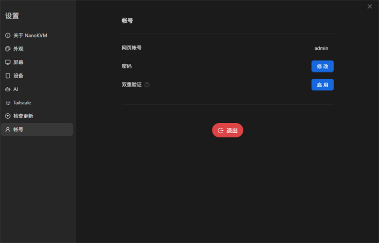

On the change password page, enter the username and new password, then enter the new password again to confirm. After checking that the information is correct, click `Confirm` to save it.

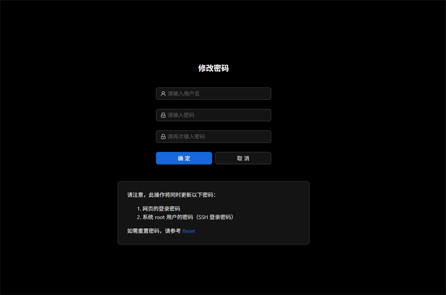

Changing the password updates both the web login password and the system `root` user password (SSH login password). After changing the password, log in again with the new password.

### Reset Forgotten Password

If you forget the web login password, click `Forgot Password` on the login page to view the default account information and reset entry.

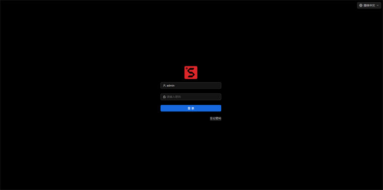

The page shows that the default web account is `admin/admin`, and the default SSH account is `root/sipeed`. If the password has been changed and you cannot log in, click the `Reset` link on the page and follow the reset instructions to reset the password.

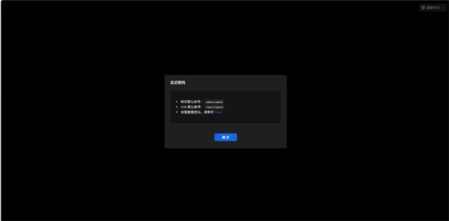

After the reset is complete, log in again with the default account and set a new secure password as soon as possible.
