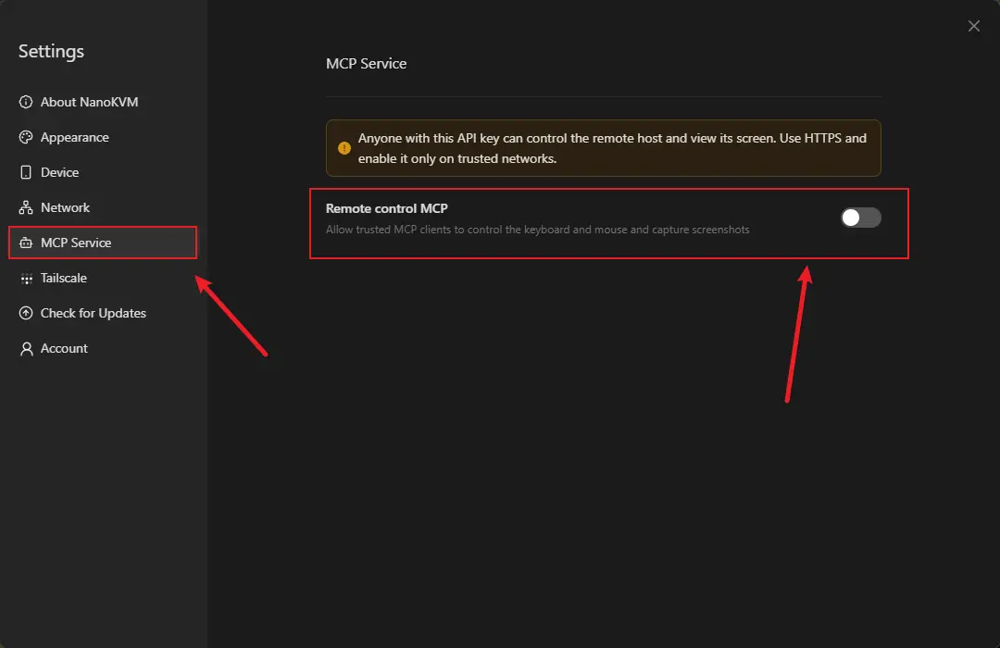
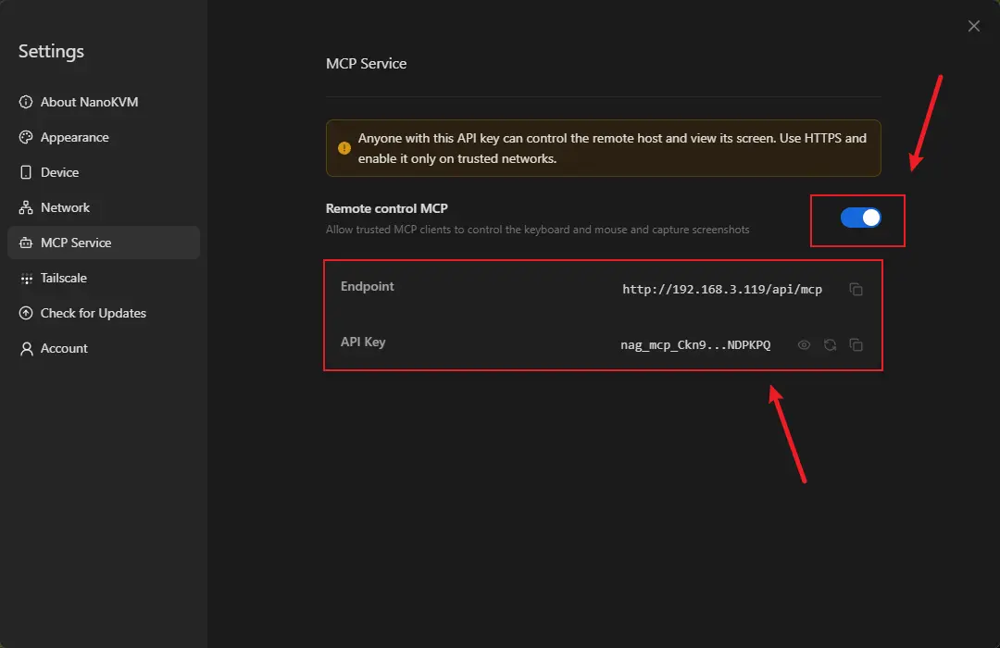
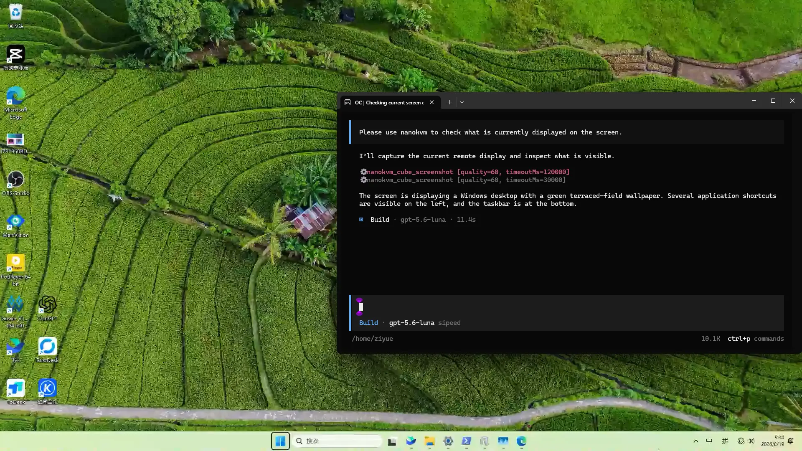

## Introduction

The MCP feature on NanoKVM PCIe lets MCP-compatible AI tools connect to NanoKVM PCIe, so the AI tool can view and control the target device through NanoKVM PCIe.

After the connection is configured, the AI tool can use the target device screen content to assist with clicking, typing, opening applications, changing settings, troubleshooting issues, and performing repetitive operations. This feature is useful for remote maintenance, system configuration, troubleshooting, and assisted automation.

> The MCP feature gives the AI tool the ability to operate the target device. Use trusted AI tools only, and do not expose the MCP service on untrusted networks.

## How It Works

After MCP is enabled on NanoKVM PCIe, the AI tool on the control device connects to the MCP service using the `Endpoint` and `API Key` shown on the NanoKVM PCIe page. The AI tool does not connect to the target device directly. Instead, it gets screen content and sends control operations through NanoKVM PCIe.

The connection flow is:

```text
AI tool on the control device
        |
        | MCP
        v
NanoKVM PCIe
        |
        | KVM control
        v
Target device
```

In this flow:

+ The target device sends video to NanoKVM PCIe through HDMI and receives keyboard and mouse control through the USB HID interface, which can use either a USB-C cable or the internal USB 2.0 header;
+ NanoKVM PCIe captures the target device screen and sends keyboard and mouse operations to the target device;
+ The AI tool on the control device connects to NanoKVM PCIe through MCP;
+ After the user sends an instruction in the AI tool, the AI tool controls the target device through NanoKVM PCIe.

## Preparation

Before using MCP, make sure that:

+ NanoKVM PCIe is connected to the target device;
+ The NanoKVM PCIe web control page can display the target device screen correctly;
+ NanoKVM PCIe is connected to the network and has obtained an IP address;
+ The control device can access the MCP endpoint shown by NanoKVM PCIe;
+ The control device has an MCP-compatible AI tool installed, such as [OpenCode](https://opencode.ai/download) or another MCP client;
+ The NanoKVM PCIe system and application versions support MCP.

> If the MCP option is not shown, check whether the NanoKVM PCIe system and application have been updated to a version that supports MCP.

## Enable MCP

1. Connect NanoKVM PCIe to the target device and confirm that the target device screen is displayed correctly.
2. Enter the NanoKVM PCIe IP address in a browser to open the NanoKVM PCIe web control page.
3. Log in to NanoKVM PCIe.
4. Open the settings page.


5. Find the MCP option.



6. Turn on the MCP switch.
7. Record the `Endpoint` and `API Key` shown on the page.

## Add MCP to an AI Tool

Different AI tools use different MCP configuration methods. This section uses OpenCode as an example.

### Get the Endpoint and API Key

After MCP is enabled on NanoKVM PCIe, the page shows an `Endpoint` and an `API Key`.



In this section:

+ `Endpoint` is the full URL of the NanoKVM PCIe MCP server, for example `http://<NanoKVM-IP>/api/mcp` or `https://<NanoKVM-IP>/api/mcp`;
+ `API Key` is the credential used to access the NanoKVM PCIe MCP server.

When configuring an AI tool, copy the endpoint shown on the page directly. Do not split the IP address and port or change the protocol.

### Add MCP to OpenCode

OpenCode supports adding a remote MCP server through the global configuration file.

Create or edit the following configuration file:

```bash
~/.config/opencode/opencode.json
```

Configuration example:

```json
{
  "$schema": "https://opencode.ai/config.json",
  "mcp": {
    "nanokvm": {
      "type": "remote",
      "url": "<Endpoint>",
      "oauth": false,
      "headers": {
        "Authorization": "Bearer <API-Key>"
      }
    }
  }
}
```

Replace:

+ `<Endpoint>` with the `Endpoint` shown on the NanoKVM PCIe MCP page;
+ `<API-Key>` with the `API Key` shown on the NanoKVM PCIe MCP page.

The displayed endpoint may start with HTTP or HTTPS. Enter it exactly as shown. Use MCP only on a trusted LAN, and prefer HTTPS whenever possible.

If the endpoint starts with HTTPS and OpenCode cannot connect because of the local NanoKVM PCIe certificate, set the following environment variable before starting OpenCode on Linux:

```bash
export NODE_TLS_REJECT_UNAUTHORIZED=0
opencode
```

You can also start OpenCode with a single command:

```bash
NODE_TLS_REJECT_UNAUTHORIZED=0 opencode
```

> The `NODE_TLS_REJECT_UNAUTHORIZED` environment variable disables TLS certificate verification for the current OpenCode process. Use it only when connecting to NanoKVM PCIe MCP on a trusted LAN. Do not use it long term on untrusted networks.

After saving the configuration, restart OpenCode. Then check whether the MCP server is connected:

```bash
opencode mcp list
```

If an HTTPS endpoint produces a local certificate verification error, use:

```bash
NODE_TLS_REJECT_UNAUTHORIZED=0 opencode mcp list
```

If `nanokvm` is shown as connected, OpenCode has successfully connected to NanoKVM PCIe MCP.


After the connection succeeds, you can send an instruction to OpenCode and let OpenCode view and control the target device through NanoKVM PCIe MCP.



To restore the default security behavior, close the current terminal and open a new one. You can also run:

```bash
unset NODE_TLS_REJECT_UNAUTHORIZED
```

### Other AI Tools

Other MCP-compatible AI tools can also try connecting to NanoKVM PCIe MCP. Support for remote MCP, HTTPS, and tool-call permissions varies between tools and versions.

If an AI tool cannot handle the certificate used by an HTTPS endpoint, a reverse proxy such as Nginx may be required to handle certificates. This setup is more complex and is not recommended as the first choice for general users.

## Usage Examples

After the connection succeeds, you can describe the operation you want to perform in natural language. For example:

```text
Use NanoKVM PCIe to check the current screen and tell me which page the target device is on.
```

```text
Use NanoKVM PCIe to click the Settings button on the screen.
```

```text
Use NanoKVM PCIe to open a terminal and type ifconfig to check the network information.
```

```text
Use NanoKVM PCIe to continue the system installation process based on the current screen.
```

Start with simple and easy-to-confirm operations, such as reading the screen, clicking a clear button, or typing a short command. For high-risk operations such as deleting files, formatting disks, or changing system configuration, confirm the action before allowing the AI tool to proceed.

## FAQ

### The AI Tool Cannot Connect to NanoKVM PCIe MCP

Check:

+ Whether the NanoKVM PCIe MCP switch is turned on;
+ Whether the MCP endpoint is correct;
+ Whether the `API Key` is correct;
+ Whether the control device and NanoKVM PCIe can reach each other over the network;
+ When using an HTTPS endpoint, whether the AI tool can handle the local NanoKVM PCIe certificate;
+ Whether a firewall, router, VPN, or security software is blocking the connection;
+ Whether NanoKVM PCIe is connected to the network and shows an IP address.

### The AI Tool Can Connect to MCP, but Cannot Control the Target Device

Check:

+ Whether the NanoKVM PCIe web control page can display the target device screen correctly;
+ Whether the target device is connected to NanoKVM PCIe correctly;
+ Whether the current target device screen requires unlocking, login, or manual confirmation;
+ Whether the AI tool allows MCP tool calls;
+ Whether keyboard and mouse control works normally in NanoKVM PCIe.

### The MCP Switch Is Not Shown

Check:

+ Whether the NanoKVM PCIe system or application version is too old;
+ Whether the current version supports MCP;
+ Whether the KVM App needs to be updated from the web control page;
+ Whether the settings page has been reopened after the update.

## Security Notes

+ MCP gives the AI tool the ability to operate the target device. Connect only trusted AI tools;
+ Do not expose the MCP service directly to the public Internet;
+ Do not expose the MCP endpoint on untrusted networks;
+ Turn off MCP when it is not needed;
+ Confirm the AI tool's action before operating important devices;
+ Do not leak the NanoKVM PCIe MCP `API Key`;
+ When entering passwords, keys, tokens, or other sensitive information, make sure the AI tool and network environment are trusted.
