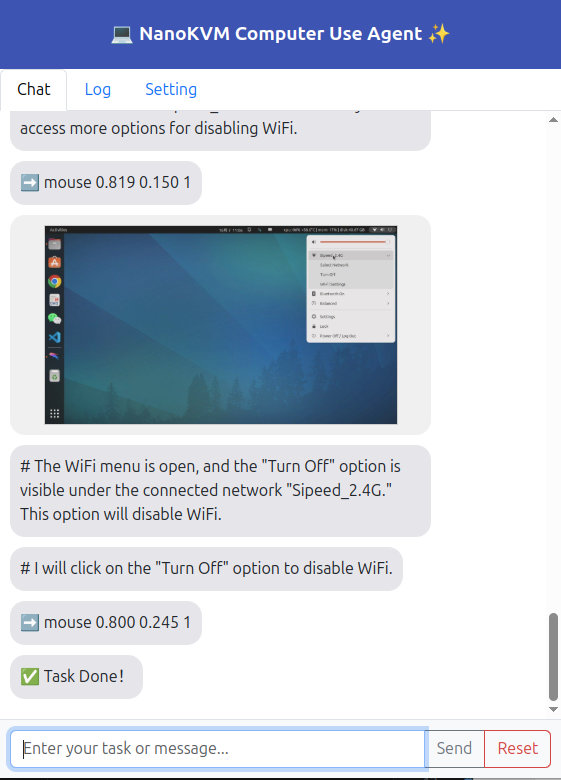

## Introduction

NanoKVM-Pro experimentally introduces an AI Agent feature, enabling users to quickly experience the currently trending **Computer Use Agent** capability.

**Computer Use** leverages multimodal Vision-Language Models (VLMs) to empower users to control their computers via natural language—eliminating the need for complex scripting previously required.

For an overview of the Computer Use concept, refer to Anthropic’s demonstration video and user experiences shared on Reddit:
https://www.reddit.com/r/ClaudeAI/comments/1ga3uqn/mindblowing_experience_with_claude_computer_use  
<iframe width="560" height="315" src="https://www.youtube.com/embed/ODaHJzOyVCQ" frameborder="0" allowfullscreen></iframe>

## Advantages of NanoKVM-Pro

How does NanoKVM-Pro’s implementation of Computer Use compare favorably to Anthropic’s offering?

1. **Out-of-the-box usability**  
   - NanoKVM-Pro comes with the Computer Use application built-in. Users can launch it directly from the web UI with a single click—no complex environment setup required, unlike Anthropic’s demo which demands significant pre-configuration.

2. **Hardware-level Computer Use**  
   - Anthropic’s solution is software-based, limiting support to macOS 11+ and Windows 10+. Linux and Android are not supported.  
   - NanoKVM-Pro’s Computer Use operates at the hardware level. As an IP-KVM device, it natively captures screenshots and controls mouse/keyboard at the hardware layer, enabling compatibility with Windows, macOS, Linux, and even Android.

3. **Support for self-hosted deployment**  
   - Anthropic uses a closed-source large model, requiring users to upload screenshots to their servers—making it unsuitable for privacy-sensitive tasks.  
   - NanoKVM-Pro supports custom VLM model endpoints. You can connect to either online commercial APIs or your own self-hosted open-source VLM server (via OpenAI-compatible API).  
   - Until recently (mid-2025), no open-source VLM could perform basic Computer Use tasks. However, Alibaba’s newly released open-source models—**qwen3-vl-235b-a22b-instruct** and **qwen3-vl-30b-a3b-instruct** (October 2025)—now enable foundational Computer Use capabilities.  
   - With the rapid advancement of AI models, we believe that by next year, open-source VLMs will deliver practical, self-hosted Computer Use functionality.

Below are mobile screen recordings of NanoKVM-Pro performing simple demonstration tasks (downloading an ESP32 datasheet and setting DNS):

<div class="video-row">
  <video playsinline controls muted preload src="../../../assets/NanoKVM/pro/cua/download_esp32.mp4"></video>
  <video playsinline controls muted preload src="../../../assets/NanoKVM/pro/cua/set_dns.mp4"></video>
</div>

<style>
.video-row {
  display: flex;
  gap: 12px;
  flex-wrap: wrap;
  justify-content: center;
}
.video-row video {
  flex: 1;
  min-width: 280px;
  aspect-ratio: 9/16;
}
@media (max-width: 600px) {
  .video-row {
    flex-direction: column;
  }
}
</style>

As an experimental feature, NanoKVM-Pro’s Computer Use Agent (CUA) is implemented as a standalone Python service, making it easy for community developers to modify and test.  
Contributions from developers interested in AI Agents are welcome: https://github.com/sipeed/nanokvm_cua

## Critical Warnings Before Use!!!

Before explaining how to try this feature, we must **emphatically stress** the current limitations and risks of CUA.

Today’s large models are still very limited and prone to **hallucinations**. When granted hardware-level control, these hallucinations can cause **irreversible damage** to your computer.  
For example, in 2025, a user reportedly lost an entire database due to unintended actions by Anthropic’s Computer Use feature.

**While using CUA, please stay physically near your computer**, monitor every action the AI performs, and be ready to interrupt it immediately if it attempts a dangerous operation.

Additionally, CUA requires connection to a VLM model server. You must either:
- Purchase token credits from a VLM provider and enter your API key, **or**
- Deploy your own VLM server.

**Users are solely responsible for any data loss, system damage, or incurred costs resulting from the use of CUA.**

## Quick Start Guide

### Set Video Mode

CUA captures screenshots from the KVM stream. Before using CUA, switch the **Video Mode** to **MJPEG**, and we recommend setting your desktop resolution to **1280×720**:
1. Higher-resolution images increase VLM inference time and token costs.
2. Lower resolutions (e.g., 800×600) make on-screen elements too small, forcing CUA to take more steps—increasing cost and failure rate.


### Read the Safety Notice

Click the **"Smart Assistant"** icon in the floating toolbar to view CUA’s safety notice.  
We **strongly urge** you to fully read and understand all risks before proceeding.


### Install Dependencies

Since CUA is experimental and involves privacy-sensitive operations, we do **not** pre-install its dependencies.  
On first use, click the **"Install Dependencies"** button to automatically install required packages.  
A terminal window will appear showing installation progress—please wait until it completes.

### Launch CUA Service

After dependencies are installed, click **"Try It Now"** to start the CUA service. A new CUA window will appear within 5–10 seconds.  
*(If no window appears, check if your browser blocked pop-ups.)*

> Note: The current CUA implementation increases CPU usage on the KVM host, which may cause lag in the main KVM interface.

For security reasons:
- Only **one CUA instance** is allowed at a time.
- Opening the CUA URL in a new tab will **not** work.
- Closing or refreshing the CUA webpage **automatically stops** the service. You must restart it from the main page.

The CUA web interface is responsive and works on both desktop and mobile browsers. Desktop layout example:


> **For developers**: You can manually run CUA via terminal:  
> `python /kvmapp/cua/cua_webapp.py --auth`

### Configure CUA Settings

On first use, go to the **Settings** tab and fill in the following:

1. **API Type**
   - **DashScope** (default): Lightweight, see https://www.aliyun.com/product/bailian  
   - **OpenAI**: Most universal format—ideal for self-hosted VLM servers (e.g., vLLM/SGLang)
   - **Genai**: *TODO*

2. **API Key**  
   - Enter the key from your VLM provider or your self-hosted server.

3. **Base URL**  
   - Required for OpenAI-style APIs. Examples:  
     - `https://dashscope.aliyuncs.com/compatible-mode/v1`  
     - `https://192.168.0.xxx:8000/v1`

4. **Model Name**  
   - Specify the VLM model name:  
     - Commercial: `qwen3-vl-plus`  
     - Open-source: `qwen3-vl-235b-a22b-instruct`, `qwen3-vl-30b-a3b-instruct`  
     - For self-hosted vLLM deployments: use the `--served-model-name` you configured

5. **IMG_KEEP_N**  
   - To reduce token usage, only the most recent *N* screenshots are retained.

6. **MAX_ROUNDS**  
   - Maximum steps per task—to prevent infinite loops and excessive token consumption.

7. **Initial Prompt**  
   - This is the system prompt we designed for CUA tasks. Minor tuning is allowed, but **do not modify** the instruction-generation part unless you also update the corresponding Python script.

Click **"Submit"** to save your configuration.

### Issue Automation Tasks

Switch back to the **Chat** tab, enter your desired task in the text box (e.g., *"download raspberrypi datasheet"* or *"set dns server to 8.8.8.8"*), and click **"Send"** to observe CUA in action.

> The right-side preview window is **read-only**—you cannot interact with it via mouse/keyboard.

The chat window displays each step’s screenshot and CUA’s planned action.  
- If CUA gets stuck in a loop, click **"Pause"**, provide corrective instructions, then click **"Send"**.  
- If CUA is about to perform a dangerous action, **pause immediately**.  
- To start a new task, click **"Reset"**.



## Self-Hosting a VLM Model

### Hardware Requirements

Thanks to the Qwen3-VL series release, self-hosting a VLM for CUA is now feasible.

As of October 2025, the open-source **Qwen3-VL** models have significantly improved:
- `qwen3-vl-235b-a22b-instruct` surpasses last year’s `qwen-vl-max`
- `qwen3-vl-30b-a3b-instruct` outperforms `qwen2.5-vl-72b-instruct`  
Both now meet the threshold for basic computer control tasks.
> It is expected that Qwen3-VL-4B will be released in mid-October. It may also feature CUA capabilities, which would make self-deployment on regular consumer-grade computers possible!

However:
- The **235B** model requires at least **4×H100 GPUs** (320GB total)—impractical for most users.
- We focus on demonstrating **qwen3-vl-30b-a3b-instruct** (30B parameters), which needs ~40GB of memory (depending on precision).

Possible deployment setups:
1. **1× L40S / RTX6000 / H100** → FP8  
2. **2× RTX4090 / RTX5090** → FP8  
3. **4× RTX3090** → FP16  
4. **CPU**: 48GB+ RAM, 16+ cores → Q4 quantization

> Note: Community-released [Q4 quantized models](https://huggingface.co/yairpatch/Qwen3-VL-30B-A3B-Thinking-GGUF) appear to suffer from excessive quantization error, leading to inaccurate UI clicks. Official AWQ-quantized versions may resolve this.

Thus, **4×RTX3090** or **2×RTX4090/5090** are the most practical options for individual users.  
We’ve successfully tested deployments using **vLLM** (SGLang is also supported)—both provide OpenAI-compatible APIs.

**2025.10.15 Updated**  
The Qwen3-VL-8B and 4B models were released today!
After testing, the Qwen3-VL-8B-Instruct model is also capable of achieving basic CUA functionality!
This means the barrier for individual users to self-deploy and experience CUA has been lowered to a single RTX 3090 graphics card, or a CPU with 32GB of RAM or more. 

This is a configuration accessible to most digital enthusiasts. Come and try it out!


### Deploying VLM with vLLM

1. Install vLLM: https://docs.vllm.ai/en/stable/getting_started/installation/gpu.html  
2. Download model weights (FP16 or FP8):  
   - https://modelscope.cn/models/Qwen/Qwen3-VL-30B-A3B-Instruct  
   - https://modelscope.cn/models/Qwen/Qwen3-VL-30B-A3B-Instruct-FP8  
   - - https://modelscope.cn/models/Qwen/Qwen3-VL-8B-Instruct  
3. Launch the server:
4xGPU run Qwen3-VL-30B-A3B-Instruct：
```shell
vllm serve \
    /your_models_path//Qwen/Qwen3-VL-30B-A3B-Instruct \
    --host 0.0.0.0 \
    --port 8000 \
    --tensor-parallel-size 4 \
    --gpu-memory-utilization 0.90 \
    --max-model-len 65536 \
    --served-model-name qwen3-vl-30b-a3b-instruct \
    --api-key skxxxxxx
```

1xGPU Run Qwen3-VL-8B-Instruct:
```shell
vllm serve \
    /your_models_path//Qwen/Qwen3-VL-8B-Instruct \
    --host 0.0.0.0 \
    --port 8000 \
    --tensor-parallel-size 1 \
    --gpu-memory-utilization 0.90 \
    --max-model-len 32768 \
    --served-model-name qwen3-vl-8b-instruct \
    --api-key skxxxxxx
```

Then configure CUA with your local server details—and enjoy fully private, local Computer Use!

Example server output:

```
(vllm) zp@server105:~/work/vllm$ vllm serve \ \
    /home/zp/work/models/Qwen/Qwen3-VL-30B-A3B-Instruct \
    --host 0.0.0.0 \
    --port 8000 \
    --tensor-parallel-size 4 \
    --gpu-memory-utilization 0.90 \
    --max-model-len 65536 \
    --served-model-name Qwen3-VL-30B-A3B-Instruct\
    --api-key sk123
INFO 10-06 15:56:22 [__init__.py:216] Automatically detected platform cuda.
(APIServer pid=41428) INFO 10-06 15:56:26 [api_server.py:1839] vLLM API server version 0.11.0
(APIServer pid=41428) INFO 10-06 15:56:26 [utils.py:233] non-default args: {'model_tag': '/home/zp/work/models/Qwen/Qwen3-VL-30B-A3B-Instruct', 'host': '0.0.0.0', 'api_key': ['sk123'], 'model': '/home/zp/work/models/Qwen/Qwen3-VL-30B-A3B-Instruct', 'max_model_len': 65536, 'served_model_name': ['Qwen3-VL-30B-A3B-Instruct'], 'tensor_parallel_size': 4}
(APIServer pid=41428) INFO 10-06 15:56:26 [model.py:547] Resolved architecture: Qwen3VLMoeForConditionalGeneration
(APIServer pid=41428) `torch_dtype` is deprecated! Use `dtype` instead!
(APIServer pid=41428) INFO 10-06 15:56:26 [model.py:1510] Using max model len 65536
(APIServer pid=41428) INFO 10-06 15:56:27 [scheduler.py:205] Chunked prefill is enabled with max_num_batched_tokens=2048.
INFO 10-06 15:56:32 [__init__.py:216] Automatically detected platform cuda.
(EngineCore_DP0 pid=41565) INFO 10-06 15:56:35 [core.py:644] Waiting for init message from front-end.
(EngineCore_DP0 pid=41565) INFO 10-06 15:56:35 [core.py:77] Initializing a V1 LLM engine (v0.11.0) with config: model='/home/zp/work/models/Qwen/Qwen3-VL-30B-A3B-Instruct', speculative_config=None, tokenizer='/home/zp/work/models/Qwen/Qwen3-VL-30B-A3B-Instruct', skip_tokenizer_init=False, tokenizer_mode=auto, revision=None, tokenizer_revision=None, trust_remote_code=False, dtype=torch.bfloat16, max_seq_len=65536, download_dir=None, load_format=auto, tensor_parallel_size=4, pipeline_parallel_size=1, data_parallel_size=1, disable_custom_all_reduce=False, quantization=None, enforce_eager=False, kv_cache_dtype=auto, device_config=cuda, structured_outputs_config=StructuredOutputsConfig(backend='auto', disable_fallback=False, disable_any_whitespace=False, disable_additional_properties=False, reasoning_parser=''), observability_config=ObservabilityConfig(show_hidden_metrics_for_version=None, otlp_traces_endpoint=None, collect_detailed_traces=None), seed=0, served_model_name=Qwen3-VL-30B-A3B-Instruct, enable_prefix_caching=True, chunked_prefill_enabled=True, pooler_config=None, compilation_config={"level":3,"debug_dump_path":"","cache_dir":"","backend":"","custom_ops":[],"splitting_ops":["vllm.unified_attention","vllm.unified_attention_with_output","vllm.mamba_mixer2","vllm.mamba_mixer","vllm.short_conv","vllm.linear_attention","vllm.plamo2_mamba_mixer","vllm.gdn_attention","vllm.sparse_attn_indexer"],"use_inductor":true,"compile_sizes":[],"inductor_compile_config":{"enable_auto_functionalized_v2":false},"inductor_passes":{},"cudagraph_mode":[2,1],"use_cudagraph":true,"cudagraph_num_of_warmups":1,"cudagraph_capture_sizes":[512,504,496,488,480,472,464,456,448,440,432,424,416,408,400,392,384,376,368,360,352,344,336,328,320,312,304,296,288,280,272,264,256,248,240,232,224,216,208,200,192,184,176,168,160,152,144,136,128,120,112,104,96,88,80,72,64,56,48,40,32,24,16,8,4,2,1],"cudagraph_copy_inputs":false,"full_cuda_graph":false,"use_inductor_graph_partition":false,"pass_config":{},"max_capture_size":512,"local_cache_dir":null}
(EngineCore_DP0 pid=41565) WARNING 10-06 15:56:35 [multiproc_executor.py:720] Reducing Torch parallelism from 44 threads to 1 to avoid unnecessary CPU contention. Set OMP_NUM_THREADS in the external environment to tune this value as needed.
(EngineCore_DP0 pid=41565) INFO 10-06 15:56:35 [shm_broadcast.py:289] vLLM message queue communication handle: Handle(local_reader_ranks=[0, 1, 2, 3], buffer_handle=(4, 16777216, 10, 'psm_9b2ff0e4'), local_subscribe_addr='ipc:///tmp/012ca9e5-5641-4fb7-a15a-3031d0bab01f', remote_subscribe_addr=None, remote_addr_ipv6=False)
INFO 10-06 15:56:39 [__init__.py:216] Automatically detected platform cuda.
INFO 10-06 15:56:39 [__init__.py:216] Automatically detected platform cuda.
INFO 10-06 15:56:39 [__init__.py:216] Automatically detected platform cuda.
INFO 10-06 15:56:39 [__init__.py:216] Automatically detected platform cuda.
INFO 10-06 15:56:44 [shm_broadcast.py:289] vLLM message queue communication handle: Handle(local_reader_ranks=[0], buffer_handle=(1, 10485760, 10, 'psm_c289f912'), local_subscribe_addr='ipc:///tmp/1da89172-ec87-4616-92cb-37f804606ec3', remote_subscribe_addr=None, remote_addr_ipv6=False)
INFO 10-06 15:56:44 [shm_broadcast.py:289] vLLM message queue communication handle: Handle(local_reader_ranks=[0], buffer_handle=(1, 10485760, 10, 'psm_e3f33e50'), local_subscribe_addr='ipc:///tmp/d22d4439-f2d4-4ad5-bf43-c8aefa75d97d', remote_subscribe_addr=None, remote_addr_ipv6=False)
INFO 10-06 15:56:44 [shm_broadcast.py:289] vLLM message queue communication handle: Handle(local_reader_ranks=[0], buffer_handle=(1, 10485760, 10, 'psm_202b7486'), local_subscribe_addr='ipc:///tmp/8dfcea44-3e7d-46c0-881a-bb2913de8283', remote_subscribe_addr=None, remote_addr_ipv6=False)
INFO 10-06 15:56:44 [shm_broadcast.py:289] vLLM message queue communication handle: Handle(local_reader_ranks=[0], buffer_handle=(1, 10485760, 10, 'psm_acb66435'), local_subscribe_addr='ipc:///tmp/a79c13a7-b107-4974-bc22-d18fbb753f4a', remote_subscribe_addr=None, remote_addr_ipv6=False)
[Gloo] Rank 2 is connected to 3 peer ranks. Expected number of connected peer ranks is : 3
[Gloo] Rank 0 is connected to 3 peer ranks. Expected number of connected peer ranks is : 3
[Gloo] Rank 1 is connected to 3 peer ranks. Expected number of connected peer ranks is : 3
[Gloo] Rank 3 is connected to 3 peer ranks. Expected number of connected peer ranks is : 3
[Gloo] Rank 2 is connected to 3 peer ranks. Expected number of connected peer ranks is : 3
[Gloo] Rank 0 is connected to 3 peer ranks. Expected number of connected peer ranks is : 3
[Gloo] Rank 1 is connected to 3 peer ranks. Expected number of connected peer ranks is : 3
[Gloo] Rank 3 is connected to 3 peer ranks. Expected number of connected peer ranks is : 3
INFO 10-06 15:56:46 [__init__.py:1384] Found nccl from library libnccl.so.2
INFO 10-06 15:56:46 [pynccl.py:103] vLLM is using nccl==2.27.3
INFO 10-06 15:56:46 [__init__.py:1384] Found nccl from library libnccl.so.2
INFO 10-06 15:56:46 [pynccl.py:103] vLLM is using nccl==2.27.3
INFO 10-06 15:56:46 [__init__.py:1384] Found nccl from library libnccl.so.2
INFO 10-06 15:56:46 [pynccl.py:103] vLLM is using nccl==2.27.3
INFO 10-06 15:56:46 [__init__.py:1384] Found nccl from library libnccl.so.2
INFO 10-06 15:56:46 [pynccl.py:103] vLLM is using nccl==2.27.3
WARNING 10-06 15:56:46 [symm_mem.py:58] SymmMemCommunicator: Device capability 8.6 not supported, communicator is not available.
WARNING 10-06 15:56:46 [symm_mem.py:58] SymmMemCommunicator: Device capability 8.6 not supported, communicator is not available.
WARNING 10-06 15:56:46 [symm_mem.py:58] SymmMemCommunicator: Device capability 8.6 not supported, communicator is not available.
WARNING 10-06 15:56:46 [symm_mem.py:58] SymmMemCommunicator: Device capability 8.6 not supported, communicator is not available.
WARNING 10-06 15:56:46 [custom_all_reduce.py:144] Custom allreduce is disabled because it's not supported on more than two PCIe-only GPUs. To silence this warning, specify disable_custom_all_reduce=True explicitly.
WARNING 10-06 15:56:46 [custom_all_reduce.py:144] Custom allreduce is disabled because it's not supported on more than two PCIe-only GPUs. To silence this warning, specify disable_custom_all_reduce=True explicitly.
WARNING 10-06 15:56:46 [custom_all_reduce.py:144] Custom allreduce is disabled because it's not supported on more than two PCIe-only GPUs. To silence this warning, specify disable_custom_all_reduce=True explicitly.
WARNING 10-06 15:56:46 [custom_all_reduce.py:144] Custom allreduce is disabled because it's not supported on more than two PCIe-only GPUs. To silence this warning, specify disable_custom_all_reduce=True explicitly.
INFO 10-06 15:56:46 [shm_broadcast.py:289] vLLM message queue communication handle: Handle(local_reader_ranks=[1, 2, 3], buffer_handle=(3, 4194304, 6, 'psm_a8cdf3eb'), local_subscribe_addr='ipc:///tmp/f25bfe61-de00-442b-9f93-e5edf37c4389', remote_subscribe_addr=None, remote_addr_ipv6=False)
[Gloo] Rank 0 is connected to 0 peer ranks. Expected number of connected peer ranks is : 0
[Gloo] Rank 0 is connected to 0 peer ranks. Expected number of connected peer ranks is : 0
[Gloo] Rank 0 is connected to 0 peer ranks. Expected number of connected peer ranks is : 0
[Gloo] Rank 0 is connected to 0 peer ranks. Expected number of connected peer ranks is : 0
[Gloo] Rank 0 is connected to 0 peer ranks. Expected number of connected peer ranks is : 0
[Gloo] Rank 0 is connected to 0 peer ranks. Expected number of connected peer ranks is : 0
[Gloo] Rank 0 is connected to 0 peer ranks. Expected number of connected peer ranks is : 0
[Gloo] Rank 0 is connected to 0 peer ranks. Expected number of connected peer ranks is : 0
[Gloo] Rank 0 is connected to 0 peer ranks. Expected number of connected peer ranks is : 0
[Gloo] Rank 0 is connected to 0 peer ranks. Expected number of connected peer ranks is : 0
[Gloo] Rank 0 is connected to 0 peer ranks. Expected number of connected peer ranks is : 0
[Gloo] Rank 0 is connected to 0 peer ranks. Expected number of connected peer ranks is : 0
[Gloo] Rank 0 is connected to 3 peer ranks. Expected number of connected peer ranks is : 3
[Gloo] Rank 2 is connected to 3 peer ranks. Expected number of connected peer ranks is : 3
[Gloo] Rank 1 is connected to 3 peer ranks. Expected number of connected peer ranks is : 3
[Gloo] Rank 3 is connected to 3 peer ranks. Expected number of connected peer ranks is : 3
INFO 10-06 15:56:46 [__init__.py:1384] Found nccl from library libnccl.so.2
INFO 10-06 15:56:46 [__init__.py:1384] Found nccl from library libnccl.so.2
INFO 10-06 15:56:46 [pynccl.py:103] vLLM is using nccl==2.27.3
INFO 10-06 15:56:46 [pynccl.py:103] vLLM is using nccl==2.27.3
INFO 10-06 15:56:46 [__init__.py:1384] Found nccl from library libnccl.so.2
INFO 10-06 15:56:46 [pynccl.py:103] vLLM is using nccl==2.27.3
INFO 10-06 15:56:46 [__init__.py:1384] Found nccl from library libnccl.so.2
INFO 10-06 15:56:46 [pynccl.py:103] vLLM is using nccl==2.27.3
INFO 10-06 15:56:46 [parallel_state.py:1208] rank 3 in world size 4 is assigned as DP rank 0, PP rank 0, TP rank 3, EP rank 3
INFO 10-06 15:56:46 [parallel_state.py:1208] rank 2 in world size 4 is assigned as DP rank 0, PP rank 0, TP rank 2, EP rank 2
INFO 10-06 15:56:46 [parallel_state.py:1208] rank 0 in world size 4 is assigned as DP rank 0, PP rank 0, TP rank 0, EP rank 0
INFO 10-06 15:56:46 [parallel_state.py:1208] rank 1 in world size 4 is assigned as DP rank 0, PP rank 0, TP rank 1, EP rank 1
WARNING 10-06 15:56:47 [topk_topp_sampler.py:66] FlashInfer is not available. Falling back to the PyTorch-native implementation of top-p & top-k sampling. For the best performance, please install FlashInfer.
WARNING 10-06 15:56:47 [topk_topp_sampler.py:66] FlashInfer is not available. Falling back to the PyTorch-native implementation of top-p & top-k sampling. For the best performance, please install FlashInfer.
WARNING 10-06 15:56:47 [topk_topp_sampler.py:66] FlashInfer is not available. Falling back to the PyTorch-native implementation of top-p & top-k sampling. For the best performance, please install FlashInfer.
WARNING 10-06 15:56:47 [topk_topp_sampler.py:66] FlashInfer is not available. Falling back to the PyTorch-native implementation of top-p & top-k sampling. For the best performance, please install FlashInfer.
(Worker_TP3 pid=41702) INFO 10-06 15:56:51 [gpu_model_runner.py:2602] Starting to load model /home/zp/work/models/Qwen/Qwen3-VL-30B-A3B-Instruct...
(Worker_TP0 pid=41699) INFO 10-06 15:56:51 [gpu_model_runner.py:2602] Starting to load model /home/zp/work/models/Qwen/Qwen3-VL-30B-A3B-Instruct...
(Worker_TP3 pid=41702) INFO 10-06 15:56:51 [gpu_model_runner.py:2634] Loading model from scratch...
(Worker_TP2 pid=41701) INFO 10-06 15:56:51 [gpu_model_runner.py:2602] Starting to load model /home/zp/work/models/Qwen/Qwen3-VL-30B-A3B-Instruct...
(Worker_TP3 pid=41702) INFO 10-06 15:56:51 [cuda.py:366] Using Flash Attention backend on V1 engine.
(Worker_TP1 pid=41700) INFO 10-06 15:56:51 [gpu_model_runner.py:2602] Starting to load model /home/zp/work/models/Qwen/Qwen3-VL-30B-A3B-Instruct...
(Worker_TP0 pid=41699) INFO 10-06 15:56:51 [gpu_model_runner.py:2634] Loading model from scratch...
(Worker_TP0 pid=41699) INFO 10-06 15:56:51 [cuda.py:366] Using Flash Attention backend on V1 engine.
(Worker_TP2 pid=41701) INFO 10-06 15:56:51 [gpu_model_runner.py:2634] Loading model from scratch...
Loading safetensors checkpoint shards:   0% Completed | 0/13 [00:00<?, ?it/s]
(Worker_TP1 pid=41700) INFO 10-06 15:56:51 [gpu_model_runner.py:2634] Loading model from scratch...
(Worker_TP2 pid=41701) INFO 10-06 15:56:52 [cuda.py:366] Using Flash Attention backend on V1 engine.
(Worker_TP1 pid=41700) INFO 10-06 15:56:52 [cuda.py:366] Using Flash Attention backend on V1 engine.
Loading safetensors checkpoint shards:   8% Completed | 1/13 [00:02<00:24,  2.02s/it]
Loading safetensors checkpoint shards:  15% Completed | 2/13 [00:04<00:22,  2.02s/it]
Loading safetensors checkpoint shards:  23% Completed | 3/13 [00:06<00:20,  2.04s/it]
Loading safetensors checkpoint shards:  31% Completed | 4/13 [00:08<00:18,  2.05s/it]
Loading safetensors checkpoint shards:  38% Completed | 5/13 [00:10<00:16,  2.09s/it]
Loading safetensors checkpoint shards:  46% Completed | 6/13 [00:12<00:14,  2.08s/it]
Loading safetensors checkpoint shards:  54% Completed | 7/13 [00:13<00:09,  1.64s/it]
Loading safetensors checkpoint shards:  62% Completed | 8/13 [00:15<00:08,  1.78s/it]
Loading safetensors checkpoint shards:  69% Completed | 9/13 [00:17<00:07,  1.87s/it]
Loading safetensors checkpoint shards:  77% Completed | 10/13 [00:19<00:05,  1.94s/it]
Loading safetensors checkpoint shards:  85% Completed | 11/13 [00:20<00:03,  1.84s/it]
Loading safetensors checkpoint shards:  92% Completed | 12/13 [00:23<00:01,  1.91s/it]
(Worker_TP2 pid=41701) INFO 10-06 15:57:16 [default_loader.py:267] Loading weights took 24.06 seconds
(Worker_TP2 pid=41701) INFO 10-06 15:57:16 [gpu_model_runner.py:2653] Model loading took 14.7708 GiB and 24.325636 seconds
(Worker_TP3 pid=41702) INFO 10-06 15:57:16 [default_loader.py:267] Loading weights took 25.29 seconds
(Worker_TP1 pid=41700) INFO 10-06 15:57:17 [default_loader.py:267] Loading weights took 24.85 seconds
Loading safetensors checkpoint shards: 100% Completed | 13/13 [00:25<00:00,  1.97s/it]
Loading safetensors checkpoint shards: 100% Completed | 13/13 [00:25<00:00,  1.94s/it]
(Worker_TP0 pid=41699) 
(Worker_TP0 pid=41699) INFO 10-06 15:57:17 [default_loader.py:267] Loading weights took 25.24 seconds
(Worker_TP3 pid=41702) INFO 10-06 15:57:17 [gpu_model_runner.py:2653] Model loading took 14.7708 GiB and 25.534107 seconds
(Worker_TP1 pid=41700) INFO 10-06 15:57:17 [gpu_model_runner.py:2653] Model loading took 14.7708 GiB and 25.147370 seconds
(Worker_TP0 pid=41699) INFO 10-06 15:57:17 [gpu_model_runner.py:2653] Model loading took 14.7708 GiB and 25.517781 seconds
(Worker_TP3 pid=41702) INFO 10-06 15:57:18 [gpu_model_runner.py:3344] Encoder cache will be initialized with a budget of 153600 tokens, and profiled with 1 video items of the maximum feature size.
(Worker_TP2 pid=41701) INFO 10-06 15:57:18 [gpu_model_runner.py:3344] Encoder cache will be initialized with a budget of 153600 tokens, and profiled with 1 video items of the maximum feature size.
(Worker_TP1 pid=41700) INFO 10-06 15:57:18 [gpu_model_runner.py:3344] Encoder cache will be initialized with a budget of 153600 tokens, and profiled with 1 video items of the maximum feature size.
(Worker_TP0 pid=41699) INFO 10-06 15:57:18 [gpu_model_runner.py:3344] Encoder cache will be initialized with a budget of 153600 tokens, and profiled with 1 video items of the maximum feature size.
(Worker_TP1 pid=41700) INFO 10-06 15:57:44 [backends.py:548] Using cache directory: /home/zp/.cache/vllm/torch_compile_cache/f062b114ba/rank_1_0/backbone for vLLM's torch.compile
(Worker_TP1 pid=41700) INFO 10-06 15:57:44 [backends.py:559] Dynamo bytecode transform time: 12.36 s
(Worker_TP2 pid=41701) INFO 10-06 15:57:44 [backends.py:548] Using cache directory: /home/zp/.cache/vllm/torch_compile_cache/f062b114ba/rank_2_0/backbone for vLLM's torch.compile
(Worker_TP2 pid=41701) INFO 10-06 15:57:44 [backends.py:559] Dynamo bytecode transform time: 12.67 s
(Worker_TP0 pid=41699) INFO 10-06 15:57:45 [backends.py:548] Using cache directory: /home/zp/.cache/vllm/torch_compile_cache/f062b114ba/rank_0_0/backbone for vLLM's torch.compile
(Worker_TP0 pid=41699) INFO 10-06 15:57:45 [backends.py:559] Dynamo bytecode transform time: 12.90 s
(Worker_TP3 pid=41702) INFO 10-06 15:57:45 [backends.py:548] Using cache directory: /home/zp/.cache/vllm/torch_compile_cache/f062b114ba/rank_3_0/backbone for vLLM's torch.compile
(Worker_TP3 pid=41702) INFO 10-06 15:57:45 [backends.py:559] Dynamo bytecode transform time: 13.11 s
(Worker_TP1 pid=41700) INFO 10-06 15:57:50 [backends.py:164] Directly load the compiled graph(s) for dynamic shape from the cache, took 4.849 s
(Worker_TP2 pid=41701) INFO 10-06 15:57:50 [backends.py:164] Directly load the compiled graph(s) for dynamic shape from the cache, took 4.916 s
(Worker_TP0 pid=41699) INFO 10-06 15:57:50 [backends.py:164] Directly load the compiled graph(s) for dynamic shape from the cache, took 4.527 s
(Worker_TP3 pid=41702) INFO 10-06 15:57:50 [backends.py:164] Directly load the compiled graph(s) for dynamic shape from the cache, took 4.870 s
(Worker_TP3 pid=41702) WARNING 10-06 15:57:52 [fused_moe.py:798] Using default MoE config. Performance might be sub-optimal! Config file not found at ['/home/zp/work/vllm/.venv/lib/python3.12/site-packages/vllm/model_executor/layers/fused_moe/configs/E=128,N=192,device_name=NVIDIA_GeForce_RTX_3090.json']
(Worker_TP2 pid=41701) WARNING 10-06 15:57:52 [fused_moe.py:798] Using default MoE config. Performance might be sub-optimal! Config file not found at ['/home/zp/work/vllm/.venv/lib/python3.12/site-packages/vllm/model_executor/layers/fused_moe/configs/E=128,N=192,device_name=NVIDIA_GeForce_RTX_3090.json']
(Worker_TP0 pid=41699) WARNING 10-06 15:57:52 [fused_moe.py:798] Using default MoE config. Performance might be sub-optimal! Config file not found at ['/home/zp/work/vllm/.venv/lib/python3.12/site-packages/vllm/model_executor/layers/fused_moe/configs/E=128,N=192,device_name=NVIDIA_GeForce_RTX_3090.json']
(Worker_TP1 pid=41700) WARNING 10-06 15:57:52 [fused_moe.py:798] Using default MoE config. Performance might be sub-optimal! Config file not found at ['/home/zp/work/vllm/.venv/lib/python3.12/site-packages/vllm/model_executor/layers/fused_moe/configs/E=128,N=192,device_name=NVIDIA_GeForce_RTX_3090.json']
(Worker_TP3 pid=41702) INFO 10-06 15:57:52 [monitor.py:34] torch.compile takes 13.11 s in total
(Worker_TP1 pid=41700) INFO 10-06 15:57:52 [monitor.py:34] torch.compile takes 12.36 s in total
(Worker_TP2 pid=41701) INFO 10-06 15:57:52 [monitor.py:34] torch.compile takes 12.67 s in total
(Worker_TP0 pid=41699) INFO 10-06 15:57:52 [monitor.py:34] torch.compile takes 12.90 s in total
(Worker_TP3 pid=41702) INFO 10-06 15:57:53 [gpu_worker.py:298] Available KV cache memory: 2.31 GiB
(Worker_TP2 pid=41701) INFO 10-06 15:57:53 [gpu_worker.py:298] Available KV cache memory: 2.31 GiB
(Worker_TP0 pid=41699) INFO 10-06 15:57:53 [gpu_worker.py:298] Available KV cache memory: 2.31 GiB
(Worker_TP1 pid=41700) INFO 10-06 15:57:53 [gpu_worker.py:298] Available KV cache memory: 2.31 GiB
(EngineCore_DP0 pid=41565) INFO 10-06 15:57:53 [kv_cache_utils.py:1087] GPU KV cache size: 100,752 tokens
(EngineCore_DP0 pid=41565) INFO 10-06 15:57:53 [kv_cache_utils.py:1091] Maximum concurrency for 65,536 tokens per request: 1.54x
(EngineCore_DP0 pid=41565) INFO 10-06 15:57:53 [kv_cache_utils.py:1087] GPU KV cache size: 100,752 tokens
(EngineCore_DP0 pid=41565) INFO 10-06 15:57:53 [kv_cache_utils.py:1091] Maximum concurrency for 65,536 tokens per request: 1.54x
(EngineCore_DP0 pid=41565) INFO 10-06 15:57:53 [kv_cache_utils.py:1087] GPU KV cache size: 100,752 tokens
(EngineCore_DP0 pid=41565) INFO 10-06 15:57:53 [kv_cache_utils.py:1091] Maximum concurrency for 65,536 tokens per request: 1.54x
(EngineCore_DP0 pid=41565) INFO 10-06 15:57:53 [kv_cache_utils.py:1087] GPU KV cache size: 100,752 tokens
(EngineCore_DP0 pid=41565) INFO 10-06 15:57:53 [kv_cache_utils.py:1091] Maximum concurrency for 65,536 tokens per request: 1.54x
Capturing CUDA graphs (mixed prefill-decode, PIECEWISE): 100%|█████████████████████████████████████████████████████████████████████████| 67/67 [00:11<00:00,  5.66it/s]
Capturing CUDA graphs (decode, FULL): 100%|████████████████████████████████████████████████████████████████████████████████████████████| 35/35 [00:06<00:00,  5.78it/s]
(Worker_TP0 pid=41699) INFO 10-06 15:58:12 [gpu_model_runner.py:3480] Graph capturing finished in 19 secs, took 1.92 GiB
(Worker_TP2 pid=41701) INFO 10-06 15:58:12 [gpu_model_runner.py:3480] Graph capturing finished in 19 secs, took 1.92 GiB
(Worker_TP1 pid=41700) INFO 10-06 15:58:12 [gpu_model_runner.py:3480] Graph capturing finished in 19 secs, took 1.92 GiB
(Worker_TP3 pid=41702) INFO 10-06 15:58:12 [gpu_model_runner.py:3480] Graph capturing finished in 19 secs, took 1.92 GiB
(EngineCore_DP0 pid=41565) INFO 10-06 15:58:12 [core.py:210] init engine (profile, create kv cache, warmup model) took 54.87 seconds
(APIServer pid=41428) INFO 10-06 15:58:17 [loggers.py:147] Engine 000: vllm cache_config_info with initialization after num_gpu_blocks is: 6297
(APIServer pid=41428) INFO 10-06 15:58:18 [api_server.py:1634] Supported_tasks: ['generate']
(APIServer pid=41428) WARNING 10-06 15:58:18 [model.py:1389] Default sampling parameters have been overridden by the model's Hugging Face generation config recommended from the model creator. If this is not intended, please relaunch vLLM instance with `--generation-config vllm`.
(APIServer pid=41428) INFO 10-06 15:58:18 [serving_responses.py:137] Using default chat sampling params from model: {'temperature': 0.7, 'top_k': 20, 'top_p': 0.8}
(APIServer pid=41428) INFO 10-06 15:58:18 [serving_chat.py:139] Using default chat sampling params from model: {'temperature': 0.7, 'top_k': 20, 'top_p': 0.8}
(APIServer pid=41428) INFO 10-06 15:58:18 [serving_completion.py:76] Using default completion sampling params from model: {'temperature': 0.7, 'top_k': 20, 'top_p': 0.8}
(APIServer pid=41428) INFO 10-06 15:58:18 [api_server.py:1912] Starting vLLM API server 0 on http://0.0.0.0:8000
(APIServer pid=41428) INFO 10-06 15:58:18 [launcher.py:34] Available routes are:
(APIServer pid=41428) INFO 10-06 15:58:18 [launcher.py:42] Route: /openapi.json, Methods: HEAD, GET
(APIServer pid=41428) INFO 10-06 15:58:18 [launcher.py:42] Route: /docs, Methods: HEAD, GET
(APIServer pid=41428) INFO 10-06 15:58:18 [launcher.py:42] Route: /docs/oauth2-redirect, Methods: HEAD, GET
(APIServer pid=41428) INFO 10-06 15:58:18 [launcher.py:42] Route: /redoc, Methods: HEAD, GET
(APIServer pid=41428) INFO 10-06 15:58:18 [launcher.py:42] Route: /health, Methods: GET
(APIServer pid=41428) INFO 10-06 15:58:18 [launcher.py:42] Route: /load, Methods: GET
(APIServer pid=41428) INFO 10-06 15:58:18 [launcher.py:42] Route: /ping, Methods: POST
(APIServer pid=41428) INFO 10-06 15:58:18 [launcher.py:42] Route: /ping, Methods: GET
(APIServer pid=41428) INFO 10-06 15:58:18 [launcher.py:42] Route: /tokenize, Methods: POST
(APIServer pid=41428) INFO 10-06 15:58:18 [launcher.py:42] Route: /detokenize, Methods: POST
(APIServer pid=41428) INFO 10-06 15:58:18 [launcher.py:42] Route: /v1/models, Methods: GET
(APIServer pid=41428) INFO 10-06 15:58:18 [launcher.py:42] Route: /version, Methods: GET
(APIServer pid=41428) INFO 10-06 15:58:18 [launcher.py:42] Route: /v1/responses, Methods: POST
(APIServer pid=41428) INFO 10-06 15:58:18 [launcher.py:42] Route: /v1/responses/{response_id}, Methods: GET
(APIServer pid=41428) INFO 10-06 15:58:18 [launcher.py:42] Route: /v1/responses/{response_id}/cancel, Methods: POST
(APIServer pid=41428) INFO 10-06 15:58:18 [launcher.py:42] Route: /v1/chat/completions, Methods: POST
(APIServer pid=41428) INFO 10-06 15:58:18 [launcher.py:42] Route: /v1/completions, Methods: POST
(APIServer pid=41428) INFO 10-06 15:58:18 [launcher.py:42] Route: /v1/embeddings, Methods: POST
(APIServer pid=41428) INFO 10-06 15:58:18 [launcher.py:42] Route: /pooling, Methods: POST
(APIServer pid=41428) INFO 10-06 15:58:18 [launcher.py:42] Route: /classify, Methods: POST
(APIServer pid=41428) INFO 10-06 15:58:18 [launcher.py:42] Route: /score, Methods: POST
(APIServer pid=41428) INFO 10-06 15:58:18 [launcher.py:42] Route: /v1/score, Methods: POST
(APIServer pid=41428) INFO 10-06 15:58:18 [launcher.py:42] Route: /v1/audio/transcriptions, Methods: POST
(APIServer pid=41428) INFO 10-06 15:58:18 [launcher.py:42] Route: /v1/audio/translations, Methods: POST
(APIServer pid=41428) INFO 10-06 15:58:18 [launcher.py:42] Route: /rerank, Methods: POST
(APIServer pid=41428) INFO 10-06 15:58:18 [launcher.py:42] Route: /v1/rerank, Methods: POST
(APIServer pid=41428) INFO 10-06 15:58:18 [launcher.py:42] Route: /v2/rerank, Methods: POST
(APIServer pid=41428) INFO 10-06 15:58:18 [launcher.py:42] Route: /scale_elastic_ep, Methods: POST
(APIServer pid=41428) INFO 10-06 15:58:18 [launcher.py:42] Route: /is_scaling_elastic_ep, Methods: POST
(APIServer pid=41428) INFO 10-06 15:58:18 [launcher.py:42] Route: /invocations, Methods: POST
(APIServer pid=41428) INFO 10-06 15:58:18 [launcher.py:42] Route: /metrics, Methods: GET
(APIServer pid=41428) INFO:     Started server process [41428]
(APIServer pid=41428) INFO:     Waiting for application startup.
(APIServer pid=41428) INFO:     Application startup complete.
(APIServer pid=41428) INFO 10-06 15:58:23 [chat_utils.py:560] Detected the chat template content format to be 'openai'. You can set `--chat-template-content-format` to override this.
(APIServer pid=41428) INFO:     192.168.1.11:54734 - "POST /v1/chat/completions HTTP/1.1" 200 OK
(APIServer pid=41428) INFO 10-06 15:58:28 [loggers.py:127] Engine 000: Avg prompt throughput: 170.4 tokens/s, Avg generation throughput: 5.7 tokens/s, Running: 0 reqs, Waiting: 0 reqs, GPU KV cache usage: 0.0%, Prefix cache hit rate: 0.0%
(APIServer pid=41428) INFO:     192.168.1.11:54734 - "POST /v1/chat/completions HTTP/1.1" 200 OK
(APIServer pid=41428) INFO:     192.168.1.11:54734 - "POST /v1/chat/completions HTTP/1.1" 200 OK
(APIServer pid=41428) INFO 10-06 15:58:38 [loggers.py:127] Engine 000: Avg prompt throughput: 642.9 tokens/s, Avg generation throughput: 9.9 tokens/s, Running: 0 reqs, Waiting: 0 reqs, GPU KV cache usage: 0.0%, Prefix cache hit rate: 56.3%
(APIServer pid=41428) INFO 10-06 15:58:48 [loggers.py:127] Engine 000: Avg prompt throughput: 0.0 tokens/s, Avg generation throughput: 0.0 tokens/s, Running: 0 reqs, Waiting: 0 reqs, GPU KV cache usage: 0.0%, Prefix cache hit rate: 56.3%
```