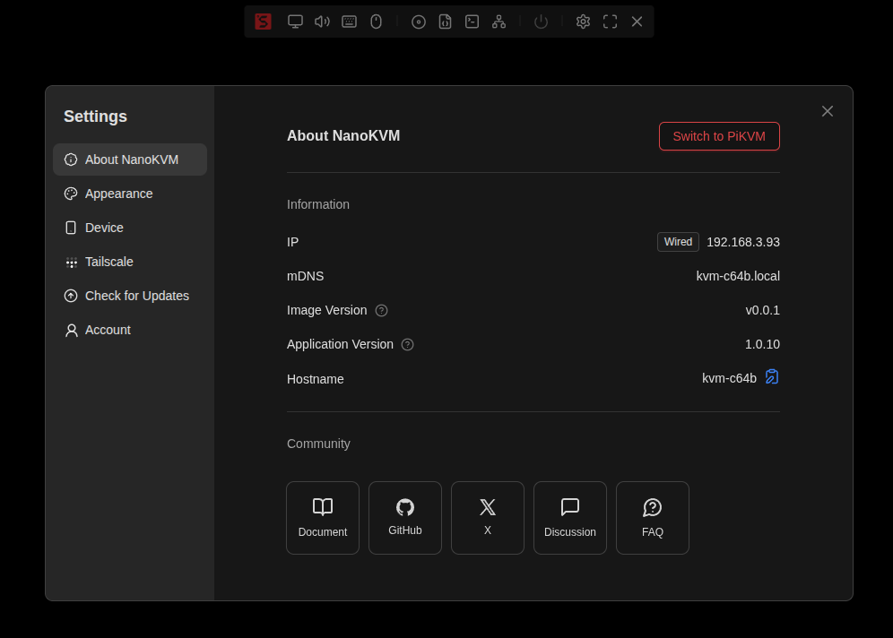
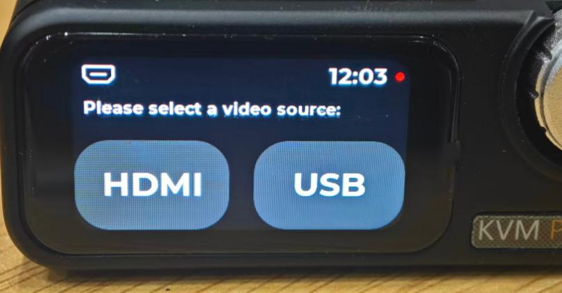
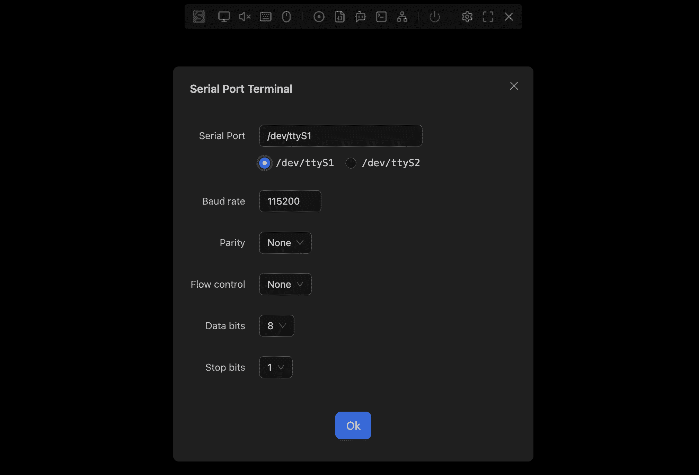

## Switching to PiKVM

In addition to running the NanoKVM framework, NanoKVM Pro is also compatible with the PiKVM software framework. You can switch between them as needed.

### Switching to PiKVM

By default, the NanoKVM Pro uses the NanoKVM framework. You can switch to PiKVM in `Settings` -> `About` -> `Switch Device`.



After clicking, the system will automatically restart and boot into the PiKVM framework. This process takes about 30 seconds. If it does not switch automatically for a long time, please refresh the webpage manually.


The default username and password for the PiKVM framework are also `admin`, `admin`. However, the two platforms use their own usernames and passwords, which are not unified. It is strongly recommended to change them after logging in.


> Some functions in the PiKVM framework require the use of a web terminal, such as Wi-Fi configuration and Tailscale setup.  
> When updating NanoKVM, the PiKVM framework will be updated simultaneously.

### Switching to NanoKVM

Switching back from the PiKVM system to NanoKVM is equally simple. Just go to `Options` -> `Switch to NanoKVM` and click `Switch Now`.


After clicking, the system will automatically restart and boot into the NanoKVM framework. This process takes about 30 seconds. If it does not switch automatically for a long time, please refresh the webpage manually.

## SSH & mDNS

### SSH

By default, NanoKVM-Pro disables SSH to ensure system security. If you need to enable the SSH service or use it when previewing new versions, you can turn it on as follows:

* **ATX/Desk**: From the web interface, go to `Settings` → `Device` → enable `SSH`
* **Desk**: From the screen, tap `Settings` → `SSH` to enable `SSH`

The default account is `root` with the password `sipeed`. If you change the web account password in the NanoKVM interface, the SSH password will be updated accordingly.

### mDNS

To enable or disable mDNS, use the following methods:

* **ATX/Desk**: From the web interface, go to `Settings` → `Device` → enable/disable `mDNS`
* **Desk**: From the screen, tap `Settings` → `mDNS` to enable/disable `mDNS`

## HDMI Input & Loop Out

> Currently, configuration is only supported on the Desk version’s screen.
> Support for ATX/Desk web interface will be added soon.

If HDMI functionality is not required, you can disable it to reduce power consumption. Operation:

On Desk: From the screen, tap `Settings` → `HDMI` to enter the HDMI configuration page, which has two options:

* **INPUT**: When disabled, Desk stops capturing HDMI input signals.
* **LOOP OUT**: When disabled, Desk stops outputting HDMI loop-out signals.

## Display Adjustment

### ATX

Currently, the OLED screen supports the following function:

* Short press the `USR` button to toggle the OLED display on or off.

### Desk

The LCD screen supports the following functions (all configured from the screen):

* Adjust backlight brightness: `Settings` → `Brightness`
* Standby clock: `Settings` → `Auto Clock`

  * When disabled, the LCD remains always on.
  * When enabled, the LCD switches to a clock display after a long period of inactivity.

## Factory Reset

### Quick Reset

* **ATX**: Long press the `USR` button until the screen shows `Reset`, then release.

  > Requires version ≥ `1.0.13`
* **Desk**: From the screen, tap `Settings` → `Help` to enter the Help page. Repeatedly tap the reset button until `0` appears, and the device enters recovery mode.

> **Note**: Do not perform any other operations until the device has fully restarted and refreshed the screen.

### Deep Reset

For details, see the [FAQ](https://wiki.sipeed.com/hardware/en/kvm/NanoKVM_Pro/faq.html#Image-Burning-Methods) section on `Image Burning Methods`.


## HDMI Secondary Display

Since NanoKVM-Pro can emulate a display, capture screen content, and features a small built-in screen, it can function as an HDMI secondary display.

In the UI, simply select **HDMI** as the video output source to display the captured video feed on the small screen.

When used as a desktop accessory, this feature can serve as a:
- Mini secondary monitor  
- System performance monitor  
- Video thumbnail player  
and more.


 <video playsinline controls muted preload src="../../../assets/NanoKVM/pro/extended/cat.mp4"></video>
 <video playsinline controls muted preload src="../../../assets/NanoKVM/pro/extended/video.mp4"></video>

## USB Expansion Features

### USB NCM

The NCM function allows the NanoKVM to simulate a USB network card, enabling users to log in directly via USB. To enable:

* **ATX/Desk**: From the web interface, go to `Settings` → `Device` → enable `Virtual Network`
* **Desk**: From the screen, tap `Settings` → `USB` → enable `NCM`

### USB Secondary Display

> **Supported only on NanoKVM-Desk**
> Currently, the USB secondary display function is supported only on Windows systems.

1. Download and extract the USB secondary display driver.

2. On Desk: From the screen, tap `Settings` → `USB` to enter the USB configuration page, then enable `Panel`.

3. On the controlled PC:

   * Open `Device Manager` → `Other devices`

   * Find `NanoKVMPro` → right-click `Properties` → `Driver` → `Update driver`

   * Choose `Browse my computer for drivers` → `Let me pick from a list of available drivers on my computer`

   * Double-click `Show all devices`

   * Under `Standard USB Host Controller` / `Standard system devices`, locate `USB Composite Device` → double-click to install

   > **Note**: Driver locations may vary depending on Windows version. Please search carefully.

4. After installation, a new `loop input to output` device will appear under `Other devices` in Device Manager.

5. Right-click this device → `Update driver` → `Browse my computer for drivers` → `Browse` → select the USB secondary display driver folder → `Next` → follow the prompts to complete installation.

6. Once installed, a new NanoKVM graphics device will appear under `Display adapters`.

7. On Desk, enter the secondary display page from the screen, select USB, and the Desk will function as a USB secondary display.

8. To disable, refer to step 2 to turn off `Panel`.

9. When re-enabling, some systems may require reinstalling the USB driver.

## Updates

NanoKVM Pro will periodically push new application versions that include new features and bug fixes. You can update the application version in `Settings` -> `Check for Updates`.


After clicking download, the new application installation package will be automatically downloaded, which includes `kvmcomm_x.x.x_arm64.deb`, `nanokvmpro_x.x.x_arm64.deb`, and `pikvm_x.x.x_arm64.deb`:

* `kvmcomm_x.x.x_arm64.deb` is responsible for driving the shared hardware in the NanoKVM and PiKVM frameworks;
* `nanokvmpro_x.x.x_arm64.deb` is the NanoKVM application software;
* `pikvm_x.x.x_arm64.deb` is the PiKVM application software.

Enabling the preview update feature will allow you to access the latest experimental application, which usually includes updated features but may lack stability. It is recommended to enable SSH before downloading preview updates.

You can also download specific versions and install them manually.

```shell
# Taking download of version 1.1.6 as an example
# Download file
sudo curl -L https://cdn.sipeed.com/nanokvm/preview/nanokvm_pro_1.1.6.tar.gz | sudo tar -xz

# Enter folder
cd nanokvm_pro_1.1.6

# Install deb packages
sudo apt install ./*.deb
```

> Software version 1.1.5 and later underwent an architectural adjustment. Older NanoKVM-Pro units can only fetch up to version 1.1.5 initially; after updating, they will be able to retrieve the latest versions.

## How to Use TF Card for Storage Expansion

The NanoKVM-Desk version features a TF card slot on the rear panel. Inserting a TF card expands the storage capacity and enables the `Virtual U Disk` function.

The TF card is mounted by default under the NanoKVM system's `/sdcard` directory. When `Virtual U Disk` is enabled, the TF card is simultaneously mounted as a mass storage device through the USB composite interface, allowing file transfer to the controlled host via this feature.

> Note:
> The ATX version cannot expose the TF card slot due to bracket size constraints.
> The first batch of Desk versions does not support TF card hot-plugging. Please insert the TF card when the device is powered off.
> The Virtual U Disk and image mounting functions cannot be enabled simultaneously.

## How to Perform Remote OS Installation

+ In addition to simulating keyboard and mouse devices, the USB-C port of NanoKVM Pro also emulates a USB drive device. This can be used to mount specified ISO files for tasks like OS installation. ISO files can be uploaded to the NanoKVM-Pro, which offers approximately 21GB of available space.

+ Unlike a regular USB drive, NanoKVM's virtual USB drive can store multiple ISO files simultaneously. Before powering on the target host, you can select which system ISO to mount via the options on the web interface.

After connecting the remote host and Nano KVM as described in the previous steps, log into the system via your browser. Click the CD-ROM icon and select the target system ISO to mount it.


Next, begin the OS installation process. Click `Power On (Short Press)`, then quickly press the F11 key (the key may vary for different hosts; please refer to your host's manual). Select the corresponding bootable ISO to start and complete the installation.


Note:

+ All uploaded ISO files are stored in the `/data` directory of the NanoKVM-Pro. Users can directly read and write this partition from within the NanoKVM terminal.
+ If you encounter issues mounting the ISO, try ejecting the ISO from the host first, then click to mount it again.

## How to Set a Static IP

NanoKVM-Pro introduced static IP configuration for Ethernet cards in version `1.1.6` and above. You can assign a static IP by configuring the `/boot/eth.nodhcp` file. The detailed setup method is as follows:

Create a file named `/boot/eth.nodhcp` in NanoKVM-Pro, then edit it according to the following rules:

- Each line represents a custom IP in the format: `addr/netid gw[optional]`;
- Multiple static IPs can be preset across multiple lines.

Simplified steps:

```shell
# Perform the following operations in the NanoKVM-Pro web terminal or SSH terminal
# Create the /boot/eth.nodhcp file and write the configuration
echo "192.168.2.2/22" > /boot/eth.nodhcp
```

> During system startup, the static IP address list in the `/boot/eth.nodhcp` file will be read. The setup process is as follows:
> 1. **Sequential detection**: The system reads the IPs in the file line by line and checks whether each one is already in use by another device on the network.
> 2. **Detection mechanism**: `arping` is used for detection first; if `arping` is not installed in the system, it automatically falls back to using the `ping` command.
> 3. **Set available IP**: Once the first available (unused) IP is found, the system immediately sets it as the static address for the device, and the process terminates.
> 4. **Fallback option**: If all IPs in the list are occupied, the system will attempt to obtain an IP automatically via DHCP.
> 5. **Guaranteed address**: If DHCP also fails to assign an address (for example, if there is no DHCP server on the network), the system will use the fixed guaranteed address `192.168.90.1`.

## How to Use Serial Port

NanoKVM Pro provides two sets of available serial ports: UART1/UART2. (Note: The ATX version, limited by the standard bracket size, does not have these ports externally exposed; only the internal solder pads are retained.)

The interface definition diagram for the Desk version is as follows:


- Using the Serial Terminal via the Web Interface

**Requires firmware version 1.1.5 or higher**

Navigate to: Web Menu Bar -> Terminal -> Serial Terminal. Here, you can configure the serial port number, baud rate, and other options.



- Send serial commands only:

```shell
# Set ttyS1 to 115200 baud rate
stty -F /dev/ttyS1 115200

# Send hexadecimal data 0x11, 0x22, 0x33
echo -n -e '\x11\x22\x33' > /dev/ttyS1
```

## How to Modify EDID

EDID (Extended Display Identification Data) is a set of data provided by a display device to the host, including device information, resolution and frame rate lists, color characteristics, audio capabilities, etc. The host adjusts the display settings based on the received EDID.

NanoKVM Pro supports modifying the EDID exposed by the virtual display. You can clone the EDID from a monitor or write your own EDID to achieve specific screen ratios, refresh rates, or color characteristics.

> Modifying the EDID may risk improper display functionality. Please proceed with caution. If issues arise, restore the default EDID.

Writing method:

```shell
# 1. Prepare the EDID file, typically 256 bytes, and scp it to the system
ls -l /root/customize.bin
# -rw-r--r-- 1 1000 1000 256 Aug 19 14:44 /root/customize.bin
# 2. Write the EDID
cat /root/customize.bin > /proc/lt6911_info/edid
# 3. Restore the default EDID:
cat /kvmcomm/edid/e18.bin > /proc/lt6911_info/edid
```

Version 1.2.0 comes with six built-in EDIDs. Below is the list of supported resolutions and their maximum frame rates for each EDID:

| Resolution   | Aspect Ratio | 3840×2160@30Hz | 3840×2160@39Hz | 2560×1440@60Hz | 1920×1080@60Hz | 3840×2400@30Hz | 3440×1440@60Hz |
|--------------|--------------|----------------|----------------|----------------|----------------|----------------|----------------|
| 3840×2400    | 16:10        | ×              | ×              | ×              | ×              | 30 FPS         | ×              |
| 3840×2160    | 16:9         | 30 FPS         | 39 FPS         | ×              | ×              | 30 FPS         | 30 FPS         |
| 3840×1600    | 21:9         | ×              | ×              | ×              | ×              | ×              | 50 FPS         |
| 3440×1440    | 21:9         | ×              | ×              | ×              | ×              | ×              | 60 FPS         |
| 2560×1440    | 16:9         | 83 FPS         | 83 FPS         | 83 FPS         | ×              | 60 FPS         | 60 FPS         |
| 2560×1080    | 21:9         | ×              | ×              | ×              | ×              | ×              | 75 FPS         |
| 1920×1200    | 16:10        | 60 FPS         | 60 FPS         | 60 FPS         | ×              | 60 FPS         | ×              |
| 1920×1080    | 16:9         | 120 FPS        | 125 FPS        | 60 FPS         | 60 FPS         | 60 FPS         | 60 FPS         |
| 1680×1050    | 16:10        | 60 FPS         | 60 FPS         | 60 FPS         | 60 FPS         | 60 FPS         | 60 FPS         |
| 1440×900     | 16:10        | 60 FPS         | 60 FPS         | 60 FPS         | 60 FPS         | 60 FPS         | 60 FPS         |
| 1280×1024    | 5:4          | 60 FPS         | 60 FPS         | 60 FPS         | 60 FPS         | 60 FPS         | 60 FPS         |
| 1280×960     | 4:3          | 60 FPS         | 60 FPS         | 60 FPS         | 60 FPS         | 60 FPS         | 60 FPS         |
| 1280×800     | 16:10        | 60 FPS         | 60 FPS         | 60 FPS         | 60 FPS         | 60 FPS         | 60 FPS         |
| 1280×720     | 16:9         | 120 FPS        | 120 FPS        | 60 FPS         | 60 FPS         | 60 FPS         | 60 FPS         |
| 1152×864     | 4:3          | 60 FPS         | 60 FPS         | 60 FPS         | 60 FPS         | 60 FPS         | 60 FPS         |
| 1024×768     | 4:3          | 60 FPS         | 60 FPS         | 60 FPS         | 60 FPS         | 60 FPS         | 60 FPS         |
| 800×600      | 4:3          | 120 FPS        | 120 FPS        | 60 FPS         | 60 FPS         | 60 FPS         | 60 FPS         |

> Resolutions not listed in this table may experience display errors or fail to display.
> Lower resolutions might have compatibility issues, resulting in no display or screen flickering.

## How to Modify USB Information

Versions `1.2.0` and above support customizing USB information. The method is as follows:

```shell
# Modify PID
echo "0xXXXX" > /boot/usb.pid
# Modify VID
echo "0xXXXX" > /boot/usb.vid
# Modify Manufacturer
echo "XXXX" > /boot/usb.manufacturer
# Modify Product Name
echo "XXXX" > /boot/usb.product
# Apply changes
/kvmapp/scripts/usbdev.sh restart
```

## About Latency
NanoKVM-Pro has made significant improvements in latency, with end-to-end latency controlled at around 100ms at any resolution.

> The latency mentioned by other competitors is not end-to-end latency, but one-way latency. The actual end-to-end latency is much higher than what they claim.
> Actual tests show that choosing different frame rates has little impact on end-to-end latency, meaning the latency for 1080P120 and 1080P30 is almost the same.

| Video Mode    | End-to-End Latency |
|---------------|-------------------|
| Direct H264   | 100ms             |
| WebRTC H264   | 100ms             |
| MJPEG         | 100~150ms         |

Note: We use "end-to-end" latency to reflect the actual latency perceived by users:
The delay from when a user moves the mouse in the local browser window to when the remote desktop mouse starts moving in the browser.

You can use [this Python script](../../../assets/NanoKVM/pro/extended/lat_mouse.py) to actually measure the "end-to-end" latency. Maximize the browser window or place it on the left side, ensuring the current remote desktop background color has maximum contrast with the mouse pointer color (for example, use a white background for a black pointer, or a black background for a white pointer).

```
python lat_mouse.py TEST_CNT RECORD_NAME
```

4K30 webrtc end-to-end latency record:

