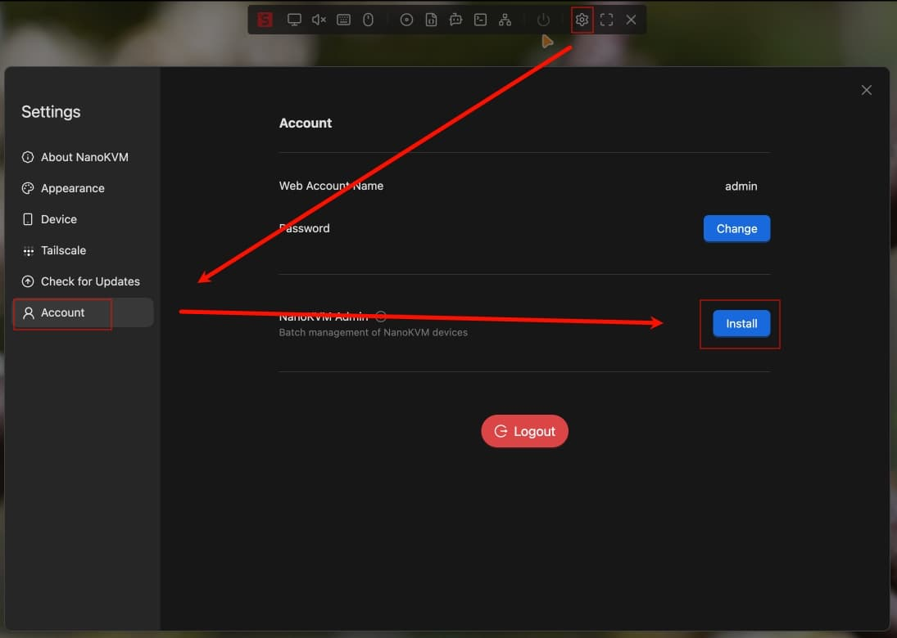

## Introduction

NanoKVM Admin is a tool designed for batch management of NanoKVM devices. It provides a simple web interface to help users centrally manage all NanoKVM devices within the local network. Whether you're a home lab user with a few devices or an operations professional managing dozens of devices, NanoKVM Admin makes it easy to discover and access your KVM devices with a single click.

Key Features:

- **Auto Discovery**: One-click scanning of NanoKVM devices on the local network based on mDNS protocol.
- **Manual Addition**: Support for manually adding devices with specific IP addresses, suitable for complex network environments.
- **Centralized Management**: View all devices in a unified web interface.
- **Quick Access**: Jump directly to individual NanoKVM access page with a single click.

## Installation

Find NanoKVM Admin in "Settings - Account", click "Install" and wait for the installation to complete.



After installation, you can click the "Open" button to open the page. Alternatively, enter the access address "NanoKVM-Pro IP:8999" in your browser's address bar (for example: `https://192.168.3.102:8999`).


## Device Addition

NanoKVM Admin provides two methods for adding devices. You can choose according to your actual situation.

### Method 1: mDNS Auto Scan

Suitable for environments where devices are on the same network segment and the router supports mDNS broadcasting.

1. Ensure NanoKVM devices have mDNS discovery enabled.
2. Click the "Discover Device" button.
3. The system will automatically search for online NanoKVM devices in the network.
4. After the scan is complete, the list will display information about discovered devices.


### Method 2: Manual Addition

Suitable for cross-network segment access or when mDNS cannot discover devices.

1. Click the "Add Device" button.
2. Fill in the device information in the dialog box that appears.
3. Click "Ok" to save.


## Device Management and Access

### Device Dashboard

After adding devices, all devices will be displayed in a list on the main dashboard. You can see:

- **IP Address**: The device's IP address, which is unique and cannot be edited.
- **mDNS Address**: The device's mDNS address.
- **Online Status**: Whether the device is online. The service periodically scans and updates the status of devices on the local network.
- **Other Information**: Such as MAC address, source, and other details.
- **Action Buttons**: Visit, edit, and delete buttons.


### Accessing Devices

When you need to control a specific device:

- Click the device IP to access the device via IP address.
- Click the device mDNS to access the device via mDNS address.
- Click the "Visit" icon in the actions to access the device via IP address.

### Editing and Deletion

- **Modify Information**: Click the "Edit" icon in the actions to modify device information such as mDNS and notes.
- **Delete Device**: Click the "Delete" icon in the actions to remove the device from the management list.

## User Management

Click "User List" on the left side to enter the user management interface. Here you can perform user addition, editing, and deletion operations.


## Service Management

The service runs through systemctl and can be operated with the following commands:

```bash
systemctl start/stop/restart kvmadmin.service
```

### Service Information

- Service Installation Location: `/kvmadmin`
- Service Configuration File: `/etc/kvmadmin/server.yaml`
- SQLite Database File: `/etc/kvmadmin/kvm.db`

### Service Certificate

Modify the `cert.crt` and `cert.key` parameters in the configuration file `/etc/kvmadmin/server.yaml`, then execute the following command to restart the service: `systemctl restart kvmadmin.service`.

### Uninstalling Service

Click the "Uninstall" button on the settings page to uninstall the service. This operation will delete all installation files and data. Please proceed with caution.


