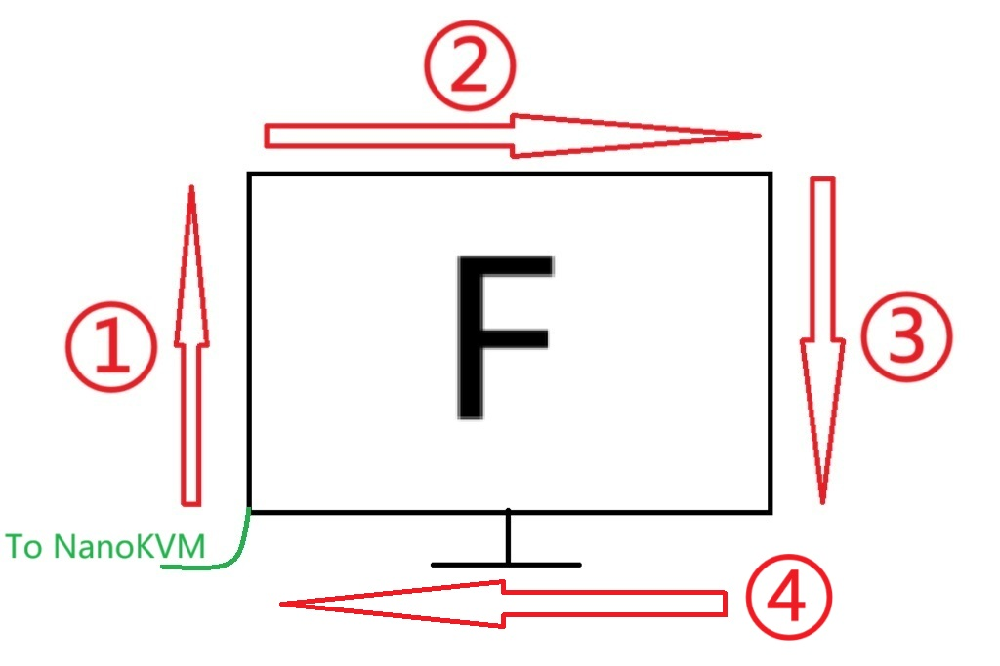
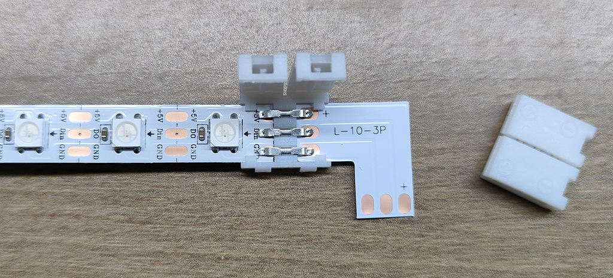
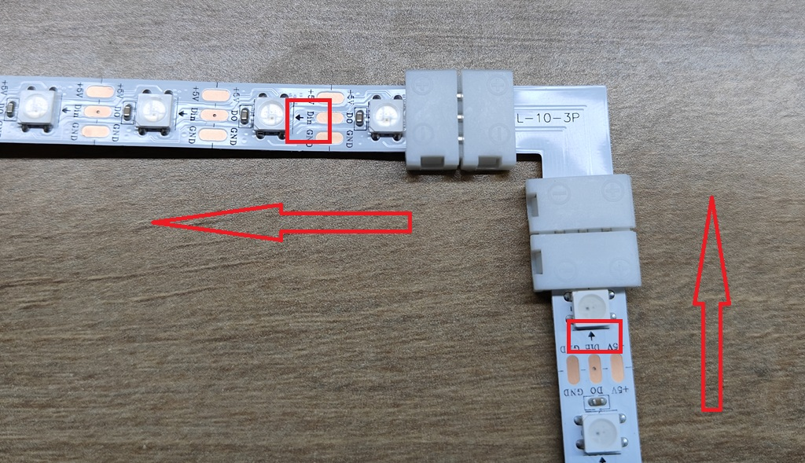

## Introduction
The Screen-Sync LED Strip is a signature expansion accessory for NanoKVM-Pro.

When using NanoKVM-Pro with a desktop computer, it can capture the screen content and control an LED strip to display colors matching the edges of your screen—creating a dreamy, immersive lighting effect!

<video playsinline controls muted preload src="../../../assets/NanoKVM/pro/ledstrip/sync_led.mp4"></video>

⚠️ Note: To use this feature, ensure your power supply meets the specification: 5V ≥ 3A. 

## Package Accessories Overview

If you purchased the LED strip package, you will receive the following items:

1. 1-to-2 data cable
2. LED strip adapter kit (includes 6 adapters and 3 right-angle cables)
3. One roll of LED strip

---

## Installation Steps

### Confirm Installation Orientation

> Segment ④ is optional. You can choose between three-sided or four-sided mode based on your needs.
>
> The sampling order of the strip is: **Bottom-left → Top-left → Top-right → Bottom-right → Bottom-left**.
> Ensure consistency during installation. The green end is the strip’s Type-C connector, and the other end connects to NanoKVM-Pro via the adapter cable.

### Cut the LED Strip

Cut the LED strip according to the screen’s width and height.

> The number of LEDs on opposite sides must remain consistent.

Example: Screen height 18 LEDs, width 30 LEDs.

* Segment ①: 18 LEDs
* Segment ②: 30 LEDs
* Segment ③: 18 LEDs
* Segment ④: 30 LEDs

When cutting, make sure to cut along the red line (the midpoint between contacts):

### Open the Adapter Connector

In the image below, the right side shows the **side view** of the adapter connector. Pry open the connector at the red-marked area, resulting in the state shown on the left:

### Insert the Cables

Insert the LED strip and right-angle cable into opposite sides of the adapter connector, ensuring that the metal contacts align with the bridging metal inside the connector. Close the connector to secure.

Connect the other end of the right-angle cable. **Ensure that the arrow direction on the LED strip (signal flow direction) remains consistent**.
Repeat this process until all strips are connected.

### Attach the LED Strip

Peel off the protective film of the double-sided adhesive on the back of the strip, then firmly attach it to the back of the screen.

### Connect to NanoKVM-Pro

The connection layout is as follows:

* ① Connect to NanoKVM-Pro PWR port
* ② Connect to LED strip
* ③ Connect to power adapter

> ⚠️ Note: Please ensure the power supply specification is **5V ≥ 3A**.

---

## Enable the LED Strip

* Enable via Web

  1. Log in to NanoKVM via a browser
  2. Navigate to **Settings → Device → LED Strip Settings**, enable it and set the correct parameter.

  

* Enable via Desk UI

  1. Go to the `Settings` page
  2. Select `Ambilight` to enter the sub-settings page
  3. Configure the number of LEDs and enable the feature

---

## Demonstration

