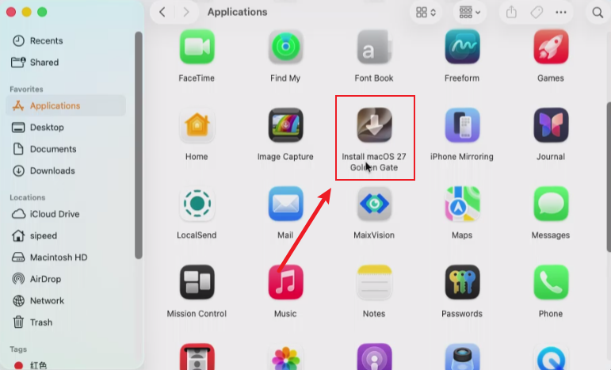
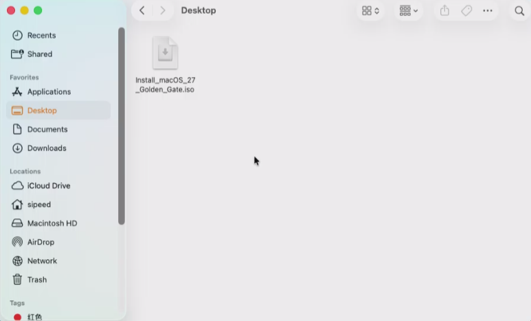
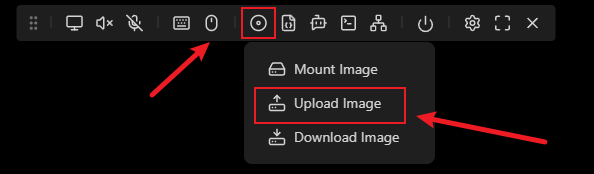
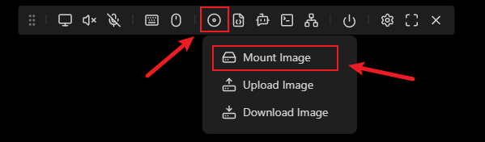
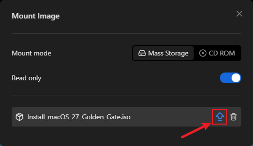

## Introduction

The USB-C port of NanoKVM Pro emulates a USB drive, so an ISO file stored on the NanoKVM Pro can be mounted to the target host. This guide shows how to use that feature to reinstall macOS on a target Mac: build a bootable ISO from Apple's full installer on a working Mac, upload it to the NanoKVM Pro, mount it to the target Mac, and boot the target Mac from it to run the installer. The whole process runs through the NanoKVM Pro, so the target Mac needs no extra monitor or keyboard.

This is useful when:

- the target Mac cannot start normally (a damaged system, stuck at the boot screen, a forgotten password, and so on) and needs a reinstall or a clean install of macOS;
- the target Mac still boots and you only want to restore it to factory state.

> A reinstall, especially an install after erasing the disk, wipes all data on the target disk. Make sure the data is backed up or no longer needed.

This guide uses macOS 27 (Golden Gate) as an example. For other versions, see [Use a Different macOS Version](#Use-a-Different-macOS-Version).

## Preparation

| Item | Description |
| --- | --- |
| A Mac to build the image | A working Mac with an administrator password (`sudo` is required to build the ISO) and enough free disk space |
| Network | The Mac that builds the image needs internet access to download the installer; the NanoKVM Pro must be reachable from your browser |
| NanoKVM Pro | Wired up and connected to the network as described in the quick start guides, and able to log in to the web interface. See [NanoKVM-Desk Quick Start](./desk_start.md) / [NanoKVM-ATX Quick Start](./atx_start.md) |
| Target Mac | The Mac to reinstall. No extra monitor or keyboard is needed; video and input both go through the NanoKVM Pro |
| Cables | An HDMI cable and a USB-C data cable (the HID / virtual USB drive port on the NanoKVM Pro) |

> Disk space: the macOS image in this guide is about 18.45 GB. While the image is being built, the installer, the temporary files and the final ISO all take up space at the same time, so around 50 GB of free space on the build Mac is recommended (actual usage may vary).

## Download the Full macOS Installer

On the Mac you use to build the image, open Terminal and run:

```shell
softwareupdate --fetch-full-installer --full-installer-version 27.0
```

- `--full-installer-version` takes the version to download, `27.0` in this guide;
- the command downloads the full installer (a large file). How long it takes depends on your network, so wait for it to finish and do not close the terminal;
- you must use a **full installer**; incremental updates from the App Store will not work.

When the download finishes, the installer appears in `/Applications`:

```
/Applications/Install macOS 27 Golden Gate.app
```

You can confirm it in Finder → Applications. Double-clicking the icon shows the version information (quit it afterwards rather than continuing the installation).



## Create a Bootable ISO Image

Apple only ships `createinstallmedia`, which writes a bootable USB drive rather than an ISO. This guide uses the open-source tool [createinstalliso](https://github.com/BITespresso/createinstalliso), which packages the downloaded installer into a bootable ISO image.

1. Download the script to `~/bin` and make it executable:

```shell
mkdir -p ~/bin && curl -fsSL https://raw.githubusercontent.com/BITespresso/createinstalliso/master/createinstalliso -o ~/bin/createinstalliso
chmod +x ~/bin/createinstalliso
```

2. Run the script as administrator to write the ISO to the desktop:

```shell
sudo ~/bin/createinstalliso -i ~/Desktop --applicationpath /Applications/Install\ macOS\ 27\ Golden\ Gate.app
```

Arguments:

| Argument | Description |
| --- | --- |
| `-i` / `--isodirectory` | Output directory for the ISO, `~/Desktop` here |
| `--applicationpath` / `-a` | Path to the macOS installer app; escape spaces in the path with `\` |

You will be asked for the administrator password (the terminal shows nothing while you type). The script then prints its progress. Building the image mounts disk images and converts them, so it takes a while; do not interrupt the terminal.

3. When it finishes, the ISO file appears on the desktop:

```
~/Desktop/Install macOS 27 Golden Gate.iso
```

## Rename the ISO File

Rename the ISO to remove the spaces from the file name:

```
Install macOS 27 Golden Gate.iso
        ↓
Install_macOS_27_Golden_Gate.iso
```

Spaces in the file name can make the upload fail, so replace them with underscores first.

The renamed `Install_macOS_27_Golden_Gate.iso` is the image you will upload (about 18.45 GB in this guide).



## Upload the Image to NanoKVM Pro

1. Log in to the NanoKVM Pro web interface in your browser;
2. Click the CD-ROM icon in the control bar:


3. Choose `Upload Image` from the menu:



4. Select the `Install_macOS_27_Golden_Gate.iso` you built above and wait for the upload to finish.

Notes:

- Uploaded images are stored in the `/data` directory on the NanoKVM Pro, with about 21 GB available. The macOS image in this guide is about 18.45 GB, so it fits but leaves little room; avoid storing several large images at once;
- Upload time depends on your LAN speed and the size of the ISO. Do not close the page or disconnect from the network while uploading;
- The NanoKVM Pro can store several images at the same time; pick one of them when mounting.

## Connect the Target Mac and Mount the Image

1. With the **target Mac powered off**, connect the NanoKVM Pro to it:
   - connect the HDMI-IN port to the video output of the target Mac (for video capture);
   - connect the HID port to a USB port on the target Mac (provides the virtual keyboard, mouse and USB drive);
   - connect the PWR port to an external 5V/1A or better power supply (the NanoKVM Pro has relatively high power requirements, and some Mac USB ports do not supply power while the Mac is off, so do **not** power it from the Mac).
   See the wiring section of the quick start guides for the exact connections: [Desk wiring](./desk_start.html#Wiring) / [ATX wiring](./atx_start.html#Wiring).
2. In the web interface, click the CD-ROM icon and choose `Mount Image` from the menu:



3. In the mount window, select `Install_macOS_27_Golden_Gate.iso` and click the button at the right of that row to mount it.



4. Once mounted, the web interface usually shows which image is mounted. The target Mac now behaves as if a USB drive holding the macOS installer were plugged in.

## Boot the Target Mac from the Image

With the target Mac **powered off**, press and hold the power button until "Loading startup options" appears, then release it.

In the startup options screen, select the installation media `Install macOS 27 Golden Gate` mounted by the NanoKVM Pro to enter the installer environment.


That screen also lists the internal disk `Macintosh HD` and `Options`; choosing `Options` also enters macOS Recovery.

> This guide was verified on a Mac with Apple silicon (M-series).

## Finish the Installation

Once the installer environment starts, it looks like macOS Recovery: choose `Reinstall macOS` and select the target disk. For a clean install, you can erase the target disk in `Disk Utility` first.

> Erasing a disk removes all data on it, so make sure you have a backup.

The target Mac restarts several times during the installation. Do not disconnect the NanoKVM Pro and do not cut the power; just wait for the installation to finish.

## Use a Different macOS Version

This guide uses macOS 27. To install another version, replace the version number and the installer name, for example:

```shell
# 1. Download the full installer for the version you want (check which version Apple actually offers)
softwareupdate --fetch-full-installer --full-installer-version 15.6

# 2. Build the ISO (replace the installer path with the real name)
sudo ~/bin/createinstalliso -i ~/Desktop --applicationpath /Applications/Install\ macOS\ Sequoia.app
```

## Troubleshooting

### Target Mac Cannot See the Mounted Image or Boot from It

1. Make sure the image is actually mounted (the web interface reports success);
2. Eject the image in the web interface and mount it again;
3. Re-enter the startup options screen and select the mounted installation media manually.

### The Upload Is Interrupted or the Uploaded Image Is Unusable

Upload it again, keeping the page open and the network stable during the upload. Afterwards you can check in the NanoKVM Pro web terminal whether the image file exists and is complete under `/data`.

### The Upload Keeps Failing on an Unstable Network

If network fluctuations make the browser upload fail no matter what, push the image to the `/data` directory of the NanoKVM Pro over SSH instead:

1. Enable `SSH` in `Settings` → `Device` (SSH is disabled by default on the NanoKVM Pro), or on the Desk model, tap `Settings` → `SSH` on the screen;
2. On the Mac you used to build the image, run:

```shell
rsync -avP ~/Desktop/Install_macOS_27_Golden_Gate.iso root@<NanoKVM-IP>:/data/
```

Replace `<NanoKVM-IP>` with the actual IP of your NanoKVM Pro. The default account is `root` with the password `sipeed`; if you changed the web password, the SSH password follows it.

`-P` is shorthand for `--partial --progress`, so a partially transferred file is kept when the transfer is interrupted and you can run the same command again to continue, which helps on an unstable network.

Once the transfer finishes, the image shows up in the image list in the web interface, and the mounting steps above apply as usual.
