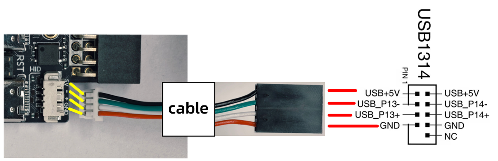
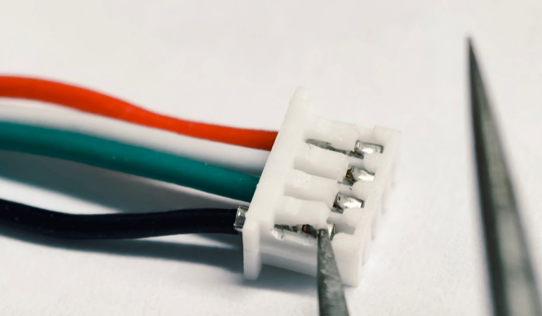
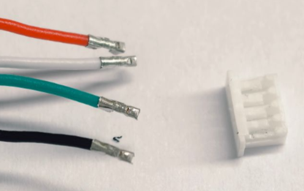

## Method 1: Connect as Shown Below

Note: The black 5V cable needs to be cut at the position indicated in the figure below. Avoid having the wire end touch other components, which could cause a short circuit.

## Method 2: Requires Swapping Some Wire Positions

1.  Use a tool like tweezers, a toothpick, or a small screwdriver to lift the plastic tab of the 1.27mm terminal header.

2.  Pull out the cable (repeat steps 1/2 for all 4 cables).

3.  Press here.

4.  Use a tool like tweezers, a toothpick, or a small screwdriver to lift the plastic tab for the red wire on the 2.54mm terminal header.

5.  Cut both ends of the red wire. Be sure to insert the scissors deep into the heat shrink tubing to cut, avoiding any exposed wire ends.

6.  Insert the 1.27mm wires into the connector as shown in the figure below.

