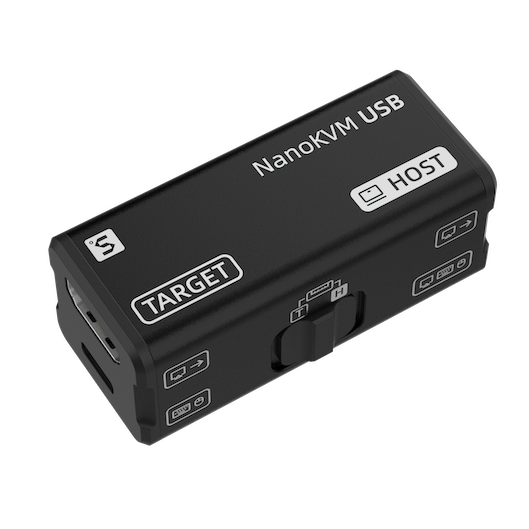
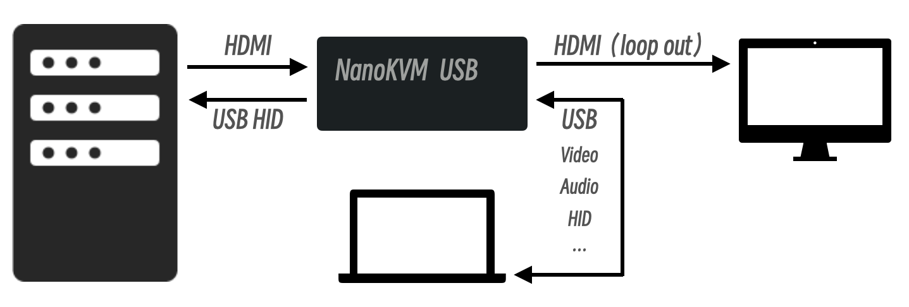
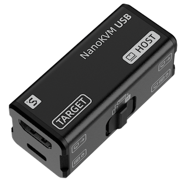

## Introduction

The NanoKVM-USB is a convenient tool for operations and multi-device collaboration. It allows you to perform maintenance tasks without the need for a keyboard, mouse, or monitor. Using just a single computer and no additional software downloads, you can start graphical operations directly through the Chrome browser.

NanoKVM-USB captures HDMI video signals and transmits them to the host via USB 3.0. Unlike typical USB capture cards, NanoKVM-USB also captures keyboard and mouse input from the host and sends it to the target machine in real-time, eliminating the need for traditional screen and peripheral connections. It also supports HDMI loop-out, with a maximum resolution of 4K@30Hz, making it easy to connect to a large display.

Notably, NanoKVM-USB comes with a USB-A port that supports switching between HOST and TARGET sides. When a USB drive is connected, data can be easily transferred between two computers. Additional features can be explored freely.

## Use Cases

## Interface

## Parameters

| |NanoKVM-USB 4K | NanoKVM-USB | Mini-KVM |
| --- | :---: | :---: | :---: |
| HDMI Input | 4K@60fps | 4K@30fps | 1080P@60fps |
| HDMI Loopback | 4K@60fps | 4K@30fps | None |
| USB Capture | 4K@60fps | 2K@30fps | 1080P@60fps |
| USB Interface | USB3.0 | USB3.0 | USB2.0 |
| USB Switch | Y | Y | Y |
| Keyboard&Mouse | Y | Y | Y |
| Clipboard | Y | Y | Y |
| Software | No setup needed, works in chrome | No setup needed, works in chrome | Host App install required |
| Latency | 50-100ms | 50-100ms | 50-100ms |
| Volume | 57x25x23mm | 57x25x23mm | 61x13.5x53mm |
| Shell Material | Aluminum Alloy | Aluminum Alloy | Aluminum Alloy |
| Color | Black | Black / Blue / Red | Black |
| Price | ~~$69~~ `$59`  | `$39.9 / $49.9` | `$89 / $109` |

  
  
  

## Purchase Links

- [AliExpress Store](https://www.aliexpress.com/item/1005008473747668.html)
- [Taobao Store](https://item.taobao.com/item.htm?id=898108163819)
- [Pre-sale Page](https://sipeed.com/nanokvm/usb)

## Feedback

If you encounter any issues or have suggestions, please contact us through the following channels:

- [Github issues](https://github.com/sipeed/NanoKVM)
- [MaixHub Forum](https://maixhub.com/discussion/nanokvm)
- QQ Group: 703230713
