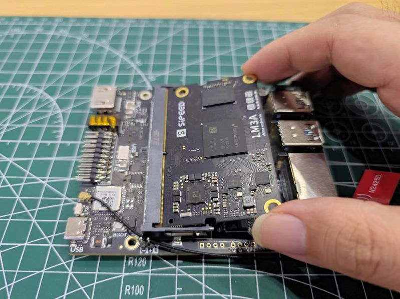

## Unbox Contents

### Basic Suit

The package you received contains the following packaging:

Opening the white cardboard box, you can see the LicheePi3A board and basic accessories (silicone grease sheet+cooling fan+USB-C cable):

If you find missing relevant components after opening the box, please contact customer service for consultation.

### Accessories

LicheePi 4A also has a wide range of accessories to choose from, as shown in the following figure:

Purchase instructions:

|Accessory Name | Selection Instructions|
|---|---|
|Aluminum alloy casing | Suitable as a casing for small hosts and soft routers|
|10.1-inch touch screen | 1280x800 4lane MIPI, suitable for use as a car infotainment system and Android debugging|
|USB camera | 5MP USB camera, onboard microphone, suitable for use as an openCV camera|
|PoE power module | 5V2.4A PoE power module, gateway applications use Ethernet PoE power supply|
|12V power supply | 12V2A power adapter, to choose when connecting many power consuming peripherals to the board|
|RV debugger Plus | UART+JTAG debugging board, connect system serial port terminal for debugging|

##Assemble the board

###SOM installation
 
By default, LM3A SOM is already installed on the motherboard. If you need to upgrade/replace SOM, you can follow the instructions below to remove and install SOM

1. remove SOM:
   <table>
    <tr>
      <td colspan=2>First, use your fingers to flick the shrapnel outwards to unlock SOM, and then remove SOM</td>
    </tr>
    <tr>
      <td></td>
      <td></td>
    </tr>
   </table>

2. install SOM:
   <table>
    <tr>
      <td colspan=2>First insert the SOM diagonally into the connector slot, then press the SOM, and the two side tabs will automatically lock the SOM</td>
    </tr>
    <tr>
      <td></td>
      <td></td>
    </tr>
   </table>

### Installation of radiator

LicheePi 3A is a high-performance SBC that requires the installation of an active heat sink to dissipate heat from the SOM. Otherwise, it may automatically downshift due to core overheating at full load, resulting in suboptimal performance.

1. Install thermal conductive silicone grease sheet
Remove the thermal conductive silicone grease sheet, tear off both sides of the film, place the silicone grease sheet in the position shown in the figure and gently press it to fix it (the silicone grease sheet has a certain degree of viscosity to fix it), paying attention to fully covering the main chip and two memory chips

2. Install the cooling fan

Align and install a 30mm cooling fan on the silicone grease sheet, and gently press and secure it in place.

3. Install the cooling fan power supply
4. 
By default, the fan power supply should have been inserted when received. If the fan power cord is disconnected, please insert it as shown in the following figure, paying attention to the order of the power cords. Installing the fan in reverse will not rotate.
Note that the power supply of the pin at this position is controlled by the Linux kernel and requires correct configuration of the kernel to rotate. If the fan does not rotate, it can also be plugged into the 5V+GND of the 20 pin pin below the board to test the quality of the fan.

### WIFI antenna installation
By default, the WIFI antenna is already installed on the motherboard. If it is removed, please install it back according to the following diagram:

### Assembly completed

The assembled state is as follows:

## Startup board
The LicheePi 3A has pre burned the basic system image upon release, allowing you to quickly start up and experience it!

Connect the monitor (self provided) to the HDMI port of the LicheePi 3A using an HDMI cable (self provided), and connect the matching USB-C cable to a USB power supply with at least 5V2A output (self provided). The LicheePi 3A will start up and the default image will boot up to the login interface of the desktop system within 30 seconds. The first login will enter the user account settings sequence.

The default account password configuration for the image is as follows:

Account: 'root', Password: 'bianbu';

Insert the keyboard and mouse, enter your username and password to log in and experience it. Please refer to the following chapters for specific instructions.

If the above operation fails to light up the monitor and enter the system, there may be the following possibilities for self-examination:

1. Check if the power supply voltage is normal, if the USB-C port connection is normal, and if the power indicator light is on
2. Check if the radiator is installed properly and if the fan is rotating
3. Check if HDMI is securely connected, if the monitor is turned on, and try replacing the monitor for testing
4. It may also be due to missing firmware burning at the factory. Please follow the instructions in the chapter to perform image burning and try again
5. If none of the above works, please contact customer service and after-sales service
   
## POE module installation
The POE module requires manual welding and installation by the user. Please weld it according to the following diagram:

   

> Note that the POE module cannot be installed into the aluminum alloy casing after welding.

## Hardware Diagram

After completing the initial lighting of the board, you can take a moment to familiarize yourself with the hardware of LicheePi 3A, which will facilitate possible maintenance work in the future.

 

