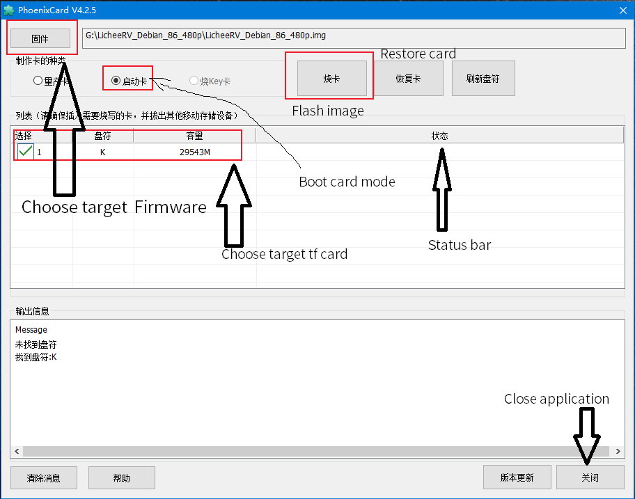

# Lichee RV system image

There are two system images for Lichee RV and they are tina and debian.
**Tina** is a small linux image while **Debian** is a desktop image.

## Prepare

1. Lichee RV Core board
2. TF card (It's suggested to use tf card provided by sipeed beacuse other card might fail to burn or fail to boot system)
3. Burn tool [PhoenixCard](https://dl.sipeed.com/shareURL/LICHEE/D1/Lichee_RV/tool)
4. System image
   - [Tina](https://dl.sipeed.com/shareURL/LICHEE/D1/Lichee_RV/SDK/image) 
   - Debian: Download from [mega](https://mega.nz/folder/lx4CyZBA#PiFhY7oSVQ3gp2ZZ_AnwYA)

| Image name    | Meaning                                                                                                                    | Note |
| ------------- | -------------------------------------------------------------------------------------------------------------------------- | ---- |
| LicheeRV      | RISCV D1 Linux image only for sipeed                                                                                  | ---  |
| Tina          | Tina openwrt system image                                                                                                 | ---  |
| debian        | Riscv debian system image                                                                                                 | ---  |
| 86panel       | [taobao 86panel](https://item.taobao.com/item.htm?spm=a230r.1.14.18.30b534187YMsRx&id=663345415205&ns=1&abbucket=7#detail) | ---  |
| dock          | [taobao dock](https://item.taobao.com/item.htm?spm=a1z10.3-c-s.w4002-21410578028.20.35765d54K9XCOt&id=666274331852)        | ---  |
| hdmi          | Display to HDMI screen                                                                                         |      |
| 800480 / 480P | Display to LCD screen，it fits resolution 800*480 or 480P (640X480)                                                    |      |
| 8723ds        | This image supports 8723ds WIFI / BLE driver                                                                                    |      |
| xr829         | This image supports xr829 WIFI / BLE driver                                                                                     |      |
| waft          | Whether waft is built in  image                                                                                                     |      |

## Burn image

Connect you sd card reader inserted with sd card with your computer

Use SD Card Formatter to format your TF card first: Click Refresh then choose your target disk carefully, click Format

Follow the steps below to complete burning

- Run PhoenixCard
- Click `Image` marked with ① to choose your target firmware
- We choose `Start up` marked with ② 
- Click `Burn` marked with ③ to burn your target firmware into tf card
- From `Status bar` marked with ④ to see your progress；If it's red when finishing this means it fails burning, then we should rerun `SD Card Formatter` to format the TF card to increase its success possibility.
- Click `Close` to close PhoenixCard

> Not each card can successed be burned, if you can't do this we suggest you buy an image card we provide

Waiting for finishing burning, It will be faster if flashing Tina OS and it will take about 10 minutes if flashing Debian 

## Run OS
The username and passward are as follows:

- Tina   OS username：`root`   password：`tina`

- Debian OS username：`sipeed` password：`licheepi`

Insert tf card, and we can see the startup information in the serial port tool

> Debian startup message

  
Click to see Debian startup log

<pre><code class="language-shell">
[270]HELLO! BOOT0 is starting!
[273]BOOT0 commit : 27369ab

OpenSBI v0.6
   ____                    _____ ____ _____
  / __ \                  / ____|  _ \_   _|
 | |  | |_ __   ___ _ __ | (___ | |_) || |
 | |  | | '_ \ / _ \ '_ \ \___ \|  _ < | |
 | |__| | |_) |  __/ | | |____) | |_) || |_
  \____/| .__/ \___|_| |_|_____/|____/_____|
        | |
        |_|
</code></pre>

> Tina startup message

  
Click to see Tina startup log

<pre><code class="language-shell">
BusyBox v1.27.2 () built-in shell (ash)

    __  ___     _        __   _
   /  |/  /__ _(_)_ __  / /  (_)__  __ ____ __
  / /|_/ / _ `/ /\ \ / / /__/ / _ \/ // /\ \ /
 /_/  /_/\_,_/_//_\_\ /____/_/_//_/\_,_//_\_\
 ----------------------------------------------
 Maix Linux (Neptune, 5C1C9C53)
 ----------------------------------------------
root@MaixLinux:/#
</code></pre>

## Qusetions

[Questions](./problems.md)