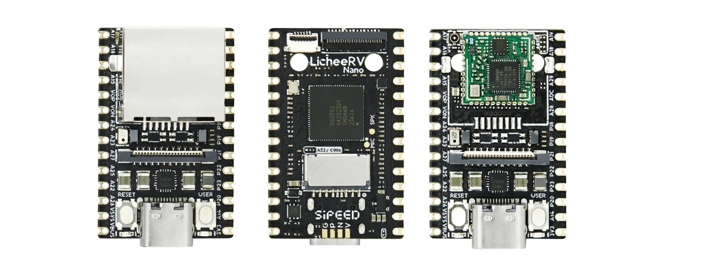

##  Introduction

The LicheeRV Nano is a mini-sized development board (measuring only 22.86*35.56mm), equipped with the SG2002 processor. It features a powerful core running at 1GHz (RISC-V/ARM options available) and a smaller core at 700MHz RISC-V, along with 256MB DDR3 memory, and an integrated 1Tops NPU. The board includes a wealth of interfaces such as MIPI-CSI, MIPI-DSI, SDIO, ETH, USB, SPI, UART, I2C, etc., allowing for the expansion of a wide variety of applications. Its through-hole/half-hole design facilitates easy mass production and soldering.

## Specifications

| Item                | Specification                                                |
| ------------------- | ------------------------------------------------------------ |
| CPU                 | SOPHGO SG2002;  Major core: 1GHz RISC-V C906 / ARM A53 (selectable);  Minor core: 700MHz RISC-V C906; Low-power core: 25～300M 8051 |
| NPU                 | 1TOPS INT8, supports BF16                                    |
| Memory              | Integrated 2Gbit (256MByte) DDR3                             |
| Storage             | Bootable from either TF card / SD NAND (SD NAND pads under TF card slot) |
| Video Interface     | Video Output: 2 lane MIPI DSI output, standard 31pin interface, supports 6pin capacitive touchscreen  Video Input: 4 lane MIPI CSI input, 22Pin interface, supports dual CSI split |
| Audio Interface     | Audio Output: Onboard PA amplifier, can directly connect speakers under 1W  Audio Input: Onboard analog silicon microphone, capable of direct sound reception |
| Wired Connection    | E suffix version supports 100M RJ45 connector                |
| Wireless Connection | W suffix version supports 2.4G / 5.8G dual-band WiFi6 + BLE5.4 |
| USB                 | 1 x USB2.0 OTG Type-C                                        |
| IO Interface        | 2 x 14pin 2.54 pin headers, 800mil spacing, breadboard-friendly |
| Buttons             | 1 x RST button + 1 x BOOT button                             |
| LEDs                | 1 x Power LED, 1 x User LED                                  |
| Operating System    | Buildroot Linux / Debian                                     |
| Dimensions          | 22.86*35.56mm                                                |

##  Version Comparison

|  **Specification**   | **Basic System** | **Microphone/Speaker** | **Ethernet** | **WiFi6/BT5** |
| :------------------: | :--------------: | :--------------------: | :----------: | :-----------: |
| **LicheeRV-Nano-B**  |       Yes        |          Yes           |      No      |      No       |
| **LicheeRV-Nano-E**  |       Yes        |          Yes           |     Yes      |      No       |
| **LicheeRV-Nano-W**  |       Yes        |          Yes           |      No      |      Yes      |
| **LicheeRV-Nano-WE** |       Yes        |          Yes           |     Yes      |      Yes      |

## Hardware Resources

Datasheets, schematic diagrams, dimension drawings, and more can be found here: [Click Here](http://cn.dl.sipeed.com/shareURL/LICHEE/LicheeRV_Nano)

- [Board Specification](http://cn.dl.sipeed.com/shareURL/LICHEE/LicheeRV_Nano/01_Specification)
- [Board Schematic](http://cn.dl.sipeed.com/shareURL/LICHEE/LicheeRV_Nano/02_Schematic)
- [Board Designator Drawing](http://cn.dl.sipeed.com/shareURL/LICHEE/LicheeRV_Nano/03_Designator_drawing)
- [Board Dimensional Drawing](http://cn.dl.sipeed.com/shareURL/LICHEE/LicheeRV_Nano/04_Mechanical_drawing)
- [3D Model Files](http://cn.dl.sipeed.com/shareURL/LICHEE/LicheeRV_Nano/06_3D_file)
- [Core Board Packaging](http://cn.dl.sipeed.com/shareURL/LICHEE/LicheeRV_Nano/05_PCB_Lib)
- [Board Chip Information](http://cn.dl.sipeed.com/shareURL/LICHEE/LicheeRV_Nano)
- http://cn.dl.sipeed.com/shareURL/LICHEE/LicheeRV_Nano/07_Datasheet)

## Software Resources

- [SDK LicheeRV-Nano-Build](https://github.com/sipeed/LicheeRV-Nano-Build)

## SOPHGO Resources Summary

- [Datasheet](https://github.com/sophgo/sophgo-doc/releases)
- [Compiler Toolchain Download](https://sophon-file.sophon.cn/sophon-prod-s3/drive/23/03/07/16/host-tools.tar.gz)
- [Software SDK Download](https://github.com/sophgo/cvi_mmf_sdk)
- [SDK Development Documentation Summary](https://developer.sophgo.com/thread/471.html)
- [HDK Development Documentation Summary](https://developer.sophgo.com/thread/472.html)
- [TPU SDK Development Resources Summary](https://developer.sophgo.com/thread/473.html)
- [TDL SDK Development Guide: (Provides common AI model algorithms, application packaging based on TPU SDK)](https://doc.sophgo.com/cvitek-develop-docs/master/docs_latest_release/CV180x_CV181x/zh/01.software/TPU/TDL_SDK_Software_Development_Guide/build/TDLSDKSoftwareDevelopmentGuide_zh.pdf)
- [TDL SDK Development Resources Summary](https://developer.sophgo.com/thread/473.html)
- https://developer.sophgo.com/thread/556.html)
- Precautions
  - The beta version hardware (70405) NPU only supports operation at 0.5T, running at 1.0T does not guarantee the stability of the board.
  - The WIFI of the beta version hardware (70405) has not been fully optimized yet, resulting in lower speeds. We appreciate your understanding.
  - If purchasing a camera accessory or the WE version package, screws, soldering pillars, and a screwdriver are included in the package. To avoid burns during soldering, please refer to the [Camera & WE Ethernet Module Installation Guide](https://wiki.sipeed.com/hardware/zh/lichee/RV_Nano/2_unbox.html).
  - If purchasing 3-inch, 4-inch, or 10.1-inch screen accessories, a screen adapter board and ribbon cable are included in the package. Please refer to the [Screen Installation Guide](https://wiki.sipeed.com/hardware/zh/lichee/RV_Nano/2_unbox.html)

