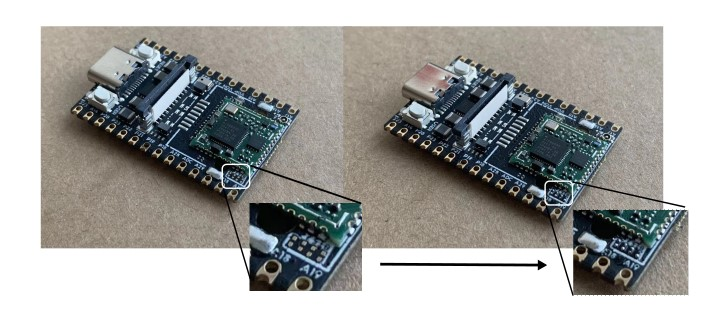
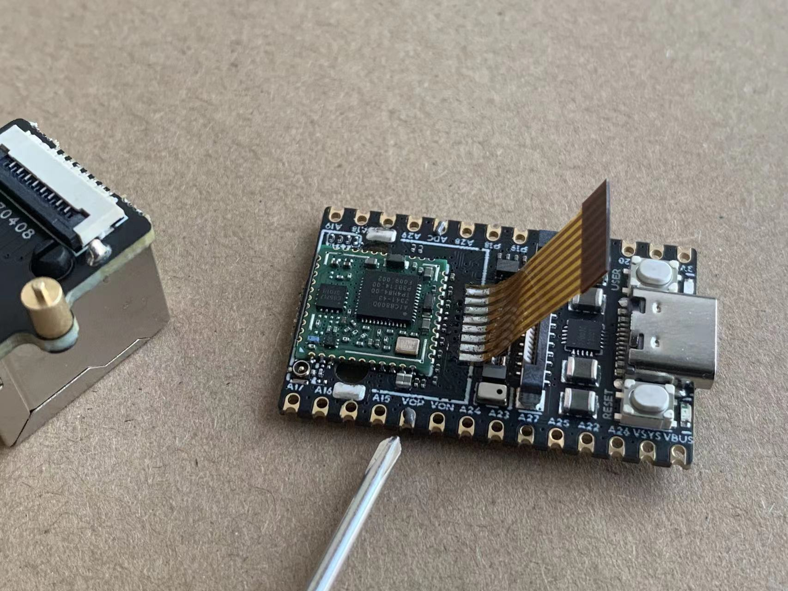
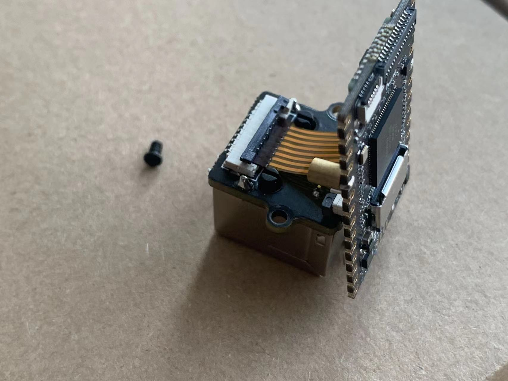
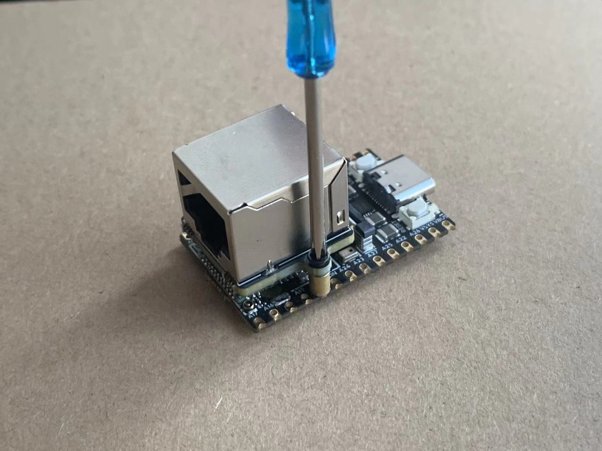
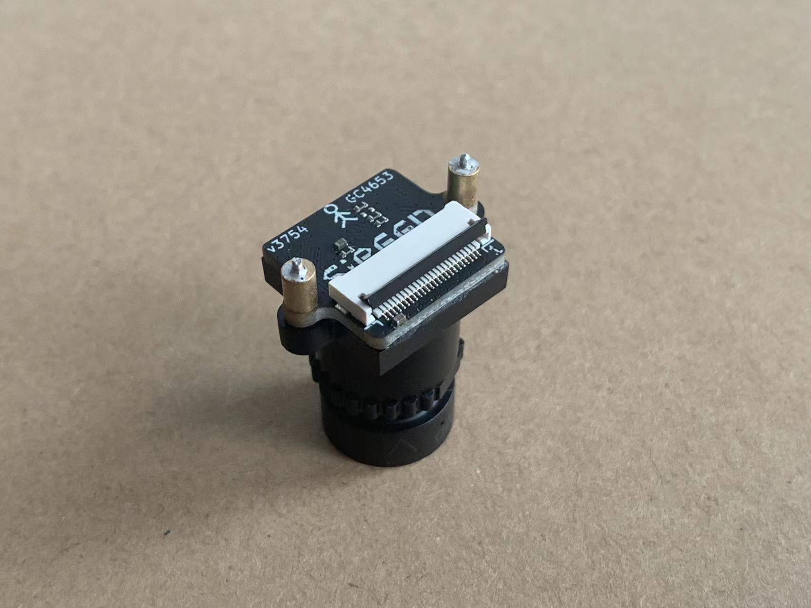
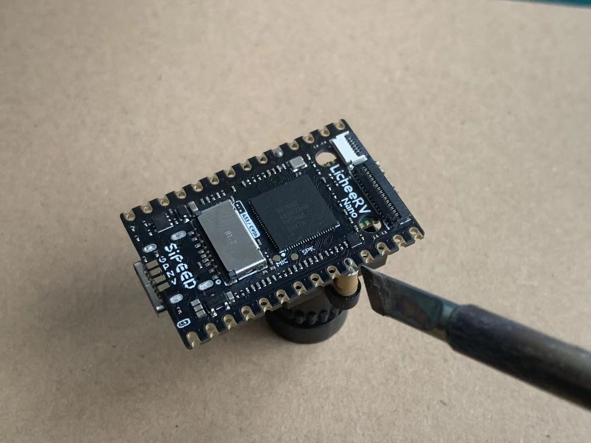

## LicheeRV Nano Package Introduction

The LicheeRV Nano is available in four versions based on networking capabilities:

- **Standard Version (B)**: Comes without any networking accessories.
- **Ethernet Version (E)**: Features an onboard 100M Ethernet port for wired network connections.
- **WiFi Version (W)**: Equipped with an onboard WiFi6/BT5.2 module. By default, the BT5.2 functionality is not enabled. To activate Bluetooth capabilities, it's necessary to solder four 0201 resistors in the specified location or use a 2B pencil to create a short circuit in the designated area.

+ The WiFi Ethernet (WE) version features an onboard WiFi 6/BT 5.2 module and comes with an Ethernet module that connects to the development board via standoffs and ribbon cables.

  We also offer the following accessory:

  - Camera

+ The camera (model 3754) features non-short-circuiting screw holes on both sides for secure mounting. It is recommended to fix the standoffs to the fifth pad for optimal stability.

  

+ 3-inch Display Screen

  

  - The display features a resolution of 480*845 and supports touch functionality. The package includes a touch screen adapter board and a ribbon cable for easy integration.
  - 5-inch Display Screen

  

  - This display boasts a resolution of 480*845 and does not support touch functionality. The ribbon cable can be directly connected to the LicheeRV Nano 31Pin screen interface for seamless integration.
  - 7-inch Display Screen

  

  - The display features a resolution of 800*1280 and supports touch functionality. The ribbon cable can be directly connected to both the LicheeRV Nano 31Pin screen interface and the 6Pin touch interface, ensuring easy setup and integration.
  - 10-inch Display Screen

  

  ------

  - The display features a resolution of 800*1280 and supports touch functionality. The package includes a touch adapter board and a ribbon cable for easy setup. The screen ribbon cable can be directly connected to the LicheeRV Nano 31Pin screen interface, ensuring seamless integration.
  - Raspberry Pi Camera Adapter Ribbon Cable (Coming Soon)

  

  ------

  - Raspberry Pi Standard 15Pin Camera to LicheeRV 22Pin CSI Camera Interface Adapter

+ 1. Installation Guide

     ### Installing the WE Module

     - Soldering the Ribbon Cable

     1. Solder the ribbon cable following the direction shown in the diagram below.

     

  2. Use a Multimeter to Test for Continuity

     

  ●Securing the Standoffs

  1. To avoid burns while soldering the standoffs, you can first screw them onto the Ethernet module.

  2.Insert the standoff into the fifth pad. It is advisable to apply solder paste to the pad beforehand to enhance the stability of the standoff after soldering.

  

  3.Use a soldering iron from the bottom side to solder.

  

+ Assembly

  1. Insert the ribbon cable into the FPC connector of the Ethernet module and secure it.

  

  1. Secure the Ethernet module to the standoffs using screws.

  

### Installing the Camera

- Securing the Standoffs
  1. Similar to the method mentioned above: first, screw the standoffs and screws onto the camera module.

2.Insert the standoff into the fifth pad. To enhance the stability of the standoff after soldering, it is recommended to apply solder paste to the pad beforehand.

3.Solder from the bottom side using a soldering iron.

+ Assembly

  1. Connect the camera ribbon cable as shown in the diagram below.

  

  2.Secure with screws.

  