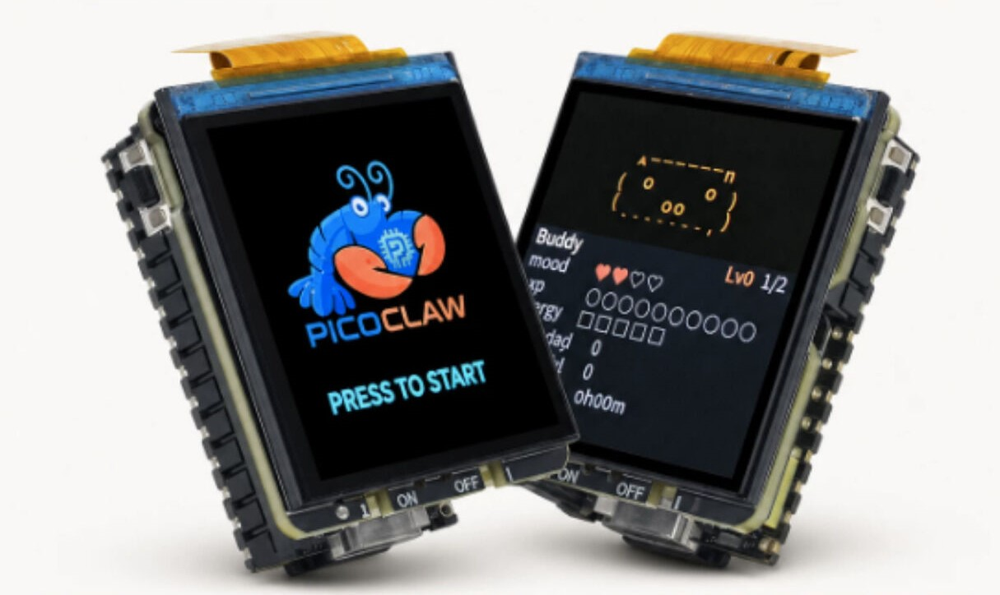

## PicoClaw Expansion Board

<div style="display:flex; gap:12px; justify-content:center; align-items:center; margin: 8px 0 16px;">
	
	
</div>

The PicoClaw Expansion Board is a feature extension board built for **PicoClaw** interactive applications, based on the **LicheeRV Nano** development board. It is designed for voice interaction and local display scenarios, integrating display, buttons, status LEDs, battery management, and audio peripheral interfaces to quickly build a complete HMI terminal.

The board includes a **240×240 LCD** for system status, recognized text, conversation output, and UI menus. It also provides **2 onboard buttons** for mode switching and confirmation, and **2 LEDs** for power/running/status indication. A **Battery** connector is provided with charging support, with a **maximum charging power of 3W**. Speaker connection for voice playback is also supported.

With the customized image, the board can work with PicoClaw for real-time voice conversation: audio capture, ASR, generation, with key results shown on the LCD for a complete local interaction experience.

Main features of the PicoClaw Expansion Board:

- 240×240 LCD display
- 2 function buttons
- 2 status LEDs
- Battery interface (charging supported, max 3W)
- Speaker connection and voice output support
- Real-time conversation and result display (with customized image)

If you want to print the enclosure yourself, download the [PicoClaw Expansion Board enclosure 3D model files](https://dl.sipeed.com/shareURL/LICHEE/LicheeRV_Nano/08_RVClaw).

### About PicoClaw

<div align="center">
	
</div>

PicoClaw is an open-source personal AI assistant project for low-resource devices, written from scratch in **Go**. It targets complete Agent capability on low-cost, low-power hardware. The project focuses on being lightweight, fast, and deployable across resource-constrained Linux devices and multiple CPU architectures.

Key PicoClaw features:

- **Ultra-light deployment**: optimized for low-memory devices.
- **Fast startup**: suitable for always-on local interaction.
- **Cross-platform**: supports RISC-V, ARM, MIPS, and x86.
- **Multi-channel access**: supports Telegram, Discord, WeChat, QQ, Slack, and more.
- **Rich model & tool ecosystem**: supports multiple LLM providers, MCP, web search, and skills.
- **Multiple operation modes**: WebUI, TUI, and CLI.

For the LicheeRV Nano + PicoClaw Expansion Board scenario, PicoClaw provides the upper software layer for voice interaction and local display. By configuring models, channels, and tools, you can quickly build a usable local AI interaction terminal.

Project URL: <https://github.com/sipeed/picoclaw>

## Image Download

Customized PicoClaw expansion-board image:

[Download](https://github.com/sipeed/rvclaw/releases/latest)

File name: `picoclaw-rv-nano-YYYYMMDD.img.xz`

- Flashing method: You can use balenaEtcher to write the image directly to an SD card, or extract the `.xz` file first and then flash it using the `dd` command.

- Expansion-board side code in the image is based on Python, located at `/opt/app_picoclaw` (source: [https://github.com/sipeed/rvclaw](https://github.com/sipeed/rvclaw)), which is convenient for custom development.

## Quick Start with PicoClaw

### Select an Application

After startup, the system enters the application selection screen by default. Press `KEY1` to select the PicoClaw application, or press `KEY2` to select the CC Buddy application. In the PicoClaw application, long-press `KEY2` to return to this application selection screen. CC Buddy is a customized virtual pet application that provides a cute interactive interface and simple conversation features, making it suitable for first-time users to try out.

### Connect Wi-Fi

First, access the device console. Recommended methods:

- **Serial connection**: Use **UART0** exposed on **SBU1/SBU2** of the USB connector. With a USB Type-C breakout board, route **RX0/TX0** and connect using a serial tool.

- **USB NIC connection**: The device creates both **RNDIS** and **NCM** USB NICs by default. Check the USB NIC IP assigned on the host, then replace the last octet with `1` as the device IP. Example: if host IP is `10.166.194.100`, device IP is `10.166.194.1`.

<div align="center">
	
</div>

Then log in with SSH or serial. Default username/password are both `root`.

**After logging in, connect Wi-Fi as follows.**

<details>
<summary>Connect Wi-Fi</summary>

> ```bash
> # Create wifi.sta in the first SD-card partition to enable STA mode:
> touch /boot/wifi.sta && rm -f /boot/wifi.ap /boot/wifi.mon
>
> # Then write the AP SSID and password into files:
> echo ssid > /boot/wifi.ssid
> echo pass > /boot/wifi.pass
>
> # Finally restart the Wi-Fi service
> /etc/init.d/S30wifi restart
> ```

</details>

### Configure PicoClaw

On first boot, PicoClaw is not initialized yet. You need initial configuration first. You can use Web UI or TUI. The following uses Web UI.

#### Web UI Setup
Open `http://<device-ip>:18800` in your browser to enter the PicoClaw Web UI. On first access, you need to set a password. You can use this password to log in later. If you forget the password, delete the `/root/.picoclaw` directory or re-flash the image to reset it.

#### Chat Model Setup
Open settings, select **Model**, then choose a provider and model. For example, you can use `openai/gpt-5.4` as the default model.

<div align="center">
	
</div>

- After configuration, click save and return to the chat page. You will see `Service is not running, please start it before chatting.` Click `Start Service` at the top-right, then wait for startup and begin chatting.

<div align="center">
	
</div>

#### Voice Model Setup

> Currently, PicoClaw's WebSocket channel does not support direct audio-stream input, so PicoClaw ASR cannot be called directly for voice conversation. ASR is currently independent from PicoClaw, but still reads PicoClaw config files for model settings.

To enable voice interaction, configure a voice model first. In the model page, click Add Model and configure an ASR model. Example: `qwen3/qwen3-asr-flash`.

<div align="center">
	
</div>

Currently supported ASR models:

| Model | Provider |
| --- | --- |
| `qwen3/qwen3-asr-flash-realtime` | Qwen |
| `qwen3/qwen3-asr-flash` | Qwen |
| `openai/whisper-1` | OpenAI |
| `groq/whisper-large-v3` | Groq |
| `groq/whisper-large-v3-turbo` | Groq |
| `elevenlabs/scribe_v1` | ElevenLabs |

<br>

> Note: keep `model alias` aligned with the model ID. For example, alias for `qwen3/qwen3-asr-flash-realtime` should be `qwen3-asr-flash-realtime`.

#### Try Voice Chat

After saving, press and hold the left `KEY1` button on the expansion board to record voice input. Release to trigger ASR and send the result to PicoClaw. After processing, ASR text and reply are displayed on screen.

<div style="display:flex; flex-direction:column; gap:10px; margin: 8px 0 16px;">
	<div style="display:flex; gap:10px; justify-content:center;">
		
		
		
	</div>
	<div style="display:flex; gap:10px; justify-content:center;">
		
		
	</div>
</div>

## CC Buddy Application

### About CC Buddy

<div align="center">
	
</div>

**CC Buddy** is another application built into the PicoClaw Expansion Board image. It is positioned as a **companion device for Claude Code**. It turns Claude Code activity into a cute virtual pet (ASCII Pet), and moves **permission approval requests** generated by Claude Code tool or command execution from the computer to the LicheeRV Nano screen. You can approve or deny requests directly with the device buttons, and the decision is sent back to Claude Code, so you do not need to switch back to the computer window.

CC Buddy is ported from Felix Rieseberg's [claude-desktop-buddy](https://github.com/anthropics/claude-desktop-buddy) project, with dedicated adaptations for LicheeRV Nano + PicoClaw Expansion Board: 240×240 ST7789 display, KEY1(A)/KEY2(B) buttons, onboard LEDs, and more. The source code is located at `/opt/app_cc_buddy` in the system image.

Core design ideas:

- **Embodied feedback**: Map Claude Code states (idle, busy, waiting for approval, task completed, etc.) to pet emotions and actions, making invisible Agent behavior visible.
- **Nearby approval**: Permission requests are pushed to the device screen. Press A/B to approve or deny directly, reducing context switching.
- **CLI bridge**: Uses Claude Code's official Hook mechanism plus a local daemon to bridge events to the device TCP port, without modifying Claude Code itself.

### Main Features

- Display an ASCII pixel-style pet on the 240×240 LCD (`capybara`, `cat`, and `robot` are provided by default and can be switched in settings)
- Show Claude Code session status in real time: total sessions, running, waiting, token usage, and latest command/output line
- Permission approval dialog: shows tool name, prompt message, and waiting time, with highlight after 10 seconds
- Pet growth system: calculates mood, fed, and energy from approval speed, denial count, and token usage; accumulated tokens trigger level-up animation
- Multiple display modes: HUD (script/transcript), INFO (device/network/statistics), PET (pet status page), CLOCK (shown when no Claude connection exists)
- Optional LED status blinking, auto screen sleep after 30 seconds of inactivity, and sound feedback (configurable in settings)
- One-click switch back to the PicoClaw application from the app menu without rebooting

<div style="display:flex; gap:10px; justify-content:center; margin: 8px 0 16px;">
	
	
	
	
</div>

<details>
<summary>Full Mode</summary>

<div style="display:flex; gap:10px; justify-content:center; margin: 8px 0 16px;">
	
	
</div>

<div style="display:flex; gap:10px; justify-content:center; margin: 8px 0 16px;">
	
	
	
</div>

<div style="display:flex; gap:10px; justify-content:center; margin: 8px 0 16px;">
	
	
	
</div>
</details>

### Connection Method

CC Buddy communicates with the device through **Claude Code CLI (Hooks + Daemon)**.

It is intended for users who use the `claude` terminal command. A daemon runs on the computer and bridges Claude Code Hook events to the device TCP port.

```
Claude Code CLI (sessions)
		│ HTTP hooks (automatically injected into ~/.claude/settings.json)
		▼
cc_buddy_daemon.py (default :9876)
		│ TCP
		▼
RVClaw device (:19000)
```

Start the daemon on the computer ([download script here](https://raw.githubusercontent.com/sipeed/rvclaw/refs/heads/main/app_cc_buddy/hooks/cc_buddy_daemon.py)):

```bash
python3 cc_buddy_daemon.py --device <RVCLAW_IP>
# Custom port
python3 cc_buddy_daemon.py --device <RVCLAW_IP> --port 9877
```

After startup, the daemon automatically:

- Writes the following Hooks into `~/.claude/settings.json`, and automatically cleans them up on exit (Ctrl+C / SIGTERM)
- Listens on `http://127.0.0.1:9876` for Claude Code Hook events
- Connects to the RVClaw `19000` TCP port to send heartbeats and receive button decisions

| Hook | Purpose |
| --- | --- |
| SessionStart / SessionEnd | Maintain active session count |
| PreToolUse | Mark running state and build command transcript |
| PostToolUse | Clear running state |
| Stop | Mark session generation completed |
| **PermissionRequest** | **Block** and wait for device button decision (default timeout: 30s) |
| PermissionDenied | Clear waiting state |
| PreCompact | Sync token count |

Then use `claude` normally. When Claude needs permission, the device switches to the approval page. Press **A to approve / B to deny**, and the daemon sends the decision back to Claude Code.

<div align="center">
	
</div>

### Button Operations

CC Buddy reuses the two buttons for multiple functions. Behavior changes with the current UI:

| Operation | A (left) | B (right) |
| --- | --- | --- |
| Short press on main screen | Switch display mode (NORMAL / PET / INFO) | Turn pages in INFO/PET pages; scroll transcript in HUD mode |
| Long press (≥ 600ms) | Open main menu (settings / help / about / demo / to picoclaw / close) | — |
| Approval page | **Approve** (once) | **Deny** (deny) |
| Menu/settings opened | Move selection | Confirm/trigger selected item |
| Screen sleeping | Wake screen (first press does not trigger function) | Wake screen (first press does not trigger function) |

> Select `to picoclaw` in the main menu to switch back to the PicoClaw application without rebooting. The CC Buddy service stops and the PicoClaw service starts.

### Settings and Persistence

<div style="display:flex; gap:10px; justify-content:center; margin: 8px 0 16px;">
	
	
</div>

Go to `main menu → settings` to configure:

| Setting | Description | Values |
| --- | --- | --- |
| brightness | Display brightness level | 0–4 |
| sound | Sound feedback switch | on / off |
| led | Status LED switch (blinks while waiting for approval) | on / off |
| transcript | HUD transcript display switch | on / off |
| ascii pet | Pet species selection | capybara / cat / robot |
| sleep | Auto screen sleep after 30s of inactivity | on / off |
| reset stats | Clear growth data and restore defaults | — |

Device data is persisted in `/root/.cc_buddy/`:

- `stats.json`: level, accumulated tokens, approve/deny counters, pet species index, owner/pet names, etc.
- `settings.json`: the settings above

### Pet Growth Rules

<div style="display:flex; gap:10px; justify-content:center; margin: 8px 0 16px;">
	
	
	
</div>

- **MOOD**: Faster approval means higher mood (< 5s triggers a one-time `HEART` animation); frequent denials reduce mood.
- **FED**: Levels up about every 50K accumulated tokens and plays the `CELEBRATE` animation.
- **ENERGY**: Designed to recover after placing the screen face-down for a nap (currently unsupported).
- **State mapping**: disconnected → IDLE; waiting for approval → ATTENTION (with LED blinking); ≥ 3 sessions running → BUSY; recently completed → CELEBRATE; late night (1:00–7:00) without Claude connection → SLEEP (clock mode).

### Custom Development

Development repository: [GitHub app_cc_buddy](https://github.com/sipeed/rvclaw/tree/main/app_cc_buddy).
CC Buddy is written entirely in Python with a clear directory structure:

| File | Purpose |
| --- | --- |
| `main.py` | Main event loop, button dispatch, state switching, display refresh |
| `config.py` | Pin definitions, SPI parameters, font paths, UI layout constants |
| `ui.py` | Draws splash screen, HUD, approval page, Info/Pet/Clock/Menu/Settings pages |
| `buddy.py` + `buddies/*.py` | Pet renderers (capybara, cat, and robot registered by default) |
| `state.py` | Data structures such as `TamaState`, `PersonaState`, and `DisplayMode` |
| `protocol.py` | JSON heartbeat/command parsing and permission-response packaging |
| `transport.py` | TCP communication implementation on port 19000 |
| `hooks/cc_buddy_daemon.py` | Host-side Hook bridge daemon |
| `S99cc_buddy_app` | Boot startup script |

To add a custom pet species, create a species file under `buddies/` and register it with `register_species()` in `buddies/__init__.py`.

## FAQ

- Errors during conversation
	- The model may be misconfigured, or unavailable. Check logs in Web UI for detailed errors.
	- Check `/var/log/picoclaw-launcher.log` and `/var/log/picoclaw-worker.log` for error details.
	- You can try deleting `/root/.picoclaw` and rebooting, then reconfigure.

- Errors when using `groq` voice models
	- `groq` is currently not accessible in mainland China. Use another provider or access through a proxy.
