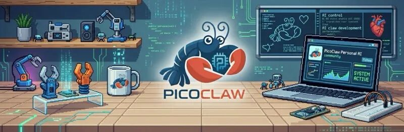
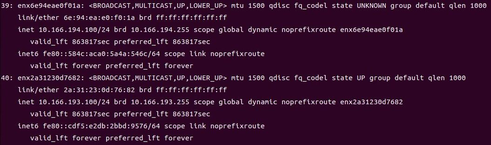
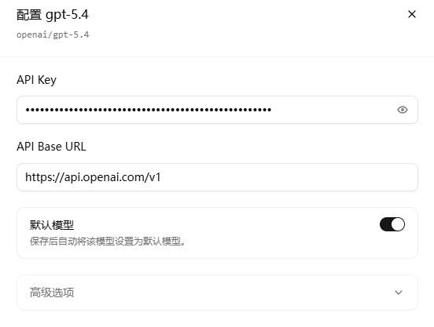
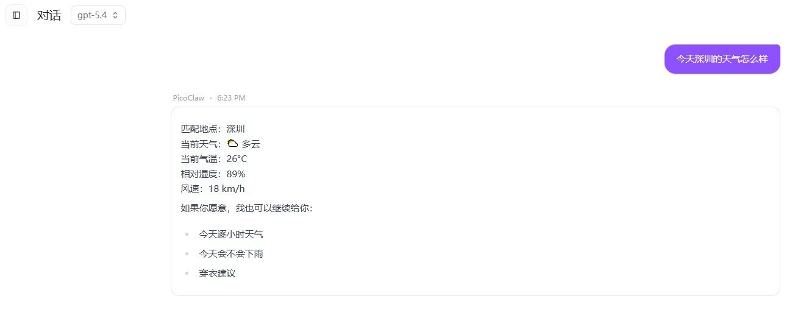
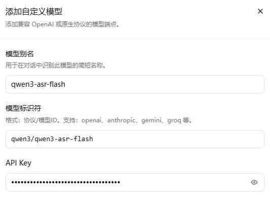
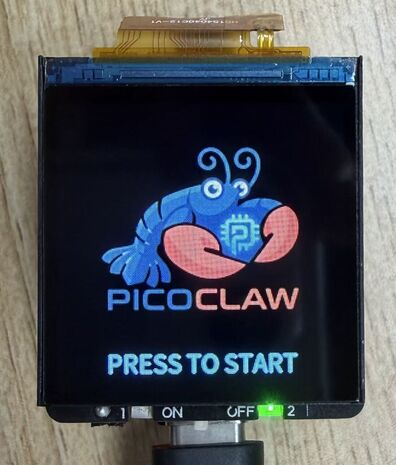
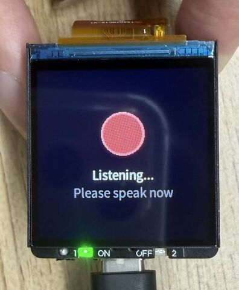
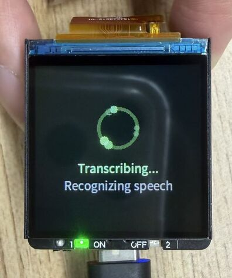
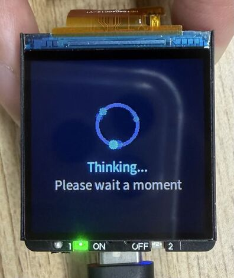
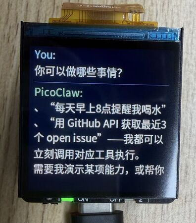

## PicoClaw Expansion Board

The PicoClaw Expansion Board is a feature extension board built for **PicoClaw** interactive applications, based on the **LicheeRV Nano** development board. It is designed for voice interaction and local display scenarios, integrating display, buttons, status LEDs, battery management, and audio peripheral interfaces to quickly build a complete HMI terminal.

The board includes a **240×240 LCD** for system status, recognized text, conversation output, and UI menus. It also provides **2 onboard buttons** for mode switching and confirmation, and **2 LEDs** for power/running/status indication. A **Battery** connector is provided with charging support, with a **maximum charging power of 3W**. Speaker connection for voice playback is also supported.

With the customized image, the board can work with PicoClaw for real-time voice conversation: audio capture, ASR, generation, with key results shown on the LCD for a complete local interaction experience.

Main features of the PicoClaw Expansion Board:

- 240×240 LCD display
- 2 function buttons
- 2 status LEDs
- Battery interface (charging supported, max 3W)
- Speaker connection and voice output support
- Real-time conversation and result display (with customized image)

### About PicoClaw

	

PicoClaw is an open-source personal AI assistant project for low-resource devices, written from scratch in **Go**. It targets complete Agent capability on low-cost, low-power hardware. The project focuses on being lightweight, fast, and deployable across resource-constrained Linux devices and multiple CPU architectures.

Key PicoClaw features:

- **Ultra-light deployment**: optimized for low-memory devices.
- **Fast startup**: suitable for always-on local interaction.
- **Cross-platform**: supports RISC-V, ARM, MIPS, and x86.
- **Multi-channel access**: supports Telegram, Discord, WeChat, QQ, Slack, and more.
- **Rich model & tool ecosystem**: supports multiple LLM providers, MCP, web search, and skills.
- **Multiple operation modes**: WebUI, TUI, and CLI.

For the LicheeRV Nano + PicoClaw Expansion Board scenario, PicoClaw provides the upper software layer for voice interaction and local display. By configuring models, channels, and tools, you can quickly build a usable local AI interaction terminal.

Project URL: <https://github.com/sipeed/picoclaw>

## Image Download

Customized PicoClaw expansion-board image:

[Download](https://github.com/sipeed/rvclaw/releases/latest)

File name: `picoclaw-rv-nano-YYYYMMDD.img.xz`

- Flashing method: You can use balenaEtcher to write the image directly to an SD card, or extract the `.xz` file first and then flash it using the `dd` command.

- Expansion-board side code in the image is based on Python, located at `/opt/app_picoclaw` (source: [https://github.com/sipeed/rvclaw](https://github.com/sipeed/rvclaw)), which is convenient for custom development.

## Quick Start

### 1. Select an Application

After startup, the system enters the application selection screen by default. Press `KEY1` to select the PicoClaw application, or press `KEY2` to select the CC Buddy application. CC Buddy is a customized virtual pet application that provides a cute interactive interface and simple conversation features, making it suitable for first-time users to try out.

### 2. Network Connection

First, access the device console. Recommended methods:

- **Serial connection**: Use **UART0** exposed on **SBU1/SBU2** of the USB connector. With a USB Type-C breakout board, route **RX0/TX0** and connect using a serial tool.

- **USB NIC connection**: The device creates both **RNDIS** and **NCM** USB NICs by default. Check the USB NIC IP assigned on the host, then replace the last octet with `1` as the device IP. Example: if host IP is `10.166.194.100`, device IP is `10.166.194.1`.

	

Then log in with SSH or serial. Default username/password are both `root`. After login, follow [Peripheral Usage](https://wiki.sipeed.com/hardware/en/lichee/RV_Nano/5_peripheral.html#WIFI) to connect Wi-Fi.

### 3. Configure PicoClaw

On first boot, PicoClaw is not initialized yet. You need initial configuration first. You can use Web UI or TUI. The following uses Web UI.

#### Web UI Setup
Open `http://<device-ip>:18800` in your browser. A token is required on first access; currently the default token is `root`.

#### Chat Model Setup
Open settings, select **Model**, then choose a provider and model. For example, you can use `openai/gpt-5.4` as the default model.

	

- After configuration, click save and return to the chat page. You will see `Service is not running, please start it before chatting.` Click `Start Service` at the top-right, then wait for startup and begin chatting.

	

#### Voice Model Setup

> Currently, PicoClaw's WebSocket channel does not support direct audio-stream input, so PicoClaw ASR cannot be called directly for voice conversation. ASR is currently independent from PicoClaw, but still reads PicoClaw config files for model settings.

To enable voice interaction, configure a voice model first. In the model page, click Add Model and configure an ASR model. Example: `qwen3/qwen3-asr-flash`.

	

Currently supported ASR models:

| Model | Provider |
| --- | --- |
| `qwen3/qwen3-asr-flash-realtime` | Qwen |
| `qwen3/qwen3-asr-flash` | Qwen |
| `openai/whisper-1` | OpenAI |
| `groq/whisper-large-v3` | Groq |
| `groq/whisper-large-v3-turbo` | Groq |
| `elevenlabs/scribe_v1` | ElevenLabs |

 

> Note: keep `model alias` aligned with the model ID. For example, alias for `qwen3/qwen3-asr-flash-realtime` should be `qwen3-asr-flash-realtime`.

#### Try Voice Chat

After saving, press and hold the left `KEY1` button on the expansion board to record voice input. Release to trigger ASR and send the result to PicoClaw. After processing, ASR text and reply are displayed on screen.

	

		
		
		
	

	

		
		
	

## FAQ

- Errors during conversation
	- The model may be misconfigured, or unavailable. Check logs in Web UI for detailed errors.
	- Check `/var/log/picoclaw-launcher.log` and `/var/log/picoclaw-worker.log` for error details.
	- You can try deleting `/root/.picoclaw` and rebooting, then reconfigure.

- Errors when using `groq` voice models
	- `groq` is currently not accessible in mainland China. Use another provider or access through a proxy.
