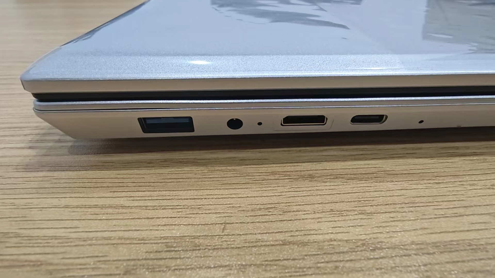

## Introduction

Lichee Book 4A (hereinafter referred to as Book) is a high-performance RISC-V lightweight laptop developed by Sipeed, designed to allow RISC-V developers to experience the application of RISC-V products in real life ahead of time.
Lichee Book 4A uses a mainstream 14-inch laptop mold, integrates a high-performance RISC-V TH1520 SOM (8+32/16+128 options), a 14-inch 1920x1200 high-definition screen, an 88-key round cap silent keyboard, and USB-A, USB-C, 2280 SSD slot, TF card slot, miniHDMI, 3.5mm headphone jack, and other rich interfaces, making it a RISC-V laptop that combines openness and usability.
The software support for Lichee Book 4A is also quite comprehensive, with Debian as the default operating system, supporting Chrome browser, VSCode IDE, KiCAD PCB drawing software, Office software, 4K player, various game emulators, meeting the needs of daily work and study.
Lichee Book 4A uses a modular design, allowing you to reuse the SOM from LicheePi4A if you purchased it earlier.
Thanks to the modular SOM design, Lichee Book 4A can also be upgraded to LM3A or LM5A modules in the future by replacing the module!

> Note: High-performance RISC-V consumer electronics are still in the early stages as of 2024. Lichee Book 4A is mainly aimed at RISC-V developers with at least proficient Linux operating experience, and ordinary consumers may not be able to use it directly.
> If you are an ordinary user without Linux experience, please do not purchase


## Technical Specifications

<table>
<colgroup>
<col  class="org-left" />
<col  class="org-left" />
</colgroup>
<tr>
<td class="org-left">SOM</td>
<td class="org-left"> <a href="https://wiki.sipeed.com/lm4a">LM4A</a> </td>
</tr>
<tr>
<td class="org-left">CPU</td>
<td class="org-left"><strong>RISC-V RV64GCV C910@1.85GHz * 4</strong> </td>
</tr>
<tr>
<td class="org-left">GPU</td>
<td class="org-left">IMG™ B 系列 BXM-4-64 </td>
</tr>
<tr>
<td class="org-left">NPU</td>
<td class="org-left">4TOPS@INT8 </td>
</tr>
<tr>
<td class="org-left">Memory</td>
<td class="org-left"> 8GB or 16GB LPDDR4X </td>
</tr>
<tr>
<td class="org-left">Storage</td>
<td class="org-left"> 32GB or 128GB eMMC, NGFF 2280 SATA SSD </td>
</tr>
<tr>
<td class="org-left">Display</td>
<td class="org-left"> 14 inch 1920 x 1200 LCD, miniHDMI </td>
</tr>
<tr>
<td class="org-left">Inoput</td>
<td class="org-left"> 88-Keyboard, touchpad </td>
</tr>
<tr>
<td class="org-left">Camera</td>
<td class="org-left"> 0.3MP Front Camera </td>
</tr>
<tr>
<td class="org-left">Audio</td>
<td class="org-left"> 3.5mm Headphone, MEMS MIC, StereoSpeaker </td>
</tr>
<tr>
<td class="org-left">Network</td>
<td class="org-left"> WiFi6 + BT5.4 </td>
</tr>
<tr>
<td class="org-left">Interface</td>
<td class="org-left"> USB3.0 Type-A, USB3.0 Type-C, USB2.0 Type-A, MicroSD Slot </td>
</tr>
<tr>
<td class="org-left"> Battery </td>
<td class="org-left"> 4500 mAh@7.6V </td>
</tr>
<tr>
<td class="org-left">Case</td>
<td class="org-left"> Silver plastic Case</td>
</tr>
<tr>
<td class="org-left">Size & Weight</td>
<td class="org-left">314x217x17mm 1.3Kg</td>
</tr>
<tr>
<td class="org-left">System</td>
<td class="org-left">Debian </td>
</tr>
</table>


## Getting Started

### Unbox
Upon receiving the package:


Open the box, and take out the two parts, the notebook on the top, and the 12V2.5A power adapter and MiniHDMI cable at the bottom.


Take out the main unit, the top view is as shown:


The bottom view shows an SSD cover, you can unscrew it to install an SSD; the central part is the fan intake, the unit uses a heat pipe + silent fan for cooling to ensure a cool core temperature.


One side view shows the interfaces from left to right: TF card, 3.5mm headphone jack, USB2.0 interface, and computer lock.


The other side view shows the interfaces from left to right: USB3.0 port, 12V DC port, miniHDMI port, USB-C port (for download/Host/charging).



(If you purchased a barebones package, refer to the "SOM Installation Guide" section to install the LM4A before proceeding.)
Open the main unit, press and hold the power button on the top right for 3 seconds to turn it on (release when the screen backlight lights up or the left power indicator lights up).


If the backlight does not light up, the battery might be drained during transportation. Try plugging in the power adapter and holding the power button.

After turning on the backlight, it will light up for about 15 seconds before the top-left corner of the screen starts flashing a cursor (indicating it has entered the kernel).
After about 20 seconds, it will enter the Debian desktop system login interface.

Enter the username "sipeed" and the default password "licheepi". After entering the desktop system, you can test the touchpad, keyboard, camera, etc. If any components are not working, contact customer service.

The default system is Debian, pre-installed with Chrome, Office, and other applications for you to experience.
You can use sudo apt install xxx to install software. The default username and password are "sipeed" and "licheepi".
Refer to the relevant sections of the LicheePi4A documentation for general software usage.

### SSDUsage Guide
The Book supports M.2 2280 SATA SSDs, which can be installed by removing the SSD cover on the back.


如果你不计划使用SSD，可以手工关闭USB转SSD芯片来降低功耗（约0.6Watt），提升续航：

If you do not plan to use an SSD, you can manually turn off the USB-to-SSD chip to reduce power consumption (about 0.6Watt) and extend battery life:

Go to /boot/dtbs/linux-image-5.10.113-zzz-sipeed-20240531+/thead/ and find the corresponding dtb to modify, such as the 8GB memory version:

sudo dtc -I dtb -O dts -o tmp.dts th1520-lpi4a-plastic.dtb

Edit the following part, change enable-active-high to enable-active-low:

```
	reg_sata_vcc_5v: regulator-sata-vcc-5v-en {
		status = "okay";
		compatible = "regulator-fixed";
		regulator-name = "regulator-sata-vcc-5v-en";
		regulator-min-microvolt = <5000000>;
		regulator-max-microvolt = <5000000>;
		vin-supply = <&reg_sys_vcc_5v>;
		gpio = <&pcal6408ahk_c 1 1>;
		enable-active-low;   
		regulator-always-on;
	};
```
sudo dtc -I dts -O dtb -o th1520-lpi4a-plastic.dtb tmp.dts

Then restart to turn off the SATA power.


### SOM Installation Guide
If you purchased the barebones package, you need to install the SOM module.
Prepare a Phillips screwdriver, remove the back cover (first peel off the two foot pads, each has a screw underneath), install the SOM module, apply thermal grease on the CPU/DDR, place the heatgrease, and reassemble the back cover.


## System
The Book's image is released together with the LConsole's image, with only the U-Boot being different. It is recommended to use the SOM with 8+32 or higher configuration.

The GitHub repository is at: https://github.com/0x754C/sipeed-th1520-laptop-extra/releases

linux-image-*.deb is the kernel installation package provided by Sipeed. If you only want to upgrade the kernel, you can install this package. Remember to update to the corresponding version of U-Boot and backup files before installation.

sipeed-th1520-laptop-extra-*.deb is the additional file package provided by Sipeed, including configuration files, test tools, and EC firmware.

u-boot-with-spl-*.bin is the U-Boot file. Please choose the U-Boot corresponding to your circuit board model. Remember to back up files before flashing. Flashing the wrong U-Boot may cause the system to fail to boot.

boot|root-*.ext.xz is the partition image. If you want to re-flash the entire system, use this.
  

Baidu Pan：
Link: https://pan.baidu.com/s/1jkJ4YR7EhMRZ11XmccKDtg   
Code: qj1r   

Mega：   
https://mega.nz/folder/p9BCTbLb#sWSZvLw6nrBmqujQXfvWrg   


Common application Show:


The system architecture of the Book is as follows. Refer to the schematic or device tree files for details.


## Resources Download
Lichee Book 4A and Lichee Console 4A share the same motherboard and hardware resources:
[Sipeed 下载站](https://dl.sipeed.com/shareURL/LICHEE/LicheeConsole4A)


## Other Links
[Taobao](https://item.taobao.com/item.htm?id=807162533118)
[Aliexpress](https://www.aliexpress.com/item/3256807018240741.html)  

QQ Group: 559614960 [Click to join](http://qm.qq.com/cgi-bin/qm/qr?k=5YkapIhdtWHp8AEfM5_bFFYQIX3CUQN6)
Telegram: https://t.me/linux4rv

Forum：Maixhub.com/discussion
Contact Email：support@sipeed.com


